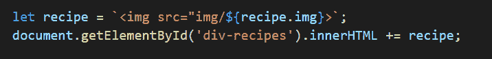
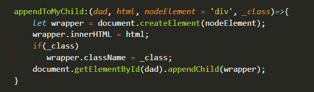

# 在 js 中追加元素的更快方法👨🏻‍💻

> 原文：<https://dev.to/wakeupmh/faster-way-to-appendelements-in-pure-javascript-2o9m>

### 🚧**剧透:**

#### 这篇文章是关于如何大幅减少你的用户界面加载时间以获得更好的 UX！

# 清晨可爱但令人反感的小叫声😥

任何人都知道一个常见的陷阱(💣)是用于向 DOM

添加元素的方法。出于对开发人员的好奇，我摆弄旧代码来评估它的性能，即使不使用任何框架在 DOM 中添加元素，我也会感到害怕

## *27s* 将模板的所有 *330* 组件从我的 UI 插入到一个*异步请求*中。

(我指的是不太高效的 JQuery，因为我的任务是将整个项目传递给纯 javascript，但这将在另一篇文章中讨论)。

# 贴着脏尿布😬💩

我用经典的`innerHTML`把它们添加到视图中，这适合我，这是最快的方法🤷‍♂️

并且使用`console.time`来评估性能，我得到了如下所示的高时间

### 在我小小的、令人想拥抱的冲突中，我用湿润的手帕思考着存在性:*如何改进它？*

经过一段时间对论坛的思考，我写了下面的函数

## 忍者换尿布器🤸

### 因此在`console.time`我看到了不可思议的*26.73 秒*的🧐的进步👌

# 感谢阅读！🙌🍼

我是一名对新技术和增强功能充满热情的 FullStack 开发人员，也是第一次做爸爸😊这是我的第一篇帖子，通过它我打开了更多人参与社区的大门，有任何疑问请联系我🍻