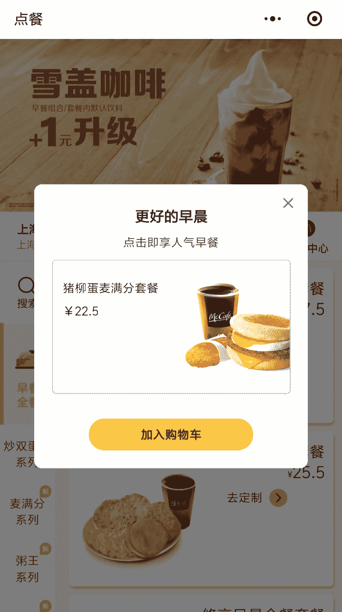

# 迷你程序，FTW？

> 原文：<https://dev.to/zex/mini-program-ftw-2ikd>

如果你没有体验过微信，你可能不会听说过迷你程序。它是微信生态中的一个子应用。

在我从事后端开发的 90%的时间里，迷你程序开发对我来说是新的，这个星期我才接触到它。

这是麦当劳的迷你点餐程序。

迷你程序可以在 Mac 或 Windows 上开发，因为工具包只适用于这两种环境。

它通常包含

*   WXML 定义了用户界面的外观。
*   WXSS，微信样式表。
*   JS/TS，定义业务逻辑。
*   配置，定义它应该如何运行。

类似于 Web UI 项目，只是它使用了一些微信定义的标签和 API。与原生应用相比，它更加轻量级。点击查看参考文献

不幸的是，这些文档对全球化的支持很差。大多数文件最初是用中文写的。嗯，他们正在改进它，英文版可以在这里找到。

感兴趣吗？尝试一下🙃