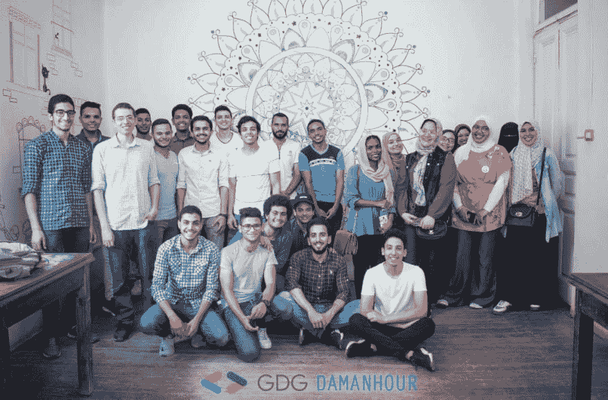

# 关于我参加的第一次技术会议的想法...

> 原文：<https://dev.to/saraahmed626/thoughts-on-first-technology-meetup-i-ve-attended-2g57>

作为一名计算机科学毕业生，以前的技术支持，和一名现任程序员，我以前也参加过与技术相关的活动，但这次有点不同。按照我拓展人脉的计划，我决定去参加这个聚会，我在 [Meetup](https://www.meetup.com/) 网站上查了一下。

这次聚会是在埃及 **Damanhour** 一个离亚历山大一个小时路程的小城市，我没有任何极客埃及朋友，这是我第一次来埃及，所以我既兴奋又有点紧张，因为我对埃及的技术社区没有丝毫了解，没有和它的任何成员联系过，也没有在网上搜索过！去埃及原本是为了家庭度假。
这就是它与众不同的原因。

### meetup 的主办方？

谷歌开发者小组达曼胡尔(GDG 达曼胡尔)。

gdg 是对 Google 产品和 API 特别感兴趣的本地开发者团体。每个本地小组被称为 GDG 分会，可以为开发人员举办各种技术活动——从几个人聚在一起观看我们的最新视频，到大型演示和技术讲座，再到黑客马拉松。
谷歌开发者支持并认可 GDG 分会，但不拥有或管理它们。”

### 涵盖了哪些话题？

它包含 3 个部分，每个部分都是对主题的介绍。

*   颤动者:塔里克·阿拉布。
*   艾作者:吉哈德·纳吉布。
*   谷歌云平台。

对于一个对上述每个主题都有一点技术基础知识的初学者来说，演讲的内容非常好，演讲者的简历令人印象深刻，经验丰富。

### 我喜欢吗？

是的，我了解了埃及的技术社区和技术市场，演讲者、组织者和参与者都很友好，热情地回答了所有问题。

很高兴看到另一面，那就是谷歌产品，这一面我还没有使用过它的任何技术。

我甚至得到了我的第一个程序员贴纸:D

**在苏丹境外参加 2 项技术相关活动:半查；)**