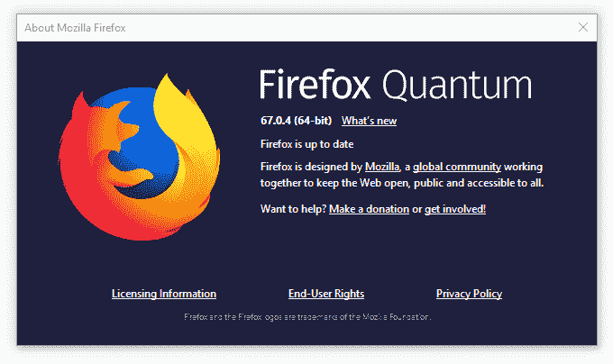
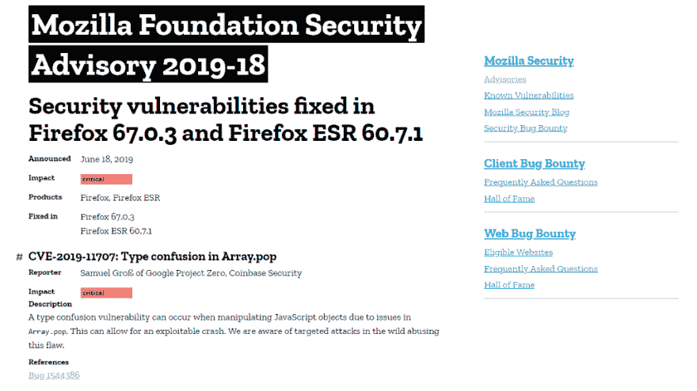
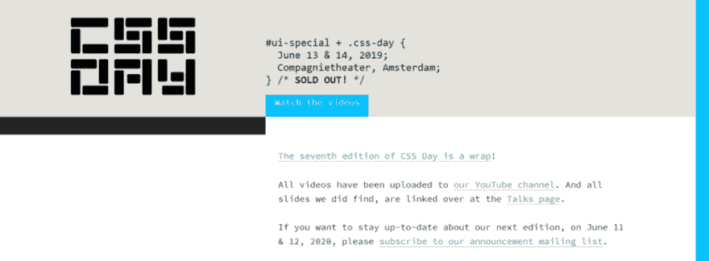
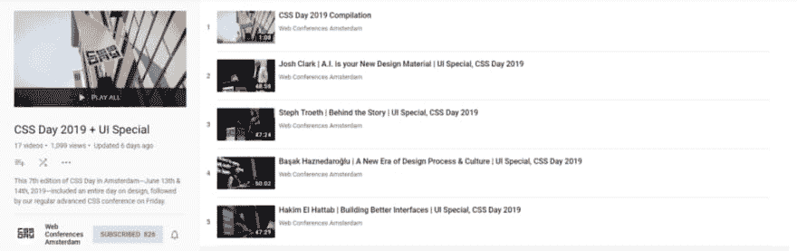
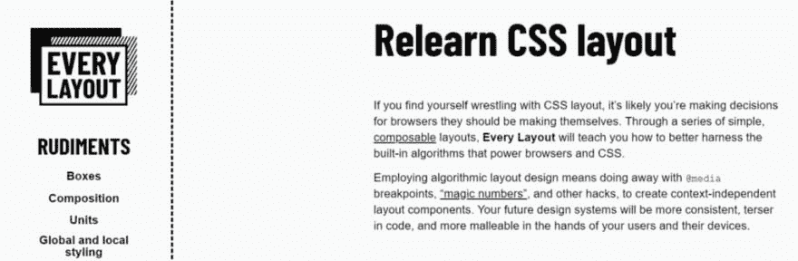
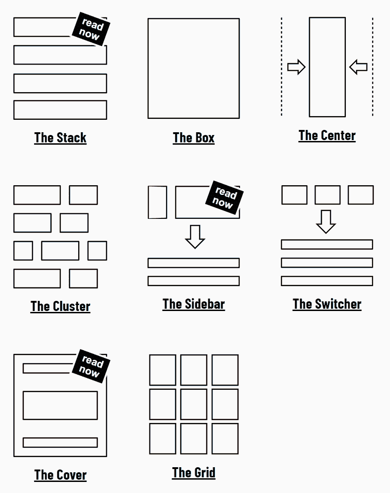

# 前端新闻#6: Firefox 零时差补丁，谷歌搜索服务工人，CSS Day 2019 播放列表和每个布局的推出

> 原文：<https://dev.to/adriansandu/front-end-news-6-firefox-zero-day-patches-google-search-service-workers-css-day-2019-playlist-and-the-launch-of-every-layout-22ci>

<figure> 

<figcaption>于[https://youtu.be/sFR4E8uIRLs](https://youtu.be/sFR4E8uIRLs)</figcaption>

</figure>

在 YouTube 上查看该集

大家好，欢迎来到另一个版本的前端新闻，这是 YouTube 上唯一一个为您带来行业最新事件信息的节目。

以下是我今天为大家准备的重点内容:

*   Mozilla 为 Firefox 发布了两个紧急零日补丁
*   了解谷歌搜索如何使用服务人员
*   CSS Day 2019 会议已上线
*   展示每个布局项目

一如既往，我也为那些喜欢听而不是读的人准备了视频版本。如果你喜欢这种格式，如果你也能订阅 YouTube 频道，我将不胜感激。

[https://www.youtube.com/embed/sFR4E8uIRLs](https://www.youtube.com/embed/sFR4E8uIRLs)

### Mozilla 发布紧急零日 Firefox 补丁

Mozilla 本周再次成为焦点，这一次是对其旗舰产品 Firefox 的两次连续更新。这些修复解决了“零日漏洞”，强烈建议用户立即将浏览器更新到 67.0.4 或更高版本。

第一个漏洞的发现归功于安全研究员 Samuel Gro，他是 Google Project Zero 和比特币基地安全团队的成员。第二个问题，严重性较低，被认为是比特币基地安全。现在，如果你不知道，“零日”意味着已经发生了针对这些漏洞的攻击。新闻门户网站 ZDNet 证实，这两个漏洞被用于针对比特币基地员工以及其他未披露的加密货币组织的鱼叉式网络钓鱼攻击。

<figure>

<figcaption>[https://www . Mozilla . org/en-US/security/advisories/mfsa 2019-18/](https://www.mozilla.org/en-US/security/advisories/mfsa2019-18/)</figcaption>

</figure>

你还在等什么？当火狐自动检查更新并安装它们时，你可以自己打开菜单，选择**帮助**，然后选择**关于火狐**，强制执行这个过程。上传下载完成后，重启浏览器进行安装。这就是你需要做的。

来源和参考资料:

*   [https://www . Mozilla . org/en-US/security/advisories/mfsa 2019-18/](https://www.mozilla.org/en-US/security/advisories/mfsa2019-18/)
*   [https://www . Mozilla . org/en-US/security/advisories/mfsa 2019-19/](https://www.mozilla.org/en-US/security/advisories/mfsa2019-19/)
*   [https://www . zdnet . com/article/Mozilla-fixes-second-Firefox-zero-day-exploited-in-the-wild/](https://www.zdnet.com/article/mozilla-fixes-second-firefox-zero-day-exploited-in-the-wild/)
*   [https://www . zdnet . com/article/Firefox-zero-day-was-use-in-attack-against-coin base-employees-not-its-users/](https://www.zdnet.com/article/firefox-zero-day-was-used-in-attack-against-coinbase-employees-not-its-users/)

### 将服务人员引入谷歌搜索

Google Developers Web.dev 博客上本周出现了一篇新文章，非常详细地描述了使用服务人员如何增强 Google 搜索体验。

对于那些不知道的人来说，服务人员是一个在后台运行的脚本，独立于网页。一些最常见的用途是推送通知或在后台同步数据。更多细节可以通过下面的谷歌开发者门户链接找到。

本文介绍了决定使用服务人员的原因、团队遇到的最大挑战以及他们为实现项目目标而找到的解决方案。对于所有“有趣”的细节，你可以在下面找到整篇文章的链接。

来源和参考资料:

*   [https://web.dev/google-search-sw/](https://web.dev/google-search-sw/)
*   [https://developers . Google . com/web/fundamentals/primers/service-workers/](https://developers.google.com/web/fundamentals/primers/service-workers/)

### CSS Day 2019 场次正在直播

CSS Day 是业内最负盛名的会议之一，第七届会议于上周在阿姆斯特丹举行。它的特点是演讲者阵容惊人，当演讲进行时，我简直跟不上我的推特。

<figure>

<figcaption></figcaption>

</figure>

对于那些不幸不能参加的人(比如我)来说，这是一个好消息。所有演讲的录像现在都在会议的官方 YouTube 频道上，每个人都可以免费观看。

<figure>

<figcaption>[https://www.youtube.com/playlist?list = pljnstnlebvntim r5 FHD D5 tdbbqr 57 o1oh](https://www.youtube.com/playlist?list=PLjnstNlepBvNTimR5FhD5tdbbQr57o1Oh)</figcaption>

</figure>

所以，在你开始观看马拉松之前，拿起爆米花，拿起笔记本，和你所爱的人说再见。另一头见。

来源和参考资料:

*   [https://cssday.nl/2019](https://cssday.nl/2019)
*   [https://www.youtube.com/playlist?list = pljnstnlebvntim r5 FHD D5 tdbbqr 57 o1oh](https://www.youtube.com/playlist?list=PLjnstNlepBvNTimR5FhD5tdbbQr57o1Oh)

### 一举布局

名单上的下一个项目是一个名为“每一个布局”的项目，由海登·皮克林([@海登·works](https://twitter.com/heydonworks))和安迪·贝尔( [@andybelldesign](https://twitter.com/andybelldesign) )创建。他们正在采用一种新的布局构建方法，其中代码利用了布局引擎中的算法，而不是基于静态设计模型强制实施“像素完美”的结构。

<figure>

<figcaption></figcaption>

</figure>

整个系统是建立在一套“基本原理”之上的，这些基本原理、规则和公理描述了构建模块的基本行为。接下来，有 8 个主要的布局原语，涵盖了一些最常见的场景。

<figure>

<figcaption></figcaption>

</figure>

该项目仍在开发中，因为目前只有 3 个布局原语准备就绪。所以，如果你对这个感兴趣，请留意网站的更多更新。我知道我会的。

### 今日问题

您是否曾因使用没有最新安全补丁的软件而成为网络攻击的受害者？请在下面的评论区告诉我们。

这一版就这么多了。在 https://twitter.com/frontendnexus[的 Twitter 上关注 Front End Nexus](https://twitter.com/frontendnexus)，一旦有新的更新，我们将立即通知您。我还想鼓励你在 https://www.youtube.com/channel/UCgACtqiDmnSaskDIBsK54ww[的](https://www.youtube.com/channel/UCgACtqiDmnSaskDIBsK54ww)订阅 YouTube 频道。一旦该频道达到 100 名订户，我可以解锁更多的选项，因此非常感谢您的支持。

祝您度过愉快而富有成效的一周，我们下次再见！

* * *