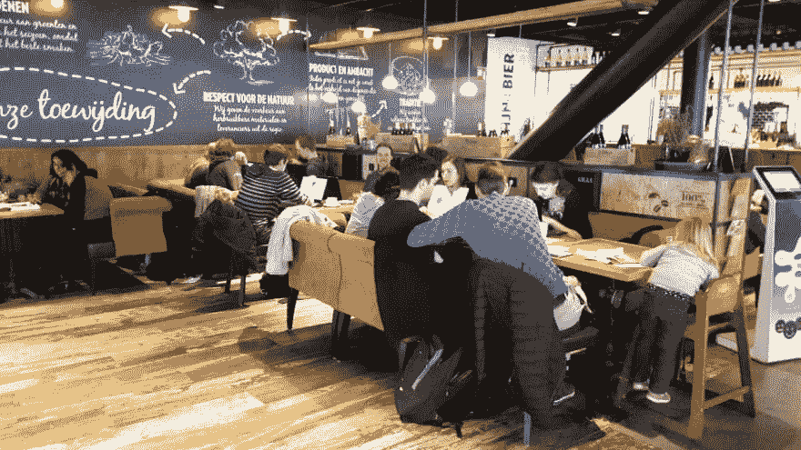

# 创建社区:一致性是最重要的

> 原文：<https://dev.to/jlengrand/creating-communities-consistency-is-paramount-8mf>

作为荷兰国际集团 IT 分会的负责人，我的工作之一就是对分会成员的“掌控”负责。这意味着我需要确保他们基本上处于游戏的顶端，并保持增长(朝着他们想要的方向！).

我大部分是通过一对一的会议来完成的。我很快意识到我周围的大部分同事不去聚会，也不在家做任何编程。这当然没问题，但我来自一个小公司，那里的每个人都非常有激情，这是我没有想到的。然而，我坚信**一个人不能仅仅通过完成日常任务来保持技术相关性/变得更好**。毕竟我们作为开发人员所做的大部分都是简单的管道工作，真正激活我们的任务是稀缺的。在大公司中尤其如此，因为大部分工作都是在现有应用程序之上进行的。

当然，我们公司的大多数开发人员每年都会参加一到两次会议。但是一年两次足以让一个人对他的工作保持动力吗？这肯定是它的一部分。

在过去的一年半时间里，**我给自己设定了一个任务，那就是为人们创造更多的机会，让他们得到‘启发’**,并为我们正在做的美好工作感到自豪。我以两种不同的方式做到这一点:

*   **:一套月度/双月深度技术午餐时间会谈，在职场上进行。**
***   建立官方 ing 科技博客 。你听到了吧，自今年年初以来，ING 已经有了一个官方的技术博客:)。<！-kg-卡-begin: image - >**

 **<figure> 

<figcaption>我们最后的午餐，与嘉宾 Trisha Gee 从 Jetbrains</figcaption>

</figure>

午餐螺旋开始时很小，但现在越来越大。仅在 6 月份，我们就收到了来自 Jetbrains 的 Google over 和 [**Trisha Gee**](https://twitter.com/trisha_gee) 。我们现在计划与 Spotify、AWS、Azure、Gitlab 等合作举办会议，最后一次会议有 80 多人参加！我很高兴看到我上面谈到的那些人从那些会议中受到鼓舞，**渴望在家里尝试更多。我们现在甚至开始在新的地点和国家开展业务！**

对于午餐灵感和博客来说，内容正以我的方式到来，我不必再为之苦苦追寻。但并不总是这样！我花了 4 个多月的时间完成了启动博客所需的所有工作，还经历了一场漫长的艰苦战斗来寻找创作内容的人。寻找我们的第一个午餐演讲人也是一个挑战，我不得不走出自己的方式来启动整个想法。

我从过去 6 年创建社区中学到的是，你最好的盟友是一致性。**不要投入大量的工作，因为这是不可持续的。投入一些时间，但是要坚持不懈，无论如何都要坚持下去！**

这些年来，我一直在组织一些聚会。咖啡、代码和聊天聚会现在有超过 1000 人参加，当我写这篇文章时，我正和大约 10 个其他黑客在一起。**我们不举办展示，也不像其他聚会那样邀请演讲者。我们只是见面，一起喝咖啡，做我们自己的项目。人们甚至要为他们的咖啡付钱！尽管如此，我们仍然是乌得勒支第五大科技聚会。怎么会？**在过去的 5 年里，我每个周六都会去那里，一直如此。有一段时间，我们 2 岁，或者 3 岁。但是人数开始增加，我们已经有超过 25 人参加了会议！去年的数字下降了，但我相信在我离开的那天，这个聚会会继续下去。****

<figure> 

<figcaption>我们周六上午的一次聚会</figcaption>

</figure>

这些年来，我目睹了太多聚会和社区的消亡。他们开始高飞，飞了几个月，有一天他们就停下来了。通常是在不到一年后。

你想创建一个社区？你不必成为摇滚明星。你不需要有很棒的场地。保持愉快和一致就好。一遍又一遍。人们会找到你的。**