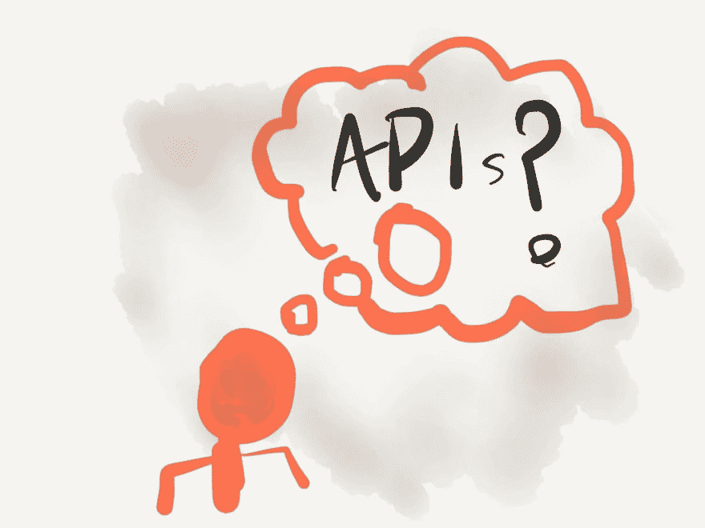
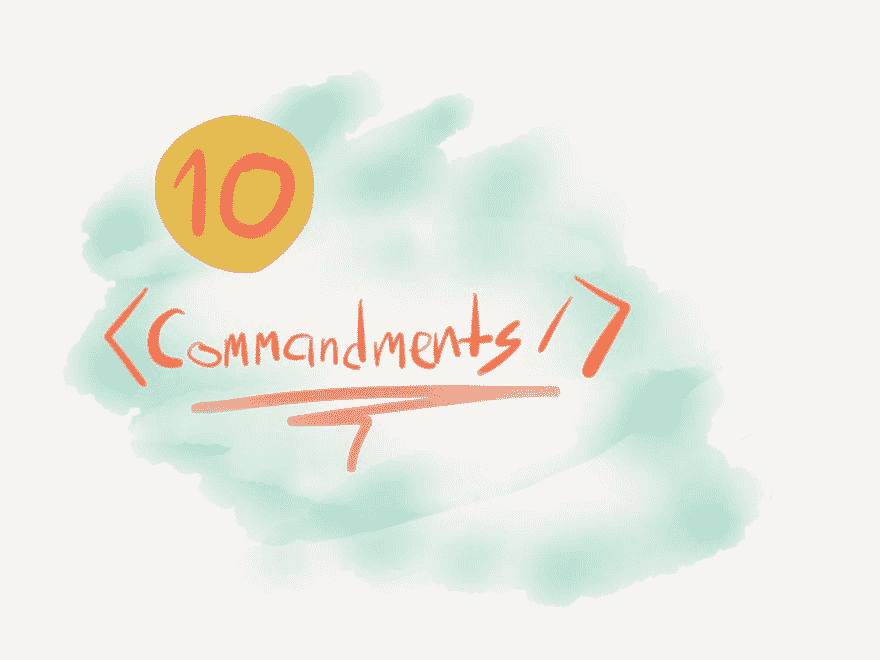

# 10 条戒律

> 原文：<https://dev.to/selbekk/the-10-component-commandments-2a7f>

> 与 Caroline Odden 合作撰写。基于 2019 年 6 月在 ReactJS 奥斯陆会议上举行的同名同人的谈话。

创建被很多人使用的组件是困难的。如果这些道具应该是公共 API 的一部分，你必须非常仔细地考虑你应该接受什么样的道具。

本文将向您简要介绍 API 设计中的一些最佳实践，以及您可以用来创建其他开发人员喜欢使用的组件的 10 条实用戒律清单。

[](https://res.cloudinary.com/practicaldev/image/fetch/s--UkzFrUiz--/c_limit%2Cf_auto%2Cfl_progressive%2Cq_auto%2Cw_880/https://thepracticaldev.s3.amazonaws.com/i/tzruxhdpzm8tc2sroarv.jpg)

## 什么是 API？

API——或应用程序编程接口——基本上是两段代码相遇的地方。它是你的代码和世界其他部分之间的接触面。我们称这个接触面为界面。它是您可以与之交互的一组已定义的操作或数据点。

你的后端和前端之间的接口是一个 API。通过与这个 API 交互，您可以访问一组给定的数据和功能。

类和调用该类的代码之间的接口也是 API。您可以调用类上的方法来检索数据或触发封装在其中的功能。

按照同样的思路，**你的组件接受的道具也是它的 API** 。这是用户与组件交互的方式，当您决定公开什么时，许多相同的规则和考虑事项都适用。

## API 设计中的一些最佳实践

那么在设计一个 API 时，有哪些规则和考虑呢？嗯，我们在这方面做了一些研究，结果发现有很多很好的资源。我们挑选了两个——乔希·陶伯勒的[“什么是好的 API？”](https://joshdata.wordpress.com/2014/02/10/what-makes-a-good-api/)和[罗恩·库里尔的同名文章](https://medium.com/@rkuris/good-apis-cd861b8b70a3)——我们想出了 4 个可以遵循的最佳实践。

### 稳定版本化

当你创建一个 API 的时候，要考虑的最重要的事情之一就是尽可能的保持它的稳定性。这意味着随着时间的推移，最小化突破性变化的数量。如果您确实有突破性的变化，请确保编写大量的升级指南，如果可能的话，为消费者提供一个自动化该过程的代码模块。

如果你正在发布你的 API，确保遵守[语义版本](https://semver.org/)。这使得消费者很容易决定需要什么版本。

### 描述性错误信息

每当调用 API 时出现错误，您都应该尽力解释哪里出错了，以及如何修复它。用一个没有任何上下文的“错误用法”来羞辱消费者似乎不是一个好的用户体验。

相反，编写描述性的错误来帮助用户修正他们调用 API 的方式。

### 尽量减少开发者的惊讶

开发人员是脆弱的，当他们使用你的 API 时，你不想吓到他们。换句话说——让你的 API 尽可能的直观。您可以通过遵循最佳实践和现有的命名约定来实现这一点。

另一件要记住的事情是与你的代码保持一致。如果你在布尔属性名的前面加上`is`或`has`，而在下一个地方跳过它——这将会使人们感到困惑。

### 最小化你的 API 面

当我们谈到最小化东西的时候，也要最小化你的 API。大量的特性都很好，但是你的 API 表面越少，你的用户需要学习的就越少。这反过来被认为是一个易于使用的 API！

总有一些方法可以控制 API 的大小——一种是从旧的 API 中重构出一个新的 API。

## 十大构件戒律

[](https://res.cloudinary.com/practicaldev/image/fetch/s--V2VIARcT--/c_limit%2Cf_auto%2Cfl_progressive%2Cq_auto%2Cw_880/https://thepracticaldev.s3.amazonaws.com/i/8halntamxnndr2fb5a6s.jpg)

因此，这 4 条黄金法则对于 REST APIs 和 Pascal 中的旧的过程化东西来说非常有效——但是它们如何转化为 React 的现代世界呢？

正如我们前面提到的，组件有自己的 API。我们称之为`props`，这就是我们如何为组件提供数据、回调和其他功能。我们如何构造这个`props`对象，使得我们不违反上面的任何规则？我们如何以这样一种方式编写我们的组件，使得下一个开发人员在测试它们的时候可以很容易地使用它们？

我们列出了在你创建组件时需要遵循的 10 条好规则，我们希望这些规则对你有用。

### 1。记录用法

如果你不记录你的组件应该如何被使用，它就毫无用处。嗯，差不多——消费者总是可以检查实现，但这很少是最好的用户体验。

有几种方法来记录组件，但在我们看来，有 3 个选项值得推荐:

*   [故事书](https://storybook.js.org/)
*   [Styleguidist](https://react-styleguidist.js.org/)
*   [Docz](https://www.docz.site/)

前两个给你一个开发组件的平台，而第三个让你用 [MDX](https://mdxjs.com/) 编写更多自由格式的文档。

无论您选择什么，确保记录 API，以及如何和何时使用您的组件。最后一部分在共享组件库中至关重要——所以人们在给定的上下文中使用正确的按钮或布局网格。

### 2。考虑上下文语义

HTML 是一种以语义方式组织信息的语言。然而，我们的大多数组件都是由`<div />`标签组成的。这在某种程度上是有意义的——因为通用组件不能真正假设它应该是一个`<article />`、`<section />`还是`<aside />`——但这并不理想。

相反，我们建议您允许您的组件接受一个`as` prop，这将始终允许您覆盖正在呈现的 DOM 元素。这里有一个如何实现它的例子:

```
function Grid({ as: Element, ...props }) {
  return <Element className="grid" {...props} /> }
Grid.defaultProps = {
  as: 'div',
}; 
```

我们将`as`属性重命名为局部变量`Element`，并在我们的 JSX 中使用它。当你真的没有更语义化的 HTML 标签要传递时，我们给出一个通用的默认值。

当需要使用这个`<Grid />`组件时，只需传递正确的标签:

```
function App() {
  return (
    <Grid as="main">
      <MoreContent />
    </Grid>
  );
} 
```

请注意，这与 React 组件一样适用。一个很好的例子是，如果你想让一个`<Button />`组件呈现一个反应路由器`<Link />`而不是:

```
<Button as={Link} to="/profile">
  Go to Profile
</Button> 
```

### 3。避免布尔道具

布尔道具听起来是个好主意。您可以在没有值的情况下指定它们，因此它们看起来非常优雅:

```
<Button large>BUY NOW!</Button> 
```

但是，即使它们看起来很漂亮，布尔属性只允许两种可能性。开或关。可见或隐藏。1 或 0。

每当你开始引入布尔属性，比如大小、变量、颜色或者任何可能不是二元选择的东西时，你就有麻烦了。

```
<Button large small primary disabled secondary>
  WHAT AM I??
</Button> 
```

换句话说，布尔属性通常不随需求的变化而变化。取而代之的是，尝试使用枚举值，比如字符串，这些值可能有机会成为除了二进制选择之外的任何值。

```
<Button variant="primary" size="large">
  I am primarily a large button
</Button> 
```

这并不是说布尔属性没有地位。他们当然有！上面列出的属性 I 应该仍然是一个布尔值——因为在 enabled 和 disabled 之间没有中间状态。把它们留给真正的二元选择吧。

### 4。使用`props.children`

React 有一些特殊的属性，处理方式与其他属性不同。一个是`key`，用于跟踪列表项的顺序，另一个是`children`。

放在开始和结束组件标签之间的任何东西都放在`props.children` prop 里面。你应该尽可能多地使用它。

这样做的原因是，它比使用一个`content` prop 或其他通常只接受简单值(如文本)的东西要容易得多。

```
<TableCell content="Some text" />

// vs

<TableCell>Some text</TableCell> 
```

使用`props.children`有几个好处。首先，它类似于常规 HTML 的工作方式。第二，你可以随意传入任何你想传入的东西！不要把`leftIcon`和`rightIcon`道具添加到你的组件中——只要把它们作为`props.children`道具的一部分传入:

```
<TableCell>
  <ImportantIcon /> Some text
</TableCell> 
```

你可能总是认为你的组件应该只允许呈现常规文本，在某些情况下这可能是真的。至少现在是这样。相反，通过使用`props.children`,您可以让您的 API 适应这些不断变化的需求。

### 5。让父对象与内部逻辑挂钩

有时，我们会创建具有大量内部逻辑和状态的组件，比如自动完成的下拉列表或交互式图表。

这些类型的组件最容易受到冗长 API 的困扰，原因之一是随着时间的推移，您通常需要支持大量的覆盖和特殊用法。

如果我们能提供一个单一的、标准化的道具，让消费者控制、反应或直接覆盖组件的默认行为，会怎么样？

肯特·c·多兹(Kent C. Dodds)就这个概念写了一篇很棒的文章，名为《国家缩减者》(state reducers)。有一个[帖子是关于概念本身](https://kentcdodds.com/blog/the-state-reducer-pattern)，另一个是关于[如何为 React 钩子](https://kentcdodds.com/blog/the-state-reducer-pattern-with-react-hooks)实现它。

简而言之，这种向组件传递“状态缩减器”函数的模式将允许消费者访问组件内部调度的所有操作。你可以改变状态，甚至引发副作用。这是一个允许高水平定制的好方法，不需要所有的道具。

下面是它的样子:

```
function MyCustomDropdown(props) {
  const stateReducer = (state, action) => {
    if (action.type === Dropdown.actions.CLOSE) {
      buttonRef.current.focus();
    }
  };
  return (
    <>
      <Dropdown stateReducer={stateReducer} {...props} />
      <Button ref={buttonRef}>Open</Button>
    </> } 
```

顺便说一下，你当然可以创建更简单的方式来对事件做出反应。在前一个例子中提供一个`onClose`道具可能会带来更好的用户体验。保存状态缩减器模式，以备需要时使用。

### 6。传播剩余的道具

每当你创建一个新的组件时——确保将剩余的道具分散到任何有意义的元素上。

您不必一直向组件添加道具，这些道具将被传递给底层组件或元素。这将使您的 API 更加稳定，消除了下一个开发人员需要新的事件监听器或 aria-tag 时对大量小版本的需求。

可以这样做:

```
function ToolTip({ isVisible, ...rest }) {
  return isVisible ? <span role="tooltip" {...rest} /> : null;
} 
```

每当你的组件在你的实现中传递一个属性时，比如一个类名或者一个`onClick`处理程序，确保外部消费者也能做同样的事情。在类的情况下，你可以简单地用 handly `classnames` npm 包(或者简单的字符串连接)附加类 prop:

```
import classNames from 'classnames';
function ToolTip(props) {
  return (
    <span 
      {...props} 
      className={classNames('tooltip', props.tooltip)} 
    /> } 
```

对于点击处理程序和其他回调函数，您可以用一个小工具将它们合并成一个函数。这里有一种方法:

```
function combine(...functions) {
  return (...args) =>
    functions
      .filter(func => typeof func === 'function')
      .forEach(func => func(...args));
} 
```

这里，我们创建了一个函数，它接受您的函数列表进行组合。它返回一个新的回调，用相同的参数依次调用它们。

你应该这样使用它:

```
function ToolTip(props) {
  const [isVisible, setVisible] = React.useState(false);
  return (
    <span 
      {...props}
      className={classNames('tooltip', props.className)}
      onMouseIn={combine(() => setVisible(true), props.onMouseIn)}
      onMouseOut={combine(() => setVisible(false), props.onMouseOut)}
    />
  );
} 
```

### 7。给出足够的默认值

只要有可能，确保为你的道具提供足够的默认值。这样，您可以最大限度地减少需要传递的道具数量——这极大地简化了您的实现。

以一个`onClick`处理器为例。如果你的代码中不需要，提供一个 noop-function 作为默认属性。这样，您可以在代码中调用它，就好像它总是被提供一样。

另一个例子是自定义输入。假设输入字符串是空字符串，除非显式提供。这将让你确保你总是在处理一个字符串对象，而不是一些未定义的或空的东西。

### 8。不要重命名 HTML 属性

HTML 作为一种语言有它自己的属性，它本身就是 HTML 元素的 API。为什么不继续使用这个 API 呢？

正如我们前面提到的，最小化 API 表面和使其有些直观是改进组件 API 的两个很好的方法。因此，与其创建自己的`screenReaderLabel`道具，为什么不直接使用已经提供给你的`aria-label` API 呢？

所以**为了你自己的“易用性”，不要重命名任何现有的 HTML 属性**。您甚至没有用新的 API 替换现有的 API 而是在上面添加了您自己的 API。人们仍然可以通过你的`screenReaderLabel`道具旁边的`aria-label`——那么最终值应该是多少呢？

顺便说一下，确保永远不要覆盖组件中的 HTML 属性。一个很好的例子是`<button />`元素的`type`属性。可以是`submit`(默认)、`button`或`reset`。然而，许多开发人员倾向于重新使用这个专有名称来表示按钮的视觉类型(`primary`、`cta`等等)。

通过改变这个道具的用途，您必须添加另一个覆盖来设置实际的`type`属性，这只会导致混乱、怀疑和令用户不快。

相信我——我已经一次又一次地犯了这个错误——这真是一个难以忍受的决定。

### 9。写出正确类型

任何文档都不如存在于代码中的文档好。React 提供了一种很好的方式来声明带有`prop-types`包的组件 API。现在，去用它。

你可以对你需要的和可选的道具的形状和形式指定任何类型的要求，你甚至可以用 [JSDoc 评论](https://devhints.io/jsdoc)进一步改进它。

如果您跳过一个必需的属性，或者传递一个无效或意外的值，您将在控制台中得到运行时警告。这对开发来说很棒，并且可以从您的产品构建中剥离出来。

如果你用 TypeScript 或 Flow 编写 React 应用程序，你会得到这种 API 文档作为一种语言特性。这导致了更好的工具支持和更好的用户体验。

如果您自己没有使用类型化 JavaScript，您仍然应该考虑为那些使用类型化 JavaScript 的消费者提供类型定义。这样，他们就能更容易地使用你的组件。

### 10。为开发者设计

最后，要遵循的最重要的规则。确保你的 API 和“组件体验”是为使用它的人——你的开发伙伴——优化的。

改善这种开发人员体验的一种方法是为无效使用提供大量的错误消息，以及在有更好的方法使用组件时提供仅用于开发的警告。

在编写错误和警告时，请确保引用带有链接的文档或提供简单的代码示例。消费者越快发现问题所在以及如何解决问题，你的组件使用起来就越舒服。

事实证明，所有这些冗长的错误警告根本不会影响最终的包大小。感谢死代码消除的奇迹，所有这些文本和错误代码都可以在为生产而构建时删除。

React 本身就是一个做得非常好的库。每当你忘记为你的列表项指定一个键，或者拼错一个生命周期方法，忘记扩展正确的基类或者以不确定的方式调用钩子——你会在控制台得到大而厚的错误消息。为什么您的组件的用户应该期望更少呢？

所以为你未来的用户设计。5 周内为自己设计。为那些在你离开后不得不维护你的代码的可怜虫设计！为开发者设计。

## 一次回顾

我们可以从经典的 API 设计中学到很多东西。通过遵循本文中的提示、技巧、规则和戒律，您应该能够创建易于使用、易于维护、使用直观且在需要时极其灵活的组件。

你最喜欢的创建酷组件的技巧是什么？