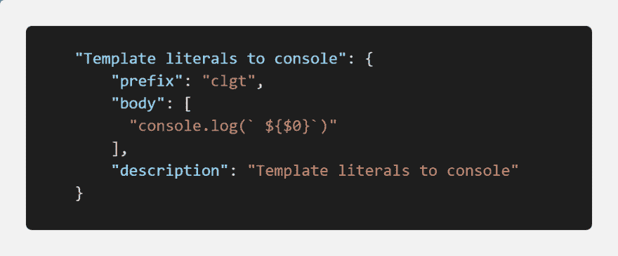

# 您的 ES6 模板文本！

> 原文：<https://dev.to/drozerah/vscode-snippet-your-es6-template-literals-1ha2>

[](https://res.cloudinary.com/practicaldev/image/fetch/s--gAnF9GDy--/c_limit%2Cf_auto%2Cfl_progressive%2Cq_auto%2Cw_880/https://thepracticaldev.s3.amazonaws.com/i/waip3rz6vb58s7ajsetm.png) 
你越是在你的`console.log()`中使用 ES6 [模板文字](https://developer.mozilla.org/en-US/docs/Web/JavaScript/Reference/Template_literals)——就像我一样——你就越需要你的 VSCode 片段！不要重复编写相同的模板！

```
const greetings = "Hello"
console.log(`${greetings} the DEV community!`) // Hello the DEV community! 
```

用 VSCode 创建自己的代码片段很容易:

`VSCode > File > Preferences > User Snippets > New Global Snippets file`

然后，选择您希望代码片段可用的语言，在我们的例子中是`JavaScript`，将您的[代码片段语法](https://code.visualstudio.com/docs/editor/userdefinedsnippets#_snippet-syntax)复制并粘贴为`.json`格式:

`{}javascript.json VSCode file`

```
//...  "Template literals to console":  {  "prefix":  "clgt",  "body":  [  "console.log(` ${$0}`)"  ],  "description":  "Template literals to console"  }  //... 
```

就是这个！

现在，在您正在处理的任何`.js`文件中，只需键入代码片段前缀`clgt`并按下`Tab`就可以在您的代码中插入一个新的代码片段。不要忘记首先启用编辑器的 tab 补全功能`"editor.tabCompletion": "on"`。

提示=> [代码片段生成器](https://snippet-generator.app/) 

下一步？

玩得开心&有创意！

感谢阅读！

下次见！

德罗泽拉