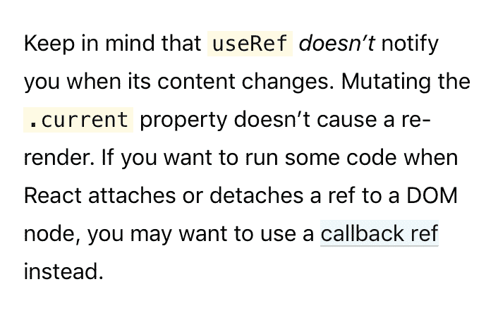

# 同一个 useRef，但是它会回调🤙

> 原文：<https://dev.to/thekashey/the-same-useref-but-it-will-callback-8bo>

很长一段时间我们没有`refs`——我们只有`ref`，它是基于回调的。某个东西会通过调用它来设置一个`ref`。

```
class Example extends React.Component {
  state = {
    ref1: null,
  }

  ref2 = null;

  // updating ref1 would trigger update for this component
  setRef1 = (ref) => this.setState(ref1);
  // updating ref2 would just set it 
  setRef2 = (ref) => this.ref2 = ref; 

  render() {
    return <div ref={ref1}><span ref={ref2}>🤷‍♂️</span></div>
} 
```

这就是我们多年来一直在做的事情，直到`createRef`来到这个游戏。`React.createRef`更多的是关于`ref2`的方式——当前 ref 会*只是将*设置为，嗯，`ref.current`。

> 请记住， **useRef 不会在内容改变时通知**您。变异了。当前属性不会导致重新呈现。

所以- *如果你想在 React 附加或分离一个对 DOM 节点的引用时运行一些代码，你可能想使用[一个回调引用](https://reactjs.org/docs/hooks-faq.html#how-can-i-measure-a-dom-node)来代替。即老办法来 _ref* 。

[](https://res.cloudinary.com/practicaldev/image/fetch/s--33-g5Jsx--/c_limit%2Cf_auto%2Cfl_progressive%2Cq_auto%2Cw_880/https://thepracticaldev.s3.amazonaws.com/i/xihl091fqcx5ok39qsqj.png)T3】

```
const Example = () => {
   const [ref, setRef] = useState(null);
   const onRefSet = useCallback(ref => {
      setRef(ref);
      ref.current.focus(); // a side effect!
   });

   // well, you can re
   return <div ref={onRefSet}>😎</div> } 
```

但是以后你可能会尝试组合引用-引用和回调-引用，以及...那是通往…的路🔥地狱🔥。

此外——还有[useimperative handle](https://reactjs.org/docs/hooks-reference.html#useimperativehandle)*部分*可以控制 *ref 传播*，但每次我习惯使用它——它只是一个💩灾难💩。

```
function FancyInput(props, ref) {
  const inputRef = useRef(null);
  useImperativeHandle(ref, () => ({
    focus: () => {
      inputRef.current.focus(); // it just does not usually works :P
    }
  }));
  return <input ref={inputRef} ... />;
}
FancyInput = forwardRef(FancyInput); 
```

# 来修吧！

引入[use-callback-ref](https://github.com/theKashey/use-callback-ref)——同样的`createRef`和`useRef`，但是内置了回调。

```
import {useCallbackRef} from 'use-callback-ref';

const Example = () => {
   const ref = useCallbackRef(null, ref => ref && ref.focus());

   // that's all
   return <div ref={ref}>😎</div> } 
```

它实际上是老一套的`ref`加上一个**变化回调**，仅此而已。

> 为什么不使用基于回调的 ref？嗯，处理一个接口要容易得多，虽然 ref 的所有组件都将被传递，但是这个接口是可访问的，而对于过渡组件来说，只有`setRef`是可见的。然而，从隔离的角度来看，这可能是一件好事。

这个简单的方法也可以帮助处理`useImperativeHandle`案例:

```
function FancyInput(props, ref) {

  const inputRef = useCallbackRef(null, (newValue) => {
    // notice - this code is __isolated__, and you can move it off this component
    ref.current = { focus: () => newValue.focus() }
    // as long as you don't need to use callback-ref anymore - we could simply this case.
  });

  return <input ref={inputRef} ... />;
}
FancyInput = forwardRef(FancyInput); 
```

所以——请记住， **useRef 不会在内容改变时通知**您。变异了。当前属性不会导致重新呈现。如果您希望在 React 附加或分离对 DOM 节点的引用时运行一些代码，**您可能希望使用 useCallbackRef 来代替**。

*   300b 和 IE11 支持
*   基于 getters 和 setters，不涉及代理

现在就试试( [codesandbox demo](https://codesandbox.io/s/usecallbackref-example-jldvr) )，稍后再打给我-【https://github.com/theKashey/use-callback-ref

> 还有就是这篇文章的第二部分
> 
> [](/thekashey) [## 合并参考
> 
> ### Anton Korzunov 10 月 12 日 196 分钟阅读
> 
> #react #webdev #ref #hooks](/thekashey/merging-refs-41l8)