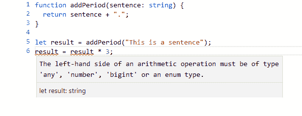

# 使用 TypeScript 减少 JS 错误

> 原文：<https://dev.to/mcapodici/make-fewer-js-mistakes-with-typescript-56gi>

(本文原创发布于[https://superjavascript.com/t/typescript/](https://superjavascript.com/t/typescript/))

Javascript (JS)最初的目的是对网页做一些小的改动，比如当你在 email @符号上滚动时旋转动画，或者验证你输入的电子邮件地址是否正确。从那以后，JS 被用于更复杂的事情。例如，它用于所谓的“单页应用程序”，就像在网络浏览器上交付的传统桌面应用程序。第一个像这样著名的应用是谷歌的 Gmail。

2011 年，NodeJS 发布，允许开发者编写运行在服务器上的 JS 代码，为网站提供后端。这些后端需要创建动态网站，允许人们登录，存储信息和交流。传统上，这些代码是用 Java、C#、Ruby 或 Python 之类的语言编写的，但是 NodeJS 变得流行起来，部分原因是你可以在 web 页面上使用与后端相同的 JS 编程语言。

2013 年 GitHub 发布了电子版，这是一个使用...你猜对了...Javascript。电子是基于 web 技术的，所以你为 web 编写的 HTML、CSS、Javascript 都可以在电子中重用。然而，电子使开发者能够访问用户计算机上的资源，如本地文件、照相机和声音。

随着 Javascript 的使用从简单的网站调整演变成一种到处都在使用的语言，它已经显示出紧张的迹象。不同版本的 Javascript 已经发布，如 2009 年的 ES5 和 2015 年的 ES6，以使语言现代化。然而，所有版本的 Javascript 都有一个问题，那就是很难管理更大的程序。这是一个由 TypeScript 解决的问题。

# Javascript 的问题

Javascript 的问题在于它使用了*“动态类型”*。

那是什么意思？这意味着当你写代码时，你可以灵活地使用对象、数组等。以你认为合适的任何方式，并且在你写代码或编译它的时候不会有错误。

这听起来是件好事，对吗？

问题是，当你运行程序时，仍然会出错。到那时就“太晚了”。更糟糕的是，这些错误只有在极少数情况下才会被发现。你的程序的用户可能会发现他们自己的情况，但是你没有测试。

为了说明这个问题，假设您将一个变量传递给一个名为`honestly_im_a_string`的函数。那么这个变量可能是一个字符串(也许应该是！)，但它可以是任何东西，包括:

*   不明确的
*   空
*   类似于 4 的数字
*   不像 NaN 或 Infinity 那样的数字
*   阵列
*   一个物体
*   一个数组，其中第一个值是 object，第二个值是 NaN
*   等等...

如果你只是假设值是一个字符串，并开始用它做查找/替换之类的事情，那么如果另一段代码向它传递一个数组，程序就会出错。

这可能是个错误吗？是啊！也许其他人正在编写调用你的函数的代码，而他们不知道。可能是同一个程序员在重温几个月前的代码时犯了这个错误。由于要跟踪大量的函数和变量，如果同一个程序员在同一天编写函数和使用它的代码，这种错误甚至会发生！

随着程序变得越来越大，函数和对象越来越多，很容易忘记这些函数期望什么。例如，如果你传入一个带有坐标的对象，那么属性应该是`x`和`y`还是`X`和`Y`？它需要一个数组还是只有一个？在某个地方很容易出错，通常只有当发现时已经太晚了，并且程序正在被打电话给你提出问题的用户使用。

# 解

解决方法是*“静态打字”*。

这是你写程序时定义变量类型的地方。在你运行程序之前，编译器会检查你没有误用任何类型。

在`honestly_im_a_string`的例子中，这意味着在运行程序之前你会被告知有错误，因为有人试图将一个数组传递给一个需要字符串的函数。

在坐标的例子中，你可以定义你的对象有一个`x`，如果你试图得到它的`X`，你会从编译器得到一个错误，所以你可以在你第一次运行程序之前修复它。

TypeScript 提供了在程序中定义变量类型的能力。这是通过用 TypeScript 语言编写程序来实现的，类似于 Javascript，但它允许您用类型“注释”变量。

TypeScript 程序被一个叫做“tsc”或者“TypeScript 编译器”的工具编译成 Javascript。在这个过程中，它会检查你没有犯任何错误。

作为一个例子，少看一个 TypeScript 函数，它接受一个字符串并在末尾添加一个句号(或句号):

```
function addPeriod(sentence: string) {
  return sentence + ".";
} 
```

这与 JavaScript 等价函数的区别在于函数参数中的类型注释`: string`。这告诉 TypeScript 编译器需要一个字符串。这有两个影响。

一个是它知道`sentence`是一个字符串，它会检查你在函数中做的任何事情对一个字符串都有效。在这种情况下，我们向它追加另一个字符串，这很好。

其次，它检查任何调用这个函数的代码传入的是一个字符串，而不是其他东西。如果此检查失败，它将无法编译。使用 Javascript，直到你运行程序时你才知道有问题。

TypeScript 将对上面的代码做的另一件有趣的事情是，它将计算出您将总是返回一个字符串。它之所以知道这一点，是因为它知道那个句子是一个字符串，你在那个字符串后面追加了另一个字符串，然后返回它。

对于任何调用`addPeriod`并将结果放入变量的代码，TypeScript 将知道该变量是一个字符串。

例如，下面的代码在试图编译时会给出一个错误:

```
let result = addPeriod("This is a sentence");
result = result * 3; 
```

以下是在[在线类型脚本编译器](https://www.typescriptlang.org/play/)中查看时的错误消息:

[](https://res.cloudinary.com/practicaldev/image/fetch/s--kwKiId2z--/c_limit%2Cf_auto%2Cfl_progressive%2Cq_auto%2Cw_880/https://superjavascript.cimg/typescript_error.png)

# 逃生舱口

TypeScript 的好处是有时你可以欺骗并像使用好的 Javascript 一样使用它。

Javascript 非常适合处理来自服务器的响应，这些响应可能包含不同格式的数据、丢失的数据等。它很好，因为它像对待任何其他 JavaScript 对象一样对待响应，并且您可以调用任何您喜欢的属性，而不必预先定义它们。如果你要求一些没有定义的东西，它的值将是 JavaScript 中众所周知的`undefined`值。

例如，如果你得到一个足球比赛结果的对象，你可以调用`.teamAgoals`和`.teamBgoals`来查看比分。如果后来他们改变了响应来包含其他信息，比如比赛时间，你可以很容易地改变程序来处理它。

在 TypeScript 中，你可以声明一个类型为`any`的变量，这将允许你像对待传统的 Javascript 一样对待它，并让它成为一个未知的类型，你可以探测它有什么属性。下面是一个例子:

```
let serverResponse : any = { color: 'red', numbers: [1,2,3] };

// This will say 'red':
console.log(serverResponse.color);

// This will say undefined:
console.log(serverResponse.shapes); 
```

这个例子将会编译，即使我们引用的是`shapes`，否则 TypeScript 编译器会认为它不是`serverResponse`对象的一部分。

# 总结

在这里，我们已经触及了 TypeScript 的表面，这是一种编程语言，它允许您编写带有额外安全检查的 JavaScript 程序，以便您在 JavaScript 程序中犯更少的错误。

(本文原创发布于[https://superjavascript.com/t/typescript/](https://superjavascript.com/t/typescript/))

我有一本免费的 JS 制作画布游戏的书。参见[https://superjavascript.com/book/](https://superjavascript.com/book/)