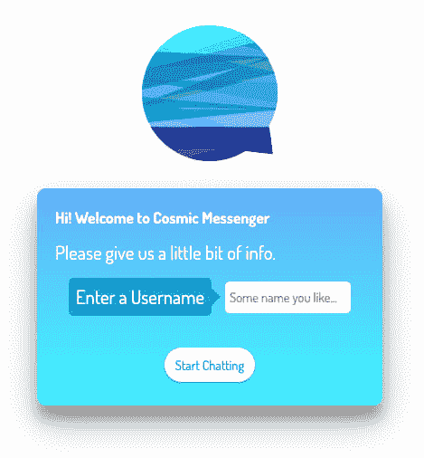

# 使用 Twilio、Node.js、GraphQL 和 Cosmic JS 构建一个完整的支持 SMS 的聊天应用程序

> 原文：<https://dev.to/jacobknaack/building-a-full-stack-sms-enabled-chat-application-using-twilio-node-js-graphql-and-cosmic-js-24f3>

[](https://res.cloudinary.com/practicaldev/image/fetch/s--z1WYZYoy--/c_limit%2Cf_auto%2Cfl_progressive%2Cq_auto%2Cw_880/https://thepracticaldev.s3.amazonaws.com/i/btzxs1o0lenwcwa8tqky.png)

多么美好的一天啊！今天，我们将探索聊天技术的发展历程，以及构建一个功能全面的聊天应用程序有多容易，只需几个(超级 rad)开发工具，就能发送 SMS 消息，任何人只要动动手指就能使用这些工具。有很多内容要讲，所以让我们开始吧！

## TLDR:

[Node.js 聊天应用演示](https://cosmicjs.com/apps/cosmic-messenger)

[Node.js 聊天 App 源代码](https://github.com/cosmicjs/nodejs-chat-app)

## 简介

让我们来谈谈**目标**，我们想在接下来的一个小时左右完成什么。

我们的应用程序的核心是一个聊天系统。我们会让事情变得非常简单。我们的系统将能够以最少的用户信息注册新用户，创建并向聊天室中的用户发送消息，并最终在用户想要离开时将他们从聊天室中注销。

为了奖励积分，我们还将为我们的系统配置一个短信通知系统，每当有消息通过我们的系统发送时，该系统将向管理员帐户发送一个文本通知。很酷吧？

### 出发前

这个系统将利用多种技术来运行。最重要的是用于管理我们所有数据的 Cosmic JS:我们的用户和我们的消息。为了跟随本教程，你应该在他们的平台上创建一个免费的桶，并创建一个用户和一个 T2 消息对象。

为了发送短信，我们正在利用 Twilio。一个通信平台，允许开发人员通过 web API 打电话和发送文本消息。要实施我们的通知，您必须注册一个免费的 Twilio 号码，并开始一个试用帐户。

### 软件需求？

我们使用 Node JS 作为我们的运行时环境，所以请确保您安装了 Node 的最新(ish)版本。事情解决后，我们可以开始建设了。

### 高层概述

这是一个全栈应用程序，这意味着我们正在构建一个 web 服务器来处理我们的请求，并为我们的客户端应用程序提供服务。我们将创建一个 **Express** 应用程序，它将在我们的 Node JS 服务器上运行，处理到一个小 API 的路由并提供 HTML，以及 **Webpack** 来捆绑我们用 **React** 和 **Graphql** 构建的客户端接口。这样，我们可以利用中央服务器向应用程序的不同部分发出请求:我们的界面、我们的控制器和我们的 Web 服务。

这里有相当多的活动部件，让我们开始吧！

## 构建我们的 Web 服务器

这是我们应用程序的主干，它允许我们控制核心应用程序的各个部分。我们将首先创建并初始化一个项目目录，所有的依赖项都将安装在这个目录中。让我们打开终端，创建一些文件:

```
$ mkdir chat 
$ cd chat 
```

这将创建一个名为 **chat** 的目录，并将我们当前的目录更改为该聊天目录。现在我们可以将这个目录初始化为一个**节点**项目:

```
$ npm init 
```

您的终端将提示您创建我们的 **package.json** 文件，该文件将包含我们项目的大部分元数据。我建议在这些步骤中按回车键，除非你知道一些你想给你的应用程序的具体信息。您随时可以在以后更改这些值。

现在让我们安装一些运行我们的项目需要的节点模块，并把它们保存到依赖列表中。我们将安装我们的 bundler **webpack** 以及必要的加载程序，我们需要这些加载程序来捆绑我们的 JS、HTML 和 SASS /CSS 文件以及我们的服务器框架 express:

```
$ npm install --save webpack webpack-cli clean-webpack-plugin @babel/core @babel/preset-env @babel/preset-react babel-loader file-loader sass-loader css-loader node-sass url-loader style-loader express express-session cookie-parser body-parser socket.io socket.io-client cosmicjs dotenv 
```

我们将这些都保存为项目依赖项，因为我们使用的任何部署容器都需要使用它们来构建和运行我们的应用程序。

接下来，我们还将安装渲染用户界面所需的依赖项:

```
$ npm install --save react react-dom react-router-dom react-icons graphql react-apollo apollo-boost axios 
```

### 设置我们的录入文件

现在我们已经安装了一些依赖项，我们需要创建一个条目文件来处理应用程序的所有请求。当用户向默认路由'/'发出请求时，我们将提供一个 HTML 文件。当客户端向我们的 API 发出请求时，我们使用附加了“/api”的端点。第一步只是创建文件:

```
$ touch index.js 
```

让我们在文本编辑器中打开这个文件，并设置 **Express** ，这样当浏览器导航到我们的本地主机服务器时，我们可以提供一些 HTML: