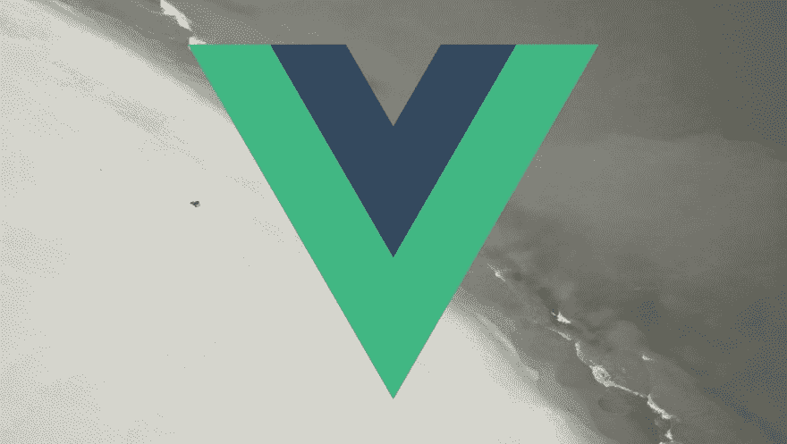

# 了解 Vue 中间件管道

> 原文：<https://dev.to/bnevilleoneill/understanding-vue-middleware-pipelines-b0o>

[](https://res.cloudinary.com/practicaldev/image/fetch/s--DIpNcJGC--/c_limit%2Cf_auto%2Cfl_progressive%2Cq_auto%2Cw_880/https://thepracticaldev.s3.amazonaws.com/i/ig8gnz0b1n5x3smm7b6z.png)

一般来说，在建造温泉时，需要保护某些路线。例如，假设我们有一个只能由经过身份验证的用户访问的仪表板路由，我们可以利用一个身份验证中间件来确保只有经过身份验证的用户才能访问仪表板路由。

在本教程中，我们将看到如何使用 [Vue-Router](https://router.vuejs.org/) 为 Vue 应用程序实现中间件管道。

## 什么是中间件管道？

中间件管道是一堆彼此并行运行的不同中间件。

使用介绍性段落中的假设案例研究，假设我们在`/dashboard/movies`有另一个路由，我们只希望订阅用户可以访问。我们已经知道，要访问仪表板路由，您需要进行身份验证。那么，我们如何着手保护`/dashboard/movies`路由，以确保只有经过认证和订阅的用户才能访问该路由呢？通过使用中间件管道，我们可以将几个中间件链接在一起，并确保它们并行运行。

## **入门**

首先，我们将使用 [Vue CLI](https://cli.vuejs.org/) 快速搭建一个新的 Vue 项目。

```
vue create vue-middleware-pipeline 
```

<svg width="20px" height="20px" viewBox="0 0 24 24" class="highlight-action crayons-icon highlight-action--fullscreen-on"><title>Enter fullscreen mode</title></svg> <svg width="20px" height="20px" viewBox="0 0 24 24" class="highlight-action crayons-icon highlight-action--fullscreen-off"><title>Exit fullscreen mode</title></svg>

## 安装依赖项

一旦创建并安装了项目目录，导航到新创建的目录并从终端运行以下命令:

```
npm i vue-router vuex 
```

<svg width="20px" height="20px" viewBox="0 0 24 24" class="highlight-action crayons-icon highlight-action--fullscreen-on"><title>Enter fullscreen mode</title></svg> <svg width="20px" height="20px" viewBox="0 0 24 24" class="highlight-action crayons-icon highlight-action--fullscreen-off"><title>Exit fullscreen mode</title></svg>

[Vue-router](https://github.com/vuejs/vue-router/) —是 Vue.js 的官方路由器

Vuex 是 Vue 的一个状态管理库

## 创建组件

我们的应用程序将有三个组件。

**登录** —该组件将显示给尚未通过身份验证的用户。

**仪表板** —该组件将显示给已登录的用户。

**Movies** —我们将向已登录并拥有有效订阅的用户显示此组件。

让我们创建这些组件。导航到`src/components`目录并创建以下文件:`Dashboard.vue` `Login.vue`和`Movies.vue`

用以下代码编辑`Login.vue`文件:

```
<template>
  <div>
    <p>This is the Login component</p>
  </div>
</template> 
```

<svg width="20px" height="20px" viewBox="0 0 24 24" class="highlight-action crayons-icon highlight-action--fullscreen-on"><title>Enter fullscreen mode</title></svg> <svg width="20px" height="20px" viewBox="0 0 24 24" class="highlight-action crayons-icon highlight-action--fullscreen-off"><title>Exit fullscreen mode</title></svg>

用以下代码编辑`Dashboard.vue`文件:

```
<template>
  <div>
    <p>This is the Dashboard component for authenticated users</p>
    <router-view/>
  </div>
</template> 
```

<svg width="20px" height="20px" viewBox="0 0 24 24" class="highlight-action crayons-icon highlight-action--fullscreen-on"><title>Enter fullscreen mode</title></svg> <svg width="20px" height="20px" viewBox="0 0 24 24" class="highlight-action crayons-icon highlight-action--fullscreen-off"><title>Exit fullscreen mode</title></svg>

最后，将下面的代码添加到`Movies.vue`文件中:

```
<template>
  <div>
    <p>This is the Movies component for authenticated and subscribed users</p>
  </div>
</template> 
```

<svg width="20px" height="20px" viewBox="0 0 24 24" class="highlight-action crayons-icon highlight-action--fullscreen-on"><title>Enter fullscreen mode</title></svg> <svg width="20px" height="20px" viewBox="0 0 24 24" class="highlight-action crayons-icon highlight-action--fullscreen-off"><title>Exit fullscreen mode</title></svg>

## 创建商店

对于`Vuex`，存储只是一个保存应用程序状态的容器。这将允许我们确定用户是否经过身份验证，以及检查用户是否订阅。

在 src 文件夹中，创建一个`store.js`文件，并将下面的代码添加到该文件中:

```
import Vue from 'vue'
import Vuex from 'vuex'

Vue.use(Vuex)

export default new Vuex.Store({
    state: {
        user: {
            loggedIn: false,
            isSubscribed: false
        }
    },

    getters: {
        auth(state) {
            return state.user
        }
    }
}) 
```

<svg width="20px" height="20px" viewBox="0 0 24 24" class="highlight-action crayons-icon highlight-action--fullscreen-on"><title>Enter fullscreen mode</title></svg> <svg width="20px" height="20px" viewBox="0 0 24 24" class="highlight-action crayons-icon highlight-action--fullscreen-off"><title>Exit fullscreen mode</title></svg>

存储在其状态中包含一个`user`对象。`user`对象包含一个`loggedIn`和`isSubscribed`属性，帮助我们确定用户是否登录并拥有一个活动订阅。我们还在商店内部定义了一个返回`user`对象的`getter`。

[](https://logrocket.com/signup/)

## 定义我们的路线

在创建我们的路由之前，让我们定义它们并关联将被附加到这些路由的相应中间件。

除了认证用户，其他人都可以访问。当经过身份验证的用户访问此路由时，他们应该被重定向到仪表板路由。这个路由将有一个`guest`中间件与之相连。

`/dashboard`只有经过认证的用户才能访问。未经验证的用户在访问此路由时应该被重定向到`/login`路由。我们将把一个`auth`中间件与这条路线关联起来。

`/dashboard/movies`将只能由经过认证和订阅的用户访问。这条路线将受到一个`isSubscribed`和`auth`中间件的保护。

## 创建路线

接下来，在`src`目录中创建一个`router`文件夹，然后在该文件夹中创建一个`router.js`文件。用以下代码编辑文件:

```
import Vue from 'vue'
import Router from 'vue-router'
import store from '../store'

import Login from '../components/Login'
import Dashboard from '../components/Dashboard'
import Movies from '../components/Movies'

Vue.use(Router)

const router = new Router({
    mode: 'history',
    base: process.env.BASE_URL,
    routes: [
        {
            path: '/login',
            name: 'login',
            component: Login
        },

        {
            path: '/dashboard',
            name: 'dashboard',
            component: Dashboard,
            children: [{
                path: '/dashboard/movies',
                name: 'dashboard.movies',
                component: Movies
            }
        ],
        }
    ]
})

export default router 
```

<svg width="20px" height="20px" viewBox="0 0 24 24" class="highlight-action crayons-icon highlight-action--fullscreen-on"><title>Enter fullscreen mode</title></svg> <svg width="20px" height="20px" viewBox="0 0 24 24" class="highlight-action crayons-icon highlight-action--fullscreen-off"><title>Exit fullscreen mode</title></svg>

这里，我们创建了一个新的`router`实例，同时传入了几个配置选项以及一个接受我们之前定义的所有路由的`routes`属性。目前，值得注意的是这些路线都没有受到保护。我们会尽快解决这个问题。

接下来，让我们将路由器和我们的商店注入 Vue 实例。用下面的代码编辑`src/main.js`文件:

```
import Vue from 'vue'
import App from './App.vue'
import router from './router/router'
import store from './store'

Vue.config.productionTip = false

new Vue({
  router,
  store,
  render: h => h(App),
}).$mount('#app') 
```

<svg width="20px" height="20px" viewBox="0 0 24 24" class="highlight-action crayons-icon highlight-action--fullscreen-on"><title>Enter fullscreen mode</title></svg> <svg width="20px" height="20px" viewBox="0 0 24 24" class="highlight-action crayons-icon highlight-action--fullscreen-off"><title>Exit fullscreen mode</title></svg>

## 创建中间件

在`src/router`目录下，创建一个`middleware`文件夹，然后在该文件夹下创建`guest.js`、`auth.js`和`IsSubscribed.js`文件。将以下代码添加到`guest.js`文件中:

```
export default function guest ({ next, store }){
    if(store.getters.auth.loggedIn){
        return next({
           name: 'dashboard'
        })
    }

    return next()
   } 
```

<svg width="20px" height="20px" viewBox="0 0 24 24" class="highlight-action crayons-icon highlight-action--fullscreen-on"><title>Enter fullscreen mode</title></svg> <svg width="20px" height="20px" viewBox="0 0 24 24" class="highlight-action crayons-icon highlight-action--fullscreen-off"><title>Exit fullscreen mode</title></svg>

`guest`中间件检查用户是否被认证。如果通过认证，它们将被重定向到`dashboard`路由。

接下来，用下面的代码编辑`auth.js`文件:

```
export default function auth ({ next, store }){
 if(!store.getters.auth.loggedIn){
     return next({
        name: 'login'
     })
 }

 return next()
} 
```

<svg width="20px" height="20px" viewBox="0 0 24 24" class="highlight-action crayons-icon highlight-action--fullscreen-on"><title>Enter fullscreen mode</title></svg> <svg width="20px" height="20px" viewBox="0 0 24 24" class="highlight-action crayons-icon highlight-action--fullscreen-off"><title>Exit fullscreen mode</title></svg>

在`auth`中间件中，使用`store`我们检查用户当前是否是`authenticated`。根据用户是否登录，我们要么继续请求，要么将他们重定向到登录页面。

用以下代码编辑`isSubscribed.js`文件:

```
export default function isSubscribed ({ next, store }){
    if(!store.getters.auth.isSubscribed){
        return next({
           name: 'dashboard'
        })
    }

    return next()
   } 
```

<svg width="20px" height="20px" viewBox="0 0 24 24" class="highlight-action crayons-icon highlight-action--fullscreen-on"><title>Enter fullscreen mode</title></svg> <svg width="20px" height="20px" viewBox="0 0 24 24" class="highlight-action crayons-icon highlight-action--fullscreen-off"><title>Exit fullscreen mode</title></svg>

`isSubscribed`中间件类似于`auth`中间件。使用我们的`store`,我们检查用户是否被订阅。如果用户已订阅，他们可以访问预定路线，否则将被重定向回仪表板页面。

## 保护航线

现在我们已经创建了所有的中间件，让我们利用它们来保护我们的路线。用以下代码编辑`src/router/router.js`文件:

```
import Vue from 'vue'
import Router from 'vue-router'
import store from '../store'

import Login from '../components/Login'
import Dashboard from '../components/Dashboard'
import Movies from '../components/Movies'

import guest from './middleware/guest'
import auth from './middleware/auth'
import isSubscribed from './middleware/isSubscribed'

Vue.use(Router)

const router = new Router({
    mode: 'history',
    base: process.env.BASE_URL,
    routes: [{
            path: '/login',
            name: 'login',
            component: Login,
            meta: {
                middleware: [
                    guest
                ]
            }
        },

        {
            path: '/dashboard',
            name: 'dashboard',
            component: Dashboard,
            meta: {
                middleware: [
                    auth
                ]
            },
            children: [{
                path: '/dashboard/movies',
                name: 'dashboard.movies',
                component: Movies,
                meta: {
                    middleware: [
                        auth,
                        isSubscribed
                    ]
                }
            }],
        }
    ]
})

export default router 
```

<svg width="20px" height="20px" viewBox="0 0 24 24" class="highlight-action crayons-icon highlight-action--fullscreen-on"><title>Enter fullscreen mode</title></svg> <svg width="20px" height="20px" viewBox="0 0 24 24" class="highlight-action crayons-icon highlight-action--fullscreen-off"><title>Exit fullscreen mode</title></svg>

这里，我们导入了所有的中间件，然后为每个路由定义了一个包含中间件数组的元字段。中间件阵列包含我们希望与特定路由相关联的所有中间件。

## Vue 路由器导航卫士

Vue 路由器提供的[导航卫士](https://router.vuejs.org/guide/advanced/navigation-guards.html#global-before-guards)是我们能够首先使用中间件来保护我们的路由的唯一原因。这些导航保护装置主要用于通过改变航线方向或取消航线来保护航线。

其中之一是全局 before guard，它通常是在触发路由之前调用的钩子。为了在 guard 之前注册一个全局变量，我们在`router`实例上定义了一个`beforeEach`方法。

```
const router = new Router({ ... })
router.beforeEach((to, from, next) => {
 //necessary logic to resolve the hook
}) 
```

<svg width="20px" height="20px" viewBox="0 0 24 24" class="highlight-action crayons-icon highlight-action--fullscreen-on"><title>Enter fullscreen mode</title></svg> <svg width="20px" height="20px" viewBox="0 0 24 24" class="highlight-action crayons-icon highlight-action--fullscreen-off"><title>Exit fullscreen mode</title></svg>

`beforeEach`方法接收三个参数:

这是我们打算进入的路线。

这是我们目前的路线。

`next:`这是被调用来解决钩子的`function`。

## 运行中间件

使用`beforeEach`钩子，我们可以运行我们的中间件。

```
const router = new Router({ ...})

router.beforeEach((to, from, next) => {
    if (!to.meta.middleware) {
        return next()
    }
    const middleware = to.meta.middleware

    const context = {
        to,
        from,
        next,
        store
    }
    return middleware[0]({
        ...context
    })
}) 
```

<svg width="20px" height="20px" viewBox="0 0 24 24" class="highlight-action crayons-icon highlight-action--fullscreen-on"><title>Enter fullscreen mode</title></svg> <svg width="20px" height="20px" viewBox="0 0 24 24" class="highlight-action crayons-icon highlight-action--fullscreen-off"><title>Exit fullscreen mode</title></svg>

我们首先检查正在处理的当前路由是否有一个包含`middleware`属性的元字段。如果找到了`middleware`属性，我们将它赋给一个`const`变量。接下来，我们定义一个`context`对象，它包含了我们需要传递给每个中间件的所有东西。然后我们调用中间件数组中的第一个中间件作为函数，同时传入`context`对象。

尝试访问`/dashboard`路线，您应该会被重定向到`login`路线。这是因为我们的`/src/store.js`中的`store.state.user.loggedIn`属性被设置为`false`。将`store.state.user.loggedIn`属性更改为 true，现在您应该可以访问`/dashboard`路线了。

我们的中间件现在正在工作，但并不完全是我们想要的方式。我们的目标是实现一个管道，在这个管道中，我们可以针对一个特定的路由运行多个中间件。

```
return middleware[0]({ …context}) 
```

<svg width="20px" height="20px" viewBox="0 0 24 24" class="highlight-action crayons-icon highlight-action--fullscreen-on"><title>Enter fullscreen mode</title></svg> <svg width="20px" height="20px" viewBox="0 0 24 24" class="highlight-action crayons-icon highlight-action--fullscreen-off"><title>Exit fullscreen mode</title></svg>

注意上面代码块中的这一行代码，我们只调用了从中间件数组`meta`字段中传递的第一个中间件。那么我们如何确保数组中包含的其他中间件(如果有的话)也被调用呢？这就是我们的管道派上用场的地方。

## 创建管道

导航到`src/router`目录，然后创建一个`middlewarePipeline.js`文件。将以下代码添加到文件中:

```
function middlewarePipeline (context, middleware, index) {
    const nextMiddleware = middleware[index]

    if(!nextMiddleware){
        return context.next 
    }

    return () => {
        const nextPipeline = middlewarePipeline(
            context, middleware, index + 1
        )

        nextMiddleware({ ...context, next: nextPipeline })

    }
}

export default middlewarePipeline 
```

<svg width="20px" height="20px" viewBox="0 0 24 24" class="highlight-action crayons-icon highlight-action--fullscreen-on"><title>Enter fullscreen mode</title></svg> <svg width="20px" height="20px" viewBox="0 0 24 24" class="highlight-action crayons-icon highlight-action--fullscreen-off"><title>Exit fullscreen mode</title></svg>

`middlewarePipeline`接受三个参数:

`context:`这是我们之前创建的`context`对象，这样它就可以被传递给栈中的每一个中间件。

`middleware:`这是`route`的`meta`字段中定义的`middleware`数组本身。

`index:`这是在`middleware`数组中运行的当前中间件的`index`。

```
const nextMiddleware = middleware[index]
if(!nextMiddleware){
return context.next
} 
```

<svg width="20px" height="20px" viewBox="0 0 24 24" class="highlight-action crayons-icon highlight-action--fullscreen-on"><title>Enter fullscreen mode</title></svg> <svg width="20px" height="20px" viewBox="0 0 24 24" class="highlight-action crayons-icon highlight-action--fullscreen-off"><title>Exit fullscreen mode</title></svg>

这里，我们只是在`index`取出传递给`middlewarePipeline`函数的中间件。如果在那个`index`没有找到`middleware`，则返回默认的`next`回调。

```
return () => {
const nextPipeline = middlewarePipeline(
context, middleware, index + 1
)
nextMiddleware({ ...context, next: nextPipeline })
} 
```

<svg width="20px" height="20px" viewBox="0 0 24 24" class="highlight-action crayons-icon highlight-action--fullscreen-on"><title>Enter fullscreen mode</title></svg> <svg width="20px" height="20px" viewBox="0 0 24 24" class="highlight-action crayons-icon highlight-action--fullscreen-off"><title>Exit fullscreen mode</title></svg>

我们调用`nextMiddleware`来运行，同时传入`context`和`nextPipeline`T3。值得注意的是，`middlewarePipeline`函数是一个递归函数，它会调用自身来获取下一个要在堆栈中运行的中间件，同时将`index`递增 1。

## 汇集一切

让我们利用我们的`middlewarePipeline`。用下面的代码编辑`src/router/router.js`文件:

```
import Vue from 'vue'
import Router from 'vue-router'
import store from '../store'

import Login from '../components/Login'
import Dashboard from '../components/Dashboard'
import Movies from '../components/Movies'

import guest from './middleware/guest'
import auth from './middleware/auth'
import isSubscribed from './middleware/isSubscribed'
import middlewarePipeline from './middlewarePipeline'

Vue.use(Router)

const router = new Router({
    mode: 'history',
    base: process.env.BASE_URL,
    routes: [{
            path: '/login',
            name: 'login',
            component: Login,
            meta: {
                middleware: [
                    guest
                ]
            }
        },

        {
            path: '/dashboard',
            name: 'dashboard',
            component: Dashboard,
            meta: {
                middleware: [
                    auth
                ]
            },
            children: [{
                path: '/dashboard/movies',
                name: 'dashboard.movies',
                component: Movies,
                meta: {
                    middleware: [
                        auth,
                        isSubscribed
                    ]
                }
            }],
        }
    ]
})

router.beforeEach((to, from, next) => {
    if (!to.meta.middleware) {
        return next()
    }
    const middleware = to.meta.middleware

    const context = {
        to,
        from,
        next,
        store
    }

    return middleware[0]({
        ...context,
        next: middlewarePipeline(context, middleware, 1)
    })

})

export default router 
```

<svg width="20px" height="20px" viewBox="0 0 24 24" class="highlight-action crayons-icon highlight-action--fullscreen-on"><title>Enter fullscreen mode</title></svg> <svg width="20px" height="20px" viewBox="0 0 24 24" class="highlight-action crayons-icon highlight-action--fullscreen-off"><title>Exit fullscreen mode</title></svg>

这里，我们利用`middlewarePipeline`来运行堆栈中包含的后续中间件。

```
return middleware[0]({
...context,
next: middlewarePipeline(context, middleware, 1)
}) 
```

<svg width="20px" height="20px" viewBox="0 0 24 24" class="highlight-action crayons-icon highlight-action--fullscreen-on"><title>Enter fullscreen mode</title></svg> <svg width="20px" height="20px" viewBox="0 0 24 24" class="highlight-action crayons-icon highlight-action--fullscreen-off"><title>Exit fullscreen mode</title></svg>

在第一个中间件被调用后，使用`middlewarePipeline`函数，栈中包含的后续中间件也被调用，直到不再有任何中间件可用。

如果您访问`/dashboard/movies`路线，您应该被重定向到`/dashboard`路线。这是因为`user`目前是`authenticated`，但没有有效的订阅。将`store`中的`store.state.user.isSubscribed`属性设置为`true`。你现在应该可以进入`/dashboard/movies`路线了。

## 结论

中间件是保护应用程序中不同路由的好方法。这是一个非常简单的实现，说明了如何利用多个中间件来保护 Vue 应用程序中的单个路由。你可以在这里找到 Github 回购[的链接。](https://github.com/Dotunj/vue-middleware-pipelines)

* * *

## Plug: [LogRocket](https://logrocket.com/signup/) ，一款适用于网络应用的 DVR

[](https://logrocket.com/signup/)

[log rocket](https://logrocket.com/signup/)是一个前端日志工具，让你重放问题，就像它们发生在你自己的浏览器中一样。LogRocket 不需要猜测错误发生的原因，也不需要向用户询问截图和日志转储，而是让您重放会话以快速了解哪里出错了。它可以与任何应用程序完美配合，不管是什么框架，并且有插件可以记录来自 Redux、Vuex 和@ngrx/store 的额外上下文。

除了记录 Redux 动作和状态，LogRocket 还记录控制台日志、JavaScript 错误、stacktraces、带有头+体的网络请求/响应、浏览器元数据、自定义日志。它还使用 DOM 来记录页面上的 HTML 和 CSS，甚至为最复杂的单页面应用程序重新创建像素级完美视频。

[免费试用](https://logrocket.com/signup/)。

* * *

帖子[了解 Vue 中间件管道](https://blog.logrocket.com/vue-middleware-pipelines/)最先出现在[博客](https://blog.logrocket.com)上。