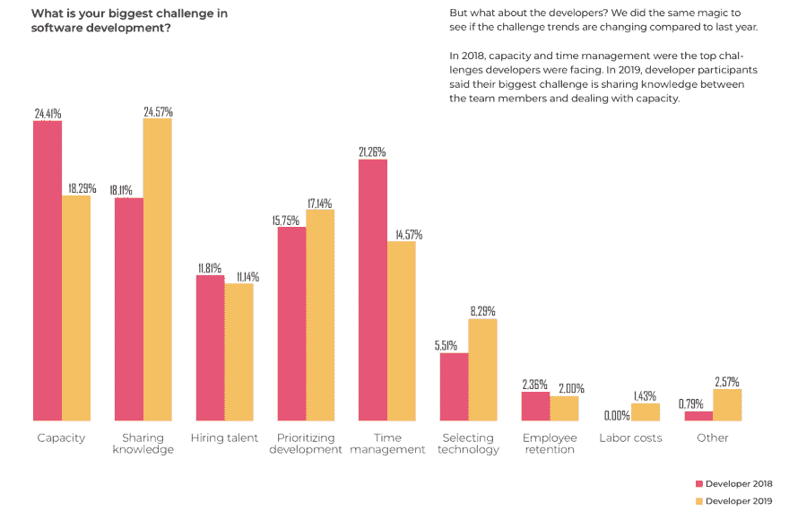

# 知识共享提高了开发团队的生产力

> 原文：<https://dev.to/codestream/knowledge-sharing-leads-to-developer-team-productivity-44a6>

公司越来越重视软件开发团队，将其作为生产力增长的驱动力。解决团队生产力的驱动因素，与个体开发人员生产力相反，需要不同的视角和方法。它从分享知识开始，因为不同开发人员之间的知识差距可能会导致整体生产力的不必要的拖累，即使它使一些团队成员更有可能比其他人更有生产力。

首先，一些加速关注开发团队的业务关注的背景。开发团队的表现在商业中变得如此重要，以至于它已经成为世界各地董事会的一个重要话题。2019 年 3 月，摩根士丹利发表了一份题为“数字时代的新软件堆栈”的报告，其中他们描述了从*旧堆栈*(想想甲骨文、Tibco、旧微软)到以 Atlassian、PageDuty、Splunk、MongoDB 和新微软等公司为代表的*新堆栈*的过渡。根据该报告，由于广泛采用了 **DevOps** 和**敏捷**方法，与旧堆栈相比，新堆栈代表了 500 亿美元的机会，CAGR 增长了 22%和 4%。摩根士丹利对 DevOps 的定义是“在向最终客户交付新功能和服务的过程中，减少或减轻*低效*的任何实践、方法或架构。”

从更技术性的角度来看，DevOps 是一种软件开发策略，它在开发人员和 IT 人员之间架起了一座桥梁。使用 DevOps，组织可以非常快速地发布小功能，并整合他们收到的反馈。这导致 1)更少的软件故障和 2)更短的修复间隔时间，即更高的生产率。为了让所有这些按计划进行，*知识共享*通常是缺失的一环。

## 知识共享是重中之重

根据 Coding Sans 在 2019 年发布的[State of Software Development](https://codingsans.com/state-of-software-development-2019)报告，科技公司面临的第二大挑战是知识共享——仅次于能力。通常情况下，当待办事项已满且截止日期临近时，知识共享会受到影响。换句话说，在一个开发人员供不应求的世界中(在可预见的未来就是如此)，降低效率在很大程度上取决于组织共享知识的能力。

该报告还指出了管理层和开发商对 2019 年最重大挑战的看法之间的差异。对于开发者来说，知识共享是他们面临的最重要的挑战，占受访者的 24.57%，高于 2018 年的 18.11%。

如果分享知识如此重要，那么今天团队如何应对这一基本挑战呢？敏捷过程非常强调面对面的交流来传递信息，但是这和拥有一个全面的方法来分享知识是一样的吗？随着团队分布在许多时区，对话越来越不够了。什么会补充或取代这些面对面的对话？

## 远程是新常态

在各种规模的组织中，远程在开发人员中变得越来越普遍。根据同一份报告，72.2%的开发人员表示他们的组织允许远程工作。

 
拥有远程开发人员的组织通常会求助于 Skype 或 Zoom 等解决方案，这些解决方案可以轻松取代面对面的交流。在 Slack 或微软团队中，知识可以异步共享——当涉及到代码时会很乏味——的对话也可以回答问题和共享知识。然而，这些方法对于团队或组织来说，在获取和组织共享的知识以便从现在起一个月或一年后可以容易地访问它方面没有任何作用。相反，它们导致重复和浪费的交互，因为相同的问题和关注点被一次又一次地提出，或者更糟的是，它们成为新开发人员的障碍，他们害怕问一个简单的问题，害怕成为更高级团队成员的烦恼。

## 团队生产力和知识共享

开发人员知道团队分享知识的能力和团队更有生产力的能力之间有关系。团队可以分享不同种类的知识。第一种，关于编码的常识，可以在帖子、论文、网络研讨会、书籍等中传达。并且有助于提升所有团队成员对团队所采用的方法和手段的共同理解。例如，Davide de Paolo 在他的文章[中写道，是什么造就了一个 10 倍的开发者？摇滚明星的特点之一是知识共享:“一旦你学到了什么，试着去帮助别人，教其他同事，分享你的学习。它可以是在你每天站起来后给一些建议，给你的团队做一个简短的演示，写一篇博客，或者成为一个在线编码平台的导师。”](https://dev.to/dvddpl/what-makes-a-10x-developer--1k0f)

第二种知识特定于代码本身。不可能通过在 Stack Overflow 或 Quora 上发布问题来获得这种知识，因为只有您的团队成员可能知道答案，此外，出于安全考虑，可能需要只在内部讨论代码。

许多开发人员报告说，他们感到沮丧，因为他们花了很大一部分时间——有时高达 75%——试图理解别人写的代码。在 Stack Overflow 2018 年的调查中，不到 20%的开发人员表示，他们使用公司的内部文档来试图弄清楚他们正在工作的代码是如何工作的。在团队生产力的背景下，这种知识应该如何共享？

## 分享关于代码的知识

要使第二种知识有助于团队生产力，它必须满足四个标准:

*   它必须在任何时候都易于访问
*   它必须是上下文相关的
*   它必须是持久的
*   它必须允许交互性，这将进一步澄清其意义和适用性

是时候将关于代码的知识从孤立和不同的来源转移到代码本身了。上下文中的知识更容易理解。团队必须抛开解释自身的代码概念，转而采用解决知识缺口的解决方案和技术，并将整个团队提升到更高的高度。共享的知识成为整个组织的竞争优势。

您可能认为代码注释可以解决这个问题，但事实并非如此。长期以来，代码注释被用来解释代码是如何工作的，但是它们有三个主要缺点:1)随着代码的发展，它们会相对较快地变得陈旧；2)它们不是对话式的，因此不适合围绕一个解释进行迭代；3)使用代码注释不能容易地提出问题，而问题可能是知识共享中最重要的元素。这是因为无论是谁在解释他或她自己的代码，都不知道代码的哪些方面不容易被其他开发人员理解。因此，在代码中提问的能力会带来更好的质量和更好的文档。

因此，关注能力和知识共享的团队应该寻找满足上述四个标准并适合其现有工作流和工具集的解决方案。在您最喜欢的 IDE 中共享知识应该会简化关于代码的对话，而与您最喜欢的消息传递和问题跟踪软件的集成将允许开发人员在创建新的问题和答案时通知整个团队。

## 总结

当团队成员广泛分享知识时，团队生产力就能实现。开发人员已经感受到了知识共享太少的痛苦，并将此视为他们最关心的问题。传统的面对面对话有助于解决某些类型的知识，但随着远程成为主流，需要新的解决方案来解决知识共享的即时需求和长期需求。描述代码如何工作的具体信息不应该脱离代码本身，因为这会降低这些信息的可用性和可理解性。面向开发人员的下一波解决方案和工具必须解决知识差距，并提升整个团队的生产力。