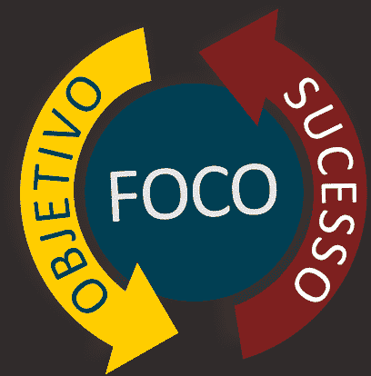
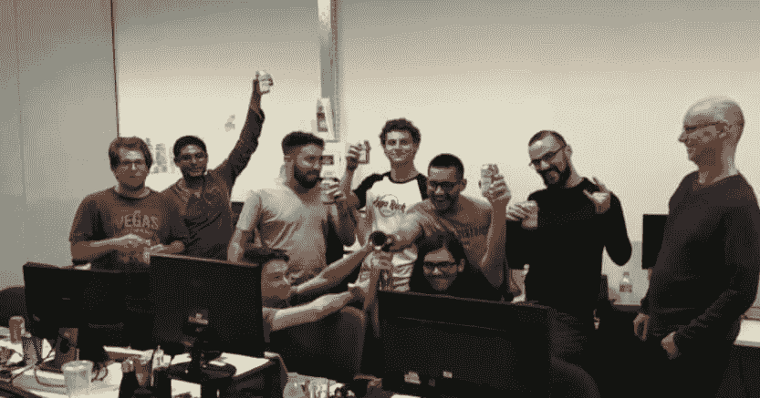

# Metas，aprendizados 和 foco

> [https://dev . to/zygo-技术/目标-学习-e-聚焦-1a7a](https://dev.to/zygo-tecnologia/metas-aprendizados-e-foco-1a7a)

2019 年第二季度初，我们在 Zygo 面临着巨大的产品和工程挑战，以至于我们团队中几乎没有人认为我们能够实现我们作为一个地区承诺的交付。我相信，我知道团队的能力，我知道我们需要在很高的层次上投入、努力和精力，但我相信我们有能力迎接所有的挑战。也许这就是我们可以成为领导者的最大挑战之一:“如何将信任传递给团队？如何使他们相信自己能够战胜挑战？”这是我还需要学习的东西，也是我需要同时学习的东西。

第一步，我们所有开发人员都从灵活的方法和项目管理中学到了一些东西:**突破小挑战。**我们做到了，我们把交货分成了 3 个较小的交货项目，我们称之为里程碑，这样我们就能更好地看到我们作为一个团队需要采取的每一步，更重要的是**我们每时每刻都需要关注的事项**。每个里程碑都包含一个需要交付的任务/功能列表，以及需要在项目中实现的最低测试复盖范围。

设定里程碑，我们在几周内切断每一个里程碑的交付，并设定每一里程碑的交付期限。因为在 Zygo 这里我们喜欢挑战，也喜欢把段落往上推，所以我们也为每一个 milestone 设定了一个超级目标，这样我们就可以在设定的目标期限前一周完成 milestone 的所有任务，并实现自动化项目测试的复盖范围。

做了所有这些之后，我们似乎已经准备好工作，实现我们的目标，或者更确切地说，我们的超级目标，因为我们的目标很高。我们开始了第一个里程碑，几个星期的延误，接下来的几个星期，我们赶上了超级目标周，我们可以完成所有的事情并击败它。我们做了大量的力量，注入能量，给最后的气体来打击，但我们不能在超目标期限内完成所有的事情。

但还没失去任何东西如果我们差一点就击中了超级目标离目标还有一周的时间我们就很容易击中目标了对吧？but nothing lost yet，if we almost hit the super target，and it ' s still a week to target，it ' s easy to hit the target，right？嗯，这是本季度的第一个主要学习，总结为一个词:**重点。**记得我在上面写道，把季度交付分成三个里程碑，然后把里程碑交付分成周交付的目标之一是帮助我们知道重点是什么吗？第一个里程碑的最后一周我们犯了一个重大错误。感觉到我们就在附近，放松，开始计划下一个里程碑，直到里程碑的最后一天，我们才意识到错过了比我们想象的更多的东西，也就是说，我们无法在目标期限内交付里程碑。

黄色信号和反思的时刻，我们如何避免在第二里程碑上重蹈复辙？我们如何做出正确的决定，上个星期的重点是什么，这需要什么？和团队一起思考，试图找出这些问题的答案，有些事情开始浮现:

*   在第一个里程碑中缺少了更大的清晰度比需要做的事情，一些视觉的东西，一份列表，所有需要完成的事情，以使它完整
*   我们需要利用每个人在目标的最后几周能够做得最好的东西，利用每个人的品质和能力，也就是说，每个人都要在生产力最高、产量最高和交付能力最高的地方工作。

好吧，现在是把这一切在第二个里程碑，我们从明确的交付开始。我们房间的墙上挂着一个空白框，上面写着用户在里程碑 2 结束时应该做的所有事情，例如:“用户必须能够创建一个帐户并检索密码。”。他们有超过 10 个这样的用户故事，我们都把它们写在黑板上，随着我们的前进，我们会在黑板上标出用户已经可以做的事情，就像一个核对表一样，这一点已经在全球范围内以各种方式被用来实现这个目标:**变得更清晰，帮助聚焦**。有了它，当它到达里程碑 2 的最后几个星期，我们不再需要有感觉，无论我们是否接近，我们确切地知道需要做什么，只是看看这幅画。

解决了第一个问题，我们进入了第二点。这一点令我们相当不安，因为我们有一种非常强大的发展和学习文化，如果我们把注意力集中在每一个人所知道的事情上，我们就会少受一些正在发生的事情的影响，但我们明白，一切都有了正确的时间，我们得出结论，现在是时候为所有人打开空间，让他们探索新的东西，加快他们的学习为此，我们在“超级目标周”召开了一次规划会议，在会上我们清楚地确定了谁将负责系统中每一个未交付的部分，利用每个部分的能力，并将每个部分的注意力集中到最后一条直线上。结果:**超级打击元。**

我谈到了我们在他们身上学到的东西和采取的行动，但对我来说，最大的实际学习是，一切围绕着焦点，我们在实践中学会了在我们真正实现目标之前不要失去焦点的重要性。没有重点，我们无法做出最好的决定做什么和不做什么，我们无法拒绝那些无助于我们实现目标的事情，我们也无法明确需要做什么。

我以球队获胜的视频结束我有权鸣喇叭举杯。恭喜大家！

[https://www.youtube.com/embed/x9NLCcN7AhY](https://www.youtube.com/embed/x9NLCcN7AhY)

* * *