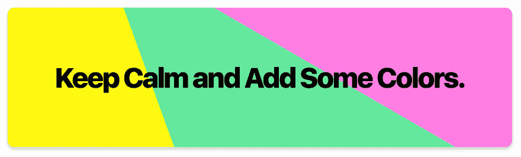
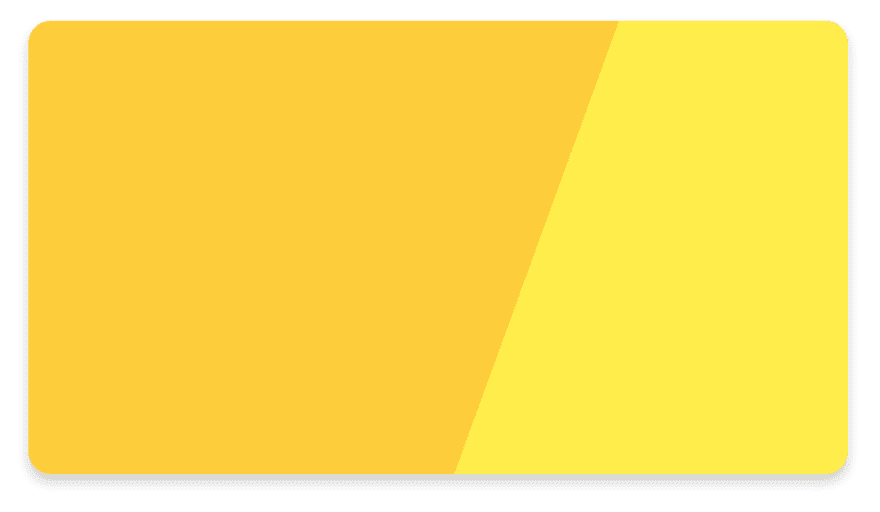

# 仅 CSS 的多色背景

> 原文：<https://dev.to/kedar9/css-only-multi-color-backgrounds-paj>

[](https://res.cloudinary.com/practicaldev/image/fetch/s--d531g8vf--/c_limit%2Cf_auto%2Cfl_progressive%2Cq_auto%2Cw_880/https://thepracticaldev.s3.amazonaws.com/i/ai2glijs8rlsowkmjusu.png) 
微软随 Windows 8 带来的 Metro design UI 可能在很大程度上没有得到积极的回应(主要是因为 Windows 7 的重大 UI 大修)，但它打开了用户界面新时代的大门。除了引入平面设计、薄字体和扩展图像的美丽实现，它还带来了我认为传统 Skeuomorph 设计中所缺乏的东西:**色彩**。

iOS 和 Android 随后分别用 iOS 7 和材质设计更新了设计标准。iOS 和材料设计也倾向于平面设计和薄排版:分别是 Helvetica·纽(后来的三藩市)和 Roboto。在他们的设计革新中，*引入了*前所未闻的颜色和渐变。

既然我们已经认识到鲜艳的颜色在当今所有现代设计中起着重要作用，那么让我们来看看 CSS 背景渐变的传统用法的不同实现。

在这个实现中，我们依赖于`linear-gradient()`(或`radial-gradient`)属性中的颜色停止参数。这些停止点决定了您想要从哪里开始一种特定的颜色。我们将使用的属性样板是:

```
background: linear-gradient(<angle>, color1 color1-stop-at, color2 color2-start-at); 
```

Enter fullscreen mode Exit fullscreen mode

这里简单的逻辑是，我们在一个 ***x%*** 处停止第一种颜色，在 ***x%*** 或 ***< x%*** 处开始第二种颜色。这从线性渐变中移除了“渐变”，并在两种颜色之间定义了一个清晰的边缘，给背景一个**多色材质**效果。

行动中:

```
background: linear-gradient(110deg, #fdcd3b 60%, #ffed4b 60%); 
```

Enter fullscreen mode Exit fullscreen mode

大半夜的:
[](https://res.cloudinary.com/practicaldev/image/fetch/s--aDB16f3X--/c_limit%2Cf_auto%2Cfl_progressive%2Cq_auto%2Cw_880/https://thepracticaldev.s3.amazonaws.com/i/j0s3otw4cxdlc5ghmxtr.png)

看起来很美，不是吗？添加一些文本，它看起来像一个很好的突出元素。上面的例子中加入了一些额外的 CSS 样式(比如`border-radius`和`box-shadow`)。

本质上，背景属性可以 ***保存*** 两个重叠的内容:两个渐变，两个图像或者你可以混合使用其中的任何一个。
要使用 2 种以上的颜色(因为何乐而不为)，把强大的`rgba()`投入使用，使用 2 个渐变参数。
这里有一个例子，背景属性保存了一个图像，并用橙色和透明的渐变掩盖了图像的一部分。

#### **使用图像中的主色或完全对比色来获得丰富的外观。**

像这样:
[](https://res.cloudinary.com/practicaldev/image/fetch/s--J0fCR4Be--/c_limit%2Cf_auto%2Cfl_progressive%2Cq_auto%2Cw_880/https://thepracticaldev.s3.amazonaws.com/i/mmvxkl3ef4ps9jqx8c2l.png) 
这样的横幅的示例代码会是:

```
background: linear-gradient(-70deg, #fa7c30 30%, rgba(0, 0, 0, 0) 30%), url('planets.jpg'); 
```

Enter fullscreen mode Exit fullscreen mode

这是一个带有一些例子的代码笔(包括径向渐变的使用)。
[https://codepen.io/kedar/embed/MpXgoR?height=600&default-tab=result&embed-version=2](https://codepen.io/kedar/embed/MpXgoR?height=600&default-tab=result&embed-version=2)