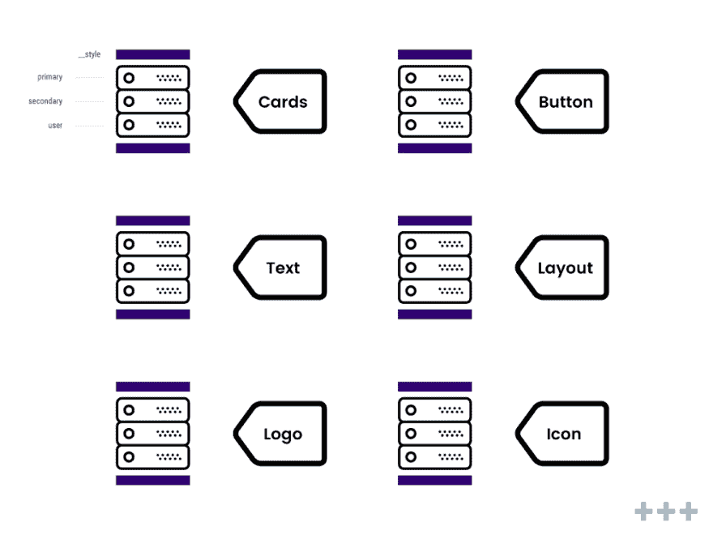

# React 组件的全局使用

> 原文：<https://dev.to/guidovdriet/global-use-for-react-components-45l>

这个项目的目标是创建一个 React 设置，其中多次使用的组件按照以下方式构造。

```
// Components
import Layout from "./Layout";
import Card from "./Card";
import Text from "./Text";
import Button from "./Button";

const Structure = () => {
  return (
    <Layout __type="container">
      <Card __type="primary">
        <Text __type="h1" primary>
          Global use for React components
        </Text>
        <Button __type="default">Next →</Button>
      </Card>
    </Layout>
  );
};

export default Structure; 
```

## 如何这样组织你的代码？

在这个例子中，我创建了一个名为`Card`的组件。这个组件将接收一个名为`__type`的属性。这个`__type`在`cards object`中选择正确的组件，并返回该类型的相关`Card`组件。

```
// Cards
import DefaultCard from "./DefaultCard";
import SecondaryCard from "./SecondaryCard";
import UserCard from "./UserCard";

const cards = {
  default: DefaultCard,
  secondary: SecondaryCard,
  user: UserCard
};

const Card = ({ __type, ...props }) => {
  const Comp = cards[__type];
  if (typeof cards[__type] === "undefined") {
    return null;
  }
  return Comp && <Comp {...props} />; };

export default Card; 
```

## 我用这个设置完成了什么？

[](https://res.cloudinary.com/practicaldev/image/fetch/s--knUdDarv--/c_limit%2Cf_auto%2Cfl_progressive%2Cq_auto%2Cw_880/https://thepracticaldev.s3.amazonaws.com/i/udtu01efwj0fl51fbwek.jpg)

*   每个项目都使用相同的代码结构。这样，团队中的每个开发人员都知道您在对话中谈论的是什么类型的组件。
*   团队的新成员可以很容易地理解项目的代码结构。
*   从视觉上看，您会更快地理解组件中的代码，因为每组组件的逻辑在您的应用程序中嵌套得更深一级(查看上图)。