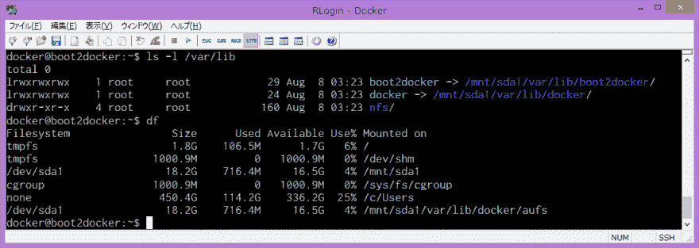
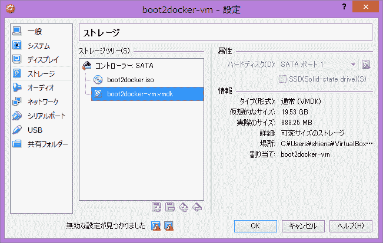
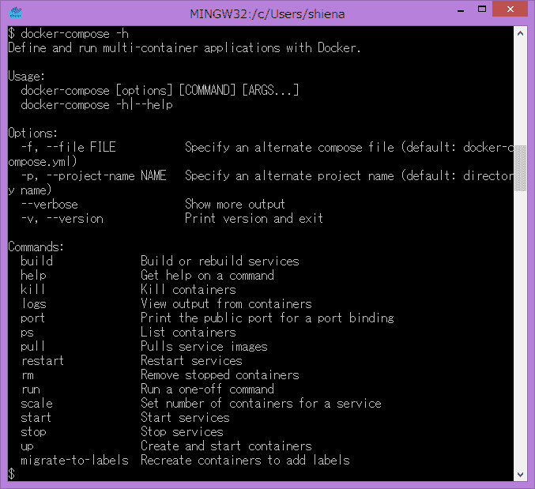

# 在 Windows 上也想使用文档公司

> 原文:# t0]https://dev . to/shiena/windows dock-compose-3cl

# ※

好像也可以在 Windows 上工作了。
1.5.0 版本可能会发布 Windows 版二进制文件。
[https://github.com/docker/compose/issues/1085 # issue comment-142491609](https://github.com/docker/compose/issues/1085#issuecomment-142491609)

# ※

1.5.0 版
坞站次のリリースに期待！
[https://github . com/dock/compose/releases/tag/1 . 5 . 0 rc1](https://github.com/docker/compose/releases/tag/1.5.0rc1)

# ※

> *   包括 Windows 操作系统上的坞站-合成

坞站工具箱入∞天啊！
[https://github . com/dock/toolbox/releases/tag/v 1 . 9 . 0](https://github.com/docker/toolbox/releases/tag/v1.9.0)

# 前言

[Docker Compose](https://github.com/docker/compose/) 对于用 Docker 管理多容器很方便。
但是，如[Epic: Windows support #1085](https://github.com/docker/compose/issues/1085) 中所示，在 Windows 本地语言中还不能移动。
于是我们考虑了在 Boot2Docker 的 Tiny Core Linux 上安装 Docker Compose，从 MinGW 上使用的方法。

# 突然安装脚本

为了麻烦的人，突然是安装脚本。
保存以下内容，从`Boot2Docker Start`的快捷方式运行脚本，再次打开`Boot2Docker Start`即可使用`docker-compose`。
但是，传球的处理需要注意，在后面叙述。

```
#!/bin/sh

VERSION=1.4.2
VAR_COMPOSE=/var/lib/boot2docker/docker-compose
BIN_COMPOSE=/usr/local/bin/docker-compose

boot2docker ssh "sudo curl -L -o ${VAR_COMPOSE} https://github.com/docker/compose/releases/download/${VERSION}/docker-compose-Linux-x86_64"
boot2docker ssh "sudo chmod +x ${VAR_COMPOSE}"
boot2docker ssh "sudo ln -fs ${VAR_COMPOSE} ${BIN_COMPOSE}"
boot2docker ssh "cat << EOL > bootlocal.sh
#!/bin/sh

if [ -x ${VAR_COMPOSE} -a ! -e ${BIN_COMPOSE} ]; then
  ln -s ${VAR_COMPOSE} ${BIN_COMPOSE}
fi
EOL
"
boot2docker ssh "sudo cp bootlocal.sh /var/lib/boot2docker/"
boot2docker ssh "rm -f bootlocal.sh"

if ! test -f ~/.bashrc || ! `grep -qE 'function +docker-compose' ~/.bashrc`; then
  cat << EOL >> ~/.bashrc
function docker-compose() { boot2docker ssh -t "docker-compose \${*}; exit 0"; }
EOL
fi 
```

# 详细安装

## 关于 Boot2Docker 的结构

Boot2Docker 的 Tiny Core Linux 由 tmpfs 挂载，因此即使安装在适当的路径上，重新启动后也会消失。
但是，在 boot2docker 的 FAQ 中有[local customisation ( with persistent partition )](https://github.com/boot2docker/boot2docker/blob/master/doc/FAQ.md#local-customisation-with-persistent-partition)的项目，
`/var/lib/docker`和`/var/lib/boot2docker`再次显示
如果仔细调查的话，就会发现
[](https://res.cloudinary.com/practicaldev/image/fetch/s--_And9JB7--/c_limit%2Cf_auto%2Cfl_progressive%2Cq_auto%2Cw_880/https://dev-to-uploads.s3.amazonaws.com/i/6fqzsrsv7rv33bwzy2d4.png)

[](https://res.cloudinary.com/practicaldev/image/fetch/s--9hBxZR7j--/c_limit%2Cf_auto%2Cfl_progressive%2Cq_auto%2Cw_880/https://dev-to-uploads.s3.amazonaws.com/i/74za0yuwptk48of9rqq1.png)

可以看出这两个目录的实体位于`/mnt/sda1`，是虚拟磁盘的`boot2docker-vm.vmdk`。

另外，启动时从`/opt/bootscript.sh`中读取的脚本有 3 个，稍后使用。

| 脚本 | use |
| --- | --- |
| /var/lib/boot2docker/profile | 环境变量等的设定 |
| /var/lib/boot 2 docker/boot local . sh | 启动时同步执行的内容 |
| /var/lib/boot 2 dock/boot sync . sh | 启动时异步执行的内容 |

## 安装文件一览

以下是要安装的文件一览表。

| 微小核心 Linuxのパス | explain |
| --- | --- |
| /var/lib/boot 2 docker/docker-合成 | 下载并添加 |
| /var/lib/boot 2 docker/boot local . sh | add to |
| /usr/local/bin/dock—构成 | 启动时添加 |

| 迷你路径 | explain |
| --- | --- |
| ~/.bashrc | 添加 alias |

## 安装文档合成

如上所述，在`/var/lib/boot2docker`下安装 Docker Compose。
因为很难区分 MinGW 侧和 Tiny Core Linux 侧的作业，所以在提示符下进行了改变。

*   提示符为`$`的命令在 MinGW 中执行。
*   提示符为`docker@boot2docker:~$`的命令在 Tiny Core Linux 上执行。

```
#  Boot2DockerでTiny Core Linuxにログイン
$  boot2docker ssh
  #  Tiny Core Linuxにdocker-composeをダウンロード
docker@boot2docker:~$  sudo curl -L -o /var/lib/boot2docker/docker-compose https://github.com/docker/compose/releases/download/1.4.2/docker-compose-Linux-x86_64
docker@boot2docker:~$  sudo chmod +x /var/lib/boot2docker/docker-compose
  #  /usr/local/bin/docker-composeにシンボリックリンクを作成するスクリプトをbootlocal.shに追加
docker@boot2docker:~$  cat << EOL > bootlocal.sh #!/bin/sh   if [ -x /var/lib/boot2docker/docker-compose -a ! -e /usr/local/bin/docker-compose ];  then
 ln -s /var/lib/boot2docker/docker-compose /usr/local/bin/docker-compose
fi
EOL
" docker@boot2docker:~$  sudo cp bootlocal.sh /var/lib/boot2docker/
docker@boot2docker:~$  rm -f bootlocal.sh
  #  すぐ使えるようにシンボリックリンクを作成する
docker@boot2docker:~$  sudo ln -s /var/lib/boot2docker/docker-compose /usr/local/bin/docker-compose 
```

```
#  MinGWの.bashrcにdocker-composeのfunctionを追加
$  echo 'function docker-compose() { boot2docker ssh -t "docker-compose ${*}; exit 0"; }' >> ~/.bashrc 
```

至此，安装完成。
重新打开 MinGW，执行`docker-compose -h`后应该会显示帮助。
[](https://res.cloudinary.com/practicaldev/image/fetch/s--zRqyKYEL--/c_limit%2Cf_auto%2Cfl_progressive%2Cq_auto%2Cw_880/https://dev-to-uploads.s3.amazonaws.com/i/sw54bpdl8ixegva6289i.png)

## 执行文档合并时的注意事项

虽说已经可以使用 docker-compose 了，但由于是通过 ssh 运行的，所以必须将 docker-compose.yml 等放在 Tiny Core Linux 上可以看到的地方。
Boot2Docker 是一个很好的想法，因为 Windows 的`C:\Users`装载在 Tiny Core Linux 的`/c/Users`上，所以可以指定以下路径:
此时将路径开头的`/`设为双重。 详情请参照[Boot2Docker on Windows 中避免 MinGW 路径转换的](http://qiita.com/shiena/items/39bd32156b8d04ea5b92)。

```
$  docker-compose -f /$HOME/docker-compose.yml up -d 
```

相反，从 Tiny Core Linux 运行时，因为不知道 Windows 的用户名，所以不能使用环境变量。

```
docker@boot2docker:~$  docker-compose -f /c/Users/shiena/docker-compose.yml up -d 
```