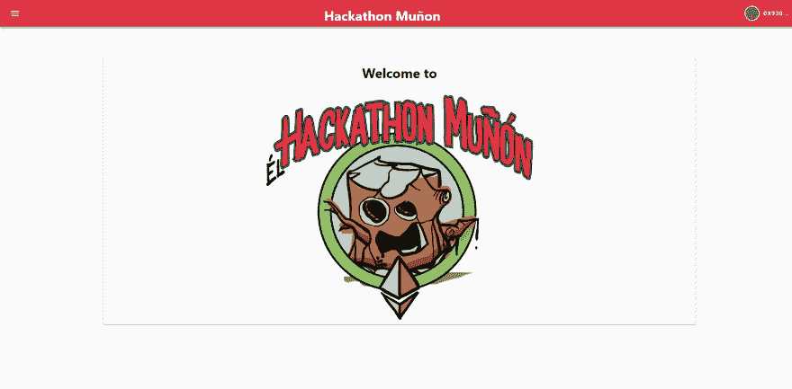
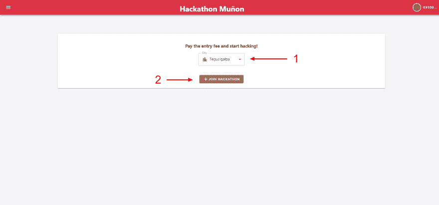
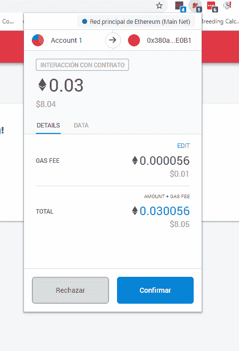

# 如何在磨坊注册

> [https://dev . to/crisgarner/如何在 al-munon-22mi](https://dev.to/crisgarner/como-registrarse-en-el-munon-22mi)注册

hackathon muñón 是一个分散的活动，参与者可以在其中为项目编程任何他们最感兴趣的技术，无论是新项目还是新项目。你可以观看下一段关于如何注册 hackathon 的视频。

[https://www.youtube.com/embed/1Y7mw0bxTTk](https://www.youtube.com/embed/1Y7mw0bxTTk)

## Registro

### 步骤

#### 1\. Instala Metamask

你可以下载元掩码到[元掩码。我](metamask.io)，阅读此处的元掩码教程:[元掩码教程](https://medium.com/affogato-network/tutorial-de-metamask-a98d9aed7659)

#### 2。它可以实现 Ether:

你可以在、[【up hold】](https://uphold.com/)或[二元](https://www.binance.com/en/creditcard)中使用信用卡购买。如果你只有现金，可以发邮件到 [ceegarner@hotmail.com](mailto:ceegarner@hotmail.com) 或 [ahmed.hn.43@gmail.com](mailto:ahmed.hn.43@gmail.com) 帮你换。

#### 3。进入注册网站[https://dapp . munon hack . com/](https://dapp.munonhack.com/)

#### 4。按下功能表按钮并选取「连接」

#### 5。选择您要加入的城市

请注意，每个城市只有 15 名参与者的配额。

#### 6。以 Metamask 确认交易

注册费是 0.03 ETH，不管市场价格如何，所以我们建议你快点登记。所有的钱都花在奖品罐子上了。

#### 恭喜！你正式注册了 hackathon muñón！