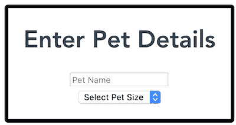
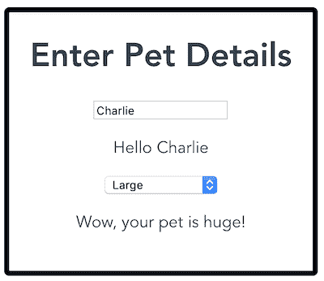

# Vue 最黑暗的一天

> 原文：<https://dev.to/danielelkington/vue-s-darkest-day-3fgh>

今天，我惊讶地看到通常积极友好的 VueJS 社区陷入了激烈的战争。两周前，Vue 的创建者尤雨溪发布了一个关于在即将到来的 Vue 3.0 中以基于函数的方式编写 Vue 组件的请求。今天，一条批评性的 [Reddit 帖子](https://www.reddit.com/r/vuejs/comments/c319el/vue_3_will_change_vue_in_a_big_way_current_syntax/)接着是一条[黑客新闻帖子](https://news.ycombinator.com/item?id=20237568)中类似的批评性评论，导致大量开发人员涌向最初的 RFC 来表达他们的愤怒，其中一些人近乎辱骂。在许多地方都有人声称

*   所有的 Vue 代码都必须以一种全新的方式重写，因为现有的语法已经被删除并被其他东西所取代；
*   鉴于一切都将改变，人们花在学习 Vue 上的所有时间都被浪费了；
*   新的语法比旧的更差，没有强制结构，会导致代码杂乱无章；
*   Vue 核心团队在没有任何咨询的情况下突然实施了一个巨大的突破性变化；
*   Vue 正在变成 React！
*   不，Vue 正在变成 AngularJS/Angular！
*   现在所有的 HTML 都需要写成一个巨大的字符串！

随着 Reddit 帖子上负面评论的堆积，你可能会惊讶地发现，在进入 [RFC 页面](https://github.com/vuejs/rfcs/pull/42)时，你的 RFC 有着极高的正面和负面表情反应比率，许多最初的评论都非常正面。的确，第一条评论就充满了赞美。

我是第一个写评论的人。我碰巧收到了一个通知，说有一个新的 RFC，我马上读了它，看到这正是我想要的 Vue 3.0，而且会有很大的帮助，并在 RFC 发布后的 15 分钟内留下了第一条评论，以表达我的感谢。我希望在这里详细说明为什么我认为新提案是一个如此好的主意，但是首先，我要回应一些批评。

我怀疑许多人在阅读了黑客新闻或 Reddit 帖子后有些激动，这些帖子有一些误导性的评论，并在没有阅读原始提案的情况下表达了他们的愤怒。尤雨溪现在更新了提案，增加了一个问答环节&，解决了人们的许多问题，但总结一下，

*   如果你不想的话，你不需要重写任何代码——新的语法是附加的，旧的语法将在整个 Vue 3.0 中保持有效，只要它仍然被广泛使用。即使它最终从核心代码中被删除，[插件也可以很容易地允许旧语法仍然 100%有效](https://github.com/vuejs/rfcs/blob/function-apis/active-rfcs/0000-function-api.md#adoption-strategy)。
*   花在学习 Vue 上的时间没有白费——新的组件语法使用了您花时间学习的相同概念，其他概念如单个文件组件、模板和作用域样式也完全一样。
*   没有协商就没有变更-*RFC**是**协商*。新的语法离发布还有很长的路要走。
*   不，HTML 代码不需要写成一个巨大的字符串。

更主观的一点是，新语法不如旧语法，并且会导致代码结构更少。我希望用一个简单的例子来说明为什么当我看到 RFC 时我会如此激动，以及为什么我认为它是更好的并且会导致更好的结构化代码。

考虑下面这个有趣的组件，它允许用户输入他们宠物的详细信息。注意到

*   当他们输入完宠物的名字时，会显示一条消息；
*   在他们选择宠物的尺寸后，会显示另一条消息。 

您可以在这里试用组件[的演示，并可以在这里](https://7c01h.codesandbox.io/)使用 Vue 2.x [查看完整代码(参见 components/Vue2.vue)。](https://codesandbox.io/s/simplified-function-based-component-example-7c01h)

考虑这个组件的 JavaScript:

```
export default {
  data() {
    return {
      petName: "",
      petNameTouched: false,
      petSize: "",
      petSizeTouched: false
    };
  },
  computed: {
    petNameComment: function() {
      if (this.petNameTouched) {
        return "Hello " + this.petName;
      }
      return null;
    },
    petSizeComment: function() {
      if (this.petSizeTouched) {
        switch (this.petSize) {
          case "Small":
            return "I can barely see your pet!";
          case "Medium":
            return "Your pet is pretty average.";
          case "Large":
            return "Wow, your pet is huge!";
          default:
            return null;
        }
      }
      return null;
    }
  },
  methods: {
    onPetNameBlur: function() {
      this.petNameTouched = true;
    },
    onPetSizeChange: function() {
      this.petSizeTouched = true;
    }
  }
}; 
```

Enter fullscreen mode Exit fullscreen mode

本质上，我们有一些数据、从这些数据中计算出来的属性以及操作这些数据的方法。注意，在 Vue 2.x 中*没有办法将相关的东西*放在一起。我们不能将`petName`数据声明放在`petNameComment`计算属性或`onPetNameBlur`方法的旁边，因为在 Vue 2.x 中，东西是按类型分组的。

当然，对于这样一个小例子来说，这没有太大关系。但是想象一个更大的例子，有多个功能需要`data`、`computed`、`methods`，甚至一两个`watcher`。目前*没有好办法*把相关的东西放在一起！人们可能会使用类似 Mixins 或高阶组件的东西，但是[这些有问题](https://www.vuemastery.com/conferences/vueconf-us-2019/state-of-vuenation) -很难看出属性来自哪里，并且存在名称空间冲突的问题。(是的，在这种情况下，有可能将事情分成多个部分，但是考虑一下[这个类似的例子](https://codesandbox.io/s/function-based-component-rfc-tn99y)，它不是。)

新提案允许我们按实际功能组织组件，而不是按选项类型组织组件。这类似于你在电脑上整理个人文件的方式——你通常没有一个“电子表格”文件夹和一个“word 文档”文件夹，而是可能有一个“工作”文件夹和一个“假期计划”文件夹。考虑用建议的语法编写的上述组件(在不看到输出的情况下，尽我所能——让我知道您看到的任何错误！):

```
import { state, computed } from "vue";
export default {
  setup() {
    // Pet name
    const petNameState = state({ name: "", touched: false });
    const petNameComment = computed(() => {
      if (petNameState.touched) {
        return "Hello " + petNameState.name;
      }
      return null;
    });
    const onPetNameBlur = () => {
      petNameState.touched = true;
    };

    // Pet size
    const petSizeState = state({ size: "", touched: false });
    const petSizeComment = computed(() => {
      if (petSizeState.touched) {
        switch (this.petSize) {
          case "Small":
            return "I can barely see your pet!";
          case "Medium":
            return "Your pet is pretty average.";
          case "Large":
            return "Wow, your pet is huge!";
          default:
            return null;
        }
      }
      return null;
    });
    const onPetSizeChange = () => {
      petSizeState.touched = true;
    };

    // All properties we can bind to in our template
    return {
      petName: petNameState.name,
      petNameComment,
      onPetNameBlur,
      petSize: petSizeState.size,
      petSizeComment,
      onPetSizeChange
    };
  }
}; 
```

Enter fullscreen mode Exit fullscreen mode

注意到

*   把相关的东西放在一起容易得可笑；
*   通过查看 setup 函数返回的内容，我们可以很容易地看到我们在模板中访问了什么；
*   我们甚至可以避免暴露模板不需要访问的内部状态(“接触”)。

最重要的是，新的语法很容易允许完整的 TypeScript 支持，这在 Vue 2.x 基于对象的语法中是很难实现的。我们可以很容易地将可重用的逻辑提取为可重用的功能。类似于

```
import { state, computed } from "vue";

function usePetName() {
  const petNameState = state({ name: "", touched: false });
  const petNameComment = computed(() => {
    if (petNameState.touched) {
      return "Hello " + petNameState.name;
    }
    return null;
  });
  const onPetNameBlur = () => {
    petNameState.touched = true;
  };
  return {
    petName: petNameState.name,
    petNameComment,
    onPetNameBlur
  };
}

function usePetSize() {
  const petSizeState = state({ size: "", touched: false });
  const petSizeComment = computed(() => {
    if (petSizeState.touched) {
      switch (this.petSize) {
        case "Small":
          return "I can barely see your pet!";
        case "Medium":
          return "Your pet is pretty average.";
        case "Large":
          return "Wow, your pet is huge!";
        default:
          return null;
      }
    }
    return null;
  });
  const onPetSizeChange = () => {
    petSizeState.touched = true;
  };
  return {
    petSize: petSizeState.size,
    petSizeComment,
    onPetSizeChange
  };
}

export default {
  setup() {
    const { petName, petNameComment, onPetNameBlur } = usePetName();
    const { petSize, petSizeComment, onPetSizeChange } = usePetSize();
    return {
      petName,
      petNameComment,
      onPetNameBlur,
      petSize,
      petSizeComment,
      onPetSizeChange
    };
  }
}; 
```

Enter fullscreen mode Exit fullscreen mode

在 Vue 2.x 中，我经常发现自己在编写一个“怪物组件”,它很难分解成更小的部分——它不能分解成其他组件，因为基于少量的状态发生了太多的事情。然而，使用建议的语法，很容易看到大组件如何将逻辑分解成更小的可重用部分，如果必要的话，移动到单独的文件中，留给您小的、易于理解的功能和组件。

这是 Vue 迄今为止最黑暗的一天吗？看起来是这样。到目前为止，一个基本上团结在项目方向背后的社区已经分裂。但我希望人们会再看看这个提案，它没有破坏任何东西，[仍然允许他们按照选项类型对事情进行分组，如果他们喜欢这样做的话](https://github.com/vuejs/rfcs/pull/42#issuecomment-502736555)，但是允许更多——更清晰的代码，更干净的代码，更有趣的库可能性，以及完整的类型脚本支持。

最后，当使用开源软件时，最好记住维护者在你可以免费使用的东西上投入了大量的精力。今天看到的一些边缘辱骂性的批评是他们真的不应该忍受的。令人欣慰的是，不敬的评论是少数(尽管是相当大的一部分)，许多人能够以更尊重的方式表达自己。

***更新 2019 年 6 月 23 日:**
我非常迅速地写了最初的帖子，并没有想到它会像一样受到[的关注。从那以后，我意识到这个代码示例对于我试图说明的观点来说太复杂了，所以我对它进行了极大的简化。原始代码示例可以在](https://twitter.com/youyuxi/status/1142280533168119808)这里找到[。](https://codesandbox.io/s/function-based-component-rfc-tn99y)*