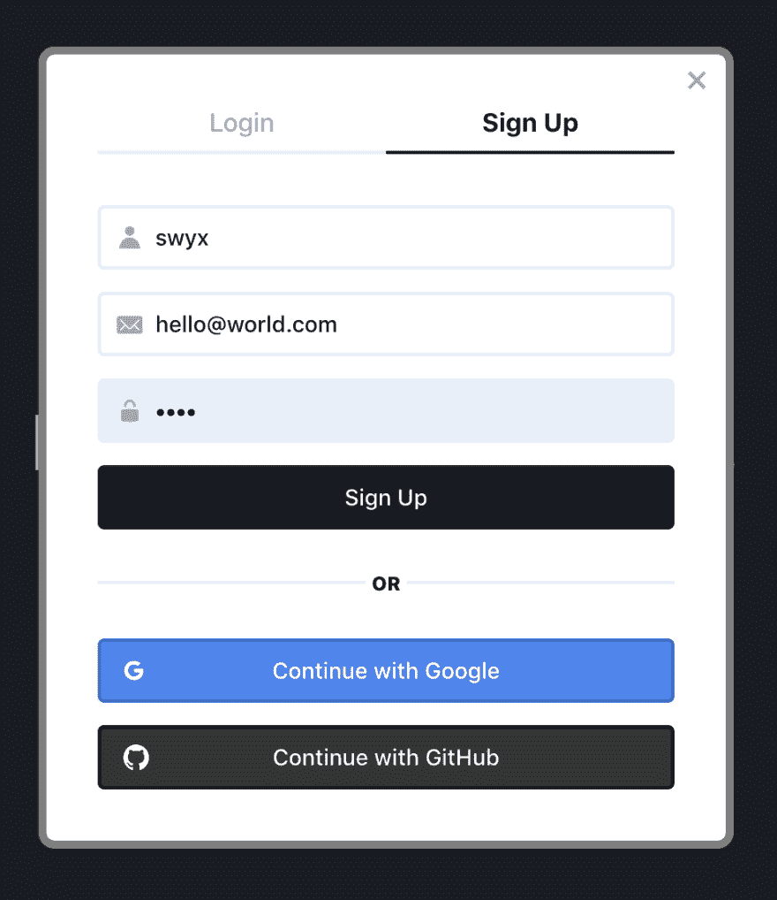

# 使用 React 上下文、挂钩和悬念，在 5 分钟内将 Netlify 身份认证添加到任何 React 应用程序

> 原文：<https://dev.to/swyx/add-netlify-identity-authentication-to-any-react-app-in-5-minutes-with-react-context-hooks-and-suspense-5gci>

> 💁🏼‍♂️Bottom 站在前面:[这是我们将在本文中看到的身份小部件的演示](https://react-netlify-identity-widget.netlify.com/)，尽管您可以自由编写自己的身份验证 UI！
> 💁🏼‍♂️If 如果你想跳过解释，直接进入最快的开始，跳到下面的 [React Netlify 身份部件](#reactlazy-and-suspense-with-raw-reactnetlifyidentitywidget)部分！

添加认证是很多 React 初学者的痛点。我们将 Netlify 身份添加到任何 React 应用程序，包括`create-react-app`、Gatsby、Next.js 或您可能拥有的任何其他设置，变得非常简单，只需将它们打包到一个简单的 React 挂钩中！然而，本文更多的是关于将身份验证引入 React 应用程序的有效设计模式，任何读者都应该能够为他们喜欢的提供者编写类似的包装器。

出于示例的目的，我们将使用[网络身份](https://www.netlify.com/docs/identity/?utm_source=blog&utm_medium=devto&utm_campaign=devex)。这是 Netlify 提供的一个非常简单的认证服务，有一个[慷慨的免费层](https://www.netlify.com/pricing/?utm_source=blog&utm_medium=devto&utm_campaign=devex#identity)。您可以将此用于[门控内容](https://www.netlify.com/blog/2018/01/23/getting-started-with-jwt-and-identity/?utm_source=blog&utm_medium=devto&utm_campaign=devex)、[站点管理](https://www.netlify.com/blog/2019/02/21/the-role-of-roles-and-how-to-set-them-in-netlify-identity/?utm_source=blog&utm_medium=devto&utm_campaign=devex)、[认证功能](https://www.netlify.com/blog/2018/03/29/jamstack-architecture-on-netlify-how-identity-and-functions-work-together/?utm_source=blog&utm_medium=devto&utm_campaign=devex)等等。用户主要通过`GoTrue-JS`、用于访问 Netlify 身份的 [3kb JS 客户端](https://www.netlify.com/blog/2018/12/07/gotrue-js---bringing-authentication-to-static-sites-with-just-3kb-of-js/?utm_source=blog&utm_medium=devto&utm_campaign=devex)来访问该功能。因为它只是一个开源 API(你可以[自托管](https://github.com/netlify/gotrue))，你不需要在 Netlify 上托管你的应用，甚至不需要有一个 [JAMstack 应用](http://jamstack.org?utm_source=blog&utm_medium=devto&utm_campaign=devex)，就可以使用它。

## 与`react-netlify-identity`挂钩

对于 React 用户，我们最近将`GoTrue-JS`的所有功能打包成一个非常容易使用的 React 钩子。这使得 Netlify Identity 非常易于使用，因为它是大多数 React 应用程序的嵌入式身份验证解决方案。

假设你有一个现有的 Netlify 站点实例(如果你没有，你可以通过点击[这里](https://app.netlify.com/start/deploy?repository=https://github.com/netlify/create-react-app-lambda&stack=cms&utm_source=blog&utm_medium=devto&utm_campaign=devex)来设置)，并且[已经在上面启用了 Netlify 身份](https://www.netlify.com/docs/identity/?utm_source=blog&utm_medium=devto&utm_campaign=devex#getting-started)，你开始安装:

```
 npm i react-netlify-identity 
```

该库内部有一个`IdentityContext`,但是您永远不必手动操作它。相反，把`IdentityContextProvider`放在你的应用程序的根目录下:

```
import React from "react"
import { IdentityContextProvider } from "react-netlify-identity"
function App() {
  const url = "https://your-identity-instance.netlify.com/" // supply the url of your Netlify site instance with Identity enabled. VERY IMPORTANT
  return <IdentityContextProvider url={url}>{/* rest of your app */}</IdentityContextProvider> } 
```

这就是你需要的所有设置！

现在你可以在你的应用程序中的任何地方使用暴露的身份方法(它们记录在[README](https://github.com/sw-yx/react-netlify-identity)中，但是你也可以得到自动完成提示，因为这个库是用 TypeScript 编写的):

```
import { useIdentityContext } from "react-netlify-identity"

// log in/sign up example
function Login() {
  const { loginUser, signupUser } = useIdentityContext()
  const formRef = React.useRef()
  const signup = () => {
    const email = formRef.current.email.value
    const password = formRef.current.password.value
    signupUser(email, password)
      .then((user) => console.log("Success! Signed up", user))
      .catch((err) => console.error(err))
  }
  // write similar logic for loginUser
  // return a form attached to formRef, with email and password fields
} 
```

通常这是我给你指出一个带有[源代码](https://github.com/sw-yx/react-netlify-identity/tree/master/example)的[工作演示](https://netlify-gotrue-in-react.netlify.com/)的地方，并让你“继续编写你的认证应用程序”，但即使这样也有太多的工作要做，尤其是对于“快速&简单”的演示。

我们说的 5 分钟，就是 5 分钟。

## 侧边栏:那是一个钩子还是一个上下文？

如果你眯着眼看着`useIdentityContext`，想知道那是什么，你并不孤单。如果是上下文，为什么不导出一个`IdentityContext`以便用户可以调用`useContext(IdentityContext)`？如果是钩子，当初为什么需要在 app 根处包一个`IdentityContextProvider`？

简而言之:都是。

`react-netlify-identity`输出一个定制提供者*和*一个定制消费者挂钩，这种模式[由肯特·C·多兹](https://kentcdodds.com/blog/how-to-use-react-context-effectively)推广。自定义提供者让我们一次性初始化所需的信息(Netlify Identity 实例),而自定义使用者挂钩让我们处理空检查的具体细节，并允许我们为 TypeScript 用户细化类型。

## 反应过来.慵懒而悬念着`react-netlify-identity-widget`

当`react-netlify-identity`为你的应用程序导出可重用的认证行为时，它对你的认证 UI 没有任何意见。当你在设计你梦想中的用户界面时，这可能会影响你的工作效率，同时也不能从你真正想展示的核心应用或网站的真实用户那里得到反馈。

`react-netlify-identity-widget`的目标是为你提供一个“足够好”的身份验证 UI，让你快速上手，同时在风格上提供可定制性，并成为几乎任何应用程序的插件解决方案。作为一个嵌入式解决方案，最好的 UI 范例是使用一个模态，它有自己的可访问性问题，所以我们依靠优秀的 [Reach UI](https://ui.reach.tech/) 项目来提供可访问的组件。

要开始使用，请安装:

```
 ## this re-exports react-netlify-identity, no separate install needed
    npm i react-netlify-identity-widget
    ## peer dependencies, if you don't already have them
    npm i @reach/dialog @reach/tabs @reach/visually-hidden 
```

要使用这个小部件，您需要像上面一样设置`IdentityContextProvider`:

```
import { useIdentityContext, IdentityContextProvider } from "react-netlify-identity-widget"

function App() {
  const url = "https://your-identity-instance.netlify.com/"
  return <IdentityContextProvider value={url}>{/** rest of your app **/}</IdentityContextProvider> }
export default App 
```

您需要做的唯一新的事情是呈现模态小部件，这是库的默认导出，以及(可选地)导入 CSS，如果您不想自己编写的话。它是一个受控组件，所以你只需要传入一个布尔值给`showDialog`来指示你想要它打开还是关闭(同时给它一个`onCloseDialog`回调来关闭它自己):

```
import "react-netlify-identity-widget/styles.css"
// code split the modal til you need it!
const IdentityModal = React.lazy(() => import("react-netlify-identity-widget"))

function Main() {
  const identity = useIdentityContext()
  const [dialog, setDialog] = React.useState(false)
  const isLoggedIn = identity && identity.isLoggedIn
  return (
    <div className="App">
      <button className="btn" onClick={() => setDialog(isLoggedIn)}>
        {isLoggedIn ? "LOG OUT" : "LOG IN"}
      </button>
      <React.Suspense fallback="loading...">
        <IdentityModal showDialog={dialog} onCloseDialog={() => setDialog(false)} />
      </React.Suspense>
    </div>
  )
} 
```

那个`React.lazy`功能和`React.Suspense`组件是什么？这些是[相对较新的 React 特性，通过使](https://reactjs.org/blog/2018/10/23/react-v-16-6.html)[动态导入的](https://webpack.js.org/guides/code-splitting/#dynamic-imports)组件声明化来进行代码拆分。这样，即使`react-netlify-identity-widget`是一个 trim [6kb min+gzipped](https://bundlephobia.com/result?p=react-netlify-identity-widget@0.1.1) ，你的用户也不会支付不必要的 JS 导入成本，直到他们尝试登录，使你的应用程序加载起来更快。

运行您的应用程序([示例，此处为](https://react-netlify-identity-widget.netlify.com/?))，点击您的登录按钮，并获得以下模式:

[](https://res.cloudinary.com/practicaldev/image/fetch/s--ypSDPI_f--/c_limit%2Cf_auto%2Cfl_progressive%2Cq_auto%2Cw_880/https://paper-attachments.dropbox.com/s_33B1E747B4EA51EE372C4DD79ED96CA43B598BF484C23D59491C5FFCCC760A2E_1559884212463_image.png)

这个小部件有助于形成一系列您想要考虑的身份验证 UI 标准(或者避免为您的 MVP 实现):

*   注册
*   签约雇用
*   注销
*   电子邮件确认
*   [使用 Google/GitHub/GitLab/Bitbucket 进行外部提供商认证](https://www.netlify.com/docs/identity/?utm_source=blog&utm_medium=devto&utm_campaign=devex#external-provider-login)
*   (待定)密码恢复

更重要的是，在您现有的应用程序上添加一个身份验证 UI，只需要很少的成本，就可以做出所有的决策。要检查应用程序中任何地方的认证信息(例如[受保护的路线](https://www.gatsbyjs.org/docs/building-a-site-with-authentication/)或获取规范的用户 ID)，您只需像以前一样调用`useIdentityContext`。

## 结论

虽然本文使用 Netlify Identity 作为其身份验证提供者，但我们描述的设计模式可以很容易地被任何其他提供者使用，如 Auth0、Okta 或您自己开发的提供者。我们只是认为这些是结合 React 的新功能的最佳使用案例，为身份验证提供了出色的开发人员体验，传统上，这是一个耗时、无差别的功能，需要添加并做好。这个库有可能在将来接受多个身份验证提供者的适配器——如果您有兴趣在 React 中为所有身份验证协作一个统一的 API，[联系](https://github.com/sw-yx/react-netlify-identity/issues/new)！