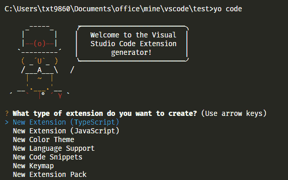
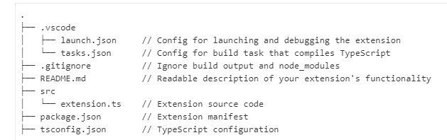

# 为 VS 代码创建扩展——第 1 部分

> 原文：<https://dev.to/thamaraiselvam/create-extensions-for-vs-code-part-1-10o0>

我想开发一个* *VS 代码扩展** 来解决我的一个日常问题，于是我开始看 [VS 代码 API](https://code.visualstudio.com/api)

他们有非常棒的文档和示例扩展，非常有用。

> 我可以在不到 5 分钟的时间内运行我的第一个 Hello world 扩展。

这是非常容易和超级简单的，来吧，让我们看看如何开发一个。

### 安装

安装以下节点模块，用于启动新扩展[约曼](https://yeoman.io/)和 [VS 代码扩展生成器](https://www.npmjs.com/package/generator-code)

`npm install -g yo generator-code`

### 创建新的分机

执行此命令`yo code`并选择 New Extension -Typescript(这是最推荐的一个)来创建一个新的扩展，然后回答问题。它将创建一个 Hello World * *样板** ，并安装所需的节点模块。

[](https://res.cloudinary.com/practicaldev/image/fetch/s--1AVs5f_0--/c_limit%2Cf_auto%2Cfl_progressive%2Cq_auto%2Cw_880/https://cdn.hashnode.com/res/hashnode/image/upload/v1561096703338/0BeEQrUoe.png)

#### 扩展文件结构

这个自动生成的扩展名有几十个文件，参考下面的图片了解更多关于文件结构。

[](https://res.cloudinary.com/practicaldev/image/fetch/s--WM1p64zT--/c_limit%2Cf_auto%2Cfl_progressive%2Cq_auto%2Cw_880/https://cdn.hashnode.com/res/hashnode/image/upload/v1561097102805/Uxir8exLD.png)

但是我们将主要关注两个文件，它们是

*   src/过流. ts
*   package.json

### 运行分机

运行扩展非常简单，只需从左侧菜单进入调试菜单或点击`Ctrl+Shift+D`键绑定，然后点击**运行扩展**。

它将打开一个新窗口，你的扩展将在那里运行，以确认你能在右下角看到“Hello World”。

[](https://i.giphy.com/media/OVXDh4cOaLawM/giphy.gif)

### 好吧，但是怎么操作呢？

VS 代码扩展都是基于事件的，我们需要在 package.json 中定义我们所有的命令(动作)

#### Package.json

您可以将* *package.json ** 文件放在根目录下，其中保存了`contributes` - > `commands`内的所有事件，在这种情况下，我们只有一个命令，即`extension.helloWorld`

```
"contributes": {
        "commands": [
            {
                "command": "extension.helloWorld",
                "title": "Hello World"
            }
        ]
} 
```

<svg width="20px" height="20px" viewBox="0 0 24 24" class="highlight-action crayons-icon highlight-action--fullscreen-on"><title>Enter fullscreen mode</title></svg> <svg width="20px" height="20px" viewBox="0 0 24 24" class="highlight-action crayons-icon highlight-action--fullscreen-off"><title>Exit fullscreen mode</title></svg>

我们通过将命令添加到`activationEvents`
中来启用我们的事件

```
"activationEvents": [
    "onCommand:extension.helloWorld"
] 
```

<svg width="20px" height="20px" viewBox="0 0 24 24" class="highlight-action crayons-icon highlight-action--fullscreen-on"><title>Enter fullscreen mode</title></svg> <svg width="20px" height="20px" viewBox="0 0 24 24" class="highlight-action crayons-icon highlight-action--fullscreen-off"><title>Exit fullscreen mode</title></svg>

`main`属性保存文件路径，一旦扩展被激活，将首先执行该路径

```
"main": "./out/extension.js" 
```

<svg width="20px" height="20px" viewBox="0 0 24 24" class="highlight-action crayons-icon highlight-action--fullscreen-on"><title>Enter fullscreen mode</title></svg> <svg width="20px" height="20px" viewBox="0 0 24 24" class="highlight-action crayons-icon highlight-action--fullscreen-off"><title>Exit fullscreen mode</title></svg>

#### Extension.ts

很高兴看到这一点，这个文件有非常详细的注释，以便更好地理解。

*   `function activate(context: vscode.ExtensionContext)` -该功能在扩展被激活时首先执行，我们所有的业务逻辑都在这里。

*   `vscode.commands.registerCommand('extension.helloWorld', () => {})` -用回调函数注册`extension.helloWorld`事件。

*   `vscode.window.showInformationMessage('Hello World!');` -它使消息框出现在右下角

最后，我们应该将注册的命令推入`context.subscriptions`

* *祝贺你的第一个 vs 代码扩展** 🎉🎉🎉🎉🎉

[](https://i.giphy.com/media/apdfsXZENhMsM/giphy.gif)

在下一篇文章中，我将解释如何实现最常见的扩展特性，比如菜单、设置、按键绑定和状态消息栏。

如果你有任何问题或疑问请评论，我很高兴能帮助你:D

谢谢大家！！！
[T3】](https://i.giphy.com/media/l2R0eYcNq9rJUsVAA/giphy.gif)

本文最初发表于 [Hashnode](https://thamaraiselvam.com/create-extensions-for-vs-code-part-1-cjx5r238f000t65s1ag0fdn8e)

#### 在[开发博客](https://thamaraiselvam.com/create-extensions-for-vs-code-part-2-cjxa87y7t001mvzs11rgng6th)或[开发博客](https://dev.to/thamaraiselvam/create-extensions-for-vs-code-part-2-1gj7)上阅读第二部分