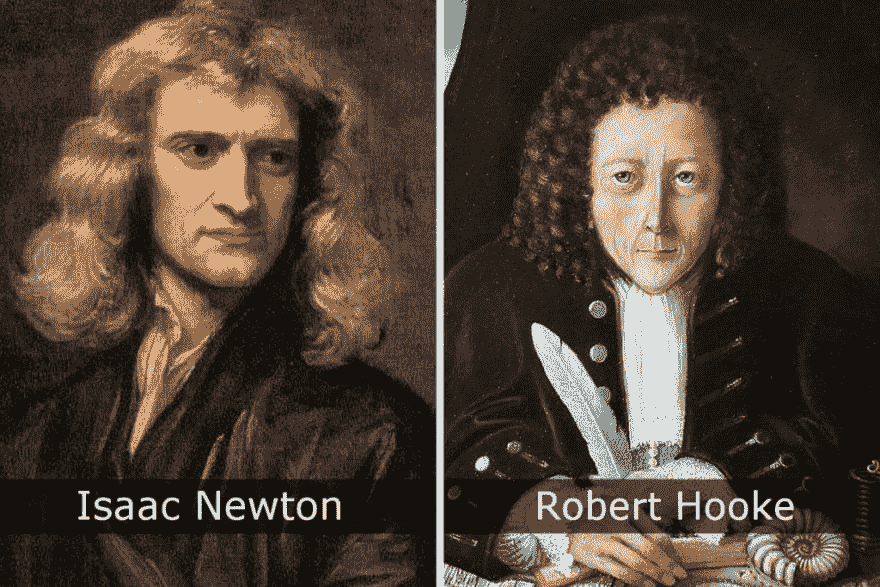
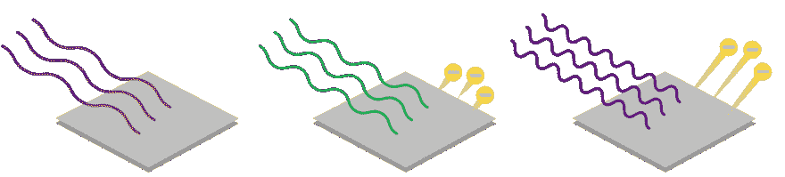
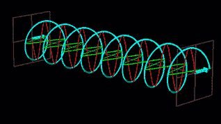
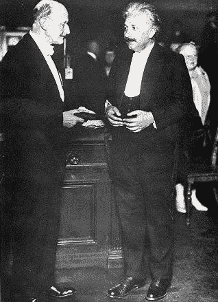
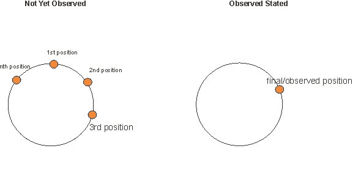
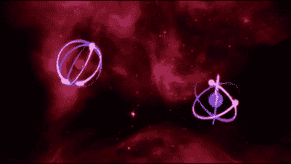
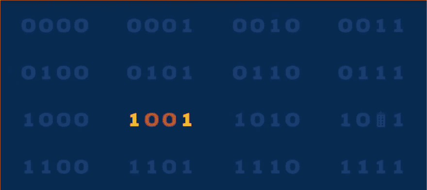
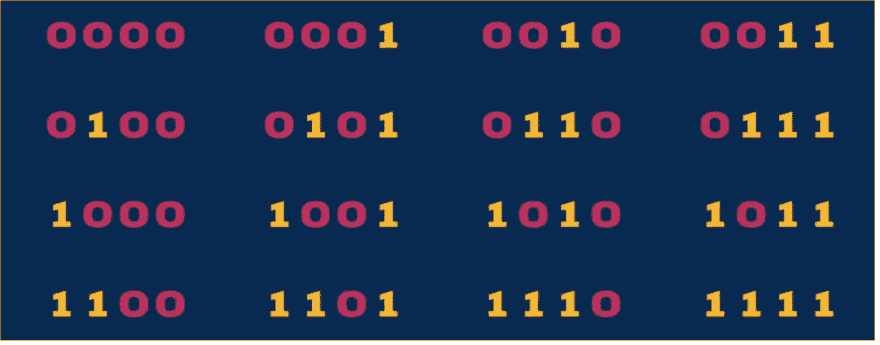
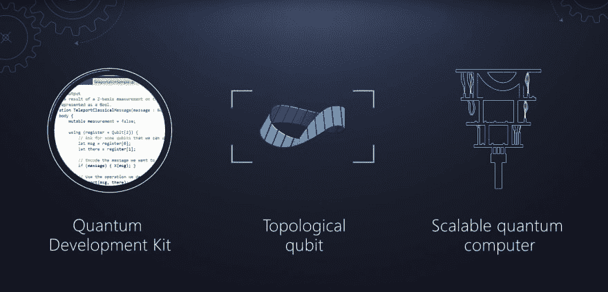

# 量子计算:导论

> 原文：<https://dev.to/jayendran/quantum-computing-an-introduction-4djd>

# 介绍

我们经常听说量子计算机将是未来，它将帮助我们解决所有世界问题，如世界饥饿、自然灾害和许多复杂的问题。理解量子的概念及其行为对于解决这类问题是非常必要的。在这个博客中，我们将了解量子的历史和概念。有很多方法可以理解为什么量子力学很难模拟。也许最简单的是，量子理论可以被解释为，物质在量子水平上同时处于一系列不同的可能配置(称为状态)中。

# 量子历史

这一切都始于 1672 年左右，当时大科学家们致力于发现光的行为。最初，牛顿发现光是粒子的形式，后来罗伯特·胡克发现光是波而不是粒子，直到光电效应的问题。

# 光效应

当光碰到一根紧挨着另一根的电缆时，电子从一根跳到另一根，人们认为这是因为光波使原子振动，直到它们射出一个电子。但是当仔细测量时，发现了一个很大的矛盾，它只发生在一些波长的光上，对于其他波长的光，根本没有电子跳跃。

# 爱因斯坦的量子发明

1905 年，爱因斯坦试图通过结合前两个假设来解决这个光电问题。

“如果光不是由波或粒子组成的，而是由波和粒子组成的，那会怎么样？如果光是由波包(光子)组成的，那会怎么样？”

<figure> 

<figcaption>光同时存在于波和粒子——光子</figcaption>

</figure>

量子是某个事物的最小部分，没有比这个更小的“事物”存在。比如一分是美国货币的一个量子，就像电荷的一个电子一样。在这方面，光子是电磁场(光)的量子。

这是一个革命性的观点，它开启了量子物理学的领域。

他还因为这项发明获得了诺贝尔奖。

<figure> 

<figcaption>爱因斯坦接受诺贝尔奖</figcaption>

</figure>

# 量子特性

## 叠加

量子叠加态表明，一个没有被观测到的物体同时存在于所有可能的状态中——它处于叠加态。这个叠加是一个粒子理论上所有可能状态的组合。

例如，原子中的电子——因为在你观察到原子中的电子之前，它可能位于原子核之外的任何地方。

## 量子纠缠

当任意两个量子粒子相互作用时，它们是纠缠的，这意味着它们的量子态是相互依赖的。它们之间是有关联的，所以如果一个处于某个特定的状态，那么另一个在空间和时间上一定有其他特定的状态。

例如，两个电子已经被纠缠，那么这可能产生这两个自旋相关的情况，使得如果一个电子自旋向上，另一个必然自旋向下。

<figure> 

<figcaption>两个电子的量子纠缠</figcaption>

</figure>

# 量子计算

量子计算是利用叠加和纠缠等量子力学现象来执行计算。使用量子计算机来执行这种计算，这可以在理论上或物理上实现。

## 量子位

在量子计算中，量子位是量子信息的基本单位。

为了从理论上理解量子比特，我们先介绍一种比特的向量记法如下:一个比特用两个元素(α，β)T 的列向量表示，其中α代表 0，β代表 1。现在比特 0 用向量(1，0)T 表示，比特 1 用(0，1)T 表示，就像之前一样(经典比特)，只有两个可能的值(量子比特叠加)。

量子计算的基本核心是以物质的量子状态存储信息，并通过利用和学习“编程”量子干涉，使用量子门操作对该信息进行计算

<figure> 

<figcaption>一个量子位存在于一个叠加态中</figcaption>

</figure>

# 现代计算机 Vs 量子计算机

我们的现代计算机由简单的部件组成，完成简单的操作，如主存储器、运算部件、控制部件。深入观察我们的计算机芯片包含模块，模块包含包含晶体管的逻辑门。晶体管只不过是一个开关，可以阻挡或允许信息通过。这里的信息只不过是 0 或 1 的比特。几个比特的组合用来表示更复杂的信息。

这里，更重要的是，这些位以 0 或 1 的形式显示，这可以产生许多不同的可能数据，如下所示

2 bits = > 2 4 = > 8 Game Boy

4 位= > 2 位 7 位内存= > 128 个 ASCII 字符

<figure> 

<figcaption>在 16 种可能的组合中，将使用 1 种组合</figcaption>

</figure>

现在量子计算机有一种不同的方式，它使用量子位，它可以同时显示 0 和 1，或者是 0 和 1 的量子叠加，只要我们不被观察到。但是我们测量它的例子会坍缩成一个确定的状态。

因为 4 个经典位可以同时处于 2 个 4 个不同配置中的一个，这是 16 种可能的组合，比如(0000 到 1111)，我们可以只使用其中的一种。

然而，对于叠加态的 4 个量子位来说，可以同时有 16 种组合

<figure> 

<figcaption>所有 16 种可能的组合叠加存在</figcaption>

</figure>

# 量子计算机的一些应用

## 密码系统

Quantum computers used to create private keys for encrypting messages from one place to another. So that hackers could not secretly copy the key perfectly, due to the quantum uncertainty. They would have to break the laws of quantum physics to hack the key.

## 心灵运输

Teleportation of information from one location to another without physically transmitting the information (Quantum entangled property)

# 量子计算的问题

## 缩放:

If we want to use quantum computers to solve real problems, they will need to explore the large space of quantum states. The number of qubits is important, but so is the error rate. By nature, qubits are fragile. They require a precise environment and state to operate correctly, and they’re highly prone to outside interference. So, if we try to scale the qubits currently error rates are also increased.

目前，微软、IBM 和其他先驱正在致力于创造一种更稳定的量子位，称为拓扑量子位。与其他量子位相比，它可以以更稳定的形式存储信息。拓扑量子位将允许量子计算机以更高的速度扩展，并允许我们建立一个足够大和稳定的量子计算机来解决我们最具挑战性的问题。

# 微软量子开发工具包(Q#)

Microsoft Quantum 开发工具包，为不断增长的社区提供工具，为我们的任务、问题和解决方案开启量子革命。高级编程语言 Q#旨在解决量子信息处理的挑战；它被集成到一个软件栈中，使量子算法能够被编译成量子计算机的基本操作。

# 结论

在这个博客里，我刚刚写了一篇关于量子世界的介绍。我希望这个博客能帮助你了解量子的基本知识。在不远的将来，还有更多的事情要做。量子的意义是未来非常巨大的需求，有了量子的帮助我们可以轻松高效地解决许多世界问题