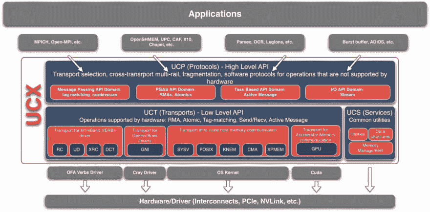

# 关于 OpenUCX 项目的个人链接集。

> 原文：<https://dev.to/hiroysato/personal-link-collection-about-the-openucx-project-2e97>

关于 OpenUCX 项目的个人链接集。

## OpenUCX

*   [UCX 统一通信 X](http://www.openucx.org) 项目页面。

## 幻灯片视频

*   2019-06-19 [统一通信 X (UCX)社区-Gilad Shainer](https://youtu.be/1xpXzrV31Jw)is c19 中的 OpenUCX 演示
    *   [UCX 发展现状](https://youtu.be/1xpXzrV31Jw?t=281)
    *   [魅力++中的 UCX 机器层](https://youtu.be/1xpXzrV31Jw?t=576)
    *   [UCX 在 MPICH 的支持](https://youtu.be/1xpXzrV31Jw?t=1067)
    *   [使用加速动词和标签匹配增强 MPI 通信:MVAPICH 方法](https://youtu.be/1xpXzrV31Jw?t=1414)
    *   [UCX CUDA 路线图更新](https://youtu.be/1xpXzrV31Jw?t=1749)
*   2019-06-19[ISC 第 19 届 OpenUCX 大会](http://www.openucx.org/wp-content/uploads/2019/06/UCX_ISC_2019_BoF_Final.pdf)
*   2018-03-21[UCX-PYTHON:PYTHON 应用的灵活通信库](https://on-demand.gputechconf.com/gtc/2019/video/_/S9679/)英伟达 GTC
*   2018-12-20 [UCX 宣讲会 ISC 2018](https://youtu.be/LLAV93cTyUI)
*   2017-12-06 [UCX 和 UCF 的亿亿次级项目在 SC17 上向前推进](https://youtu.be/hL542rj8jrI) RichReport
*   2016-02-26 [UCX:面向 HPC 网络 API 和超越 ARM 的开源框架](https://youtu.be/HqgddTip86Y)来自 ARM 的 Pavel Shamis
*   2015-12-07 [UCX -统一通信 X 框架- SC'15](https://youtu.be/Cq0w7Kem9p4) Pavel Shamis，橡树岭国家实验室
*   2015-05-29 [UCX -统一通信 X 框架](https://youtu.be/lD5CYMY840A) RichReport

## 相关项目。

*   2019-03-21[UCX-Python-Python 应用的灵活通信库](https://www.slideshare.net/MatthewRocklin/ucxpython-a-flexible-communication-library-for-python-applications)马修·洛克林，英伟达系统软件经理
*   [高性能 Python 组件](https://docs.google.com/presentation/d/e/2PACX-1vSajAH6FzgQH4OwOJD5y-t9mjF9tTKEeljguEsfcjavp18pL4LkpABy4lW2uMykIUvP2dC-1AmhCq6l/pub?start=false&loop=false&delayms=60000&slide=id.p1)，NVIDIA PASC 2019 系统软件经理 Matthew Rocklin
*   2019 年 5 月[UCX 机器层对 Charm++模拟的影响](https://charm.cs.illinois.edu/charmWorkshop/slides/26-Qin-UCX.pdf)秦永，Mellanox Technologies 博士。

## 试卷。

*   沙米斯、帕维尔、洛佩兹、马修·格雷厄姆、沙内尔、吉拉德。星期一[“在 ARM 上启用单边通信语义”](https://www.osti.gov/biblio/1376625)。美国。doi:10.1109/ipdpsw . 2017.62 .【https://www.osti.gov/servlets/purl/1376625】T2。
*   Rohit Zambre、Megan Grodowitz、Aparna Chandramowlishwaran 和 Pavel Shamis。2019.[断带:高性能通信的中断](https://dl.acm.org/citation.cfm?doid=3337821.3337910)。《第 48 届国际并行处理会议论文集》(ICPP，2019)。美国纽约州纽约市 ACM，第 47 条，10 页。https://doi.org/10.1145/3337821.3337910

## 博客

*   走向数据科学
    *   2019-06-29 [Python、性能、GPU 使用 Python 的 GPU 加速器状态更新](https://towardsdatascience.com/python-performance-and-gpus-1be860ffd58d)

## 开发备忘录

#### NBX、NB 和 NBI

[推特](https://twitter.com/pasha_sh/status/1298038366253047810?s=20)

> 隐式非阻塞是“发射并忘记”的通信例程，它不向用户返回任何跟踪请求。我们将放弃 NB 和 NBI API，转而支持结合了 NB/NBI +可扩展 ABI 的 NBX API。

## 日语

*   其实很可怕的情报科学
    *   2018/02/25 [试用 UCX 的笔记(1)](http://freak-da.hatenablog.com/entry/2018/02/25/121759)