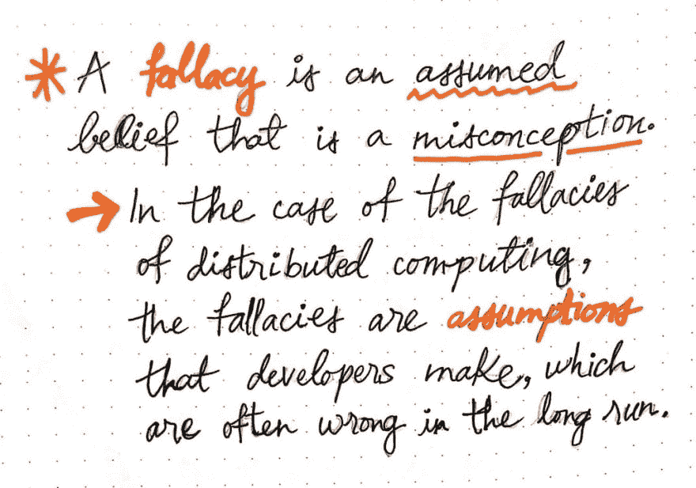
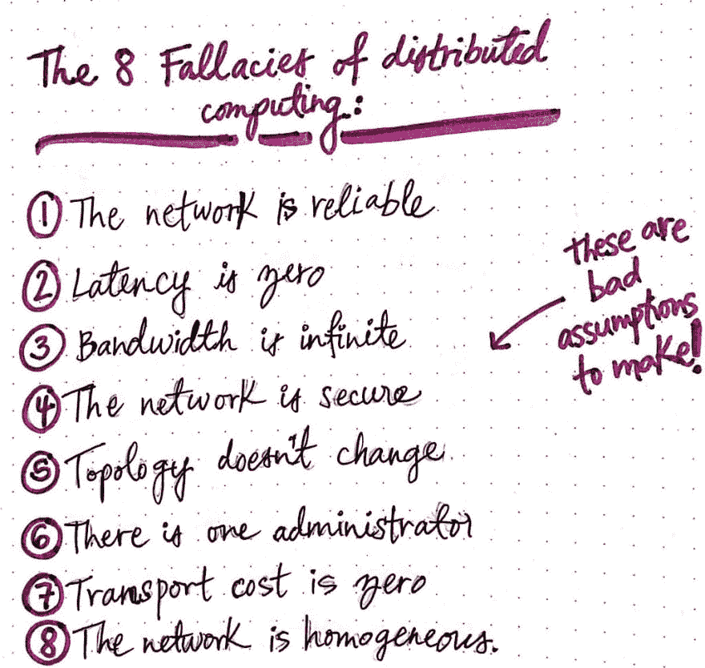
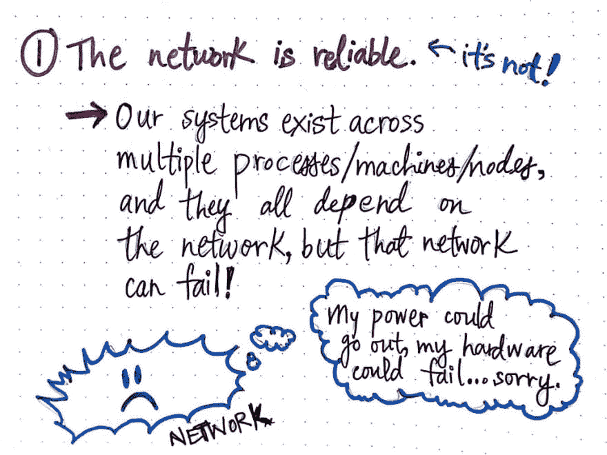
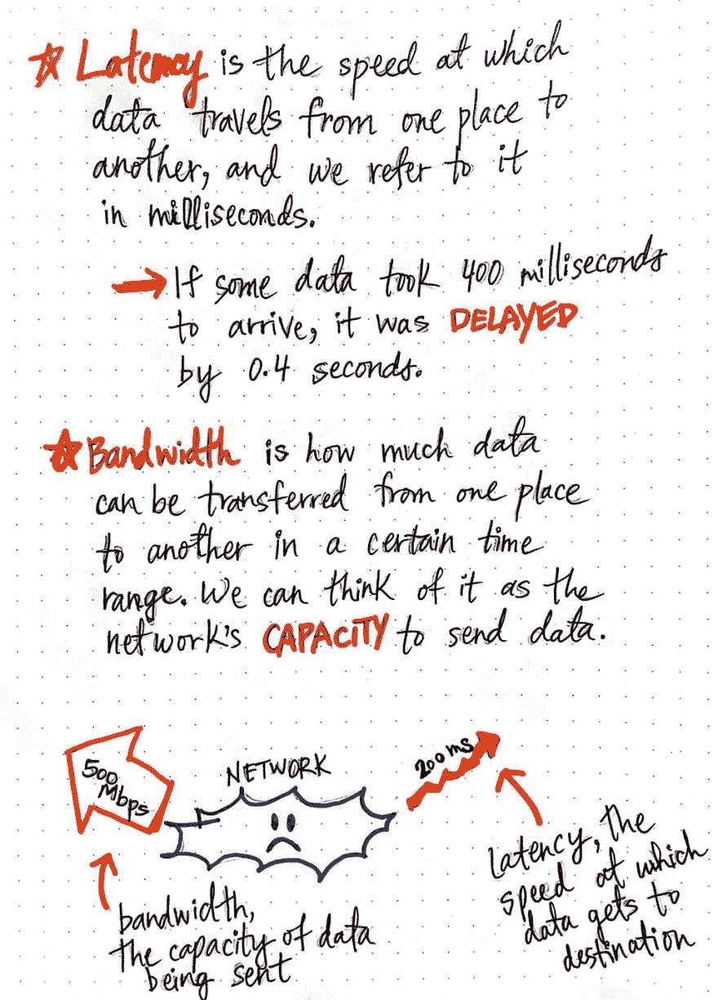
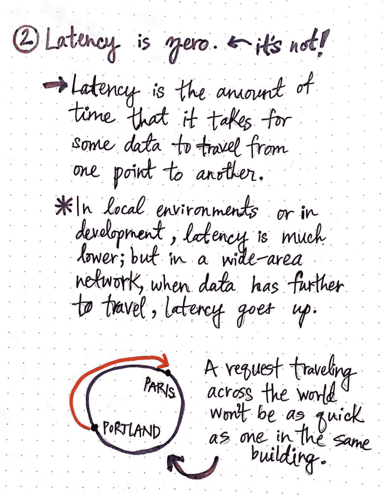
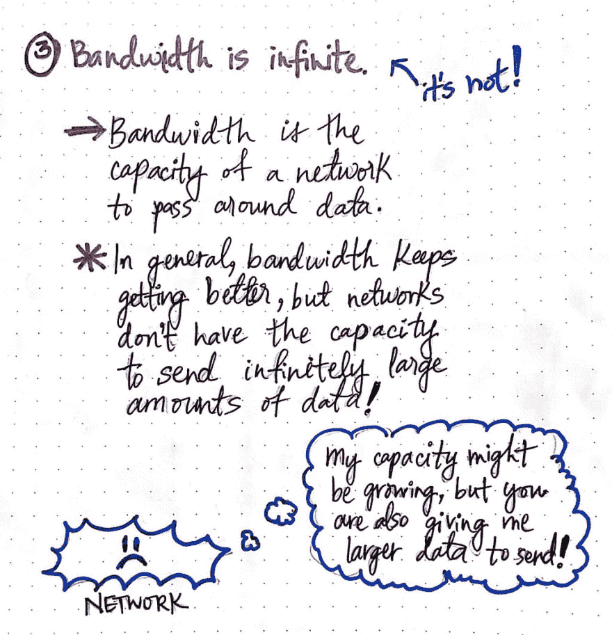
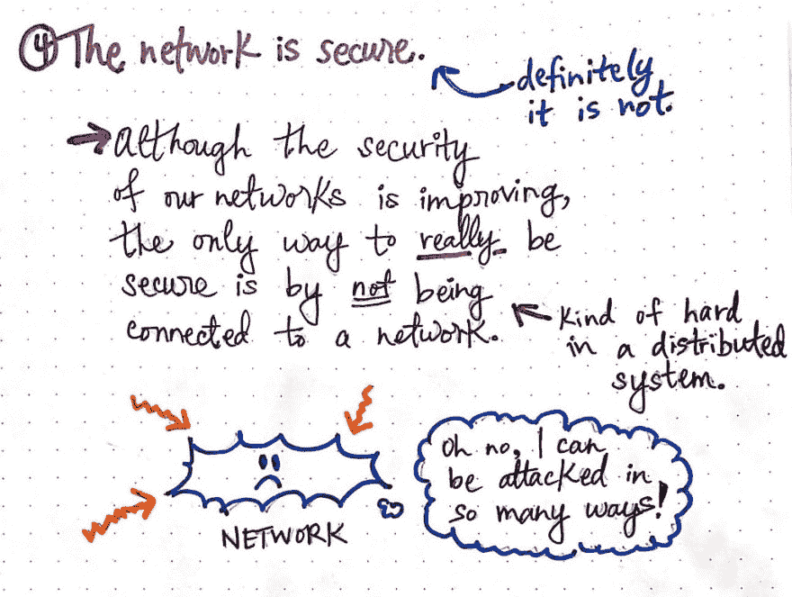

# 搜寻分布式计算的谬误(第 1 部分)

> 原文：<https://dev.to/vaidehijoshi/foraging-for-the-fallacies-of-distributed-computing-part-1-35n9>

很多计算都是基于假设的。我们设计基于一系列假设的系统。我们编写程序和应用程序时，假设它们系统的某些部分将以某种方式工作。我们还假设有些事情可能会出错，并且我们(希望)尝试解释它们。

构建类似计算机的东西的一个大问题是，即使我们经常处理复杂的系统，我们也不总是能够在宏观层面上进行推理。分布式系统当然是一个很好的例子(你知道我要说什么，不是吗？).即使是一个“简单”的分布式系统也不是那么简单，因为根据定义，它涉及不止一个节点，系统中的节点必须通过网络相互通信和交谈。即使在只有两个节点的小型分布式系统中，我们也会对系统如何工作做出某些假设。

然而，关于做出假设，这里有一点:假设可能是错误的！事实证明，我们经常对分布式计算做出一些常见的、不正确的假设。事实上，它们无处不在，以至于有了一个名字！当然，我说的是分布式计算的八个谬误。它们是什么？是时候找出答案了。

#### 假设出了问题

我们今天所知的八个谬误实际上是从四个谬误开始的，这就是我们将在这篇文章中讨论的。前四个谬误是由两位 Sun Microsystems 工程师 Bill Joy 和 Dave Lyon 在 90 年代早期(1991 年后的某个时候)创造的。

詹姆斯·高斯林当时是太阳微系统公司的研究员，后来他创造了 Java 编程语言，他把前四个谬误归类为“网络计算的谬误”。那十年后不久，Sun 的另一位研究员 Peter Deutsch 补充了第五、六和七个谬误。1997 年，高斯林补充了第八个也是最后一个谬误。编纂这份清单的大部分工作都受到了当时 Sun Microsystems 公司实际工作的启发。虽然 Deutsch 经常被认为是“创造”了这八个谬误，但很明显这是一个集体的努力(这在计算领域是常有的事！).

好了，现在我们已经有了一些历史，让我们进入这个问题的一些实际方面。让我们首先从理解我们所说的分布式计算的“谬误”开始。这到底是什么意思？

<figure> 

<figcaption>说到分布式计算，到底什么是谬误？</figcaption>

</figure>

嗯，一个 ***谬误*** 是一种假定的事实或信念；然而，即使假设这是真的，实际情况通常并非如此。谬误只是一种误解的信念。但是这在计算环境中意味着什么呢？嗯，关于分布式系统的一个谬误是开发者对系统的一个假设，从长远来看，这通常是不准确和错误的。换句话说，这些都是不好的假设。

> 我们可以把这八个谬误看作是分布式系统开发人员经常陷入的八个常见误解，这也是我们想要避免的。

<figure> 

<figcaption>分布式计算的 8 大谬误</figcaption>

</figure>

那么，我们来看看这八个谬误，好吗？

分布式计算的八个谬误如下:

1.  网络是可靠的。
2.  延迟为零。
3.  带宽是无限的。
4.  网络很安全。
5.  拓扑不会改变。
6.  有一个管理员。
7.  运输成本为零。
8.  网络是同质的。

在本帖中，我们将只关注前四个谬误，我们现在知道它们是最初的“网络计算谬误”！便利的是，前四个谬误实际上都围绕着一个中心的关键人物:网络。正如我们将要看到的，网络是一个狡猾的小家伙。当然，没有网络的分布式系统有点困难，所以我们必须习惯于处理这个棘手的角色。

让我们了解一下是什么让网络难以应对，以及为什么这些谬论很容易被假设。

#### 网络的烦恼

我们的分布式系统，不管有多复杂，都存在于一个网络中。我们系统的节点必须相互通信，发送和接收消息，以进行通信和传递数据。因为系统是分布式的，它的各个部分将位于不同的地方，而网络是系统组件进行通信的锚点。

这就把我们带到了谬误一:**网络是可靠的。**记住，这些都是我们正在处理的谬论，所以网络可靠是一个真正的误解；网络是*不*可靠！

<figure> 

<figcaption>谬误一:网络可靠(其实不可靠)。</figcaption>

</figure>

网络中的许多事情都可能出错。硬件可能会出现故障，电源可能会中断，信号可能会变得不稳定，甚至网络可能会受到威胁！网络不可靠似乎是显而易见的，但是作为分布式系统的设计者，当我们编写将要在分布式系统上运行的代码时，我们有时会忘记这一点。我们可能在这种假设下编写代码，但是当网络不可避免地变得*不可靠*时，我们意识到我们做了一个错误的假设，最终会对我们的系统产生负面影响。因此，我们的工作就是牢记这一谬论，不要忘记网络是不可靠的。

现在，在我们深入研究网络之前——更不用说与它们相关的谬误了——有一些重要的术语需要我们学习。当我们谈论通过网络发送的消息时，我们通常指的是通过网络发送的数据。但是我们可以用两种不同的方式来谈论数据和数据的发送方式:延迟和带宽。

<figure> 

<figcaption>延迟对带宽</figcaption>

</figure>

***延迟*** 是对*延迟*某些数据到达的程度的度量，基于数据被发送到的位置。我们可以将延迟视为数据从一个地方传输到另一个地方的速度，或者数据从系统中的节点 A 到达节点 B 需要多长时间。延迟是一个许多开发人员可能已经非常熟悉的概念，因为我们经常在毫秒的上下文中提到数据的延迟。例如，如果一个请求从服务器(节点 A)到客户端(节点 B)需要 400 毫秒，我们可以说发送数据的延迟是 400 毫秒，或者说消息从服务器到客户端需要 0.4 秒。许多注重性能的开发人员在考虑优化或改进他们的应用程序或系统时，通常会考虑延迟。

***带宽*** 另一方面，带宽是衡量在一定时间内从一点到另一点可以发送多少数据的指标。我们经常在互联网速度(例如，每秒兆位或 Mbps)的背景下谈论带宽，因为我们指的是通过我们的特定网络可以发送多少数据，或者我们的网络在给定时间跨度内发送一定量数据的能力。

延迟是数据通过网络到达目的地的实际速度，而带宽是网络将一定量的数据发送到目的地的能力。理解这两个概念之间的区别对我们理解第二个和第三个谬误很重要，所以接下来让我们学习这两个！

#### 一些谬误比另一些更伤人

既然我们知道了“潜伏”的真正含义，我们就更好地理解了谬误二:**潜伏为零**。不幸的是，这也是一种误解。

<figure> 

<figcaption>谬误二:潜伏期为零(其实不是)。</figcaption>

</figure>

这可能是一个容易陷入的谬误，因为在我们的本地环境或开发环境中，我们可能会经历更低的延迟；换句话说，在发送或接收数据时，我们可能会经历短暂的延迟时间。然而，较低的本地延迟并不能准确反映系统其他部分可能感受到的延迟——尤其是在不同网络的情况下。

我们已经了解了局域网和广域网。我们知道，在广域网中，数据必须从一个节点传输到另一个节点，因为网络可能跨越很长的地理距离。这与局域网形成对比，局域网是一个设备位于同一栋大楼或同一房间的网络，因此数据传输的距离要短得多。

我们不能假设我们的系统总是在局域网上运行(事实上，大多数分布式系统都在广域网上运行)，因此我们知道我们的数据有一段物理距离要传输。对于代理，我们不应该假设在发送数据和接收数据之间没有“延迟”或零延迟。例如，从波特兰到巴黎的跨世界请求将比从一个房间的机器到另一个房间的请求有更多的延迟。

> 一些延迟是网络的限制；我们应该明智地不要建立一个假设这种延迟不存在的系统。我们将来肯定会被这种错误的假设所咬。

<figure> 

<figcaption>谬误三:带宽是无限的(其实不是)。</figcaption>

</figure>

第三个谬误也类似于这个错误的假设:**带宽是无限的。**正如延迟不为零一样，网络发送数据的能力也不是无限的。随着这些年来计算技术的进步——当然是从 90 年代早期谬误被创造出来之后——我们网络的带宽变得越来越好，我们能够在给定的时间内通过我们的数据发送更多的数据。

然而，即使有了这些改进，网络仍然没有无限的容量，也不能发送无限量的数据。当我们设计一个分布式系统时，我们不应该假设任何数量的数据都可以通过网络发送。例如，我们系统中的一些用户的网络带宽有限，容量较低；对于该用户的体验来说，发送大量数据(如大型图像或供应商提供的相关文件)意味着我们将发送比他们的网络在合理的时间内能够发送的数据多得多的数据。

最后，我们来到谬误四，这也是我个人最喜欢的一个:**网络是安全的。**网络受到攻击或损害的方式非常简单，从未加密的消息到依赖关系中的漏洞到开放源代码，甚至只是我们的系统可能依赖的第三方软件中的漏洞(更不用说我们自己系统中的漏洞了！).

<figure> 

<figcaption>谬论四:网络是安全的(绝对不是！).</figcaption>

</figure>

认为网络“安全”的误解很难克服，因为，如果我们真正开始思考，没有网络是真正安全的。事实上，真正保护我们的网络和 100%安全的唯一方法就是不要连接到网络！当然，因为我们正在处理分布式系统…这真的不容易做到，因为我们知道系统中的节点之间的通信需要一个网络。

那么，我们该怎么办？好吧，我们可以试着记住*真正的*安全是一种谬误，我们可以在设计、构建和测试我们的系统时尽我们所能来防止违规和攻击。希望这至少可以暂时避免安全问题。

在这篇文章的第二部分，我们将看看剩下的四个谬误。我保证那个悲伤的蓝色网络小斑点会回来的！我们还没完成呢。

#### 资源

分布式计算的谬误已经被写得相当好了，你可以找到一些关于不同技术的不同解释的好资源。如果您想了解更多，请查看下面的参考资料！

1.  分布式计算的谬误解释
2.  理解分布式系统的 8 个谬误
3.  揭穿分布式系统的八大谬误
4.  分布式系统的谬误，乌迪·达汗
5.  分布式计算的谬误重生:云时代
6.  多伊奇的谬误，10 年后

* * *