# DevRelCon SF 2019 笔记

> 原文：<https://dev.to/maxkatz/notes-from-devrelcon-sf-2019-434m>

6 月 6 日至 7 日，我在旧金山参加了 DevRelCon。这是一个极好的活动，有伟大的演讲者和令人敬畏的社区。以下是我的笔记(不是完整的句子)和来自活动的图片。

### 通过凯西·塞拉的“踢屁股曲线”更好地处理开发者关系

史蒂夫·普斯蒂

*   史蒂夫的演讲集中在如何更好地处理开发者关系。史蒂夫用凯西·塞拉的“踢屁股曲线”演示了这个概念
*   你可以在这里找到他的[幻灯片](http://bit.ly/kickasskathy)
*   发展目标
    *   用你的产品/服务让用户开心和成功
*   用最少的时间让用户牛逼

<figure>[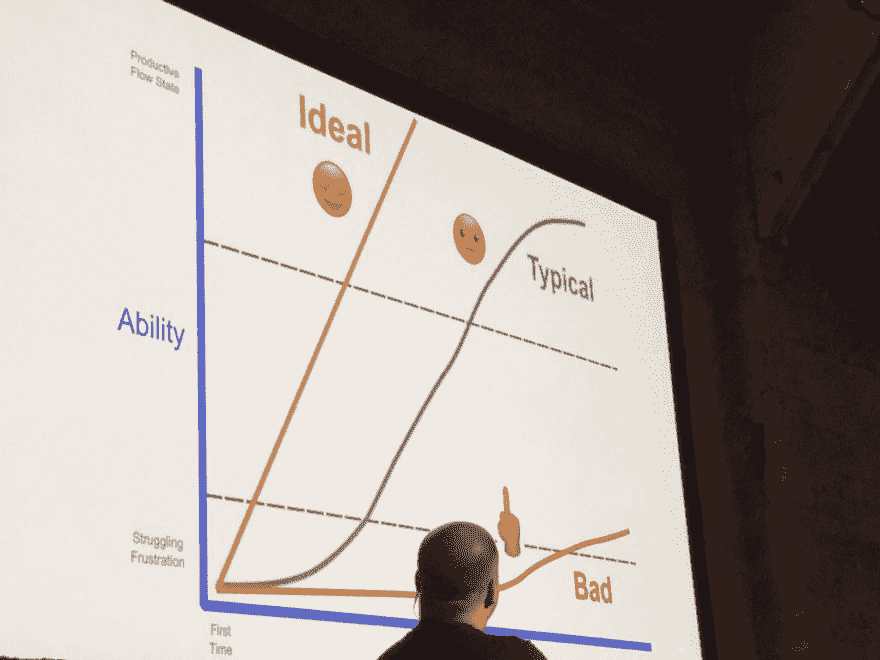](https://res.cloudinary.com/practicaldev/image/fetch/s---tUb2TE2--/c_limit%2Cf_auto%2Cfl_progressive%2Cq_auto%2Cw_880/https://katzmax.files.wordpress.com/2019/06/devrelcon-steve-curve1.jpg%3Fw%3D1024%26h%3D768) 

<figcaption id="caption-attachment-10510">开发者关系成功曲线</figcaption>

</figure>

*   不同的公司可以有不同的曲线
    *   用户的背景知识和经验(不要控制)
    *   文件和教材的质量(控制)
    *   产品/API(控制)的实际设计
    *   你所在社区的规模和有用性
*   我们经常不同意产品经理和工程师的观点，因为项目经理和工程师认为他们处于曲线上的不同位置。PM 和工程师熟悉服务/产品，通常不会像外部开发人员   那样“学习”服务/产品
*   摘要
    *   考虑一下听众(你的目标是谁，如何尽快找到听众)
    *   如果我们不能在人们放弃之前让他们走出困境，我们将永远无法让他们体验权力
    *   请记住，当与他人“交谈”时，要思考他们在曲线上的位置
    *   当曲线有帮助时使用它，当它没有帮助时忽略它

### 从零开始构建企业开发者营销计划

卢克·基尔帕特里克

<figure> 

<figcaption id="caption-attachment-10466">开发商的影响力越来越大</figcaption>

</figure>

*   34%
    *   由于开发商的直接影响而失去的机会数量
    *   现在越来越多的开发者有了预算
    *   以前没有太多预算
*   你想接触什么类型的开发者
    *   市场开发者
    *   API 消费者
    *   开发人员的工具
*   开发人员不相信你——他们必须尝试一下
    *   开发者不信任你，除非他们去尝试
    *   如果你没有开发者关系/开发者营销，你的产品可能会失败
*   早期指标和高管买入
    *   衡量标准需要时间…可能需要 12-18 个月甚至更长时间
    *   需要一个冠军
*   开发者门户
    *   developer.company.com
    *   甚至更好——公司开发
*   建议的团队结构
    *   内容作者
    *   实验室、博客、自己的门户
    *   福音传道者
    *   研究员
    *   社区经理
    *   支持
*   事件
    *   外部黑客马拉松
    *   从不使用来自外部黑客马拉松的代码
    *   大多数参加黑客马拉松的人可能都是新手。在黑客马拉松之后，项目很少发生任何事情
    *   好多了——动手实验
    *   内部黑客马拉松非常有益

### 真实性引领:发展和培育开发者社区的技巧

凯蒂·佩恩

<figure> 

<figcaption id="caption-attachment-10471">如何向开发商营销</figcaption>

</figure>

*   停止向开发商营销
    *   了解客户——开发者是独一无二的花朵
    *   带来内容和解决方案—了解他们的需求
*   开发者是
    *   建设者
    *   问题解决者
    *   房间里最聪明的人
*   当心 bios，开发者不都是一样的
*   以解决方案而非路线图为先导
*   为开发者解决问题，而不是推产品
*   建立沟通渠道
    *   他们肯定是两种方式
*   约定投资
*   去引擎盖下
    *   知识包含信任
    *   我们是如何建立一个开源程序的？
    *   分享你是如何构建的——你是如何扩展的
*   分享您的路线图
    *   打开对话并获得反馈的另一种方式
    *   松弛的
    *   发布了他们的路线图，并能够获得反馈
*   承认你的错误
    *   如何不参加黑客马拉松—[销售 100 万美元的黑客马拉松](https://medium.com/@aliciatweet/the-dirty-secret-behind-the-salesforce-1m-hackathon-b839268fb82d)
*   开发者+真实性=新的开发者营销方式

### 一个闪亮的新开发者门户

[警告性紫貂](https://twitter.com/avitaltzubeli)(冷库)

<figure>[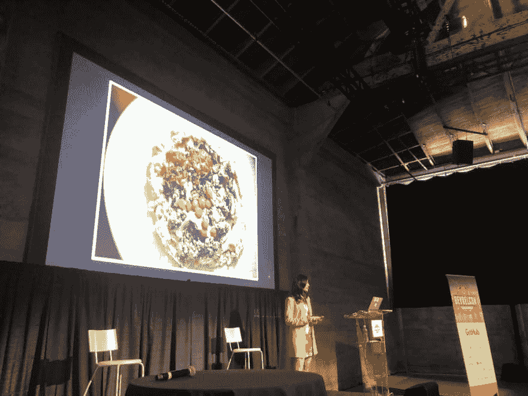](https://res.cloudinary.com/practicaldev/image/fetch/s--GMyj9dM2--/c_limit%2Cf_auto%2Cfl_progressive%2Cq_auto%2Cw_880/https://katzmax.files.wordpress.com/2019/06/devrelcon-avital-humus.jpg%3Fw%3D1024%26h%3D768) 

<figcaption id="caption-attachment-10525">Avital 在她的演讲中分享了她美味的腐殖质配方</figcaption>

</figure>

*   Avital 谈到了构建一个新的开发者门户，特别是如何构建入门内容
*   她分享了这张图片，我认为它对刚开始使用 API 的人来说有很好的指导意义
*   你的入门指南是你的钩！
*   避免抄“不是我的责任”的捷径
    *   一旦有人成功地尝试了你的 API，现在他们想要构建一个客户端——很容易说“嗯，那超出了我们的工作范围”
    *   负责
    *   Avital 建议也帮助开发者解决这些问题

### 创建优质社区

[Gerard without](https://twitter.com/gerardsans)(AWS)

<figure>[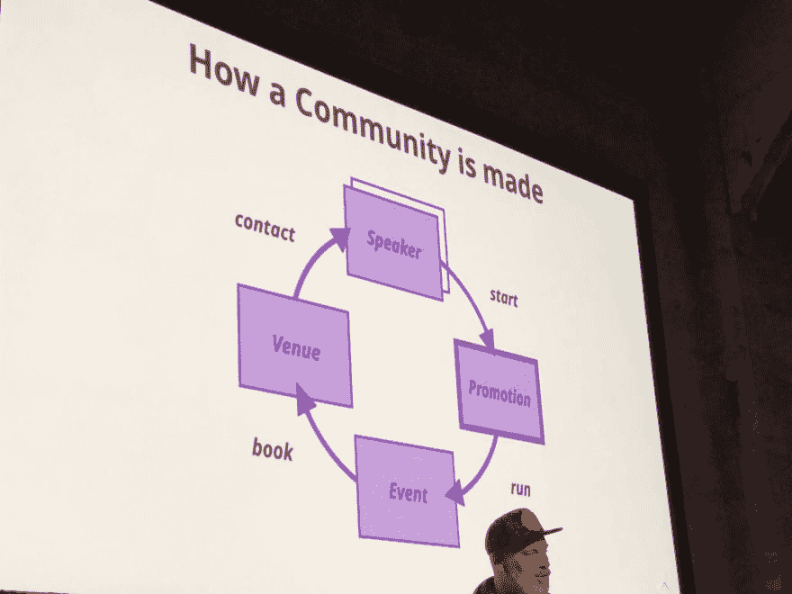](https://res.cloudinary.com/practicaldev/image/fetch/s--hOGLo-H---/c_limit%2Cf_auto%2Cfl_progressive%2Cq_auto%2Cw_880/https://katzmax.files.wordpress.com/2019/06/devrelcon-gerard.jpg%3Fw%3D1024%26h%3D768) 

<figcaption id="caption-attachment-10526">如何打造一个社区</figcaption>

</figure>

*   创建了 GraphQL 伦敦聚会
    *   每两个月聚会一次
    *   记录事件
    *   优秀的演讲者和内容
*   统计数据
    *   Two thousand and sixteen
    *   150 名成员
    *   40 名与会者
    *   1 名组织者
    *   Two thousand and nineteen
    *   1660 名成员
    *   100 名与会者
    *   3 名组织者
*   格式
    *   顶级扬声器–获得顶级扬声器
    *   顶级场馆——找一个交通便利的好场馆
    *   奖品——提供奖品
    *   饮料——获得好喝的饮料
    *   食物——获得更多比萨
    *   录制–录制活动，以便无法参加的人可以观看录制内容，并且地理位置不同的人也可以观看
*   前 3 名
    *   追求
    *   热情
    *   玩得开心
*   点击获取杰拉德的幻灯片

### 分布式开发者关系

布兰登·韦斯特

<figure>[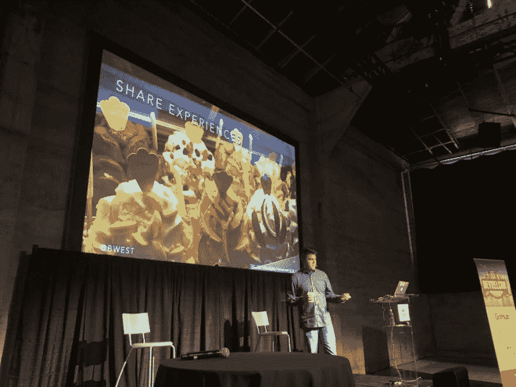](https://res.cloudinary.com/practicaldev/image/fetch/s--FtO4fpqX--/c_limit%2Cf_auto%2Cfl_progressive%2Cq_auto%2Cw_880/https://katzmax.files.wordpress.com/2019/06/devrelcon-brandon.jpg%3Fw%3D1024%26h%3D768) 

<figcaption id="caption-attachment-10528">布兰登分享领导分布式团队的最佳实践</figcaption>

</figure>

*   远程->分布式
    *   不要远程，让你的团队分散
    *   远程意味着团队成员“断开连接”
*   毕业生对远程工作感兴趣的可能性高出 68%
*   39%的员工花一些时间远程工作
*   自 2005 年以来，在家办公增长了 140%
    *   比办公室工作快 10 倍
*   寻找一个能够管理分布式团队的经理，而不仅仅是一个经理
*   好人
    *   压力更低，参与度更高
    *   更接近你的家人
*   不利方面
    *   对等关系没有那么好
*   旅行的好处
    *   如果你喜欢旅行
    *   奖励/积分
*   旅行的坏处
    *   饮食不佳
    *   睡眠剥夺
    *   倦怠风险
    *   个人/家庭关系紧张
*   如果公司允许，让您的团队成员使用他们的个人信用卡支付差旅费，这样他们就可以获得里程/积分
*   将物品按逻辑分组，以减少出行:
    *   区域团队/地理
    *   频道
    *   直播
    *   写作内容
    *   以身作则
    *   确保每个人都在使用 PTO
    *   寻找其他渠道
    *   不用上飞机就能找到工作的人
    *   面对面的时间是不可替代的
    *   让每个人都呆在同一个房间里(至少一年一次或多次)
    *   慢是的
    *   我们总是愿意帮助别人->导致过度承诺
    *   花时间决定要承诺什么
    *   分享经验
    *   如果你和同事一起旅行，花些时间去一个新的城市观光

### 炉边聊天

凯尔西·海托华

<figure> 

<figcaption id="caption-attachment-10472">正文正文正文</figcaption>

</figure>

凯尔西问答的一些要点:

*   我不会忘记初学者的感受
*   当你有信心时——你会让你周围的人也有信心，你会让你周围的人更成功
*   凯尔西为谷歌 GKE 的工程师组织了一次培训，并要求他们安装 Kubernetes
    *   客户同理心会议
    *   大多数工程师无法安装 Kubernetes。这导致在安装 Kubernetes 时大量的软件改进
*   当你问一个问题的时候，首先告诉你尝试了什么
    *   我试了 1、2 和 3，然后才问这个问题
*   不要害怕道歉

### 从初创到企业

菲尔·莱格特

菲尔有超级棒的幻灯片，很容易理解。所以，不要看我的笔记，看看他的幻灯片，了解他的演讲内容

液体错误:内部

### 迈向更具包容性的开发者门户

亚当·迪万德(EveryDeveloper)

<figure>[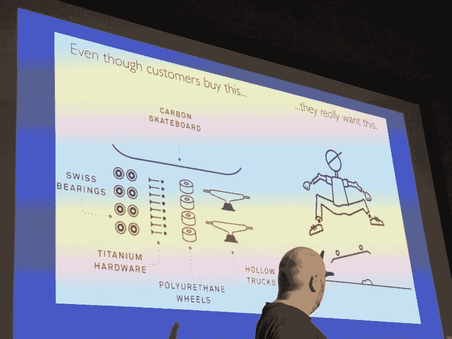](https://res.cloudinary.com/practicaldev/image/fetch/s--iQTUQ5Og--/c_limit%2Cf_auto%2Cfl_progressive%2Cq_auto%2Cw_880/https://katzmax.files.wordpress.com/2019/06/devrelcon-adam1.jpg%3Fw%3D1024%26h%3D768) 

<figcaption id="caption-attachment-10530">分享利益，不特色</figcaption>

</figure>

*   重新思考你的受众
*   找出他们想要什么
*   让它更容易得到
*   找出他们想要什么
    *   和他们谈谈
    *   电子邮件
    *   实时聊天
    *   视频聊天
    *   反馈表
    *   快速调查
*   让开始变得更容易
    *   教程
    *   用户案例
    *   博客帖子
    *   示例应用程序
*   如何在您的门户中添加低代码工具
    *   亚当的伟大文章: [API 的肮脏小秘密](https://medium.com/every-developer/apis-dirty-little-secret-24ad7deda1c4)
*   我最喜欢的 DevRel 资源之一:
    *   [分享知识，而不是特性——对开发者来说，营销的秘密就是不要使用营销手段](http://www.shareknowledgenotfeatures.com/)

### 可持续的开发者关系

马修·雷维尔

> 感谢彼得·莫斯科维茨分享他这次演讲的笔记

<figure>[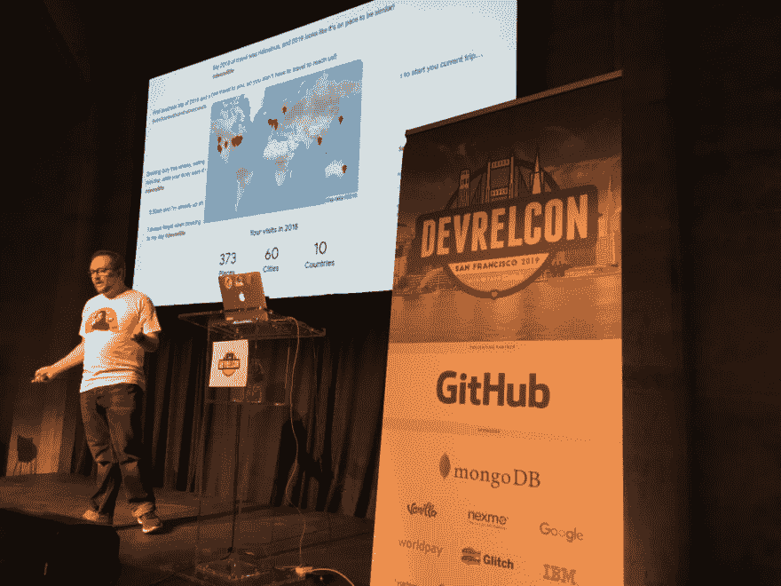](https://res.cloudinary.com/practicaldev/image/fetch/s--_qenmlgK--/c_limit%2Cf_auto%2Cfl_progressive%2Cq_auto%2Cw_880/https://katzmax.files.wordpress.com/2019/06/devrelcon-matthew1.jpg%3Fw%3D1024%26h%3D768) 

<figcaption id="caption-attachment-10548">可持续的开发者关系</figcaption>

</figure>

*   DevRel 是有压力的——对一些人来说，有时是期望的不匹配
    *   我们中的许多人以一种不可持续的方式对待 DevRel
*   我们为什么要做 DevRel？
*   三个利益相关者需要保持平衡:
    *   你们
    *   开发商
    *   商业
*   你(作为个人，作为 DevRel 的贡献者)——筋疲力尽
*   开发商:冷漠
*   业务:投资回报率
*   " DevRel 的人们在 12 月生病，因为这是他们唯一能生病的时间."

> 艾米莉·弗里曼[@ editing Emily](https://dev.to/editingemily)哦:“DevRel 的人在 12 月生病，因为这是他们唯一可以生病的时候。”2018 年 11 月 29 日下午 16:01

*   # devrellife–谦虚的吹牛
*   在航空公司的地位不是一个好处，而是一个陷阱！
*   DevRel 是一份工作，不是一种生活方式
*   DevRel 是一个过程，一步一步来，它不是魔术
*   过度捕捞相同的开发者是一个挑战
*   t 恤:如果你使用和别人一样的技巧，你很难脱颖而出
*   开发者是什么样子的？
    *   我们需要开放，去接触人们所在的地方
*   只有一小部分人容易接触到。大多数人很难接触到。

### 为什么 Target 需要 DevRel 来吸引和留住工程师

Ana Bahr (目标)

<figure>[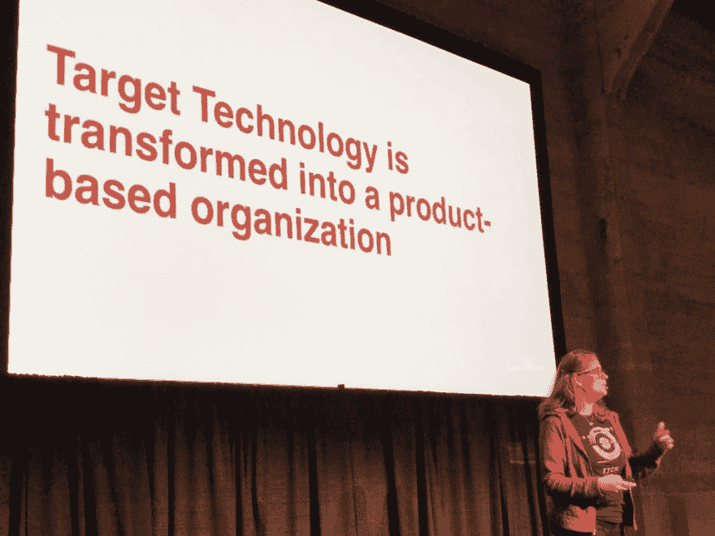](https://res.cloudinary.com/practicaldev/image/fetch/s--ddsZ6dfD--/c_limit%2Cf_auto%2Cfl_progressive%2Cq_auto%2Cw_880/https://katzmax.files.wordpress.com/2019/06/devrelcon-ana-target1.jpg%3Fw%3D1024%26h%3D768) 

<figcaption id="caption-attachment-10531">Ana 正在分享如何锁定目标将其 DevRel 程序</figcaption>

</figure>

*   为什么 Target 需要 DevRel
    *   支持目标工程师关心的事情
    *   让我们的工程师团队能够协作
    *   挑战
    *   目标 it 70%的承包商
    *   没有创新的动力
    *   瀑布项目管理
    *   需要资金为工程师创造新的空间
    *   新电脑
    *   工程师的新空间
    *   我们可以用一些预算来赞助社区组织吗
    *   举办聚会
*   首席信息官指令:围绕工程师建立一种文化
*   目标转变为基于产品的组织
*   赞助会议
*   我们是如何启动 DevRel 的
    *   问题
    *   没有预算
    *   差距和效率低下
    *   主要联系人另有工作(发言人！)
*   问题
    *   我们在做什么？
    *   我们实际上应该做什么？
    *   我该如何解决这个问题
*   我们今天做什么
    *   每周技术午餐
    *   内部会议(内部会议，900 名与会者，讲座，研讨会，灯光讲座
    *   代码化的黑客马拉松(每年 2 次)
    *   演示日(1000 人参加)
    *   志愿者活动团队
    *   沟通
    *   内部松弛通道
    *   团队 t 恤
    *   外部的
    *   外部技术委员会参与
    *   大量外部通信组织目标支持
    *   [http://tech.target.com](http://tech.target.com)
        *   张贴一周
    *   开放源码
        *   [http://opensource.target.com](http://opensource.target.com)
    *   目标技术发言人
        *   参加各种会议
*   有什么价值
    *   保留
    *   工程师关心的是什么
    *   这对你来说意味着什么
    *   今天，没有一家公司能够制造、交付或销售其产品

<figure>[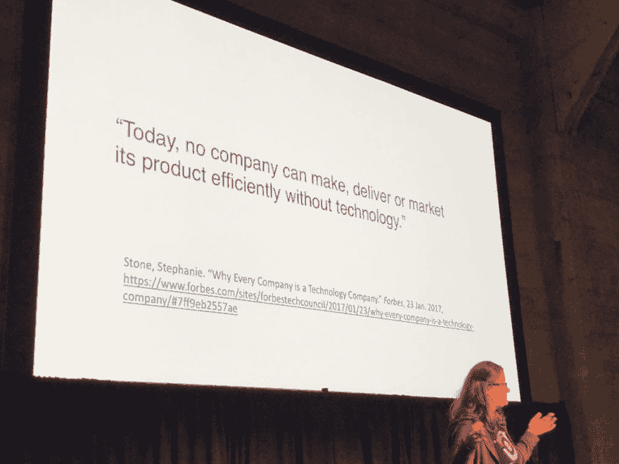](https://res.cloudinary.com/practicaldev/image/fetch/s--7RMx61Pi--/c_limit%2Cf_auto%2Cfl_progressive%2Cq_auto%2Cw_880/https://katzmax.files.wordpress.com/2019/06/devrelcon-ana-target2.jpg%3Fw%3D1024%26h%3D768) 

<figcaption id="caption-attachment-10532">【今天，没有一家公司能够制造、交付或销售其产品】</figcaption>

</figure>

### 激情……像磁铁一样，它可以吸引也可以排斥

[中原田茂](https://twitter.com/mewzherder)(织工)[巴鲁克·萨多古尔斯基](https://twitter.com/jbaruch) (JFrog)

这是我最喜欢的演讲之一。Tamao 和 Baruch 进行了一次角色扮演对话(这就是为什么我没有笔记), Tamao 是展厅的与会者(接收者), Baruch 是展位的工作人员(热情的人)。

在场景 1、2 和 3 中，他们展示了如何不表现。在场景 4 中，他们展示了与会者和展位工作人员之间互动的最佳实践。我强烈推荐在发表的时候观看这个演讲的视频。

[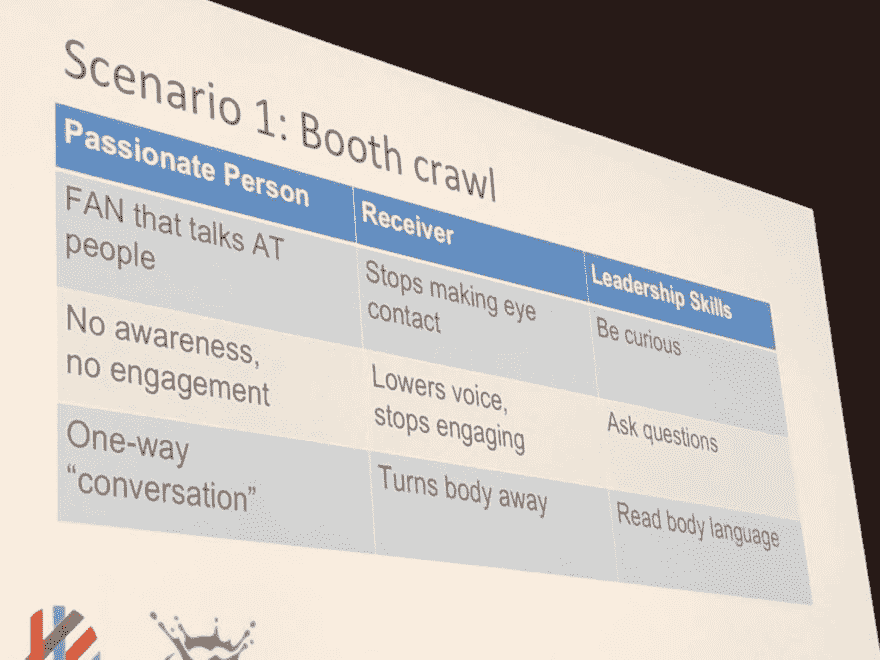](https://res.cloudinary.com/practicaldev/image/fetch/s--oYpm2HSJ--/c_limit%2Cf_auto%2Cfl_progressive%2Cq_auto%2Cw_880/https://katzmax.files.wordpress.com/2019/06/devrelcon-tamaoandbaruch1.jpg%3Fw%3D1024%26h%3D768)

[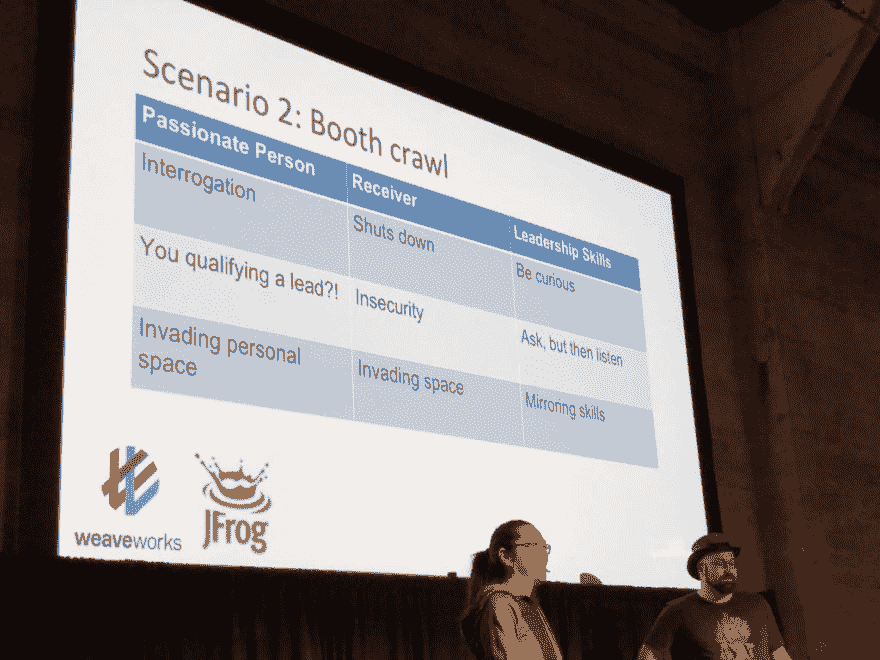](https://res.cloudinary.com/practicaldev/image/fetch/s--GDxBd7nK--/c_limit%2Cf_auto%2Cfl_progressive%2Cq_auto%2Cw_880/https://katzmax.files.wordpress.com/2019/06/devrelcon-tamaoandbaruch3.jpg%3Fw%3D1024%26h%3D768)

[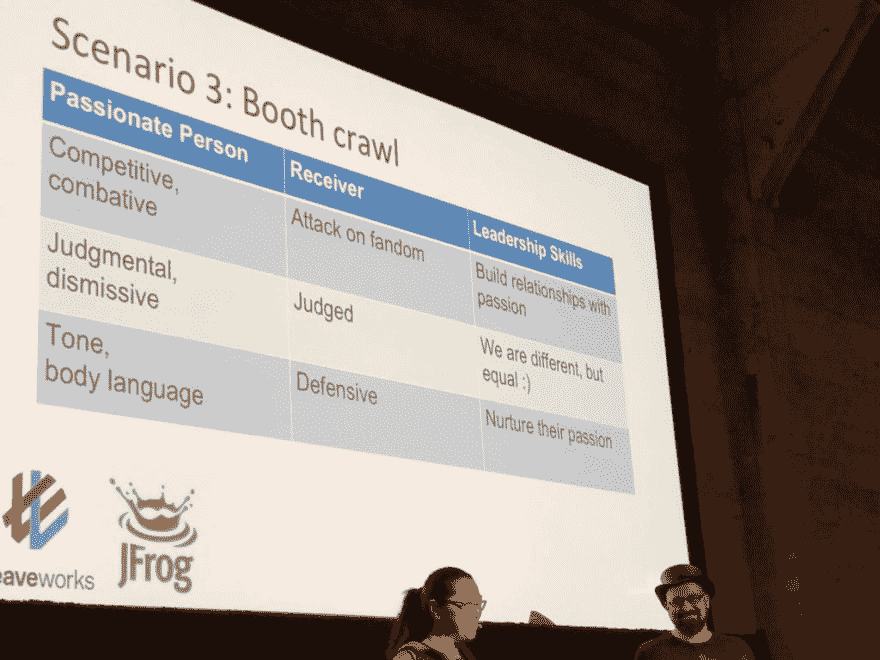](https://res.cloudinary.com/practicaldev/image/fetch/s--yx2kUJ5n--/c_limit%2Cf_auto%2Cfl_progressive%2Cq_auto%2Cw_880/https://katzmax.files.wordpress.com/2019/06/devrelcon-tamaoandbaruch4.jpg%3Fw%3D1024%26h%3D768)

### 打破“你好世界”的壁垒

泰勒·巴尼特(交通信号灯)

*   第一部《Hello World》写于 1978 年
*   我们已经使用这个程序几十年了
*   为什么“你好，世界”如此重要
    *   立即使用该软件
    *   激活–最重要的仪表之一
    *   早期胜利
    *   非常棒的感觉——初学者和高级开发者
    *   新手较少接触导师，更多自我怀疑
    *   帮助人们创造更好的 api 体验
    *   人们开始在内容中使用这样的词的障碍
    *   “仅此而已”
    *   “简单的步骤”
    *   "简单明了:"
    *   “简单”
    *   #1 过度简化
    *   故障类型
    *   移情失败
    *   新手心智衰竭
    *   损失的能量
    *   错误的文档
    *   开发者环境
        *   我不想花一整天来布置
    *   策略——我们如何解决这些问题？
    *   基础优先
        *   入门指南——不要过于复杂，学习如何做最简单的事情(Twilio)
        *   如何设置不同的代码编辑器(Spring framework)
    *   工作码
        *   用户真的想要更多的例子(Auth0)
        *   使其易于复制和粘贴
    *   常见错误库
        *   在包含更多信息的错误消息中包含 URL(Twilio)
        *   显示可能的解决方案
    *   更多用户测试
        *   同理心的途径
        *   让不太熟悉的人检查内容
        *   在开发人员所在的地方与他们见面
        *   想办法感受他们的痛苦
        *   基于这些困难推动变革

[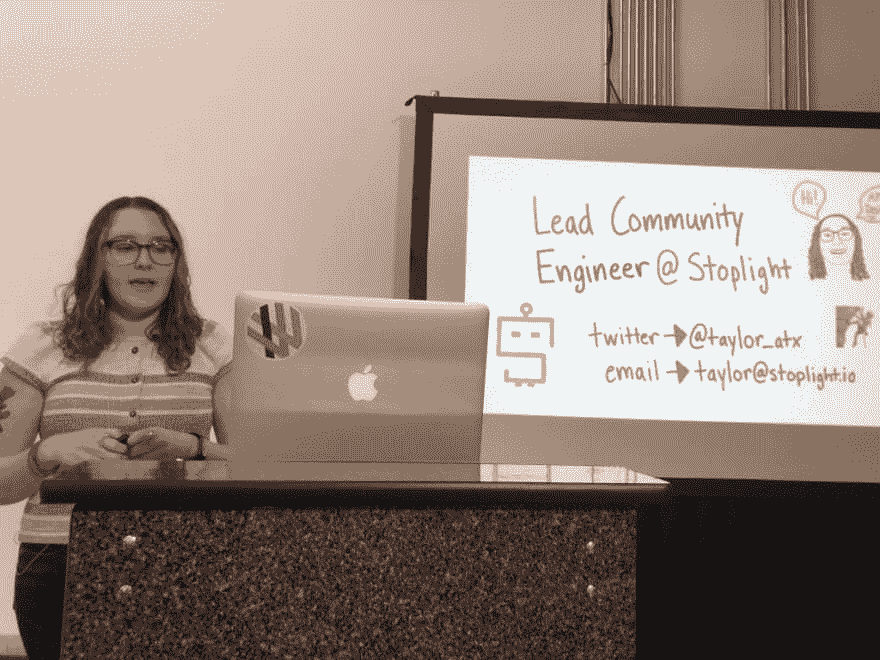](https://res.cloudinary.com/practicaldev/image/fetch/s--NkoE7-oL--/c_limit%2Cf_auto%2Cfl_progressive%2Cq_auto%2Cw_880/https://katzmax.files.wordpress.com/2019/06/devrelcon-taylor2.jpg%3Fw%3D1024%26h%3D768)

你可以在这里找到泰勒的幻灯片。

### Twilio 如何通过 TwilioQuest 提升开发人员培训

安德鲁·贝克

<figure>[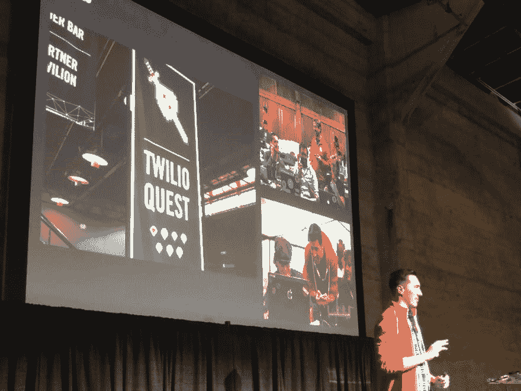](https://res.cloudinary.com/practicaldev/image/fetch/s--NaHrXyMC--/c_limit%2Cf_auto%2Cfl_progressive%2Cq_auto%2Cw_880/https://katzmax.files.wordpress.com/2019/06/devrelcon-twilioquest.jpg%3Fw%3D1024%26h%3D768) 

<figcaption id="caption-attachment-10543"></figcaption>

</figure>

*   培训计划之路(TwilioQuest)，始于 2013 年
*   传统培训
    *   酒店会议室
    *   遵循指示
    *   人们落后了
    *   太快或太慢
    *   自我指导和实践培训
*   TwilioQuest
    *   在线，基于游戏
    *   什么有效
    *   1200 名学生
    *   NPS 64
    *   入职体验
*   新(标准)Twilio 帐户创建与 TwilioQuest 帐户创建
    *   实现 10 次 api 调用的可能性增加 10%
    *   阈值–10 个 API 调用–然后上线
*   TwilioQuest starter pack 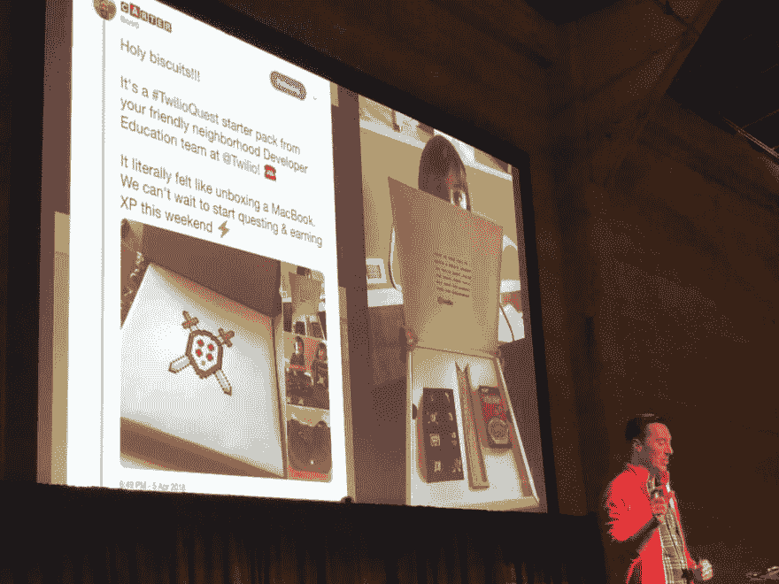
*   完成开始——买一件 t 恤
*   什么可以做得更好
    *   使用
    *   第二次练习时落下
    *   将 TwilioQuest 集成到 Twilio 的其他部分
    *   只有 1.6%的流量来自文档
*   游戏化和自我导向训练是有效的
*   TwilioQuest version 3
    *   可下载版本
    *   开发者会下载吗？
    *   电子游戏 UX 会限制我们的观众吗？
    *   一些开发者不喜欢游戏

### 从布道坛到开发者关系:作为一名拉比我如何为 DevRel 做准备

本·格林伯格

<figure>[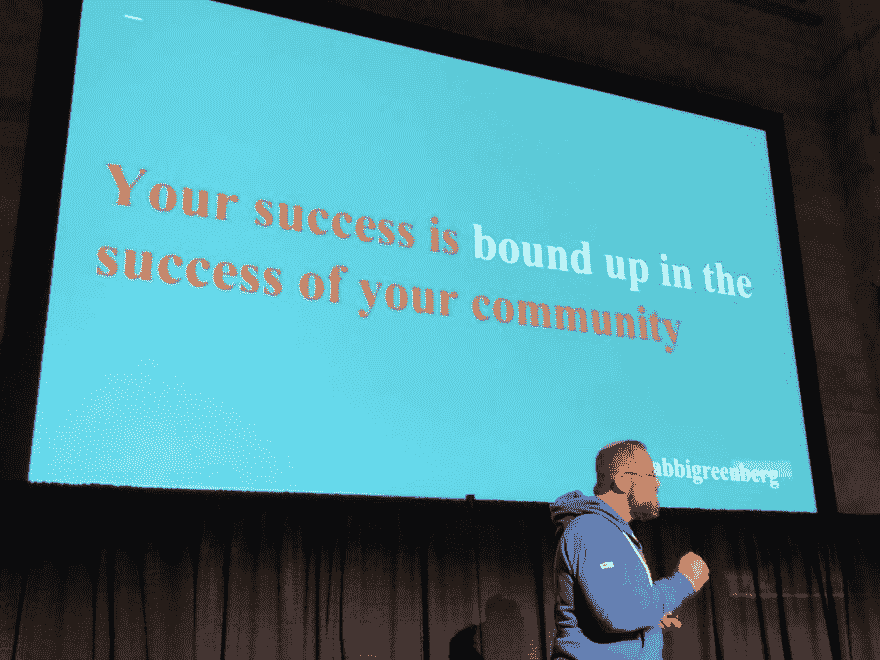](https://res.cloudinary.com/practicaldev/image/fetch/s--5X8ARrXD--/c_limit%2Cf_auto%2Cfl_progressive%2Cq_auto%2Cw_880/https://katzmax.files.wordpress.com/2019/06/devrelcon-ben2.jpg%3Fw%3D1024%26h%3D768) 

<figcaption id="caption-attachment-10546">【你的成功与你所在社区的成功息息相关】</figcaption>

</figure>

*   本的演讲以一个故事开始
    *   某人的爱人住院了，因为拉比(演讲者)没有去看望他们而感到沮丧。然而，这个家庭没有努力通知任何人他们所爱的人住院了，所以他们期待某种程度的超能直觉会出现
*   社区
    *   一群聚集在一起影响他们生活的人
*   “人们会忘记你说过的话，会忘记你做过的事，但人们永远不会忘记你让他们付出的方式。”——玛娅·安杰洛博士
*   服务型领导
    *   “服务型领导就是要明确目标，然后卷起袖子，尽一切努力帮助人们取得胜利。在那种情况下，他们不会为你工作；你为他们工作”——肯·布兰查德
*   教书！=说教
*   分享！=销售
*   你的成功与你所在社区的成功息息相关
*   技术问题并不总是由技术解决方案来解决

<figure>[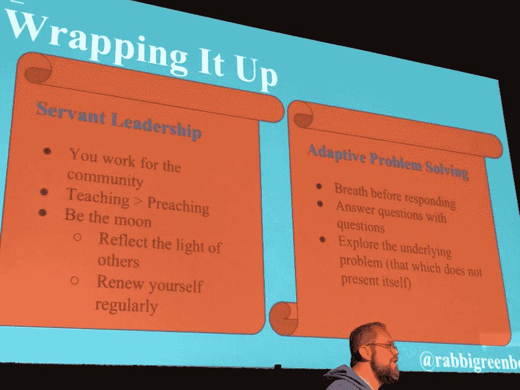](https://res.cloudinary.com/practicaldev/image/fetch/s--aeHU1QVY--/c_limit%2Cf_auto%2Cfl_progressive%2Cq_auto%2Cw_880/https://katzmax.files.wordpress.com/2019/06/devrelcon-ben1.jpg%3Fw%3D1024%26h%3D768) 

<figcaption id="caption-attachment-10545">仆人式领导&适应性问题解决</figcaption>

</figure>

### 演讲和讲故事，分组讨论

主持人[珍·赛布尔·洛佩兹](https://twitter.com/jennita)(外部系统)

> 感谢 [Peter Moskovits](https://twitter.com/pmoskovi) 分享他在本次会议中的笔记

*   你的个人故事往往很无聊。你的专业故事也经常很无聊。两者结合；这让它变得独特，特别，令人兴奋。
*   演示工具:
    *   [http://gitpitch](https://gitpitch.com/)
    *   [http://slides.com](http://slides.com)
    *   trello/索引卡，用于移动物品
*   与观众一起进行情感(而非智力)之旅
*   考虑在曲线上讲一个故事
    *   快乐的音符——负面/有争议的部分——又是快乐的音符
*   开始你的演讲，不要说嗨，介绍，生物，无聊的东西。抓住观众的注意力，震撼他们。演示开始 2-3 分钟；曲线回到介绍，背景；为什么是你在讲话
*   女性通常认为，她们必须首先建立自己的可信度来吸引观众的注意力——性别偏见
*   空幻灯片很有力量——观众会注意到你(PowerPoint:按“B”代表黑色)
*   当观众在看幻灯片时，他们听不到你在说什么
*   实践
    *   过渡至关重要；把他们练死；这就是你失去(或打动)人们的地方
    *   拍摄/记录自己
    *   最后一张幻灯片:展示你的 3 个要点+你的联系信息；邀请与会者拍张照片

DevRelCon SF 2019 是一场真正令人惊叹的社区大会。感谢[马修·勒维尔](https://twitter.com/matthewrevell)、[中原田茂](https://twitter.com/mewzherder)和[尼莱·延尔](https://twitter.com/nlycskn)组织此次活动。

作为这篇博文的结尾，这里有一张参加会议的 [IBM 开发者拥护者](http://develper.ibm.com)的图片(但不是所有人):

液体错误:内部