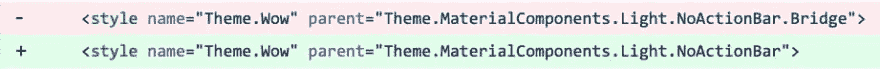
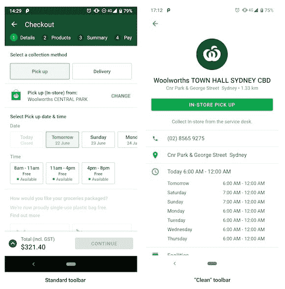
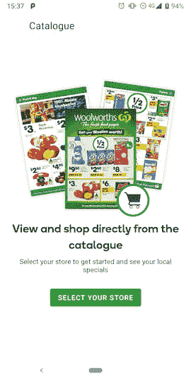

# 可调工具栏内容

> 原文：<https://dev.to/zmdominguez/tintable-toolbar-things-19b6>

几周前，我合并了一个 pull 请求，将我们应用程序的主题从 Bridge 版本更新为 Material Components [。](https://material.io/develop/android/docs/getting-started/)

> 扎拉多明格斯🦉@ zarahjutz我的团队正在砸它。💪06:26AM-03 Jun 2019[](https://twitter.com/intent/tweet?in_reply_to=1135432513688465408)[](https://twitter.com/intent/retweet?tweet_id=1135432513688465408)0[](https://twitter.com/intent/like?tweet_id=1135432513688465408)16

在这次练习中，我一直在大量引用 [MDC 目录](https://github.com/material-components/material-components-android/tree/master/catalog)应用程序；我认为这将是一个好主意，我们如何组织和应用基于该应用程序的主题和样式。(嘿，他们一定知道自己在做什么，对吧？)

我们的应用程序中有两种工具栏——第一种是标准原色，另一种是“干净”的。

[](///assets/tintables/toolbar_types.jpg)

当我们最初设置我们的主题时，我们制作了这个主题覆盖图(在这里阅读[关于主题覆盖图](https://medium.com/androiddevelopers/theming-with-appcompat-1a292b754b35))来设计我们的工具栏，并给它一个绿色箭头:

```
<style name="ThemeOverlay.Toolbar.Inverse" parent="ThemeOverlay.AppCompat.Light">
    <item name="colorControlNormal">?colorAccent</item>
    <item name="android:background">@color/white</item>
</style> 
```

然后我们在工具栏中将其设置为`android:theme` :

```
<androidx.appcompat.widget.Toolbar 
    ...
    android:theme="@style/ThemeOverlay.Toolbar.Inverse" /> 
```

MDC 目录应用使用 ***风格*** 而不是 ***主题*** ，所以我着手复制[他们的手法](https://github.com/material-components/material-components-android/blob/master/catalog/java/io/material/catalog/application/theme/res/values/styles.xml#L19)。(附注:安妮塔·辛格有一个关于风格、主题和材料设计的精彩演讲

我们马上会遇到一个问题:在基于主题的方法中，我们可以在主题覆盖图中设置`colorControlNormal`属性，但是在基于样式的方法中，我们不能再这样做了。

不过，我们确实想要绿箭，我们可以查看 MDC 源代码来获得一些线索。从我们想要成为的[父母风格](https://github.com/material-components/material-components-android/blob/8f622283d18466620a280f6f6bbb32fafb157efd/lib/java/com/google/android/material/appbar/res/values/styles.xml#L65) :
开始总是个好主意

```
<style name="Widget.MaterialComponents.Toolbar.Surface">
    <item name="android:background">?attr/colorSurface</item>
    <item name="titleTextColor">?attr/colorOnSurfaceEmphasisHighType</item>
    <item name="subtitleTextColor">?attr/colorOnSurfaceEmphasisMedium</item>
    <!-- Note: this theme overlay will only work if the style is applied directly to a Toolbar. -->
    <item name="android:theme">@style/ThemeOverlay.MaterialComponents.Toolbar.Surface</item>
</style> 
```

🤔有趣的是，我们应该完全记住这一点。

瞥一眼[引用的主题覆盖图](https://github.com/material-components/material-components-android/blob/8f622283d18466620a280f6f6bbb32fafb157efd/lib/java/com/google/android/material/appbar/res/values/styles.xml#L78)，我们看到了我们想要的属性🎉:

```
<style name="ThemeOverlay.MaterialComponents.Toolbar.Surface" parent="">
    <item name="colorControlNormal">?attr/colorOnSurfaceEmphasisMedium</item>
    <item name="actionMenuTextColor">?attr/colorOnSurfaceEmphasisMedium</item>
  </style> 
```

为了适应我们的代码，我们现在有:

```
<style name="Widget.Toolbar.Inverse" parent="Widget.MaterialComponents.Toolbar.Surface">
    <item name="android:background">@color/white</item>
    <item name="android:theme">@style/ThemeOverlay.ToolbarTint</item>
</style>

<style name="ThemeOverlay.ToolbarTint" parent="ThemeOverlay.MaterialComponents.Toolbar.Surface">
    <item name="colorControlNormal">?colorSecondary</item>
</style> 
```

并将其应用于我们的工具栏(记住现在是 ***风格*** ！):

```
 <androidx.appcompat.widget.Toolbar
    ...
    style="@style/Widget.Toolbar.Inverse"
    app:navigationIcon="?homeAsUpIndicator" /> 
```

这真的很好，直到…

[](///assets/tintables/no_x.png)
T4】

<center><small>The close button is now invisible 😱</small></center>

这个屏幕和其他屏幕的唯一区别是我们为导航图标提供了一个可绘制的向量:

```
<androidx.appcompat.widget.Toolbar
    ...
    style="@style/Widget.Toolbar.Inverse"
    app:navigationContentDescription="@string/close"
    app:navigationIcon="@drawable/ic_close" /> 
```

所以它应该能让 T2 工作，对吗？MDC 目录有一个[风格的关闭按钮](https://github.com/material-components/material-components-android/blob/2de39fafe0285aab7e6e101549c4bc93f184a7e5/catalog/java/io/material/catalog/application/theme/res/values/styles.xml#L21)像我们一样，他们使用的向量也有一个`fillColor`硬编码在里面(我甚至试图使他们的填充颜色为红色😂)，但它总是正确地着色。

我总是发现主题化和样式化真的很难调试，所以我放弃了一段时间，承认了我的失败。第二天，我决定把自己的时间框定为几个小时——如果到那时我还不明白，我就坚持以前的方式。我重新阅读了所有的博客帖子，重新审查了源代码，并给了 StackOverflow 另一次机会。

在[的一次随机评论交流中](https://stackoverflow.com/questions/28219178/toolbar-icon-tinting-on-android#comment76399857_38650854):

> 用有什么区别？attr/colorControlNormal at Android:tint vs Android:fill color 属性？谢谢！–Thomas Vos 2017 年 6 月 20 日 15:46 @ superthomasblab 该示例来自 Chris Banes 的博客，其中阐释了用着色矢量替换着色图像。请注意，fillColor 实际上是在源图像中硬编码的。我不知道 AppCompat 现在是否支持其他颜色表示。乔·鲍比尔 2017 年 6 月 22 日 20:06

果然，我们的 vector 里面没有定义`android:tint`！🤦‍♀️把它加入到我们的向量中，使一切都完美地工作👌

```
<vector xmlns:android="http://schemas.android.com/apk/res/android"
    android:width="24dp"
    android:height="24dp"
    android:viewportWidth="24"
    android:viewportHeight="24"
    android:tint="?colorControlNormal">
  <path
      android:fillColor="#FFFFFFFF"
      android:pathData="M19,6.41L17.59,5 12,10.59 6.41,5 5,6.41 10.59,12 5,17.59 6.41,19 12,13.41 17.59,19 19,17.59 13.41,12z"/>
</vector> 
```

我知道对一些人来说这可能是显而易见的(*当然*你需要染发来染东西，嗯？？？)，但对我来说不是超级明显。

所以，TL；DR:在尝试着色之前，确保你的矢量*实际上*支持着色。🌈