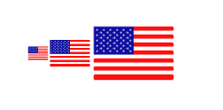
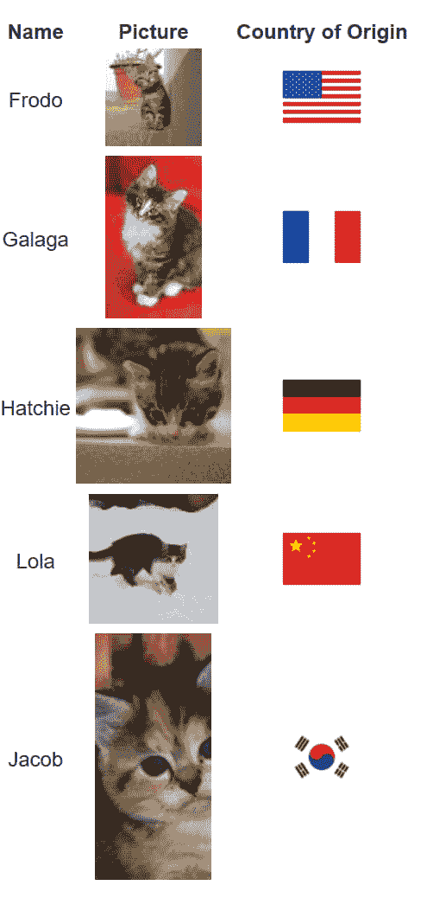

# Vue 部件 FTW-vue-国家/地区-国旗

> 原文：<https://dev.to/raymondcamden/vue-components-ftw-vue-country-flag-4pe1>

抱歉，伙计们——我已经很久没有做这些“Vue 组件”评论了。我能说什么呢，生活就是这样！也就是说，我希望这些条目能引起人们的兴趣。你可以在[标签](https://www.raymondcamden.com/tags/vue+components+ftw/)页面浏览旧的，并给我发送你想让我评论的建议。今天的例子太简单了，我几乎忽略了对它的回顾，但是我遇到了一个有趣的问题，它让我觉得这是值得我(和你)花时间去做的。

首先，今天条目中讨论的组件是 [vue-country-flag](https://github.com/P3trur0/vue-country-flag) 。

[](https://res.cloudinary.com/practicaldev/image/fetch/s--0CGwj3nt--/c_limit%2Cf_auto%2Cfl_progressive%2Cq_auto%2Cw_880/https://raw.githubusercontent.com/P3trur0/vue-country-flag/master/assets/logo.png)

可以想象，这个组件将呈现一个国家的国旗。像这样:

```
<vue-country-flag country="cn" /> 
```

<svg width="20px" height="20px" viewBox="0 0 24 24" class="highlight-action crayons-icon highlight-action--fullscreen-on"><title>Enter fullscreen mode</title></svg> <svg width="20px" height="20px" viewBox="0 0 24 24" class="highlight-action crayons-icon highlight-action--fullscreen-off"><title>Exit fullscreen mode</title></svg>

仅此而已。哦，它也支持尺寸，从`small`到`normal`到`big`。但是很简单。然而，在代码沙箱中进行演示时，我遇到了一个有趣的问题。虽然组件加载得很好，并且控制台中没有报告任何错误，但旗帜图标就是不呈现。

我突发奇想，导出了这个项目。代码沙盒使这变得容易，并发送给你一个 zip 文件。解压文件夹后，不要忘记运行`npm i`。只有白痴才会这么做。我做到了。无论如何，当我在我的本地机器上运行演示时，组件工作正常。

我的猜测是代码沙箱有问题，但由于这可能是组件的问题，为了安全起见，我[提交了一个问题](https://github.com/P3trur0/vue-country-flag/issues/11)。

也就是说，我的收获是……如果你遇到这样的奇怪问题，只要试着在本地运行它，看看是否有帮助。

好吧，那旗子看起来怎么样？我从这个演示开始:

```
<vue-country-flag country='us' size='small'/>  
<vue-country-flag country='us' size='normal'/>  
<vue-country-flag country='us' size='big'/> 
```

<svg width="20px" height="20px" viewBox="0 0 24 24" class="highlight-action crayons-icon highlight-action--fullscreen-on"><title>Enter fullscreen mode</title></svg> <svg width="20px" height="20px" viewBox="0 0 24 24" class="highlight-action crayons-icon highlight-action--fullscreen-off"><title>Exit fullscreen mode</title></svg>

这是它是如何呈现的:

[](https://res.cloudinary.com/practicaldev/image/fetch/s--H-1qsGjl--/c_limit%2Cf_auto%2Cfl_progressive%2Cq_auto%2Cw_880/https://static.raymondcamden.cimg/2019/06/flags.png)

好吧，不是特别令人兴奋。为了让它更真实一点，我创建了一些 JSON 数据来表示猫的列表:

```
[
  {
    "name": "Frodo",
    "picture": "https://placekitten.com/75/75",
    "country": "US"
  },
  {
    "name": "Galaga",
    "picture": "https://placekitten.com/75/125",
    "country": "FR"
  },
  {
    "name": "Hatchie",
    "picture": "https://placekitten.com/120/120",
    "country": "DE"
  },
  {
    "name": "Lola",
    "picture": "https://placekitten.com/100/100",
    "country": "CN"
  },
  {
    "name": "Jacob",
    "picture": "https://placekitten.com/90/190",
    "country": "KR"
  }
] 
```

<svg width="20px" height="20px" viewBox="0 0 24 24" class="highlight-action crayons-icon highlight-action--fullscreen-on"><title>Enter fullscreen mode</title></svg> <svg width="20px" height="20px" viewBox="0 0 24 24" class="highlight-action crayons-icon highlight-action--fullscreen-off"><title>Exit fullscreen mode</title></svg>

我在 jsonbin.io 上托管了这个，这是一个托管 JSON 数据的免费服务。这是一个很酷的服务，但请注意，如果你写了一些代码，并决定在你写完第一件事后登录，你会在登录后丢失这些数据。哎呀。无论如何，这里有一个显示点击 API 和渲染结果的更新组件:

```
<template>
  <div>

    <table>
      <thead>
        <tr>
          <th>Name</th>
          <th>Picture</th>
          <th>Country of Origin</th>
        </tr>
      </thead>
      <tbody>
        <tr v-for="cat in cats" :key="cat.picture">
          <td></td>
          <td></td>
          <td>
            <vue-country-flag :country="cat.country" size="big" />
          </td>
        </tr>
      </tbody>
    </table>

  </div>
</template>

<script>
export default {
  name: "HelloWorld",
  data() {
    return {
      cats:[]
    }
  },
  created() {
    fetch('https://api.jsonbin.io/b/5d0cf06ca664f3148ebc78ff/2')
    .then(res => res.json())
    .then(res => {
      this.cats = res;
    });
  }
};
</script> 
```

<svg width="20px" height="20px" viewBox="0 0 24 24" class="highlight-action crayons-icon highlight-action--fullscreen-on"><title>Enter fullscreen mode</title></svg> <svg width="20px" height="20px" viewBox="0 0 24 24" class="highlight-action crayons-icon highlight-action--fullscreen-off"><title>Exit fullscreen mode</title></svg>

基本上——遍历每个 cat 并呈现值，但是将`country`值传递给组件。结果是:

[](https://res.cloudinary.com/practicaldev/image/fetch/s--ycYdBVAX--/c_limit%2Cf_auto%2Cfl_progressive%2Cq_auto%2Cw_880/https://static.raymondcamden.cimg/2019/06/flags2.png)

仅此而已。同样，如果你觉得这些有用，如果你有建议或任何其他反馈，请告诉我！

*标题图片由[利亚姆·德西奇](https://unsplash.com/@liamdesic?utm_source=unsplash&utm_medium=referral&utm_content=creditCopyText)在 Unsplash 上拍摄*