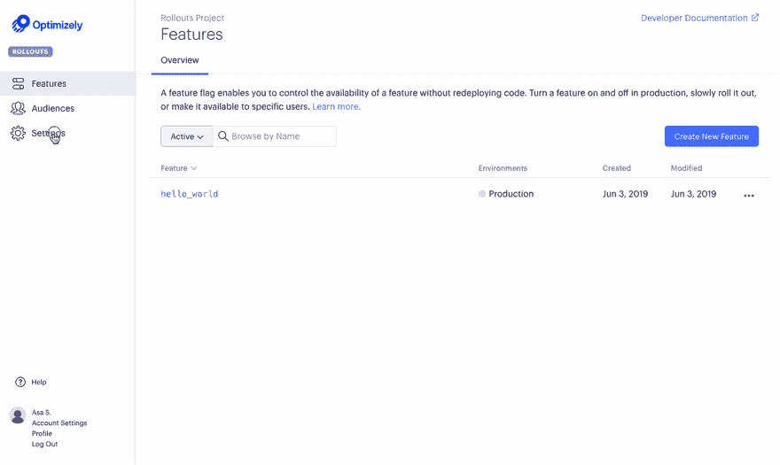

# Feature flags in React

> 原文：[https://dev.to/asaschachar/feature-flags-in-react-19fd](https://dev.to/asaschachar/feature-flags-in-react-19fd)

Feature flags allow you to slowly rollout a feature gradually rather than doing a risky big bang launch and are extremely helpful when used in a continuous integration and continuous delivery environment.

At Optimizely, we commonly use feature flags to reduce the risk of complicated deploys like rebuilding UI dashboards.

However, building a feature flagging system is usually not your company’s core competency and can be a distraction from other development efforts.

I’m Asa, Optimizely’s Developer Advocate. In this 8 step blog post, I’ll show how to get the value of powerful feature flags by rolling out a feature customer-by-customer in React using Optimizely Rollouts: a completely free product.

Note: If you don’t have a ReactJS application, we recommend creating one with [create-react-app](https://facebook.github.io/create-react-app/docs/getting-started)

## 1\. Setup the Feature Flag Interface

Create a free Optimizely Rollouts account [here](https://www.optimizely.com/rollouts-signup/?utm_source=devto&utm_campaign=react-flags).

In the Rollouts interface, navigate to ‘Features > Create New Feature’ and create a feature flag called ‘hello_world’.

[](https://res.cloudinary.com/practicaldev/image/fetch/s--2eC5NPBa--/c_limit%2Cf_auto%2Cfl_progressive%2Cq_66%2Cw_880/https://cdn-images-1.medium.com/max/2514/0%2AXJUOgDpef6PkWV03.gif)

To connect your ‘hello_world’ feature to your application, find your SDK Key. Navigate to ‘Settings > Datafile’ and copy the SDK Key value.

[](https://res.cloudinary.com/practicaldev/image/fetch/s--pgi_HW0W--/c_limit%2Cf_auto%2Cfl_progressive%2Cq_66%2Cw_880/https://cdn-images-1.medium.com/max/2514/0%2Ape4b3r1cnrojWq1a.gif)

## 2\. Install the Optimizely Rollouts React SDK

The React SDK allows you to setup feature toggles from within your codebase using JavaScript.

Using npm:

```
npm install --save @optimizely/react-sdk 
```

or using yarn:

```
yarn add @optimizely/react-sdk 
```

Use the SDK by wrapping your main React App component in the OptimizelyProvider component and replace with the SDK key you found above.