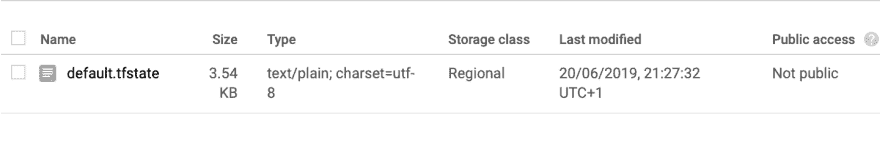
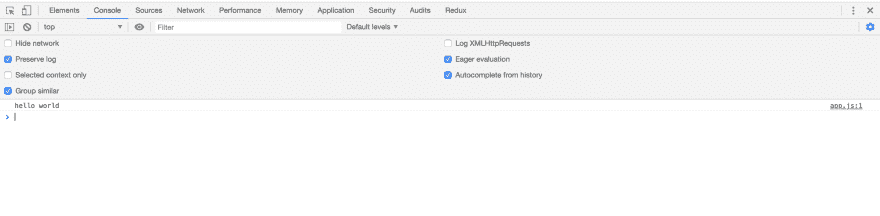
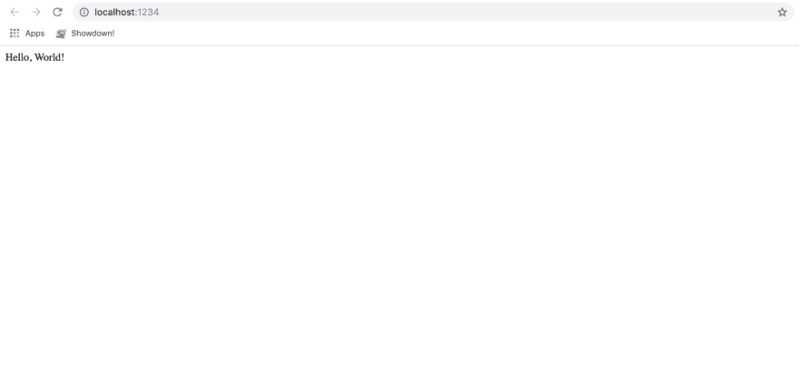

# 熟悉的第三天 JavaScript 的复仇

> 原文：<https://dev.to/nickblow/familiar-day-3-2ala>

对于新手来说，我在写博客的同时也在制作我的新桌面角色扮演助手。

## 我们在哪里？

我设定了一些目标。我创建了一些地形配置和谷歌云账户。我部署了一个什么都不做的计算引擎实例。

## 我们今天在做什么？

我们将创建一些存储—我们将建立一个 [Terraform 后端](https://www.terraform.io/docs/backends/)。这些都很棒，原因有几个，避免了本地配置，避免了在磁盘上存储敏感值(或者意外地将它们提交给 Git😱)并允许多人协作。它需要一个 Google 云存储桶来工作，所以我们将使用 CLI 来创建它——我们也可以使用 terraform 来设置它，但我们不想在拆除资源时意外破坏它。

然后，我们希望开始一些编码，并创建一个实际返回响应的服务器。我可能会部署它，所以让我们看看。

我们必须使用我们之前安装的 Google Cloud SDK 附带的`gsutil`工具来创建云存储。你可以在这里找到跟随[的指示。](https://cloud.google.com/storage/docs/creating-buckets#storage-create-bucket-gsutil)

**⚠️Warning:您可以在美国 only⚠️地区获得免费的地区存储空间**。

我们要运行的代码是:
`gsutil mb -p [PROJECT_ID] -c regional -l [REGION] -b on gs://[BUCKET_NAME]/`

-b 表示仅桶策略，阅读文档似乎意味着您不能修改单个对象的访问控制列表，因为我们的 Terraform 后端将包含敏感数据，这似乎是我们所追求的-我们可以锁定桶。

现在，您可以看到已经在[控制台](https://console.cloud.google.com/storage/browser)中创建了铲斗。

现在，我将更新我的 terraform 配置，将这个 bucket 设置为后端。我将把这几行添加到我上次设置的 variables.tf 文件中。

```
variable "backend_bucket_name" {
  type = string
  default = "MY_BUCKET_NAME"
} 
```

我还没有决定是否要提交这个文件，因为它包含项目和存储桶名称。我可能会写一个快速脚本，稍后为用户交互设置它。

让我们将后端添加到 main.tf 文件

```
terraform {
  backend "gcs" {
    bucket  = var.backend_bucket_name
    prefix  = "terraform/state"
    credentials = var.service_account_location

  }
} 
```

注意:语法高亮显示不起作用，因为它们改变了 Terraform 0.12 中表达式的工作方式。它编译正确，我保证！

所以我们需要做的就是运行`terraform init`。或者是——哎呀，我得到了这个错误:

```
Initializing the backend...

Error: Variables not allowed

  on main.tf line 10, in terraform:
  10:     bucket  = var.backend_bucket_name

Variables may not be used here. 
```

啊啊。我想保持 terraform 文件的通用性。也许这需要是另一件事，我有一个脚本自动生成的人谁想要自己部署！我将我的项目 id 和 bucket 名称保密，不受版本控制。

我将它添加到另一个文件 backend.tf 中，在那里我添加了我的配置，看起来有点像这个

```
terraform {
  backend "gcs" {
    bucket  = "MY_BUCKET"
    prefix  = "terraform/state"
    credentials = "~/.gcp/terraform-sa.json"
  }
} 
```

Terraform init 现在给了我很有希望的

```
Do you want to copy existing state to the new backend?
  Pre-existing state was found while migrating the previous "local" backend to the
  newly configured "gcs" backend. No existing state was found in the newly
  configured "gcs" backend. Do you want to copy this state to the new "gcs"
  backend? Enter "yes" to copy and "no" to start with an empty state. 
```

我说是的，因为为什么不，重新运行`terraform plan`，瞧

```
No changes. Infrastructure is up-to-date.

This means that Terraform did not detect any differences between your
configuration and real physical resources that exist. As a result, no
actions need to be performed. 
```

完美！我们所有的状态现在都存储在谷歌云中。我拿掉了我的本地。tfstate 并再次运行`terraform plan`进行检查。一切都好。

在谷歌云控制台上查看:
[](https://res.cloudinary.com/practicaldev/image/fetch/s--jNwUXZnH--/c_limit%2Cf_auto%2Cfl_progressive%2Cq_auto%2Cw_880/https://thepracticaldev.s3.amazonaws.com/i/ofvn3x160yvj19wt9w9s.png)

太棒了。

##### 关于我为什么从 Terraform 开始的一个说明

我知道这有点无聊，但我打算继续下去。我不想创造任何我无法复制的基础设施。即使有了这篇博客，我也不想回头去想我做了什么来部署 X 位软件。将基础设施作为一切的代码也是一个好的实践，并且允许您的基础设施以可审计的方式进行版本控制和更改。

### 现在怎么办？

好吧，我可以建立更多的资源(也许是云 Firestore)，但我真的不知道我现在需要什么。让我们开始写一些代码，让事情在本地工作，然后计算出我们需要什么。

我在 [GitHub](https://github.com/NickBlow/familiar) 上建立了一个我计划中的功能列表，下面为后人复制。他们可能会改变。

*   实时聊天
*   实时共享虚拟桌面(VTT)
*   可插入规则引擎
*   在游戏新闻和战役日志中
*   带有可编程宏的字符表
*   推送通知
*   可定制的随机生成器。自动集成到其他组件 TBD。
*   地图构建工具(TBD)
*   使用计算机视觉导入统计块(TBD)
*   开发人员 API (TBD)

其中一些显然比其他的更有抱负，但在高层次上，我对我想要建立的东西有一个很好的愿景。

如果我想做真正的[精益](http://theleanstartup.com/principles)的事情，这是我的一个爱好，我会专注于建立最小可能的价值单位，尽快让用户知道，完善我的想法并迭代。我仍然会做得稍微精简一些，但我为自己构建了很多，这意味着*我是*用户。所以在某种程度上，如果我认为它好，它*就是*好。如果其他人喜欢，那太好了。

看一下这些特征，有几个东西是突出的。从工程的角度来看，实时方面很有趣，因为我目前正在开发一个 Go 库，它能够通过 HTTP/2 服务器发送事件传输来处理 GraphQL 订阅。我可能会单独开源它，然后在这个项目中使用它。

虚拟桌面将是一项巨大的事业，所以我们将把它留到以后。这同样适用于一些更具投机性的特性(我标记为 TBD 的特性)。

另一件有趣的事情是游戏新闻和战役日志。我认为这是一个伪博客平台，但有激光和龙。它本身也感觉是最完整的“产品”。有一百万个聊天应用，规则引擎和角色表很酷，但需要虚拟桌面来完成。

### 有些问题

首先，我将使用 [LitElement](https://lit-element.polymer-project.org/) 。所有主流浏览器都支持影子 DOM，它很快，建立在本地 web 功能(即 WebComponents)之上。我会认真考虑的另一个选项是 React，但我将赌注押在 WebComponents 上。与[聚合物库](https://polymer-library.polymer-project.org/)不同，LitElement 感觉与普通 HTML5 和普通 Javascript 的互操作性更强，后者通常感觉有一种“聚合物”的做事方式。

然而，并非所有的文学作品都是玫瑰(尽管，反应也是如此)。这很大程度上与 ShadowDOM 在各种浏览器中的一些错误实现有关，这些标准还没有完全准备好。它在 JSDOM 中也不起作用，这使得测试有点痛苦。另一个问题是缺少服务器端渲染。有一个[库](https://github.com/popeindustries/lit-html-server)为 [LitHTML](https://github.com/Polymer/lit-html) 进行服务器端渲染，这是支撑 LitElement 的渲染库。

这*会*导致 CDNing 的问题(假设我们可以便宜地获得它，毕竟免费是目标之一！)，但是像再水化内容这样的事情并不简单，我们可以很好地缓存所有的 javascript。也真的很快。

#### 最糟糕的一期

显然，我们需要一个文本编辑器为我们的运动日志功能。

最大的问题是影子 DOM 中的 [getSelectionAPI](https://developer.mozilla.org/en-US/docs/Web/API/DocumentOrShadowRoot/getSelection) 。跨浏览器支持很差，[在 Safari](https://bugs.webkit.org/show_bug.cgi?id=163921) 中根本不工作。有一个新的 api getComposedRange，在我写这篇文章的时候，[还没有完成](http://pbtynpj.com/github_/w3c/webcomponents/issues/79)。显然，做出选择是文本编辑器的一个非常重要的特性，所以大多数文本编辑器不能开箱即用。有一个[聚合填充](https://github.com/GoogleChromeLabs/shadow-selection-polyfill)的工作方式并不完全相同，使用[选择](https://developer.mozilla.org/en-US/docs/Web/API/Selection)对象的许多功能的现代编辑器也失败了，因为它只聚合填充选择对象的一部分。

我在 [QuillJS](https://quilljs.com/) 中见过这个 polyfill，它是 [Vaadin 富文本编辑器](https://github.com/vaadin/vaadin-rich-text-editor)组件的一部分，但是它们实现的具体细节被缩小了，因此很混乱，所以我不知道让它工作起来会有多复杂。另一个选择是将它作为一个[槽](https://developer.mozilla.org/en-US/docs/Web/Web_Components/Using_templates_and_slots)传递到我们的 WebComponents 中，这意味着它将被呈现为元素的 light DOM。然而，它确实需要从顶层一路向下传递。我们也可以在`iframe`中呈现它，但是这有它自己的问题。

此外，我们可以混合使用各种技术，只使用 HTML/CSS(可能通过 LitHTML)来呈现营销活动构建器页面，甚至是 React。这意味着我们必须非常小心我们的 CSS，但我们将控制整个应用程序，我们不需要做一个完全隔离的文本编辑器。首先，我们将尝试`slot`方法，如果那不起作用，那么我们可以重新考虑这个决定。

### 我们来写点代码吧。

我已经说够了。我将创建一个“hello world”Lit 元素页面，让它进行渲染，然后就到此为止。

我已经初始化了一个 npm 包，并运行`npm install lit-element --save`。我们不需要 web 组件 polyfill，因为我们不支持旧的 Edge(如果你在 Edge 上，请使用基于 Chromium 的 [Edge Insider](https://www.microsoftedgeinsider.com/en-us/) )。

我们将尝试 [ParcelJS](https://parceljs.org) ，但我们可能稍后不得不切换到 webpack。我在`package.json`中创建了一个‘frontend:dev’脚本`parcel frontend/index.html`，现在我在前端文件夹中创建了 index.html(当我决定如何服务它时，我可能不得不改变它)。最终我可能会在项目中有多个`package.json`文件，也许会用 [LernaJS](https://github.com/lerna/lerna) 来管理它，但是让我们看看它变得有多笨拙。

index.html 的内容

```
<html>
<body>
  <script src="./js/app.js"></script>
</body>
</html> 
```

而在 app.js 中暂时

```
console.log('hello world') 
```

我将通过运行`npm run frontend:dev`来快速检查包裹工程

[](https://res.cloudinary.com/practicaldev/image/fetch/s--U7kxqsKg--/c_limit%2Cf_auto%2Cfl_progressive%2Cq_auto%2Cw_880/https://thepracticaldev.s3.amazonaws.com/i/6kgknozfs4snyimp6u6d.png)

太棒了。不过这很简单。它能运行我们的 WebComponent 吗？我将从 [LitElement](https://lit-element.polymer-project.org/) 主页中抓取示例。它有一些奇特的东西，比如 Javascript 装饰器和标记模板文字。我们稍后会将其切换到 TypeScript。

```
import { LitElement, html, property, customElement } from 'lit-element';

@customElement('simple-greeting')
export class SimpleGreeting extends LitElement {
  @property() name = 'World';

  render() {
    return html`<p>Hello, ${this.name}!</p>`;
  }
} 
```

这个例子有几个方面。它使用 LitElement 作为基本组件，在某种程度上扩展了基本 HTMLElement，使其成为 WebComponent。它使用 decorators 来定义一个属性(可以在元素上获取和设置的东西)，并定义元素标记名(`simple-greeting`)。render 函数使用了带标签的模板文字，因此字符串模板将被传递给 LitElement `html`函数。render 函数本身处理对 DOM 的最小更改，并在属性(在本例中是`name`)改变时进行更新。

将它复制粘贴到 VSCode 中已经给了我们一个错误，说我们需要在 jsconfig 或 tsconfig 中启用它。让我们暂时忽略它，看看 parcel 是否能处理它。

我们需要更新 index.html，以包括我们的自定义标签来测试它。

```
<html>
<body>
    <simple-greeting><simple-greeting/>
  <script src="./js/app.js"></script>
</body>
</html> 
```

运行前端:重新构建不起作用:

```
 Server running at http://localhost:1234 
🚨  /Users/nickblow/Personal/familiar/frontend/js/app.js:3:0: Support for the experimental syntax 'decorators-legacy' isn't currently enabled (3:1): 
```

哦亲爱的。让我们添加一个 [tsconfig](https://www.typescriptlang.org/docs/handbook/tsconfig-json.html) ，看看是否能修复它。最坏的情况是我们会转移到 WebPack。

### 🕒🕒🕒30 分钟后🕒🕒🕒

这提醒了我为什么又讨厌 Javascript 生态系统。我最终改变了如此多的配置，我还不如一直使用 WebPack，所以这将是下一个任务。我遇到了[这个](https://github.com/parcel-bundler/parcel/issues/839)问题，唯一的解决方法是将`last 1 Chrome versions`添加到我的`browserslistrc`(用于[浏览列表](https://www.npmjs.com/package/browserslist))。太可怕了。稍后我会用 WebPack 解决这个问题。我们想保留 ES6，但是我们也想支持更多的浏览器。Open WC 有一大堆好的建议、例子和缺省值，我们会用到。

此外，我还补充了一点(很多都是反复试验，我需要清理一下):

tsconfig.json

```
{  "compilerOptions":  {  "module":  "es6",  "noImplicitAny":  true,  "removeComments":  true,  "preserveConstEnums":  true,  "allowJs":  true,  "allowSyntheticDefaultImports":  true,  "sourceMap":  true,  "moduleResolution":  "node",  "target":  "es2015",  "experimentalDecorators":  true,  },  "include":  [  "frontend/**/*"  ],  "exclude":  [  "node_modules",  "**/*.spec.ts"  ]  } 
```

我试着安装了各种 babel 插件和预置，但我们将在以后的 WebPack 中使用它们。这一期也有一些有用的信息。

另一方面:
[](https://res.cloudinary.com/practicaldev/image/fetch/s--d6n9uNBW--/c_limit%2Cf_auto%2Cfl_progressive%2Cq_auto%2Cw_880/https://thepracticaldev.s3.amazonaws.com/i/wrn93565vcpw90owd116.png)

我们有一个正在运行的 web 组件。

### 下次

我将配置 WebPack，希望我们能得到一些真正的 JS 和 CSS！