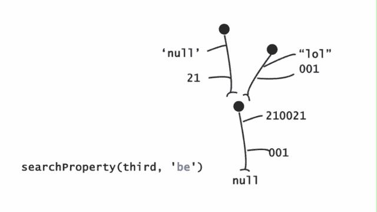

# 让我们在 JS 中构建原型继承

> 原文：<https://dev.to/varche/let-s-build-prototypal-inheritance-in-js-56mm>

这篇文章的想法很简单。我想在某种程度上建立并以此说明 Javascript 中的原型是如何工作的。

我们必须发表声明。每个对象都必须有一个属性，我们称之为 **delegator** ，它指向:

1.  另一个物体，或者
2.  指向空

现在，让我们快速定义搜索属性算法，不要担心，它很简单。

我们在某个初始对象中搜索一个属性。如果找不到任何内容，并且委托者是一个对象，则在该委托者对象中执行相同的属性搜索。如果委托者属性指向 null，则返回类似于“*什么也没找到*”的一般性错误。

```
var first = {
 a: 221,
 delegator: null
}
var second = {
 b: ‘stringy property’,
 delegator: null
} 
```

我创建了两个对象，它们有一些个人属性，还有一个共同的属性名。**委托人**一个。而目前来看，两者都指向 null。通过这样做，我们满足了我们的第一个条件/语句，那就是每个对象都必须有一个**委托人**属性。目前为止很好。现在，我们需要关注搜索属性算法。

为了在对象中查找属性，我们可以使用`for`循环。

```
for( property in first ){
 if(property === 'a'){
   console.log('I found it') // `I found it`
   return
  } // else there is nothing found
} 
```

如果您不知道这是在做什么，它会在名为`first`的对象中查找属性`a`的属性。在继续之前，我必须在函数中重构这段代码，因为我将在程序中多次使用它(希望如此)。我们有两个变量:对象的名称( *obj* )和属性的名称( *property_name* )，所以这两个变量将是我在函数中的参数。

```
function searchProperty(obj, property_name) {
  for( property in obj ){
    if(property === property_name){
      console.log('I found it')
      return
    } // else there is nothing found
  }
}
searchProperty(first, 'a') // 'I found it' 
```

到目前为止，我们有一个只在一个对象中执行搜索的函数，但是我们已经在算法中说过，我们需要在对象的**委托人**上递归地执行这个搜索，直到我们找到属性**或**我们碰到一个指向 null 的**委托人**。

```
function searchProperty(obj, property_name) {
 if(obj === null) {
   console.log('We have reached the end of chain. Nothing found.')
    return
  }
  for( property in obj ){
    if(property === property_name){
      console.log('I found it')
      return
    }
  }
  searchProperty(obj.delegator, property_name)
}

searchProperty(first, 'a') // 'I found it' 
```

在第一行中，我们已经处理了委托者指向 null 的情况。我们返回的只是一个写着`We have reached the end of chain. Nothing found.`的日志，然后我们退出这个函数。我们已经无能为力了，所以我们回来了。

在`for`循环之后，如果在起始对象中没有找到任何属性，我将使用相同的`property_name`参数再次调用那个搜索函数，但是使用不同的对象开始搜索。

通过这样做，我们在代理对象上搜索属性，直到我们找到指向 null 的代理，或者我们实际上获得了我们正在搜索的属性。

* * *

在这一小段中，我想探索和测试我们上面的函数，并尝试遍历代码，猜测结果会是什么。

示例 1

```
var first = {
 a: 221,
 delegator: null
}
var second = {
 b: 'stringy property',
 delegator: null
}
 ...
searchProperty(second, 'a') 
```

在这里，我们在`second`对象中搜索属性`a`，由于它不在该对象本身中(对于循环),我们调用`searchProperty(second.delegator, ‘a’)`。正如您所看到的，这里的`delegator`属性指向 null，因此返回“链结束”错误。

[](https://res.cloudinary.com/practicaldev/image/fetch/s--vthb0cas--/c_limit%2Cf_auto%2Cfl_progressive%2Cq_66%2Cw_880/https://cdn-images-1.medium.com/max/1600/1%2A_DVmgrEOTH06ZTGZA3AAvQ.gif)

我正在画有头、身体和底部的物体。在主体上，有指向一些值的手来模仿*键-值*对。因此，我们正在为`second`对象中的`a`执行值解析函数，因为没有找到它，所以调用第二个函数，作为参数，我们正在解析**委托者**属性。它指向一个空值，并打印出“*错误*”。

示例 2

```
var first = {
 a: 221,
 delegator: null
}
var second = {
 b: 'stringy property',
 delegator: first
}
 ...
searchProperty(second, 'a') 
```

在这里，我开始在`second`对象中搜索`a`属性。我没有在那里找到它，所以我调用`searchProperty(second.delegator, 'a')`，这将导致`searchProperty(first, 'a')`，在`first`对象中执行搜索，寻找`a`属性。果然，在那里找到了。

示例 3

```
var first = {
 be: 210021,
 ce: 001,
 __delegator__ : null
}

var second = {
 ey: "lol",
 some: 001,
 __delegator__ : first
}

var third = {
 prop: 'null',
 tup: 21,
 __delegator__ : first
}

searchProperty(third, 'be') // I found it 
```

快速明显的注意。我已经把**委托人**键名改成了**_ _ 委托人 __** ，因为用户可能会选择这个名称，而我们的对象或空值将会被用户更改。一定要在函数体里改:`searchProperty(obj. __delegator__ , property_name).`

[](https://res.cloudinary.com/practicaldev/image/fetch/s--vLRD_oNy--/c_limit%2Cf_auto%2Cfl_progressive%2Cq_66%2Cw_880/https://cdn-images-1.medium.com/max/1600/1%2AZeO-GLYoCkX0h59lWOL6ig.gif)

关于动画的快速说明。每个物体都会坐在它的 **__delegator__** 上，而不是从身体指向它。这样做的原因是系统的有组织的视图。

在这种情况下，`second`和`third`对象都有一个**委托人**对象`first`。两个人都坐在`first`物体上，他坐在 null 上面。搜索开始于`third`对象，由于没有找到，新的搜索开始于找到属性`be`的`first`对象。当我们调用这个函数时，会得到相同的结果:

```
searchProperty(second, 'be') // I found it 
```

搜索从`second`对象开始，没有找到属性，已经对其**委托人**执行了搜索，在那里找到了属性。

最终，对象不会继承任何东西。只是对其他物体的搜索还在继续。

* * *

根据这个帖子的接收情况，我将对此进行跟进。在演示授权的核心机制的同时，我想花更多的时间来讨论与此相关的话题。到目前为止，我已经准备了两篇关于这个话题的文章，并有了再写一篇的想法。