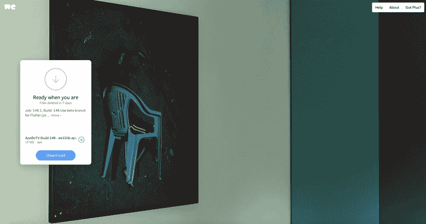
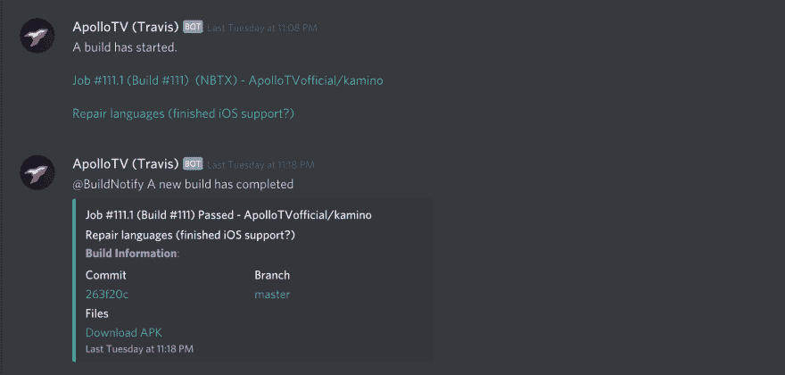

# 使用 Travis-CI 自动构建您的 Flutter 应用程序 APKs

> 原文：<https://dev.to/samjakob/automatically-build-your-flutter-app-apks-with-travis-ci-4ha0>

这篇文章是从我的博客导入的[。请通过评论这篇文章让我知道是否有任何问题(由于缺少字符导致的链接中断或语法错误)。](https://blog.samjakob.com/automatically-build-your-flutter-apps-with-travis-ci-4c1e47a5ae69)

* * *

当试图设置 [Travis-CI](https://travis-ci.com/) 时，我看到了不少关于用 Travis 运行颤振测试的文章，但没有一篇是关于实际构建和**获得**我们想要的编译过的 APK 的。

每当更改被推送到 GitHub 存储库时，Travis 会自动生成一个新版本，并在 [WeTransfer](https://wetransfer.com/) 上发布一个到 APK 的链接，供支持者和 beta 测试人员在 Discord 频道上发表评论。

在这篇文章中，我将评论我们是如何实现这个工作流程的，并给出一些一般性的建议。

## 第一步:创建 Travis 配置

首先创建以下目录结构。如果您计划向您的项目添加额外的构建脚本，您只需要包含`.travis/`目录(也在根目录中)。

```
your_project_root/
    - .travis.yml
    - .travis/
        - utils/ 
```

<svg width="20px" height="20px" viewBox="0 0 24 24" class="highlight-action crayons-icon highlight-action--fullscreen-on"><title>Enter fullscreen mode</title></svg> <svg width="20px" height="20px" viewBox="0 0 24 24" class="highlight-action crayons-icon highlight-action--fullscreen-off"><title>Exit fullscreen mode</title></svg>

在您的`.travis.yml`中，您需要添加一些基本的样板配置:*我没有将语言设置为 Android，因为它似乎没有正确设置 SDK，另外使用 node 作为语言允许我们轻松地设置额外的构建脚本。*T3】

```
os: linux

# The Ubuntu Trusty release on Travis is known to
# have oraclejdk8 available. For some reason, we couldn't
# get this to work with other distributions/releases.
dist: trusty
jdk: oraclejdk8

# We set language to Node.js (JavaScript) for the sake
# of making creating utility scripts later on easier.
language: node_js
node_js:
  - "12"

env:
  global:
    - ANDROID_SDK_ROOT=/opt/android

sudo: required

addons:
  apt:
    # Flutter depends on /usr/lib/x86_64-linux-gnu/libstdc++.so.6 version GLIBCXX_3.4.18
    sources:
      - ubuntu-toolchain-r-test # if we don't specify this, the libstdc++6 we get is the wrong version
    packages:
      - lib32stdc++6 # https://github.com/flutter/flutter/issues/6207
      - libstdc++6
      - curl

cache:
  directories:
    - $HOME/.pub-cache
    - node_modules 
```

<svg width="20px" height="20px" viewBox="0 0 24 24" class="highlight-action crayons-icon highlight-action--fullscreen-on"><title>Enter fullscreen mode</title></svg> <svg width="20px" height="20px" viewBox="0 0 24 24" class="highlight-action crayons-icon highlight-action--fullscreen-off"><title>Exit fullscreen mode</title></svg>

接下来，我们需要设置初始的`before_script`阶段。这将执行命令来设置 Gradle，Android SDK 和 Flutter。

```
before_script:
  # Setup gradle.
  - wget https://services.gradle.org/distributions/gradle-4.10.3-bin.zip
  - unzip -qq gradle-4.10.3-bin.zip
  - export GRADLE_HOME=`pwd`/gradle-4.10.3
  - export PATH=$GRADLE_HOME/bin:$PATH

  # (Quick fix: Silence sdkmanager warning)
  - mkdir -p /home/travis/.android
  - echo 'count=0' > /home/travis/.android/repositories.cfg

  # Download and setup Android SDK tools.
  - wget https://dl.google.com/android/repository/sdk-tools-linux-4333796.zip
  - mkdir android-sdk-tools
  - unzip -qq sdk-tools-linux-4333796.zip -d android-sdk-tools
  - export PATH=`pwd`/android-sdk-tools/tools/bin:$PATH
  - mkdir -p $ANDROID_SDK_ROOT

  # This will install the Android SDK 28 using the previously installed SDK tools.
  - yes | sdkmanager --sdk_root=$ANDROID_SDK_ROOT "tools" "build-tools;28.0.3" "extras;android;m2repository" > /dev/null
  - export PATH=${ANDROID_SDK_ROOT}/tools/bin:$PATH

  # List sdkmanager packages
  # (useful when checking the logs)
  - sdkmanager --list

  # Clone Flutter
  # We clone the Flutter beta branch. You should clone whatever branch
  # you know works for building production apps.
  # If in doubt, you are advised to use the stable branch of Flutter
  # for production apps and you would do this by changing -b beta to -b stable
  # but we started the project before stable existed and whilst beta has always
  # worked reasonably well for us and we find stable is usually too outdated
  # and has too many missing framework features.
  - git clone https://github.com/flutter/flutter.git -b beta --depth 1

  # Add Flutter to the PATH environment variable.
  - export PATH=`pwd`/flutter/bin:`pwd`/flutter/bin/cache/dart-sdk/bin:$PATH 
```

<svg width="20px" height="20px" viewBox="0 0 24 24" class="highlight-action crayons-icon highlight-action--fullscreen-on"><title>Enter fullscreen mode</title></svg> <svg width="20px" height="20px" viewBox="0 0 24 24" class="highlight-action crayons-icon highlight-action--fullscreen-off"><title>Exit fullscreen mode</title></svg>

最后，为了让我们的基本配置工作，我们当然必须实际执行`flutter build`。这就是我们在`script`阶段所做的。

```
script:
  # Prints the flutter version
  # (allows you to ensure, for each build, that Flutter is set up correctly.)
  - flutter doctor -v

  # Run Flutter build
  - ./flutter/bin/flutter build apk 
```

<svg width="20px" height="20px" viewBox="0 0 24 24" class="highlight-action crayons-icon highlight-action--fullscreen-on"><title>Enter fullscreen mode</title></svg> <svg width="20px" height="20px" viewBox="0 0 24 24" class="highlight-action crayons-icon highlight-action--fullscreen-off"><title>Exit fullscreen mode</title></svg>

## 步骤 2:将完成的构建上传到 WeTransfer

[](https://res.cloudinary.com/practicaldev/image/fetch/s--JDXj-qrj--/c_limit%2Cf_auto%2Cfl_progressive%2Cq_auto%2Cw_880/https://cdn.hashnode.com/res/hashnode/image/upload/v1628740457513/iVceJnS1f.png)

显然，使用 Travis 构建编译后的 APK 的一个关键部分是能够获得编译后的 APK。为此我们使用了 [WeTransfer](https://wetransfer.com/) ，这是一个设计良好的免费(临时)文件共享服务，带有 API 正是我们需要的。

注册一个 [WeTransfer 公共 API](https://developers.wetransfer.com/)(developers.wetransfer.com)的账户，在**我的应用**下，点击创建新应用。输入您的应用程序详细信息并复制 API 密钥。

**为您的键创建一个环境变量。**转到存储库的 Travis 页面，点击更多选项；在下拉菜单中选择 Settings，在 environment variables 下添加一个名为`WT_API_KEY`的新环境变量，并粘贴您之前复制的密钥。*不要**不要**启用在日志文件中显示值的选项，这会将你的 WeTransfer API 密钥暴露给任何查看你的构建日志的人。*

```
after_success:
  # Export commit info
  - export AUTHOR_NAME=`git log -1 "$TRAVIS_COMMIT" --pretty="%aN"`
  - export COMMITTER_NAME=`git log -1 "$TRAVIS_COMMIT" --pretty="%cN"`
  - export COMMIT_SUBJECT=`git log -1 "$TRAVIS_COMMIT" --pretty="%s"`
  - export COMMIT_MESSAGE=`git log -1 "$TRAVIS_COMMIT" --pretty="%b"`
  # Upload to WeTransfer
  - npm install --save @wetransfer/js-sdk
  - export BUILD_OUTPUT_URL=`node ./.travis/utils/runUpload.js` 
```

<svg width="20px" height="20px" viewBox="0 0 24 24" class="highlight-action crayons-icon highlight-action--fullscreen-on"><title>Enter fullscreen mode</title></svg> <svg width="20px" height="20px" viewBox="0 0 24 24" class="highlight-action crayons-icon highlight-action--fullscreen-off"><title>Exit fullscreen mode</title></svg>

为了给文件一个清晰的名字，我们从 git 中提取有用的提交信息(注意；使用 Travis 提交引用。)

> `*$TRAVIS_COMMIT` *是一个自动环境变量，由 Travis 在构建开始时导出。它指的是 Travis 当前正在构建的 git 提交散列。

然后，我们使用`npm`安装 WeTransfer SDK，并调用我们自己的脚本:

```
const APPLICATION_NAME = "ApolloTV";

const fs = require('fs');
const createWTClient = require('@wetransfer/js-sdk');

const commit = process.env.TRAVIS_COMMIT.substring(0, 6);
const jobName = process.env.TRAVIS_JOB_NUMBER;
const buildName = process.env.TRAVIS_BUILD_NUMBER;
const title = process.env.COMMIT_SUBJECT;
const author = process.env.AUTHOR_NAME;
const message = `Job: ${jobName}, Build: ${buildName}\n\n${title} (${author})`;

(async function(){
  const wtClient = await createWTClient(process.env.WT_API_KEY, {
    logger: {
      level: 'error'
    }
  });

  const appBinaryContent = await new Promise((resolve, reject) => {
    fs.readFile(
      './build/app/outputs/apk/release/app-release.apk',
      (error, data) => {
        if(error) return reject(error);
        resolve(data);
      }
    );
  });

  const transfer = await wtClient.transfer.create({
    message: message,

    files: [
      {
        name: `${APPLICATION_NAME} Build ${buildName} - ${commit}.apk`,
        size: appBinaryContent.length,
        content: appBinaryContent,
      }
    ]
  });

  // This is required; this is so you can obtain the URL in your Travis/bash scripts.
  console.log(transfer.url);
})(); 
```

<svg width="20px" height="20px" viewBox="0 0 24 24" class="highlight-action crayons-icon highlight-action--fullscreen-on"><title>Enter fullscreen mode</title></svg> <svg width="20px" height="20px" viewBox="0 0 24 24" class="highlight-action crayons-icon highlight-action--fullscreen-off"><title>Exit fullscreen mode</title></svg>

如您所见，它只是将文件上传到 Flutter 构建输出目录并打印 URL，从那里您就可以开始编译 APK 了。

如果你想就此打住，你可以点击 APK 的 URL，然后你就可以下载构建了。

## 步骤 3:执行预构建和后构建 web-hooks

[](https://res.cloudinary.com/practicaldev/image/fetch/s--3fKBTLrv--/c_limit%2Cf_auto%2Cfl_progressive%2Cq_auto%2Cw_880/https://cdn.hashnode.com/res/hashnode/image/upload/v1628740459500/K-Rm5aCiN.png) 
*我们有网络挂钩，当构建开始或结束时，它会向我们的 Discord 服务器中的通道发送消息。*

我们发现当一个新的构建开始和完成时得到提醒是非常有用的，但是我们也希望让我们的支持者能够在他们被推送到 GitHub 时立即访问到前沿的构建，并且我们可以使用我们的 web-hooks 通知支持者新的构建何时开始以及何时完成并可供下载。

```
before_install:
  # Execute Travis prebuild webhook.
  - ./.travis/10_prebuild.sh $WEBHOOK_URL

after_success:
  # Execute success procedure of postbuild webhook script.
  - ./.travis/40_postbuild.sh success $WEBHOOK_URL $BUILD_OUTPUT_URL

after_failure:
  # Execute failure procedure of postbuild webhook script.
  - ./.travis/40_postbuild.sh failure $WEBHOOK_URL 
```

<svg width="20px" height="20px" viewBox="0 0 24 24" class="highlight-action crayons-icon highlight-action--fullscreen-on"><title>Enter fullscreen mode</title></svg> <svg width="20px" height="20px" viewBox="0 0 24 24" class="highlight-action crayons-icon highlight-action--fullscreen-off"><title>Exit fullscreen mode</title></svg>

> 你可能已经注意到了，我们已经给每个构建脚本赋予了数字前缀。这是因为在我们的完整配置中，我们有更多的脚本来准备我们的应用程序构建。这包括将配置注入到应用程序源代码中，并检查翻译。 *你可以在 [Kamino GitHub 库上查看我们的实际构建配置。](https://github.com/ApolloTVofficial/kamino/blob/master/.travis.yml)*

在 Discord 中，单击 cog 编辑频道，然后单击 Webhooks。选择创建 Webhook，给它一个名称，如 Travis Build，复制 URL，然后单击保存。

在 Travis 中，为您的 web-hook URL 创建一个环境变量(有关如何操作的说明，请参见步骤 2)。同样，*不要**不要**启用日志文件中的显示值，这将允许任何人用 web-hook 发送消息到你的不和谐频道。*

最后，您需要创建`prebuild`和`postbuild`脚本；这些文件应该放在项目根目录下的`.travis`文件夹中(你在步骤 1 中创建的):

```
#!/bin/bash
TIMESTAMP=$(date -u +%FT%TZ)

AUTHOR_NAME="$(git log -1 "$TRAVIS_COMMIT" --pretty="%aN")"
COMMITTER_NAME="$(git log -1 "$TRAVIS_COMMIT" --pretty="%cN")"
COMMIT_SUBJECT="$(git log -1 "$TRAVIS_COMMIT" --pretty="%s")"
COMMIT_MESSAGE="$(git log -1 "$TRAVIS_COMMIT" --pretty="%b")"

WEBHOOK_DATA='{
    "username": "ApolloTV (Travis)",
    "content": "A build has started.\n\n[Job #'"$TRAVIS_JOB_NUMBER"' (Build #'"$TRAVIS_BUILD_NUMBER"') '"$STATUS_MESSAGE"' ('"$AUTHOR_NAME"') - '"$TRAVIS_REPO_SLUG"'\n\n'"$COMMIT_SUBJECT"']('"$TRAVIS_BUILD_WEB_URL"')"
}'

(curl --fail --progress-bar -H Content-Type:application/json -d "$WEBHOOK_DATA" "$1" \
&& echo -e "\\n[Webhook]: Successfully sent the webhook.") || echo -e "\\n[Webhook]: Unable to send webhook." 
```

<svg width="20px" height="20px" viewBox="0 0 24 24" class="highlight-action crayons-icon highlight-action--fullscreen-on"><title>Enter fullscreen mode</title></svg> <svg width="20px" height="20px" viewBox="0 0 24 24" class="highlight-action crayons-icon highlight-action--fullscreen-off"><title>Exit fullscreen mode</title></svg>

```
#!/bin/bash
STATUS="$1"

TIMESTAMP=$(date -u +%FT%TZ)

if ["$STATUS" = "success"]; then EMBED_COLOR=3066993
    STATUS_MESSAGE="Passed"
elif ["$STATUS" = "failure"]; then EMBED_COLOR=15158332
    STATUS_MESSAGE="Failed"
fi WEBHOOK_DATA='{
  "username": "ApolloTV (Travis)",
  "content": "@BuildNotify A new build has completed",
  "embeds": [ {
    "color": '$EMBED_COLOR',
    "author": {
      "name": "Job #'"$TRAVIS_JOB_NUMBER"' (Build #'"$TRAVIS_BUILD_NUMBER"') '"$STATUS_MESSAGE"' - '"$TRAVIS_REPO_SLUG"'",
      "url": "'"$TRAVIS_BUILD_WEB_URL"'"
    },
    "title": "'"$COMMIT_SUBJECT"'",
    "url": "'"$URL"'",
    "description": " **Build Information** : '"${COMMIT_MESSAGE//$'\n'/ }"\\n\\n"$CREDITS"'",
    "fields": [
      {
        "name": "Commit",
        "value": "'"[${TRAVIS_COMMIT:0:7}](https://github.com/$TRAVIS_REPO_SLUG/commit/$TRAVIS_COMMIT)"'",
        "inline": true
      },
      {
        "name": "Branch",
        "value": "'"[$TRAVIS_BRANCH](https://github.com/$TRAVIS_REPO_SLUG/tree/$TRAVIS_BRANCH)"'",
        "inline": true
      },
      {
        "name": "Files",
        "value": "'"[Download APK]($BUILD_OUTPUT_URL)"'"
      }
    ],
    "timestamp": "'"$TIMESTAMP"'"
  } ]
}'

(curl --fail --progress-bar -H Content-Type:application/json -d "$WEBHOOK_DATA" "$2" \
&& echo -e "\\n[Webhook]: Successfully sent the webhook.") || echo -e "\\n[Webhook]: Unable to send webhook." 
```

<svg width="20px" height="20px" viewBox="0 0 24 24" class="highlight-action crayons-icon highlight-action--fullscreen-on"><title>Enter fullscreen mode</title></svg> <svg width="20px" height="20px" viewBox="0 0 24 24" class="highlight-action crayons-icon highlight-action--fullscreen-off"><title>Exit fullscreen mode</title></svg>

您可以随意使用和定制这些脚本。