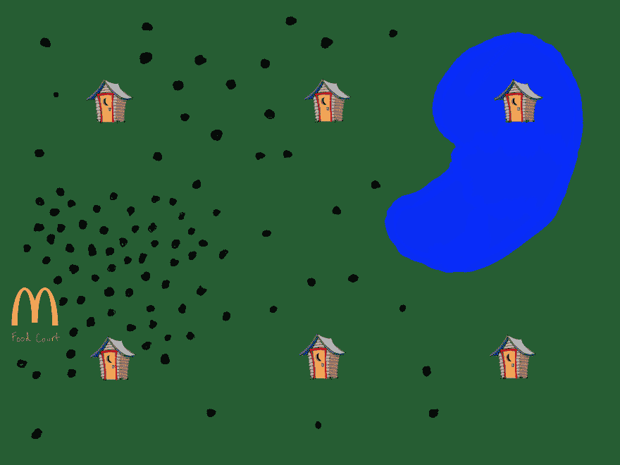
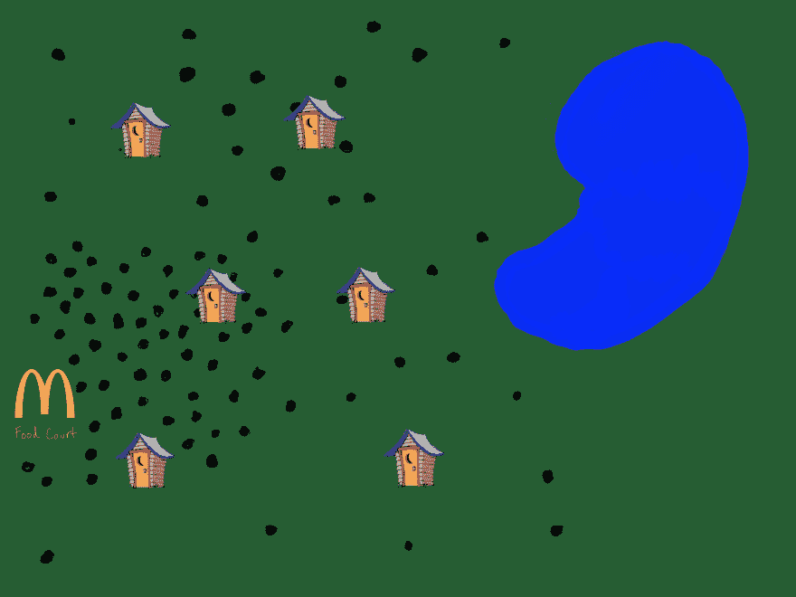
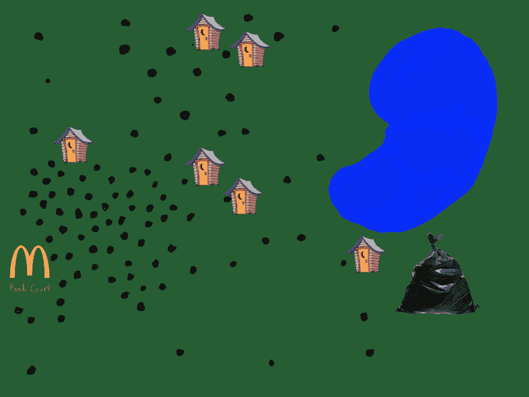
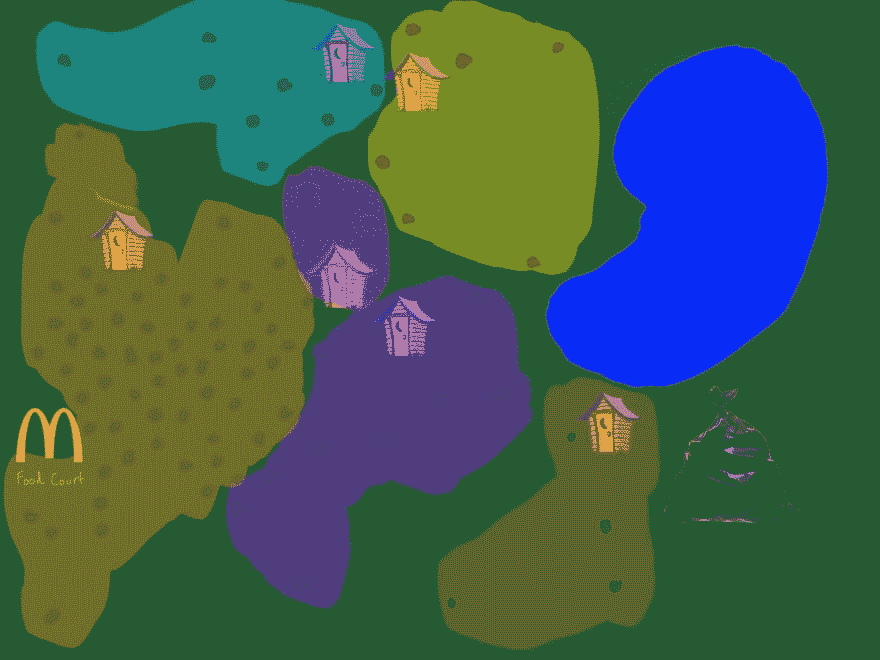
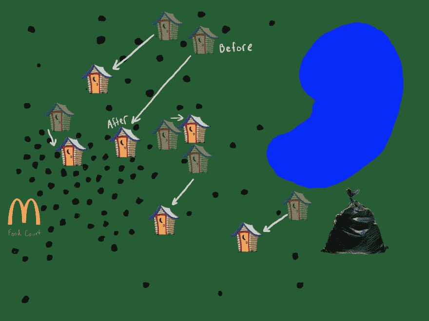
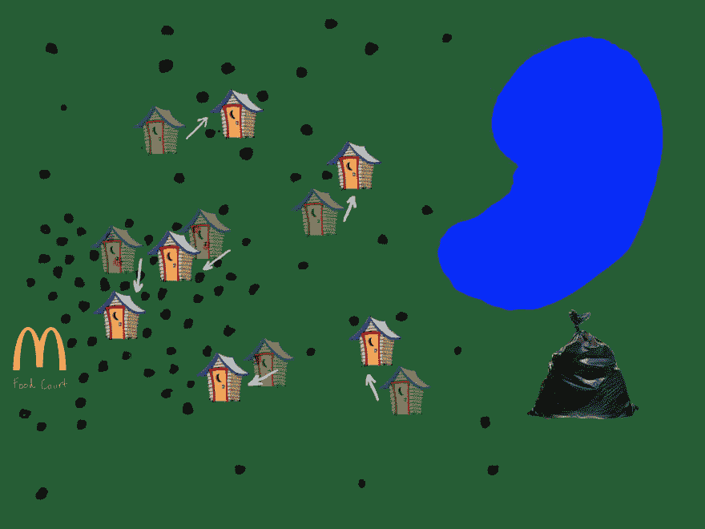
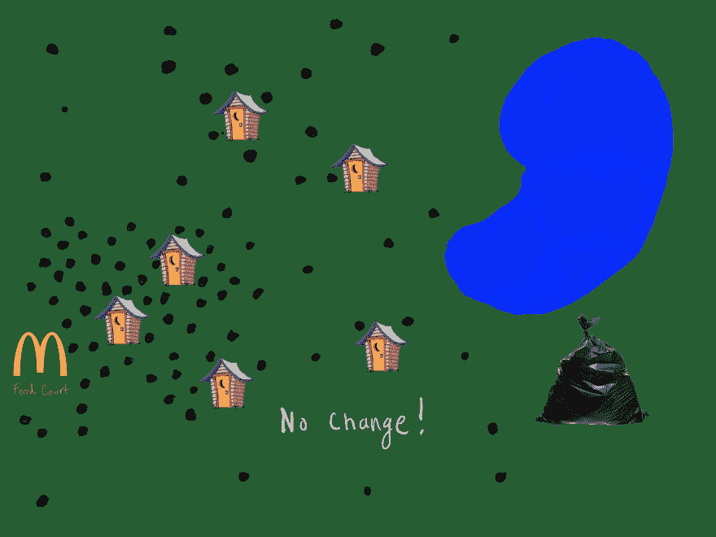

# 简单的机器学习，K 均值聚类介绍

> 原文：<https://dev.to/taillogs/ml-engineering-series-1-intro-to-k-means-clustering-4cjh>

这将是一系列教程中的第一篇，涵盖了统计分析和机器学习中的一些基本主题。

# K-均值和聚类

### 基本问题与聚类

你建了一个主题公园(顺便恭喜)。公园已经开放了，但是你不知何故在公园的设计中省略了洗手间(你为什么这么做)。事情越来越...脏乱。

你知道你需要尽快建造大量的浴室。问题来了，你只能买得起 6 个卫生间。你的顾问告诉你等距离放置浴室，这样整个公园的分布是均匀的。起初，这似乎是最好的解决方案，但随后你注意到计划中的一个致命缺陷(弥补了洗手间的失败)。虽然浴室是等距的，但这不是一个实际的分布。浴室的位置应该能够反映出公园里人们的分布情况。顾问建议 method 只在美食街设置一个卫生间(你已经被报告给卫生部门了，你不能再承受另一次事故)。

黑点是人，你是抽象的。

你意识到有一个更好的方法来布置浴室。你的主题公园的主要投资者是脸书。拿他们钱的一个要求，就是你的公园要配备非常先进的“脸书幸福监控系统”。该系统允许你(和脸书)随时监控公园里每个参与者的位置。甚至有一个应用程序可以让你在地图上查看每个人。技术齐整！

你在地图上标出浴室。你的目标是把它们放在一个最小化任何随机参与者离浴室的平均距离的地方。

> 例如，如果公园的一半(以平方英尺为单位)一直空置，新方法将在空置区域放置 0 个浴室。

现在，浴室均匀地分布在公园里人口最多的地方。东西没那么乱！意思是，本质上可以归结为你在公园里布置浴室的过程(看，你一直都知道)

> 旁白:在这种情况下，简单的 k 均值是不够的。尽管这个位置比顾问的建议有了很大的改进，但是美食街仍然只有一间浴室。为了解决这个问题，我们需要在 k-means 算法中添加一个约束，来限制一个浴室可以容纳的最大人数。这样，非常密集的区域将拥有与其密度相称的浴室。

### K-表示相位

既然你明白了 k-means 要解决的问题。让我们回顾一下算法是如何在高层次上实现的。k 均值实际上有两个不同的阶段。

*   质心初始化阶段
*   迭代阶段

### 质心初始化

当 k-means 算法开始时，没有质心(浴室)被放置在数据空间(主题公园)中。在主题公园的情况下，人的数量足够少，这是实用的“眼球”。但是这是不可伸缩的，最终，当你的数据集足够大或者在更高维度时，你就不可能“观察”它了。

K-Means 质心初始化本身就是一个研究领域。有很多方法可以处理，但是现在，你要保持简单。您最初将每个浴室放置在随机的与会者位置(这不是邪恶女巫的情况，您移动了与会者)。

 
*随机放置*

### 迭代次数

你已经用随机位置完成了浴室的初始布置，结果比你想象的要好。虽然，你以前从来没有考虑过把浴室放在离垃圾箱这么近的地方。

你仍然认为你能做得更好。不要只是再次向镖靶投掷飞镖(就像你在初始化时所做的那样)，你应该更仔细地处理它。您决定将与会者分组，每组代表与会者最近的浴室。

 
*最近的浴室区，很粗糙。*

一旦你弄清楚了这些组，你就可以计算每组参加者的平均人数。这将给出每个结果浴室组中与会者的平均位置。接下来，你付钱给一个建筑队，让他们把每个浴室移动到你刚刚计算出的平均位置。这改善了你的浴室位置，但不能完全修复。

*第一招*

你告诉你的投资者，如果你能再移动一次浴室，就能解决问题。大约 50 次昂贵的浴室重建之后，你认为你已经找到了每个浴室的“最佳”位置。据说，一个人通常会尽可能地靠近浴室！

*第 50 招*

> 在你无限的智慧中，你也做了另一个观察。您目前正在将与会者分成`k`(浴室数量)组，并对他们进行平均。您意识到该算法被命名为“k-means ”,因为您正在取`k`组的平均值。多聪明啊！

### 收敛

你现在真的相信浴室的位置是正确的(只试了 50 次)，但是为了保证公园的清洁，你的投资者要求你证明这一点。

你开始思考(从来不是一个好兆头)，你怎么能确定浴室的位置真的是“最佳”的呢？您决定重复您在[迭代](#iterations)部分采用的过程，并再次测量距离和移动浴室。您观察到:对于浴室位置的每一次调整，位置调整的量都在减少。事实上，通过移动#55，浴室在根据分组与会者平均值进行调整后仅移动了几英寸。

你已经把一半的时装秀资金投入到这个浴室项目中，如果你不坚持到底，还会有人认真对待你吗？你决定再做一些测量和重建，但是奇怪的事情发生了(X 档案音乐)，浴室似乎不再动了。事实上，无论你重复计算多少次，浴室的位置仍然与相应的组平均值相同。

*收敛*

当这种情况在 k-means 算法中发生时，它被称为“收敛”。收敛意味着对 k-means 算法的进一步迭代将不再导致变化，您完成了。

不幸的是，还没有完全完成，融合仍然不能保证你已经“优化”了浴室的位置。例如，如果您从不同配置的浴室开始，可能会产生更好的融合。现在位置必须足够好，你破产了(多么精明的商业头脑)！

### 结论

这是一个简单的 k 均值算法的高度概述。传统上有大量的工作进入质心(浴室)的初始位置，这可以对结果产生巨大的影响。

下一篇文章将从编程的角度介绍 k-means，通过用 Python 或 JavaScript 实现该算法的简单版本。未来的文章将涵盖质心初始化方法、k-means 并行化和优化，以及其他逐渐高级的 k-means 主题。

[我的博客](https://www.cdevn.com/ml-engineering-series-1-intro-to-k-means-clustering)