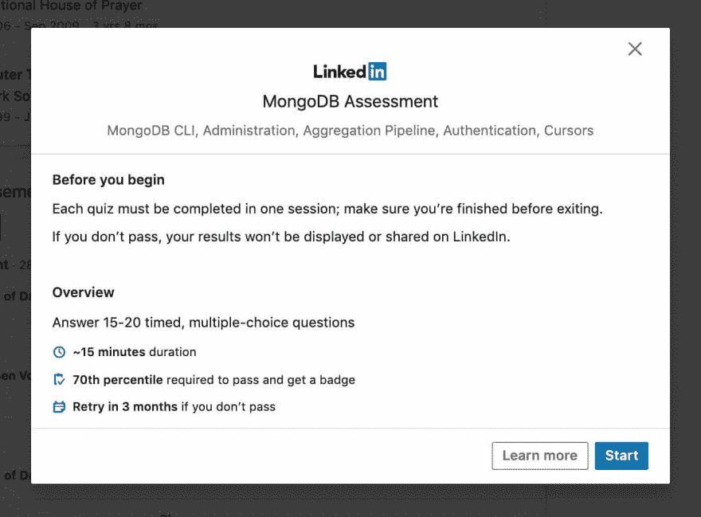

# 我刚刚做了几个 LinkedIn 的小测验，我想知道它们有什么关系吗？！🤔

> 原文：<https://dev.to/mjraadi/i-just-took-couple-of-linkedin-quizzes-and-was-wondering-do-they-even-matter-3i1m>

显然，Linkedin 正在利用他们在 Linkedin Learning(以前的 Lynda)的资源来创建针对特定技能的适应性问题的通过/失败测试。如果您通过了计时测试，并发现自己处于第 70 个百分位数，您将获得一枚徽章。

您可以选择是否要在您的个人资料中显示此徽章，以表示您已通过该特定技能的评估。如果您没有通过某项技能的评估，您可以在三个月后重考一次，并且失败的测试不会显示在您的个人资料中。

这种对技能的重新想象远比有人在你的个人资料上打勾来认可某项技能要可靠得多。我确实喜欢 LinkedIn 个人资料上的技能变得可靠的想法，但招聘人员会花时间考虑这一点吗？网络上对此讨论不多。请让我知道你的想法。