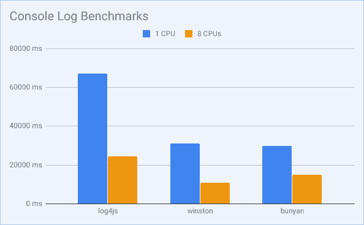
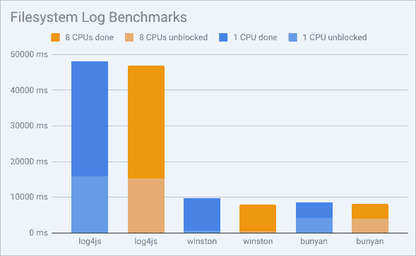
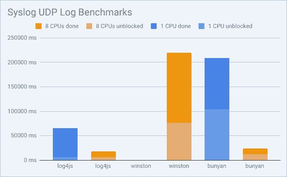
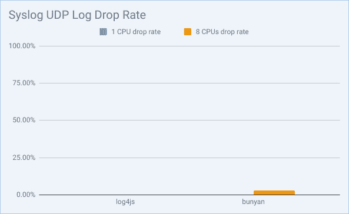
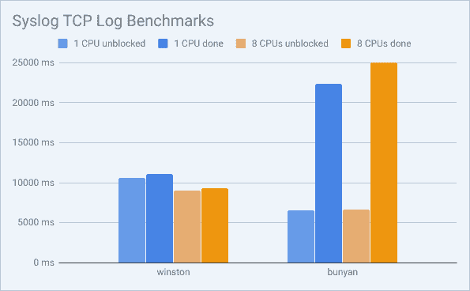
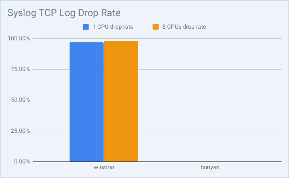

# 基准测试流行的 NodeJS 日志库

> 原文：<https://dev.to/mostlyjason/benchmarking-popular-nodejs-logging-libraries-4kk1>

有时开发人员会因为性能问题而犹豫是否要包含日志记录，但是这合理吗？库的选择对性能有多大影响？

让我们运行一些基准测试来找出答案！我们在一些最流行的 NodeJS 库上运行了一系列性能测试。这些测试旨在显示每个库处理日志的速度以及对整个应用程序的影响。

## 竞争者

对于这个测试，我们研究了一些最常用的 NodeJS 日志库:

*   Log4js 4.0.2
*   温斯顿 3.2.1
*   班扬 1.8.12

我们还使用了以下附加库:

*   用于 winston 系统日志记录的 Winston-syslog 2 . 0 . 1
*   [bunyan-syslog](https://www.npmjs.com/package/bunyan-syslog) 0.3.2 用于 bunyan 的系统日志记录

我们对这些库进行了基准测试，测试它们的性能，将它们的日志发送到控制台和文件系统。我们还测试了通过 TCP 和 UDP 将日志信息发送到本地 rsyslog 服务器，因为在生产环境中卸载日志是常见的，也可能是明智的。

这些测试是使用 NodeJS 8.15.1 运行的。

## 方法论

我们的目标是比较日志库之间的性能。每个库都在默认配置下运行，所有库和测试都使用相同的系统。

我们的测试应用程序总共记录了 1，000，000 个短语“Hello，world！”它可以在 https://github.com/codejamninja/node-log-benchmarks 的 GitHub 上下载。我们严格处理日志以创建一个隔离的控制组。

我们测量了使用单个逻辑处理器或八个逻辑处理器(四核超线程)来模拟大型生产服务器的结果。NodeJS 通常被认为是单线程程序，但从技术上讲，它只是单线程的事件循环。有许多 NodeJS 任务发生在并行线程上，比如垃圾收集。还值得注意的是，tty(终端)正在做大量的工作，将日志打印到屏幕上，这些工作肯定会在一个单独的线程上执行。这就是用生产系统中常见的多个 CPU 进行测试如此重要的原因。

此外，NodeJS 文件系统写入是非阻塞的(异步的)。 *unblocked* 时间让我们知道用于调度文件系统写入的代码何时完成，系统何时可以继续执行额外的业务逻辑。但是，文件系统仍将在后台异步写入。因此，*完成*时间让我们知道实际将日志写入文件系统花了多长时间。

我们使用的硬件来自亚马逊 AWS。

| **名称** | **规格** |
| 处理器 | 英特尔酷睿 i7-7700，2.80GHz (4 个内核，8 条线程) |
| 记忆 | 32GB 内存 |
| 操作系统 | 64 位 Ubuntu 18.04.2 LTS 服务器 |
| NodeJS | LTS |

## 测试结果

对于所有测试，结果都以毫秒为单位。小节越小越好，因为这意味着处理日志花费的时间越少。

### 控制台

对于第一组测试结果，我们对登录控制台时库的性能进行了基准测试。

从这些结果中，我们可以看到额外的 CPU 对 NodeJS 登录到控制台所花费的时间有很大的影响。Winston 是多线程系统中速度的明显赢家；但是，Bunyan 在单线程系统中的表现稍好。

### 文件系统

对于第二组测试结果，我们在将日志写入文件系统时对库的性能进行了基准测试。再次注意，每个测试结果包含两次，*未阻塞*和*完成*。这是因为库有时会将日志异步发送到 syslog。记录的总时间是这两个时间的总和。

在看到有多少额外的 CPU 影响控制台日志之后，我非常惊讶地发现，使用额外的 CPU 时，记录到文件系统的性能大致相同。这很可能是因为写文件所需的工作比打印到 tty 设备所需的工作要少得多，所以多线程活动发生得更少。

Log4js 写文件系统的结果似乎最差，有时要花 5 倍多的时间来写文件系统。Winston 最快地解除了事件循环的阻塞，但是 Bunyan 最快地完成了对文件系统的写入。因此，如果您选择基于文件系统性能的日志库，那么这种选择将取决于您是希望最快地解除事件循环的阻塞，还是希望首先完成整个程序的执行。

### Syslog UDP

对于第三组测试结果，当通过 UDP 将日志发送到 syslog 时，我们对库的性能进行了基准测试。

当使用多个 CPU 时，Log4js 和 Bunyan 几乎同时完成；然而，Log4js 更快地解除了事件循环，并且在单个 CPU 上执行得更好。

Log4js 还成功地将其所有日志发送到 syslog，没有丢失一个日志。虽然 Bunyan 的丢弃率很低，但它仍然设法丢弃了一些日志。我认为在通过 UDP 向 syslog 发送日志时，Log4js 是明显的赢家。

让 Winston 在 UDP 上使用 syslog，我有过一次可怕的经历。当它工作时，需要一分多钟来解除事件循环，并需要两分钟来完成将日志发送到 syslog。然而，我测试它的大多数时候，在我完成之前就用完了内存。我假设在使用 UDP 时，库会在将日志发送到 syslog 之前聚合堆中的所有日志，而不是立即将日志流式传输到 syslog。无论如何，它通过 UDP 将日志发送到 syslog，这种方式在处理一百万个日志时效果不佳。

## Syslog TCP

对于第四组测试结果，我们对通过 TCP 将日志发送到 syslog 时库的性能进行了基准测试。再次注意，每个测试结果包含两次，*未阻塞*和*完成*。这是因为库有时会将日志异步发送到 syslog。

因为 Bunyan 是唯一一个通过 TCP 成功地将日志发送到 syslog 而没有丢失任何日志的库，所以它是明显的赢家。尽管当引入多个 CPU 时，它的性能有些慢，但仍然相对较快。

遗憾的是，我无法让 Log4js 通过 TCP 将日志发送到 syslog。我认为他们的图书馆有一个漏洞。我总是收到以下错误。

 `(node:31818) UnhandledPromiseRejectionWarning: TypeError: Cannot read property 'trace' of undefined`

Winston 通过 TCP 向 syslog 发送日志时速度相对较快，但是它的日志丢失率非常高。大多数日志被丢弃或损坏。下面是从 Winston 收到的一个损坏日志 syslog 的示例。你可以看到信息被切断了。

`Mar 17 19:21:42 localhost /home/codejamninja/.nvm/versions/node/v8.15.1/bin/node[22463]: {"mes`

日志应该是这样的:

`Mar 17 19:21:42 localhost /home/codejamninja/.nvm/versions/node/v8.15.1/bin/node[22463]: {"message": "92342: Hello, world!"}`

在通过 TCP 向 syslog 发送日志时，Bunyan 的表现相对较好。它没有丢弃一个日志，并且非常迅速地解除了事件循环。不过，让我感到惊讶的一件事是，额外的 CPU 始终比运行在单个 CPU 上的性能差。我对此感到困惑，尽管这是唯一发生这种情况的场景。

## 结论

这些结果真的让我大吃一惊。我以为会有一个总赢家，但每个图书馆在不同的条件下在不同的领域表现最好。

| **输出类型** | **获胜者** |
| 安慰 | 温斯顿 |
| 文件 | 温斯顿和班扬打成平手 |
| 系统日志 UDP | Log4js |
| 系统日志 TCP | 班扬 |

Winston 在登录控制台时表现最佳。Winston 和 Bunyan 在登录文件系统时都以自己的方式表现最佳。通过 UDP 向 syslog 发送日志时，Log4js 的性能最好。通过 TCP 将日志发送到 syslog 时，Bunyan 的效果最好。

如果您更关心 syslog 的吞吐量，那么带 UDP 的 Log4js 是最好的输出类型。如果你只关心解除代码阻塞，那么 Winston 写文件系统是最好的。在这种情况下，每个日志事件的记录时间平均为 0.0005 毫秒，这是非常快的速度。如果您的典型响应延迟是 100 毫秒，那么它只是总响应时间的 0.0005%。这比运行 console.log()要快。只要不过度使用太多日志语句，影响是很小的。

|  | 安慰 | 文件 | 系统日志 TCP | 系统日志 UDP |
| Log4js | 24385 毫秒 | 31584 毫秒 | 不适用的 | **1195 毫秒** |
| 温斯顿 | 10756 毫秒 | 7438 毫秒 | 9362 毫秒 | 142871 毫秒 |
| 班扬 | 15062 毫秒 | 4197 毫秒 | 24984 毫秒 | 12029 毫秒 |

总的来说，我会推荐使用带有 UDP 库的 Log4js 以获得最佳性能。这对您的总体响应时间的影响可以忽略不计。像 [Loggly](http://loggly.com/) 这样的工具会为你存储和组织那些日志。当系统遇到关键问题时，它会提醒您，以便您可以为客户提供出色的体验。