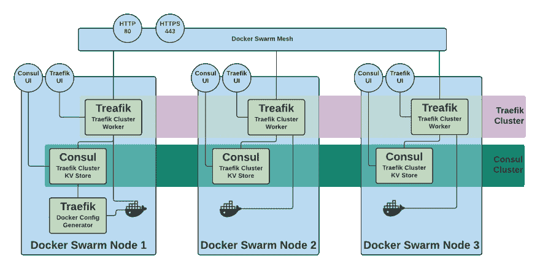
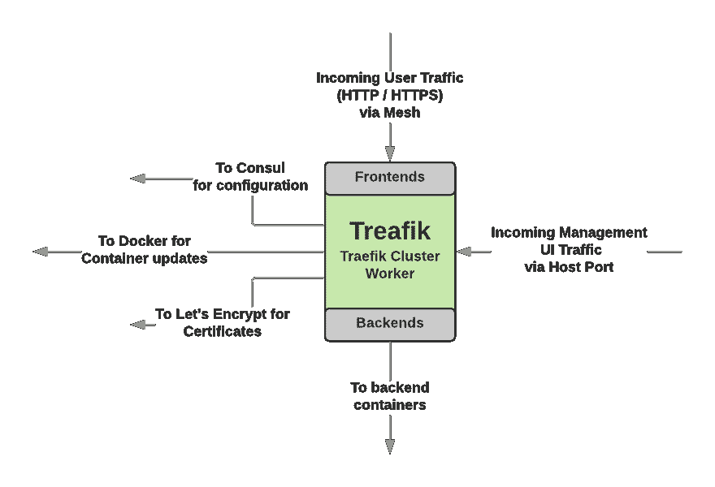
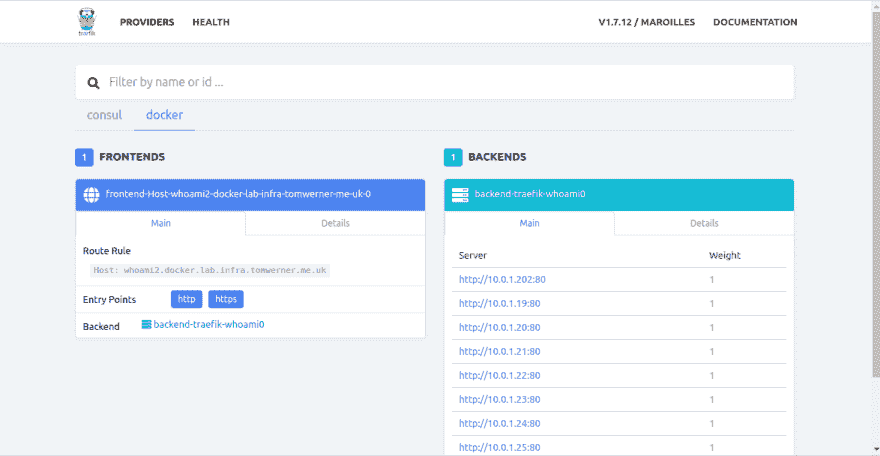

# Awesome HTTP Load Balancing on Docker with Traefik

> 原文：[https://dev.to/tomwerneruk/awesome-http-load-balancing-on-docker-with-traefik-4694](https://dev.to/tomwerneruk/awesome-http-load-balancing-on-docker-with-traefik-4694)

### Why Traefik?

Traefik is the up-and-coming 'Edge Router / Proxy' for all things cloud. Full disclosure, I like it.

The cut back features compared to products like F5 which I have used throughout my career is refreshing - these products still do have their place, and they can do some **very** cool stuff.

I'm a strong believer in avoiding technical debt when I'm building out my infrastructure and applications. Traefik is a production scale tool, while still being nimble enough to run in the smallest of deployments. There is very few reasons why you shouldn't consider incorporating it into your stack now - especially if you are self-hosting and don't have something like AWS ELB available to you, or if Traefik has a killer feature you need!

## This Tutorial

Traefik supports multiple orchestrators (Docker, Kubernetes, ECS to name a few), however, for this tutorial I am going to cover Docker Swarm. Check out *[Why Single Node Swarm](https://fluffycloudsandlines.blog/using-traefik-on-docker-swarm/why-you-need-single-node-swarm)* to see why I think you should be using Swarm over vanilla docker, even locally.

In case you didn't get the message above, I am going to cover a scale-ready configuration for Traefik here. This means HA clustered support, meaning that as you add nodes, your Traefik service will scale with you. Technical debt to a minimum!

What do I want to achieve?

*   I host a VPS server that hosts multiple websites, running multiple technologies. Thankfully they are all *now* containerised *(it wasn't pretty).*
*   I want TLS certificates by default on every URL.
*   I want to future proof this if I need to scale.

Treafik hits all of these points. Let's dive in....

Our HA Docker Swarm Ready solution has a few moving parts;

### Traefik Container

This container will be scheduled as a `global` service in our Swarm. This means that for every Host in our Docker Swarm cluster, one instance of Traefik will be deployed. This will be our traffic workhourse. In most scenarios this should have more than sufficient throughput. If a given Traefik instance is getting saturated, then you might be getting to the point where you should be horizontally scaling (more Hosts, not more CPUs).

### Consul Container

Consul is used in this scenario as a configuration store. Traefik needs a repository for config data and certificates which is accessible from all nodes in the cluster. Consul has other features - it overlaps a lot with Swarm's service mesh - but these don't need to be configured for this use case. This will be deployed in an HA manner.

### Traefik Init Container

This is used to 'seed' our Traefik config into the Consul cluster when first starting up. Once this has done it's job, it is shutdown, and our scaled Traefik Container nodes take over.

## Overall Traefik Cluster Design

<figure>[](https://res.cloudinary.com/practicaldev/image/fetch/s--8EfELh6i--/c_limit%2Cf_auto%2Cfl_progressive%2Cq_auto%2Cw_880/https://fluffycloudsandlines.blog/conteimg/2019/06/docker-swarm-traefik-ha--1-.png)

<figcaption>Overall Docker Swarm Traefik HA Cluster</figcaption>

</figure>

Our cluster is comprised of three docker swarm nodes, the recommended minimum number required for the raft consensus algorithm to provide resilience to node failure. There is no pre-requisite for this deployment except cluster communications working properly between nodes (as detailed in the Swarm setup guide - [https://docs.docker.com/engine/swarm/swarm-tutorial/](https://docs.docker.com/engine/swarm/swarm-tutorial/)).

The Terraform and Compose files for this tutorial are located on my GitLab - [https://gitlab.com/fluffy-clouds-and-lines/traefik-on-docker-swarm.git](https://gitlab.com/fluffy-clouds-and-lines/traefik-on-docker-swarm.git)

The solution shall deploy 4 services;

*   A Traefik node on each manager host,
*   A Consul node on each manager host (maximum 3),
*   'whoami' to facilitate testing,
*   A standalone Traefik config generator.

### Inside Traefik

[](https://res.cloudinary.com/practicaldev/image/fetch/s--QAyVvk68--/c_limit%2Cf_auto%2Cfl_progressive%2Cq_auto%2Cw_880/https://fluffycloudsandlines.blog/conteimg/2019/06/inside-traefik--1-.png)

Traefik has two main configuration areas; frontends and backends. Frontends respond to request from the outside world. This is where, if used, TLS is applied to requests. Backends group one or more containers to serve a frontend.

In this deployment, frontends are created dynamically as a result of the docker labels declared on the whoami service (the backend group).

### Networking

Traefik and Consul shall expose their management UI ports in `host` mode. This means they will be exposed on each host they are deployed on. Only hosts that have these services deployed shall have 8080 and 8500 available.

In addition, Traefik shall expose the front-end ports of 80 and 443 on the ingress service mesh. This means that any Docker node will have ports 80 and 443, and will be routed internally by Docker to _ **a** _ Traefik instance, but not necessarily the one running on that node. This is to facilitate fail over in the case of Traefik container failure.

## Deploying the Traefik Cluster

To deploy our stack we are going to use a Docker Compose file to define our services. Once deployed the Traefik instance will poll Docker (specifically the docker socket) for changes to deployed containers. Whenever a new container with appropriate metadata is started, Traefik will beginning routing traffic to it.

### Environment Setup

A 3 node Docker Swarm deployment is required. If you don't have this, a Terraform manifest to deploy to AWS is available in this tutorial's repo.

You will need a DNS record that points to your Swarm cluster for the test service. I have chosen `whoami2.docker.lab.infra.tomwerner.me.uk` but this will need changing to a domain name you own. For maximum availability this should resolve to all of your Swarm nodes (but in theory only one is required due to the Traefik frontend being on the ingress mesh). I have achieved this by creating duplicate A records, resolving to each IP.

### The Compose File

The full compose file is available in my GitLab repo, but breaking down the deployment;

```
 consul:
    image: consul
    command: agent -server -bootstrap-expect=3 -ui -client 0.0.0.0 -retry-join consul
    volumes:
      - consul-data:/consul/data
    environment:
      - CONSUL_LOCAL_CONFIG={"datacenter":"eu_west2","server":true}
      - CONSUL_BIND_INTERFACE=eth0
      - CONSUL_CLIENT_INTERFACE=eth0
    ports:
      - target: 8500
        published: 8500
        mode: host
    deploy:
      replicas: 3
      placement:
        constraints:
          - node.role == manager
      restart_policy:
        condition: on-failure
    networks:
      - traefik 
```

Our Consul deployment is fairly out of the box. It ensures that;

*   consul is started in server mode,
*   3 servers are pre-defined as our required amount of nodes before a cluster election can be triggered,
*   that UI traffic can come from all sources,
*   that the remaining nodes can be contacted via the alias consul. This is a bit of 'trick' - normally this would be a list of IP addresses, however, using Docker's internal round robin DNS resolution, this means that with repeated attempts, all 3 nodes are returned to trigger an election.

```
 traefik_init:
    image: traefik:1.7
    command:
      - "storeconfig"
      - "--loglevel=debug"
      - "--api"
      - "--entrypoints=Name:http Address::80 Redirect.EntryPoint:https"
      - "--entrypoints=Name:https Address::443 TLS TLS.SniStrict:true TLS.MinVersion:VersionTLS12"
      - "--defaultentrypoints=http,https"
      - "--acme"
      - "--acme.storage=traefik/acme/account"
      - "--acme.entryPoint=https"
      - "--acme.httpChallenge.entryPoint=http"
      - "--acme.onHostRule=true"
      - "--acme.onDemand=false"
      - "--acme.email=hello@tomwerner.me.uk"
      - "--docker"
      - "--docker.swarmMode"
      - "--docker.domain=docker.lab.infra.tomwerner.me.uk"
      - "--docker.watch"
      - "--consul"
      - "--consul.endpoint=consul:8500"
      - "--consul.prefix=traefik"
      - "--rest"
    networks:
      - traefik
    deploy:
      placement:
        constraints:
          - node.role == manager
      restart_policy:
        condition: on-failure
    depends_on:
      - consul 
```

This is our 'bootstrap' config for Traefik. This service only starts upon deployment. It defines the configuration for the deployment, including enabling Lets Encrypt certificates, enables the Docker provider and defines we will be using Consul as our Key-Value store.

```
 traefik:
    image: traefik:1.7
    depends_on:
      - traefik_init
      - consul
    command:
      - "--consul"
      - "--consul.endpoint=consul:8500"
      - "--consul.prefix=traefik"
    networks:
      - traefik
    volumes:
      - /var/run/docker.sock:/var/run/docker.sock
    ports:
      - target: 80
        published: 80
      - target: 443
        published: 443
      - target: 8080
        published: 8080
        mode: host 
    deploy:
      placement:
        constraints:
          - node.role == manager
      mode: global
      update_config:
        parallelism: 1
        delay: 10s
      restart_policy:
        condition: on-failure 
```

The Traefik service is again fairly out of the box. All configuration is pulled from consul (which is seeded by the traefik_init service). This container is deployed on all manager nodes at present, but this constraint is in place as Treafik requires access to data on the manager node to operate. Consider the decoupling options at the end of this post.

```
 whoami0:
    image: containous/whoami
    networks: 
      - traefik
    deploy:
      replicas: 6
      labels:
        traefik.enable: "true"
        traefik.frontend.rule: 'Host: whoami2.docker.lab.infra.tomwerner.me.uk'
        traefik.port: 80
        traefik.docker.network: 'traefik_traefik' 
```

Our last service - whoami. This allows us to test the deployment. The labels defined here are used by Traefik to configure itself. `Host: whoami2.docker.lab.infra.tomwerner.me.uk` should be changed to match a valid DNS hostname for your environment.

```
networks:
  traefik:
    driver: overlay
    attachable : true

volumes:
  consul-data:
      driver: local 
```

Finally our network and storage definition. The Traefik network is an `overlay` network to allow it to span the Swarm Cluster. It is also attachable to allow standalone containers to be attached to allow debugging (the default if `false`).

Our consul data is persisted, as not all of it is easily recreated (i.e our issued certificates).

### Check our deployment

Assuming you have a working cluster already, deploy the cluster after checking out the repo;

`$ docker stack deploy -c traefik_noprism.yml traefik`

Verify the deployment;

```
$ docker service ls
NAME MODE REPLICAS IMAGE                     
traefik_consul replicated 3/3 consul:latest              
traefik_traefik global 3/3 traefik:1.7               
traefik_traefik_init replicated 0/1 traefik:1.7                
traefik_whoami0 replicated 6/6 containous/whoami:latest 
```

The consul cluster election can take a minute or so. Monitor the Traefik and Consul logs to observe the progress of this. Navigating to the UI and having the consul and docker provider tabs available is a good indicator that this deployment has worked.

### Test the deployment

Browse to any of your node's publicly accessible addresses to view the Traefik UI;

`http://<public ip>:8080/`

[](https://res.cloudinary.com/practicaldev/image/fetch/s--gcCsoI0E--/c_limit%2Cf_auto%2Cfl_progressive%2Cq_auto%2Cw_880/https://fluffycloudsandlines.blog/conteimg/2019/06/image-3.png)

Under the Docker tab, the details of our test service should show.

Browse to your service hostname (in my case whoami2.docker.lab.infra.tomwerner.me.uk). This should resolve to one of your Swarm nodes and hand it off to a Traefik node. Refresh a few times to see it hit your chosen node under the Health tab (or open up all management UIs for each node).

That's it for the tutorial!

## Additional Steps

All tutorials are a basis to start with. A couple of things to consider taking further;

*   Applying ACLs to restrict UI access to Consul (source IP and authentication),
*   Restricting access to the Traefik management UI, either by disabling it or firewall (i.e AWS VPC security group access from bastion only),
*   Docker Socket security...

If you're concerned around exposing a container to the internet which is bound to the Docker socket (a potential security issue), you may want to consider;

*   Deploying traefik-prism as per [my previous post,](https://dev.to/tomwerneruk/hardening-traefik-when-using-the-docker-provider-55f3)
*   Using TCP to communicate to the Docker socket,
*   Consider Traefik Enterprise Edition if you are in a commercial environment (as this supports splitting configuration and routing roles).

As ever, comments and questions are welcomed below.