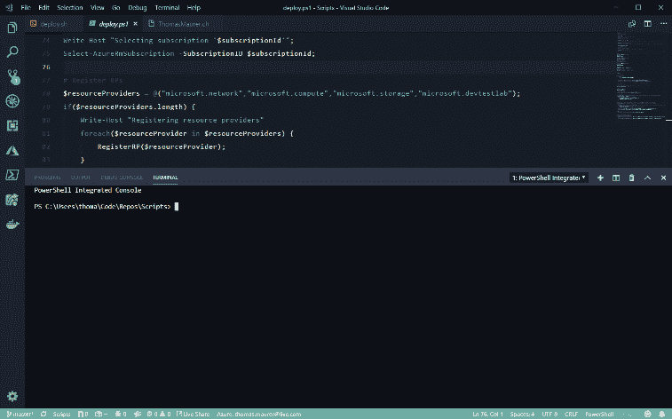

# 如何在 Visual Studio 代码中使用云壳

> 原文：<https://dev.to/azure/how-to-use-cloud-shell-in-visual-studio-code-3acf>

最初由 [@ThomasMaurer](https://twitter.com/ThomasMaurer) 在 ITOpsTalk.com[发布](https://techcommunity.microsoft.com/t5/ITOps-Talk-Blog/bg-p/ITOpsTalkBlog)

你可能知道，我是 Azure Cloud Shell 的超级粉丝。我经常直接在 Azure 门户网站(T1)、微软文档(Microsoft Docs)、Azure 手机应用(T3)或 shell.azure.com(T5)的 T4 上使用它。很多时候，我在 Visual Studio 代码中编辑文件和编写代码以及 Azure 资源管理器(ARM)模板，在这种情况下，我需要使用本地 [Azure PowerShell](https://www.thomasmaurer.ch/2016/05/how-to-install-the-azure-powershell-module/) 或 Azure CLI 安装，或者在浏览器中从 Visual Studio 代码切换回使用云外壳。不过，还有第三种选择，允许我直接在 [Visual Studio 代码](https://code.visualstudio.com?WT.mc_id=thomasmaurer-blog-thmaure)内运行云壳。

要在 Visual Studio 代码中设置云外壳，您需要做两件事。首先，你需要安装 nodeJS 和 Azure 账户扩展。

*   在 Windows 上:需要安装 Node.js 6 或更高版本([https://nodejs.org](https://nodejs.org/))。
*   Visual Studio 代码 [Azure 帐户](https://marketplace.visualstudio.com/items?itemName=ms-vscode.azure-account?WT.mc_id=itopstalk-blog-thmaure)扩展。

接下来，你可以登录 Azure，在云壳中打开 PowerShell 或 Bash:

1.  按下 **CTRL+SHIFT+P**
2.  通过键入 **Azure:登录**来登录 Microsoft Azure
3.  一个**浏览器窗口**将会打开以登录 Azure
4.  按下 **CTRL+ SHIFT+P**
5.  键入**在云壳中打开 PowerShell**或**在云壳中打开 Bash**
6.  这将把你直接连接到运行在 Azure 中的云 Shell。

我希望这能让您大致了解如何在 Visual Studio 代码中直接运行云 Shell。如果你有任何问题，请在下面留言。