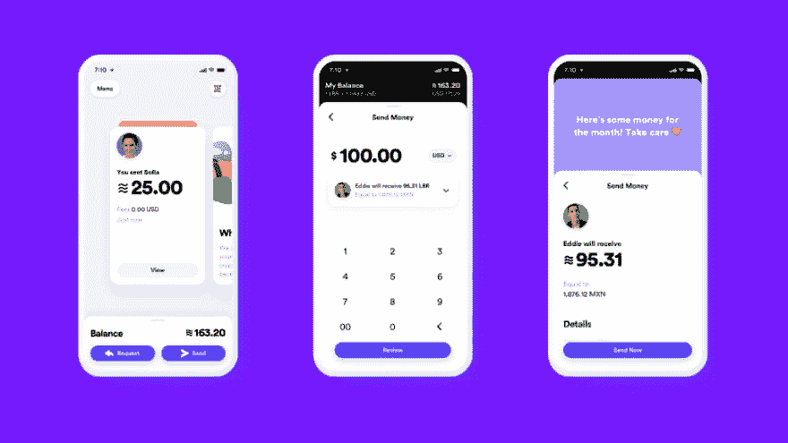

# 新脸书加密货币:天秤座

> 原文：<https://dev.to/daudr/the-new-facebook-cryptocurrency-libra-g8e>

**[这篇文章之前发表在我的主博客上。](https://blog.daudr.me/facebook-libra)T3】**

最近马克·扎克伯格宣布了脸书的新加密货币 Libra，让我们看看它是什么。

[](https://res.cloudinary.com/practicaldev/image/fetch/s--cvslQTaF--/c_limit%2Cf_auto%2Cfl_progressive%2Cq_auto%2Cw_880/https://images.unsplash.com/photo-1555020368-9e1b4cf78a52%3Fixlib%3Drb-1.2.1%26auto%3Dformat%26fit%3Dcrop%26w%3D1136%26q%3D80)

> Joshua Hoehne 在 [Unsplash](https://unsplash.com) 上拍摄的照片

## 天秤座，新脸书的加密货币

天秤座的使命简单明了:

> 一个简单的全球货币和金融基础设施，让数十亿人受益。

Libra 是一种稳定的硬币，这意味着，与比特币不同，它没有波动性，但有实物资产支持的储备，以保持其价值稳定。对于天秤座，脸书也创建了一个协会——天秤座协会，目的是调节天秤座自身的成长。这是 27 个创始成员:

> 支付:*万事达卡*，*贝宝*， *PayU (Naspers' fintech arm)* ， *Stripe* ， *Visa*
> 
> 技术和市场:*预订控股*，*易贝*，*脸书/Calibra* ， *Farfetch* ， *Lyft* ，*mercadopa *野牛步道*、*比特币基地公司*、 *Xapo 控股有限公司*、
> 、
> 风险投资:*安德森·霍洛维茨*、*突破性举措*、*瑞比特资本*、*茁壮成长资本*、*联合广场风险投资*、
> 、
> 非营利和多边组织、学术机构:*创造性破坏**

在 Libra 计划于 2020 年中期发布之前，脸书将试图将这一名单扩大到总共 100 名成员。

## 我如何从天秤网开始

Libra 网络基于智能合约，如以太坊，并使用拜占庭容错(BFT)利益证明，NEO [使用的就是这个。](https://docs.neo.org/it-it/node/whitepaper.html) [这里](https://blog.daudr.me/libra-simple-smart-contract)你会发现一个简单的指南，说明如何启动你的本地测试网和熟悉天秤座网络。

## 移动编程语言

除了 Libra，一种新的编程语言也将发布:Move。

> 这种编程语言将让开发人员为这个新的生态系统实现定制的“智能合约”。几乎在任何事务脚本中都将出现两个重要的构件:LibraAccount。t 和 LibraCoin。t 资源类型。LibraAccount 是模块的名称，T 是该模块声明的资源的名称。这是 Move 中常见的命名约定；模块声明的“主”类型通常被命名为 t。

这是来自[移动网站](https://developers.libra.org/docs/move-overview#writing-transaction-scripts) :
的一个例子

```
// Simple peer-peer payment example.

// Use LibraAccount module published on the blockchain at account address
// 0x0...0 (with 64 zeroes). 0x0 is shorthand that the IR pads out to
// 256 bits (64 digits) by adding leading zeroes.
import 0x0.LibraAccount;
import 0x0.LibraCoin;
main(payee: address, amount: u64) {
  // The bytecode (and consequently, the IR) has typed locals.  The scope of
  // each local is the entire procedure. All local variable declarations must
  // be at the beginning of the procedure. Declaration and initialization of
  // variables are separate operations, but the bytecode verifier will prevent
  // any attempt to use an uninitialized variable.
  let coin: R#LibraCoin.T;
  // The R# part of the type above is one of two *kind annotation* R# and V#
  // (shorthand for "Resource" and "unrestricted Value"). These annotations
  // must match the kind of the type declaration (e.g., does the LibraCoin
  // module declare `resource T` or `struct T`?).

  // Acquire a LibraCoin.T resource with value `amount` from the sender's
  // account.  This will fail if the sender's balance is less than `amount`.
  coin = LibraAccount.withdraw_from_sender(move(amount));
  // Move the LibraCoin.T resource into the account of `payee`. If there is no
  // account at the address `payee`, this step will fail
  LibraAccount.deposit(move(payee), move(coin));

  // Every procedure must end in a `return`. The IR compiler is very literal:
  // it directly translates the source it is given. It will not do fancy
  // things like inserting missing `return`s.
  return;
} 
```

## 天秤座协会

天秤座协会将设在瑞士日内瓦(被天秤座创始成员认为是一个中立的国家，这种新的“中立”稳定硬币的理想状态)。

> Libra 协会是一家独立的瑞士非营利组织，其使命是通过创建简单的全球货币和金融基础设施来增强数十亿人的权能。关联成员由 Libra 网络的验证器节点组成。最初，这些是全球性公司、社会影响合作伙伴(sip)和学术机构 Libra 协会的创始成员。最终，该联盟将包括任何操作验证器节点并持有 Libra 足够股份的实体。

## Calibra:天秤座钱包

脸书还为天秤座设计了一款名为 Calibra 的钱包。

[](https://res.cloudinary.com/practicaldev/image/fetch/s--KosUz8S7--/c_limit%2Cf_auto%2Cfl_progressive%2Cq_auto%2Cw_880/https://fbnewsroomus.files.wordpress.com/2019/06/calibraapp_earlylook_en402x.png%3Fw%3D1024%26h%3D576)

卡利布拉是一个

> 脸书子公司，其目标是提供金融服务，让人们访问和参与 Libra 网络

Calibra 仍处于早期开发阶段，计划于 2020 年发布，因此从现在开始，真实体验可能会发生很大变化，但我们可以从[脸书公告](https://newsroom.fb.com/news/2019/06/coming-in-2020-calibra/)中读到:

> 从一开始，Calibra 就能让你将 libra 发送给几乎任何一个有智能手机的人，就像你发送短信一样简单、即时，而且费用低廉甚至免费。最终，我们希望为个人和企业提供额外的服务，比如按下按钮支付账单，扫描代码购买一杯咖啡，或者乘坐当地的公共交通工具，而无需携带现金或地铁通行证