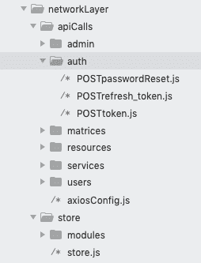

# 前端最佳实践(以 Vue.js 为特色)

> 原文：<https://dev.to/champi/front-end-best-practices-featuring-vuejs-1b5p>

[](https://www.buymeacoffee.com/champi)

# 前端 Web 开发的最佳实践

## CSS

### 很好

#### Block 元素修饰符一个用于编写可维护 css 的概念。

编写 css 对于一些开发者来说可能是一种负担。复杂的设计需要易于修改的大型/可维护代码。

这就是 BEM 的用途。BEM 代表 **block，element，modifier** ,其概念是总是编写关于 block 的样式。

例如

```
 <button class='button'>
        <span class='button__text'>Submit<span>
        
    </button> 
```

<svg width="20px" height="20px" viewBox="0 0 24 24" class="highlight-action crayons-icon highlight-action--fullscreen-on"><title>Enter fullscreen mode</title></svg> <svg width="20px" height="20px" viewBox="0 0 24 24" class="highlight-action crayons-icon highlight-action--fullscreen-off"><title>Exit fullscreen mode</title></svg>

```
 .button {
        display: flex;
        align-items: center;
        background: lightgreen;
        padding: 0 1.6rem;
    }

    .button__text {
        font-size: 2rem;
    }

    .button__icon {
        width: 1.4rem;
        height: 1.4rem;
    } 
```

<svg width="20px" height="20px" viewBox="0 0 24 24" class="highlight-action crayons-icon highlight-action--fullscreen-on"><title>Enter fullscreen mode</title></svg> <svg width="20px" height="20px" viewBox="0 0 24 24" class="highlight-action crayons-icon highlight-action--fullscreen-off"><title>Exit fullscreen mode</title></svg>

块是一个有意义的标记块，它有一个或多个子元素(在上面的例子中，span 和 img 元素都是 button 的子元素)。

一个元素是每个块的子元素。

修饰词呢？

如果上面的 submit 按钮也需要一个`disabled`类来将按钮的背景颜色改为灰色会怎么样？

例如 Vuejs

```
 <button :class="{
        'button': true,
        'button--disabled': disabled
    }">
        <span class='button__text'>Submit<span>
        
    </button> 
```

<svg width="20px" height="20px" viewBox="0 0 24 24" class="highlight-action crayons-icon highlight-action--fullscreen-on"><title>Enter fullscreen mode</title></svg> <svg width="20px" height="20px" viewBox="0 0 24 24" class="highlight-action crayons-icon highlight-action--fullscreen-off"><title>Exit fullscreen mode</title></svg>

```
 .button--disabled {
        background: lightgrey;
    } 
```

<svg width="20px" height="20px" viewBox="0 0 24 24" class="highlight-action crayons-icon highlight-action--fullscreen-on"><title>Enter fullscreen mode</title></svg> <svg width="20px" height="20px" viewBox="0 0 24 24" class="highlight-action crayons-icon highlight-action--fullscreen-off"><title>Exit fullscreen mode</title></svg>

### 萨斯

#### 使用颜色、字体、大小和断点。

设计系统是确保**一致性**的统一概念。

前端开发人员必须努力理解这些设计系统，并在编写任何一行代码之前**寻找重复的模式。**

##### 地图-获取

实现一致性的最佳方式是拥有一个**单一的真相来源**。在 sass 中，我们有一个名为`map-get`的实用程序，可以让这个过程变得非常简单。

例如`variables.scss`

```
$colors: (
    blue: #4286f4;
    lightblue: #b8d1f9;
);

$font: (
    main-family: sans-serif,    
    weight-thin: 300,
    weight-medium: 500,
    weight-fat: 700,
    base-size: 62.5%,
    smaller-size: 50%
);

$breakpoints: (
    small: 50em, 
    medium: 76.8em, 
    large: 102.4em, 
    larger: 128em, 
    extra-large: 144em
);

$sizes: (
    header-height: 6rem
); 
```

<svg width="20px" height="20px" viewBox="0 0 24 24" class="highlight-action crayons-icon highlight-action--fullscreen-on"><title>Enter fullscreen mode</title></svg> <svg width="20px" height="20px" viewBox="0 0 24 24" class="highlight-action crayons-icon highlight-action--fullscreen-off"><title>Exit fullscreen mode</title></svg>

例如`App.vue`

```
<template>
  <div class='app'>
    <div class='app__header'>
        <span class='header__text'>Hello World</span>
    </div>
  </div>
</template>

// use the scoped atrr in components
<style lang="scss">
  @import "./variables";

  html {
    font-size: map-get($font, base-size);
    font-family: map-get($font, main-family);
    font-weight: map-get($font, weight-thin);
    box-sizing: border-box;

    @media screen and (max-width: map-get($breakpoints, small)) {
        font-size: map-get($font, smaller-size);
    }
  }

  .app {
    display: flex;
    flex-direction: column;
    background: map-get($colors, blue);

    &__header {
        width: 100%;
        height: map-get($sizes, header-height);
        background: transparent;
        display: flex;
        justify-content: center;
        align-items: center;

        .header__text {
            color: map-get($colors, lightblue);
        }
    }
  }
</style> 
```

<svg width="20px" height="20px" viewBox="0 0 24 24" class="highlight-action crayons-icon highlight-action--fullscreen-on"><title>Enter fullscreen mode</title></svg> <svg width="20px" height="20px" viewBox="0 0 24 24" class="highlight-action crayons-icon highlight-action--fullscreen-off"><title>Exit fullscreen mode</title></svg>

颜色、字体、大小和断点必须在`variables.scss`中定义，并在需要时使用。您应该避免使用`variables.scss`中没有定义的值(颜色、字体、大小和断点)。如果你需要创建一个新的值(可能是设计师添加了新的颜色)，把它添加到`variables.scss`，然后和`map-get`一起使用。

### 响应式设计

#### 关于像素的完美

设计师和开发人员都有一个共同的目标，那就是让产品变得有生命力，但是他们使用不同的工具来实现这个目标。

当设计师提交一个模型时，他/她希望开发人员负责将模型转换成实际的 web 版本。他/她经常忘记的是*网络*是一个动态平台，它会根据用户的设备改变其宽度/高度，因此*的设计必须适应这一现实。*

##### 像素完美网页设计的实用观点

移动设备、平板电脑和台式机。这些是网站设计中最常见的屏幕分辨率。

*   开发人员应该努力尽可能接近这些分辨率的模型，并确保它在不常见的分辨率下仍然看起来很好(水平和垂直调整浏览器的大小，一切都应该看起来一致和到位)。
*   当一个不常见的解决方案阻碍了设计时，设计师应该帮助开发人员解决这些问题。

#### 停用`px`，改用`rem`

`px`是固定的计量单位。固定的 T2 听起来对你有反应吗？
没有？为什么还在用？

`rem`是测量的相对单位，这意味着它的值直接依赖于相对(根)值(通常用针对`html`标签的`font-size`来设置)。如果该根值发生变化，则`rem`中表示的值将一致变化。

将 html 的`font-size`设置为`10px`是一个很好的做法。这样，用`px`(就像你习惯的那样)编写你的 css 思想会更容易，但是对于其他事情使用`rem`。

例如

```
html {
    font-size: 10px;
}

button {
    font-size: 1rem; // equals 10px
}

span {
    font-size: 1.6rem; // equals 16px
    width: 20rem; // equals 200px
    height: 14rem; // equals 140px
} 
```

<svg width="20px" height="20px" viewBox="0 0 24 24" class="highlight-action crayons-icon highlight-action--fullscreen-on"><title>Enter fullscreen mode</title></svg> <svg width="20px" height="20px" viewBox="0 0 24 24" class="highlight-action crayons-icon highlight-action--fullscreen-off"><title>Exit fullscreen mode</title></svg>

##### 有什么好处？

如果我们现在将 html 的`font-size`改为`8px`，那么用`rem`设置的所有内容现在都会被重新评估为小于`20%`，因此*看起来会更小*。

例如

```
html {
    font-size: 8px;
}

button {
    font-size: 1rem; // now equals 8px
}

span {
    font-size: 1.6rem; // now equals 12.8px
    width: 20rem; // now equals 160px
    height: 14rem; // now equals 112px
} 
```

<svg width="20px" height="20px" viewBox="0 0 24 24" class="highlight-action crayons-icon highlight-action--fullscreen-on"><title>Enter fullscreen mode</title></svg> <svg width="20px" height="20px" viewBox="0 0 24 24" class="highlight-action crayons-icon highlight-action--fullscreen-off"><title>Exit fullscreen mode</title></svg>

#### 何时使用%

当您需要设置元素的子元素的尺寸(宽度/高度)时，百分比单位非常有用。
每次你用百分比设置尺寸时，你会发现自己经常使用`flexbox`。

如`Navbar.vue`

```
<template>
  <nav class='navbar'>
    <a class='navbar__link' href="#pricing">Pricing</a>
    <a class='navbar__link' href="#ourwork">Ourwork</a>
    <a class='navbar__link' href="#about">About</a>
    <a class='navbar__link' href="#legal">Legal</a>
  </nav>
</template>

<style lang="scss" scoped>
// Whe may want to give the first 3 links more importance/space
.navbar {
    display: flex;

    // Setting the width with percentage will keep the links space distribution as we
    intended even when the screen width changes
    &__link {
        width: 30%;

        &:last-child {
            width: 10%;
        }
    }
}
</style> 
```

<svg width="20px" height="20px" viewBox="0 0 24 24" class="highlight-action crayons-icon highlight-action--fullscreen-on"><title>Enter fullscreen mode</title></svg> <svg width="20px" height="20px" viewBox="0 0 24 24" class="highlight-action crayons-icon highlight-action--fullscreen-off"><title>Exit fullscreen mode</title></svg>

#### 编写媒体查询

##### 在您的媒体查询中使用`em`

在 https://zellwk.com/blog/media-query-units/[的这个链接](https://zellwk.com/blog/media-query-units/)中，你会看到一个使用`px`、`rem`和`em`编写媒体查询的实验。唯一实现跨浏览器一致性的单元是`em`单元。快速浏览一下链接，然后回来。

##### 写下你认为合适的媒体问题

我们通常有 3 个主要断点(手机、平板电脑和桌面)，但这个*并不意味着这些是你应该使用的唯一断点。从那些主要的断点开始，然后调整屏幕大小，观察破损/不一致的元素，我保证你会发现许多分辨率，你已经有的调整看起来只是**丑陋**。*

在规则中编写您的媒体查询，不要为所有内容编写一个单一的媒体查询。这样你就不会最终维护 2 个代码结构，并且你也能够快速理解一个元素在分辨率改变时将如何改变。

例如
编码这个

```
.container {
    display: flex;

    &__block {
        width: 80%;
        margin: 0 auto;
        padding: 0 2.4rem;

        @media screen and (max-width: 40em) {
            width: 100%;
            margin: unset;
        }

        @media screen and (max-width: 30em) {
            padding: 0 1.6rem;
        }

        .block__text {
            font-size: 1.6rem;

            @media screen and (max-width: 40em) {
                font-size: 1.4rem;
            }

            @media screen and (max-width: 30em) {
                font-size: 1.2rem;
            }
        }
    }
} 
```

<svg width="20px" height="20px" viewBox="0 0 24 24" class="highlight-action crayons-icon highlight-action--fullscreen-on"><title>Enter fullscreen mode</title></svg> <svg width="20px" height="20px" viewBox="0 0 24 24" class="highlight-action crayons-icon highlight-action--fullscreen-off"><title>Exit fullscreen mode</title></svg>

不是这个

```
.container {
    display: flex;

    &__block {
        width: 80%;
        margin: 0 auto;
        padding: 0 2.4rem;

        .block__text {
            font-size: 1.6rem;
        }
    }
}

@media screen and (max-width: 40em) {
    .container {
        &__block {
            width: 100%;
            margin: unset;

            .block__text {
                font-size: 1.4rem;
            }
        }
    }
}

@media screen and (max-width: 30em) {
    .container {
        &__block {
            padding: 0 1.6rem;

            .block__text {
                font-size: 1.2rem;
            }
        }
    }   
} 
```

<svg width="20px" height="20px" viewBox="0 0 24 24" class="highlight-action crayons-icon highlight-action--fullscreen-on"><title>Enter fullscreen mode</title></svg> <svg width="20px" height="20px" viewBox="0 0 24 24" class="highlight-action crayons-icon highlight-action--fullscreen-off"><title>Exit fullscreen mode</title></svg>

## JS

### 推荐阅读

#### 你不知道 js

[https://github.com/getify/You-Dont-Know-JS](https://github.com/getify/You-Dont-Know-JS)
这是一系列将向你展示`javascript`来龙去脉的书籍。如果你对 js 开发很认真，你必须阅读所有这些书。

#### 清理代码(针对 js)

[https://github.com/ryanmcdermott/clean-code-javascript](https://github.com/ryanmcdermott/clean-code-javascript)

### 工装

现代前端开发使用现代工具，使得开发体验非常流畅。如今几乎每个字体端项目都会用到一个 *linter* 、 *formatter/format-rules* 和一个 *bundler* 。

截至 2019 年的行业标准有:

*   林特:埃斯林特
*   格式化程序:更漂亮(虽然我更喜欢标准)
*   bunder:web pack

如果您使用的是`vue-cli`，您不需要担心配置这些选项，只要确保在创建项目时手动选择这些选项即可:

*   巴比伦式的城市
*   CSS 预处理器- > Sass/SCSS(带节点 Sass)
*   Linter / Formatter - > ESLint +标准配置- > Lint 并在提交时修复

### vista . js

#### 风格指南

https://vuejs.org/v2/style-guide/一定要阅读官方的 Vuejs 风格指南。遵循给出的建议将使代码库保持一致，使用格式化程序将使它看起来更加标准化。

#### 状态管理

当一个应用程序增长并开始变得复杂时，我们发现自己处于一种需要小心组织代码的情况。

状态管理模式有助于我们清楚地了解数据流。当你的应用程序有许多组件共享的*全局*数据时，使用这种模式。

不要对 ui(组件内部的状态)生成的数据使用这种模式，而是用它来管理来自*服务器*的数据。

##### Vuex

[https://vuex.vuejs.org/](https://vuex.vuejs.org/)Vuex 文档非常清晰，你应该花时间阅读并了解如何正确使用。
这里有一些整理`store`文件夹的建议。

###### 为你正在处理的数据的每一个有意义的概念建立一个模块(与 api 服务紧密耦合)

假设我们正在为一个电子商务应用程序构建`store`文件夹。
我们需要以下模块:

*   auth(用于处理用户认证)
*   产品(用于处理电子商务产品)
*   购物车(用于处理结账)

注意事项:

*   假设每个 api 调用如果“成功”将返回`[ res ]`，否则将返回`[ null, error ]`*
    ，我将在`App architecture`部分对此进行详述。

*   动作根据需要执行 api 调用和提交突变。

*   动作返回`{ status }`，因为它在调用动作的组件中使用(这对于在成功/错误时切换样式很有用)。

`auth.js`

```
import POSTauth from 'apiCalls/POSTauth'

export default {
    state: {
        token: '',
        userName: ''
    },

  mutations: {
    setToken(state, token) {
        state.token = token
    },
    setUserName(state, userName) {
        state.userName = userName
    }
  },

  actions: {
    async loginUser({ commit }, formData) {      
        const [res, error] = await POSTauth(formData)

        if (error) {
            return { status: 'error' }
        } else {
            commit('setToken', res.token)
            commit('setUserName', res.userName)
            return { status: 'success' }
        }
    },
  },

  getters: {
    isAuth(state) {
        return Boolean(state.token)
    }
  }
} 
```

<svg width="20px" height="20px" viewBox="0 0 24 24" class="highlight-action crayons-icon highlight-action--fullscreen-on"><title>Enter fullscreen mode</title></svg> <svg width="20px" height="20px" viewBox="0 0 24 24" class="highlight-action crayons-icon highlight-action--fullscreen-off"><title>Exit fullscreen mode</title></svg>

`products.js`

```
import GETproducts from 'apiCalls/GETproducts'

export default {
    state: {
        products: []
    },

  mutations: {
    setProducts(state, products) {
        state.products = products
    }
  },

  actions: {
    async getProducts({ commit }) {      
        const [res, error] = await GETproducts()

        if (error) {
            return { status: 'error' }
        } else {
            commit('setProducts', res.products)             
            return { status: 'success' }
        }
    },
  }
} 
```

<svg width="20px" height="20px" viewBox="0 0 24 24" class="highlight-action crayons-icon highlight-action--fullscreen-on"><title>Enter fullscreen mode</title></svg> <svg width="20px" height="20px" viewBox="0 0 24 24" class="highlight-action crayons-icon highlight-action--fullscreen-off"><title>Exit fullscreen mode</title></svg>

`cart.js`

```
import POSTprocess_payment from 'apiCalls/POSTprocess_payment'

export default {
    state: {
        productsInBasket: []
    },

  mutations: {
    handleProduct(state, { action, selectedProduct }) {
        const addProduct = () => 
            [...state.productsInBasket, selectedProduct]

        const deleteProduct = () => 
            state.productsInBasket.filter(prd => prd.id !== selectedProduct.id)

        state.productsInBasket = action === 'add' ? addProduct() : deleteProduct()
    }
  },

  actions: {
    async processPayment({ state }) {      
        const [res, error] = await POSTprocess_payment(state.productsInBasket)

        if (error) {
            return { status: 'error' }
        } else {            
            return { status: 'success' }
        }
    },
  },

  getters: {
    totalPayment(state) {
        return state.productsInBasket.reduce((a, b) => a.price + b.price)
    }
  }
} 
```

<svg width="20px" height="20px" viewBox="0 0 24 24" class="highlight-action crayons-icon highlight-action--fullscreen-on"><title>Enter fullscreen mode</title></svg> <svg width="20px" height="20px" viewBox="0 0 24 24" class="highlight-action crayons-icon highlight-action--fullscreen-off"><title>Exit fullscreen mode</title></svg>

`store.js`

```
import Vue from 'vue'
import Vuex from 'vuex'
import auth from './auth'
import products from './products'
import cart from './cart'

Vue.use(Vuex)

const store = new Vuex.Store({
    modules: {
        auth,
        products,
        cart
    }  
})

export default store 
```

<svg width="20px" height="20px" viewBox="0 0 24 24" class="highlight-action crayons-icon highlight-action--fullscreen-on"><title>Enter fullscreen mode</title></svg> <svg width="20px" height="20px" viewBox="0 0 24 24" class="highlight-action crayons-icon highlight-action--fullscreen-off"><title>Exit fullscreen mode</title></svg>

#### 复杂组件状态

有些情况下，用 props 或 bus 事件处理状态会很快变得很麻烦。我说的是设计/性质复杂的组件，因此在构建时需要仔细考虑。

万一你还是不明白，让我问你这个问题:
你是否曾经编写过一个组件，它将许多属性传递给一个中间组件，这个中间组件也传递这些属性？**(这就是所谓的支柱钻孔)**

如果你回答**是**继续读，**否则**你可能不需要我将要描述的模式。

##### 提供/注入

[https://vuejs.org/v2/api/#provide-inject](https://vuejs.org/v2/api/#provide-inject)这个特性类似于 React 的上下文。它允许您在父组件中定义数据，并使其对所有子组件*可用，不管组件层次结构有多深*，而不需要手动传递它。

有了工具带中的这个特性，我们现在可以为我们的复杂组件复制一个*状态管理模式*(从而获得数据流的清晰性)。

让我们构建一个有两个输入(电子邮件和密码)和一个提交按钮的**注册**表单。

*   每个输入都应该有验证
*   如果一个输入无效，它应该应用一个*错误样式*并显示*错误消息*
*   如果表单无效，提交按钮应*禁用*

[前往现场演示](https://codesandbox.io/s/provide-inject-72mne)

#### App 架构

编写可维护应用程序的一个关键方面是将它概念化为许多层，每一层都有自己的职责，它们一起构成了应用程序的主体。

一些人将此称为**关注点分离**，但是这个术语还没有被足够地澄清，以防止开发人员认为为`html` - `css` - `js`拥有单独的文件就是分离关注点。不，不是这样的，那只是文件的分离。

**关注点分离**是关于定义责任的。

##### 页面-组件-网络层

我想出了在我的项目中包含以下文件夹的模式:

*   pages:这些文件负责将整个页面呈现到屏幕上(也可以称为视图)。这些人给商店打电话。

*   组件:这些文件代表了一个在页面中使用的单元。

*   网络层:
    这是连接到*后端*并管理数据流的层。
    [T6】](https://res.cloudinary.com/practicaldev/image/fetch/s--XDan_eEq--/c_limit%2Cf_auto%2Cfl_progressive%2Cq_auto%2Cw_880/https://i.ibb.co/YWxLT2M/Screen-Shot-2019-06-20-at-2-04-13-AM.png)

    *   apiCalls:这里是该应用程序可以进行的所有 apiCalls。这些在存储模块操作中被调用。这些函数返回`[res]`或`[null, error]`。这里的想法是将**发出服务器请求**和**管理请求的数据**的概念分开。
    *   商店:这里是要使用的状态管理设置。一个配置文件和一个包含存储模块的`modules/`文件夹。

例如`GETproducts.js`(一个 api 调用)

```
import axios from 'axios'
export const GETproducts = () =>
  axios
    .get(
      '/products/'
    )
    .then((res) => [ res.data ])
    .catch((error) => [ null, error ]) 
```

<svg width="20px" height="20px" viewBox="0 0 24 24" class="highlight-action crayons-icon highlight-action--fullscreen-on"><title>Enter fullscreen mode</title></svg> <svg width="20px" height="20px" viewBox="0 0 24 24" class="highlight-action crayons-icon highlight-action--fullscreen-off"><title>Exit fullscreen mode</title></svg>