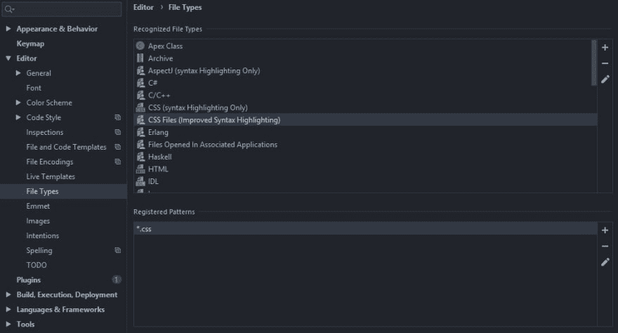

# IntelliJ 中的 CSS 语法突出显示

> 原文：<https://dev.to/lukethacoder/css-syntax-highlighting-in-intellij-5ac6>

IntelliJ 没有针对*的语法突出显示。css 文件。

没有简单的设置更改不能解决的问题。

`Settings -> Editor -> File Types`并将`*.css`文件关联从`CSS (syntax Highlighting Only)`更改为`CSS Files (Improved Syntax Highlighting`。

