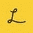

# 在环城工作，第三天:“做得更好”

> 原文：<https://dev.to/ashleemboyer/working-in-circle-city-day-3-do-better-work-4789>

# 早晨

我不禁发现自己被这里的一切迷住了。当我步行 10 分钟从我的车到办公室的时候，我在想街上的其他人可能会讲述的故事。他们在哪里工作？他们有孩子吗？他们这样做多久了？当我出门在城市街道上时，人们观看很快成为一件有趣的事情。

# 午后

我在系统中的设置仍然有些问题，所以我们决定是时候吃午饭了。😅我尝试了另一个新的地方:大肚子三明治店！

它👏🏻是👏🏻令人惊异的👏🏻

还见到了 CEO！我刚拿起午餐三明治，他就向我走来，所以我们没有握手，而是碰了碰拳头。🤣午饭后，我本来打算去参加一个会议，但是会议改期了，所以团队和我继续查看我的设置，这样我就可以开始编码了。我们想通了，团队领导向我展示了我的第一张罚单！我学到了很多东西，并把它们记下来，以便最终做进一步的阅读:

*   [析构](https://developer.mozilla.org/en-US/docs/Web/JavaScript/Reference/Operators/Destructuring_assignment)
*   [属性类型](https://reactjs.org/docs/typechecking-with-proptypes.html)
*   Mobx 注射器
*   `const`对`let`

# 傍晚

今晚，我参加了一个作家系列的第一场活动，地点是在布罗德里普的时尚夜总会。Lessonly 的首席执行官 Max Yoder 谈到了他的书*doe Better Work*，回答了一些问题，并为我们播放了他的几首歌曲。那真是一段美好的时光！

> less only@ less only我们的首席执行官麦克斯今晚将在《时尚》发表演讲并演唱，你肯定会被邀请。
> 
> 来听他分享从他的书中学到的重要知识，然后是问答、音乐表演和签名售书。你不会想错过这个的。在此获取您的门票:💥[bit.ly/2FeJN5l](https://t.co/FFoOWKLkaf)💥2019 年 6 月 19 日下午 13:00

我付了额外的钱买了一个有保证的座位，票也是随书附送的。这将是一个很好的机会，尤其是在听完 Max 对每一章的概述之后。作为一名首席执行官，他要说的话和他说的方式令人耳目一新。你可以 100%地看出他对让世界变得更美好有多大热情。

我也觉得很被认可。让人应接不暇。虽然我仍然不确定谈论过去一年最有效的方式，但我知道我必须这样做，这是我想分享的故事的一部分。我想让人们知道，他们不必仅仅因为签了你的薪水支票就转身接受领导职位上的人的不良待遇。

你可以摆脱糟糕的处境(你*应该*)。你不会永远被困住了。向你信任的人寻求帮助。把你自己放出去。你*会*滚出去。你*会*发现你是被赞美的，而不仅仅是被容忍的。

如果你需要找人倾诉，请告诉我。几个月前我去过那里。我可能无法回答你，但至少我会在这里倾听。

* * *

你知道我有时事通讯吗？📬

如果你想在我发布新的博客帖子或宣布重大项目时得到通知，请联系 https://ashleemboyer.com/newsletter。