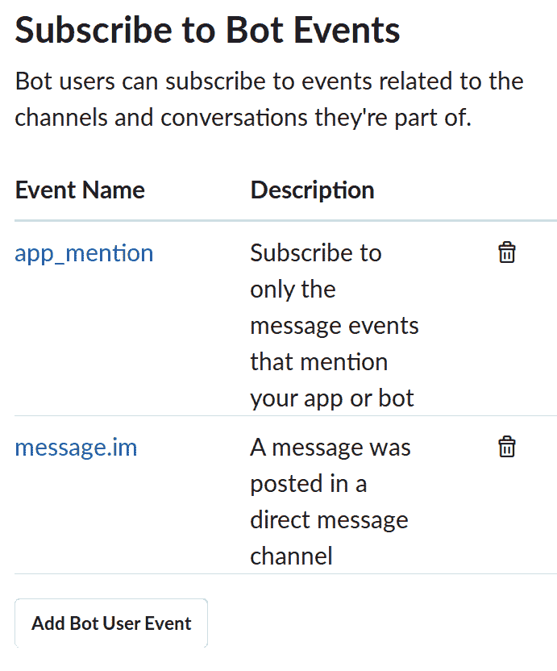
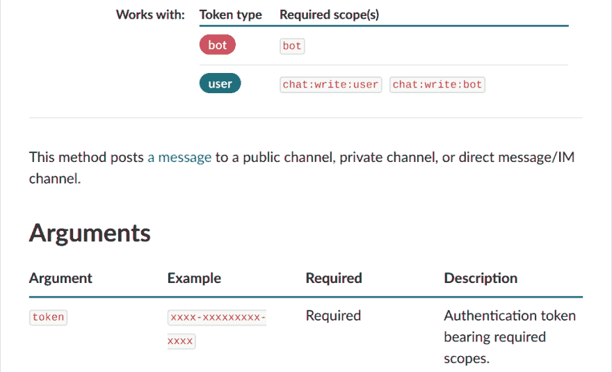
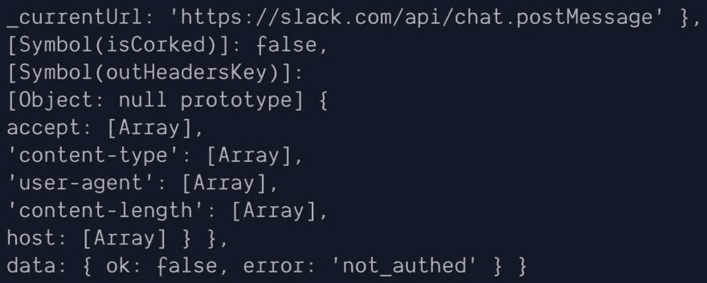
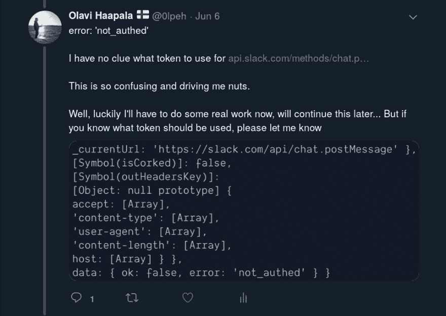
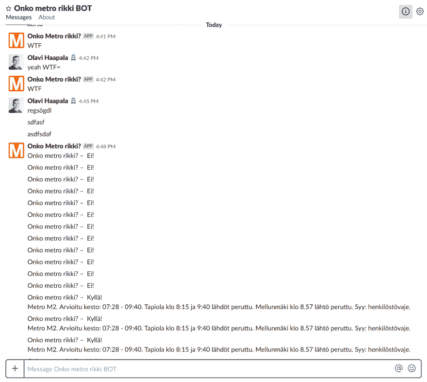
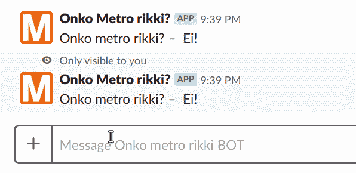

# 如何创建和部署 Slack Bot

> 原文：<https://dev.to/olpeh/how-to-create-and-deploy-a-slack-bot-47oi>

## 背景和期望

去年夏天，我作为一个初学者开始学习 Elm，在一个小而愚蠢的副业项目中使用它来通知赫尔辛基的人们地铁什么时候坏了。该项目名为“中野律纪地铁”(地铁坏了吗？)并且你可以在 [onkometrorikki.fi](https://onkometrorikki.fi) 进行测试。这个项目本来是一个笑话，但正如一些人指出的那样，它已经成为一项有用的服务，帮助人们节省通勤上班的时间。

### 推特机器人

这个项目已经进行了大约一年了。实现了基本的网站后，有人让我为“服务”实现一个 Twitter bot。一开始我有点犹豫，因为我以前从未实现过 Twitter 机器人。事实证明这是相对简单的。推特机器人可以在 [@onkometrorikki](https://twitter.com/onkometrorikki) 找到。我为 Twitter 机器人使用了一个名为 [twit](https://github.com/ttezel/twit) 的库。Twitter 机器人在 Heroku 运行，我也在那里运行服务的后端。后端获取实时交通警报提要，对其进行解析和缓存，并提供仅包含与 metro 相关的中断的响应。该馈送包含赫尔辛基地区所有本地交通的交通警报。

> 专业提示:
> 
> 如果你在 Twitter 上关注了 [@onkometrorikki](https://twitter.com/onkometrorikki) 并启用了该账户的通知功能，当地铁交通出现中断时，你会收到通知。

### 电报机器人

现在，Twitter 机器人已经可以使用了，并且在最初挣扎于不发微博或者过于激进的微博之后还能正常工作。接下来是什么？嗯，我开始考虑为“服务”创造一个电报机器人。在一个名为 [telegraf](https://github.com/telegraf/telegraf) 的图书馆的帮助下，这变得简单而有趣。电报机器人在 t.me/onkometrorikkibot 的 T2 可以买到，它和推特机器人运行在 Heroku 的同一个后端服务器上。

### 懈怠机器人

因为我已经为“服务”创建了一个 Twitter bot 和一个 Telegram bot，所以再创建和部署一个 bot 应该不会那么复杂，对吗？

> 期望:30 分钟
> 
> 现实:8.5h
> 
> –*我*关于创建一个简单的 Slack bot

## 现实

好吧，所以我准备创建一个松弛机器人，并期待它是相对容易的。我从搜索“创建一个 slack bot”开始，并在 [Slack 文档页面](https://get.slack.help/hc/en-us/articles/115005265703-Create-a-bot-for-your-workspace)上结束。文档起初看起来结构良好，表达清晰。

为了创建和部署一个工作的 Slack bot，我需要采取以下步骤:

### 1。开始

> 创建一个 Slack 应用程序(如果你还没有的话)。

我首先按照文档页面中的说明创建了一个 Slack 应用程序。

### 2。添加机器人用户

> 添加一个 bot 用户，并为您的 Bot 用户配置一些基本信息(显示名称、默认用户名及其在线状态)。

好吧，我继续添加了一个机器人用户。

### 3。事件 API

> 接下来，让您的 bot 访问事件 API。

这就是我困惑的地方。不太清楚这意味着什么，我的机器人需要什么样的访问权限。毕竟，我创造了一个简单的 Slack 机器人。原来我的应用程序需要访问`app_mention`和`message.im`事件，以响应直接消息和提及。

[](https://olavihaapala.img/10-slack-bot/events.png)

启用这些事件需要一个端点，Slack 将发送一个带有`challenge`参数的 HTTP POST 请求，我的端点应该用 HTTP 200 和`challenge`作为响应体来回复这个 POST。

这个代码的简化版本如下:

```
app.use(
  route.post('/slack/actions', async (ctx) => {
    const payload = ctx.request.body;

    if (payload.type === 'url_verification') {
      // TODO: verify this
      // Once you receive the event, verify the request's authenticity and
      // then respond in plaintext with the challenge attribute value
      ctx.response.statusCode = 200;
      ctx.response.body = payload.challenge;
    }
  })
); 
```

为了做到这一点，我需要设置 Slack 来使用 Slack 应用程序的本地环境。幸运的是，使用`ngrok`在本地开发 Slack 应用程序被很好地记录了下来，在启动我的本地应用程序后，这相对容易设置。

### 4。完全不相关的问题

我已经几个月没有接触代码库了。过了一会儿，当我再次尝试启动应用程序时，它并没有启动，只是抛出了一些错误。我想我以前见过这个，它一定是一些依赖的东西。所以，我跑去`npmplease`希望解决我所有的问题。如果你不知道`npmplease`是做什么的，看看 npmplease.com 的[。](http://npmplease.com/)

这不起作用，所以我尝试升级那些有更新版本的依赖项。为此，我使用了一个叫做[NPM-检查-更新](https://github.com/tjunnone/npm-check-updates)的工具。这也无济于事。原来原因是与我使用的节点版本(v12.2.0)有些不兼容。使用`nvm`很容易切换到使用节点 v8，这解决了这些问题:

```
nvm use 8 
```

### 5。将机器人添加到工作区

> 最后，将您的机器人添加到您的工作区。

将新创建的 bot 添加到工作区非常简单。我决定把它添加到我们的工作松弛区，对不起；).

### 6。回复一个事件？

现在我有了一个接收事件的机器人，我能够看到它确实这样做了。回复用户提及或者直接发消息给我的 bot 怎么样？

我想我可以用一个主体来回复事件 HTTP POST 请求，这个主体将被视为一条消息。这就是电报机器人的工作方式，我希望 Slack 也能这样工作。

结果证明我错了。Slack 希望您将事件处理与接收事件分开。他们建议您在收到事件时立即用 HTTP 200 进行回复，然后将该事件添加到一个单独的队列中，该队列将被异步处理。如果 Slack 没有足够快地收到响应，事件将被再次发送。

### 7。发布对松弛 API 的回应

结果是，为了能够发送消息，我需要向 Slack API 发出一个单独的 POST 请求。关于 [chat.postMessage 的文档可以在这里获得](https://api.slack.com/methods/chat.postMessage)。文档中提到了一个令牌，但是不清楚从哪里获得这个令牌。

[](https://olavihaapala.img/10-slack-bot/token.png)

我能从哪里得到代币？我不知道。还有，`chat:write:user`和`chat:write:bot`是什么意思？我以前没有见过他们。它们看起来像是某种需要添加的权限。用宽松的术语来说，它们是需要添加到令牌中的作用域，无论何时我想出从哪里获取令牌。

在我的 Slack 应用程序的`OAuth & Permissions`部分，我可以设置这些范围，它会为我创建 2 个令牌。其中一个叫`OAuth Access Token`，另一个叫`Bot User OAuth Access Token`。我应该使用哪一个？哪儿都没说。

> 机器人用户令牌表示与安装在工作空间中的应用程序相关联的机器人。只有当应用程序包括 Bot 用户并在安装期间明确要求 bot OAuth 范围时，才会提供 bot 用户令牌。机器人通常与对话式应用程序相关联，但它们可以做得更多(无机器人应用程序也可以是对话式的)。
> 
> 来源:【api.slack.com/docs/token-types#bot】T2

谢谢你什么都没做。

两种我都尝试过(多次)，没有任何运气。我从 Slack API 得到的回应是:

```
error: 'not_authed' 
```

如下图所示:

[](https://olavihaapala.img/10-slack-bot/error.jpg)

这快把我逼疯了，因为我不确定我是否有正确的令牌，或者错误是否在其他地方。你可以在我的推文中看到我的沮丧(点击图片查看原推文):

[](https://twitter.com/0lpeh/status/1136518208993841153)

经过一段时间的努力，我发现我的请求有效负载是作为字符串而不是 JSON 发送的。这就造成了问题。我一直有正确的令牌(我猜)。现在，我的机器人开始工作并多次响应事件，如下图所示:

[](https://olavihaapala.img/10-slack-bot/duplicates.png)

### 8。避免重复

结果是我的机器人甚至对自己发布的消息都有反应。我必须把这些过滤掉，但这还不够。有时它仍然会发布重复的回复。我必须通过检查事件 id 并忽略已经看到的事件来避免重复。

这是我的机器人的样子和工作原理的 GIF 图:

[](https://twitter.com/0lpeh/status/1138154635351461888)

这个机器人目前还没有公开发布。