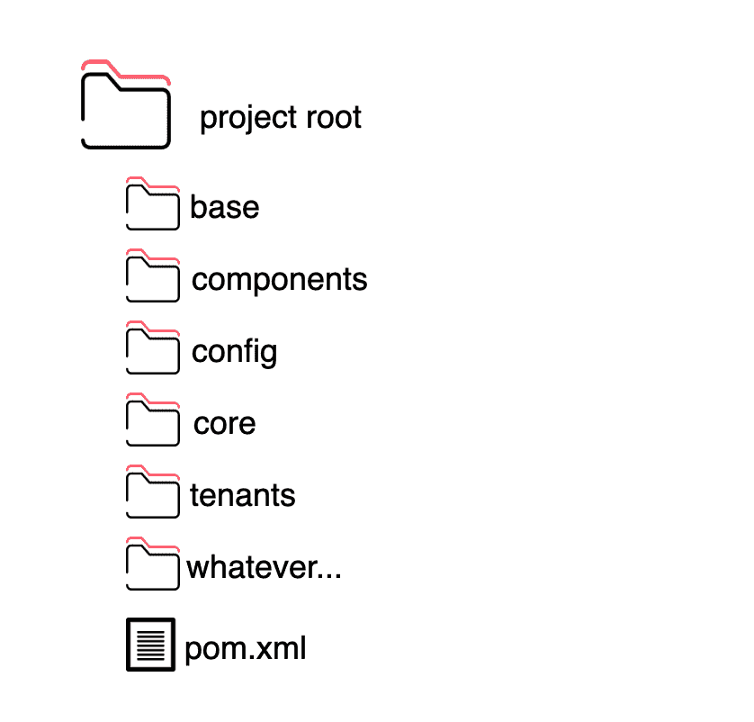
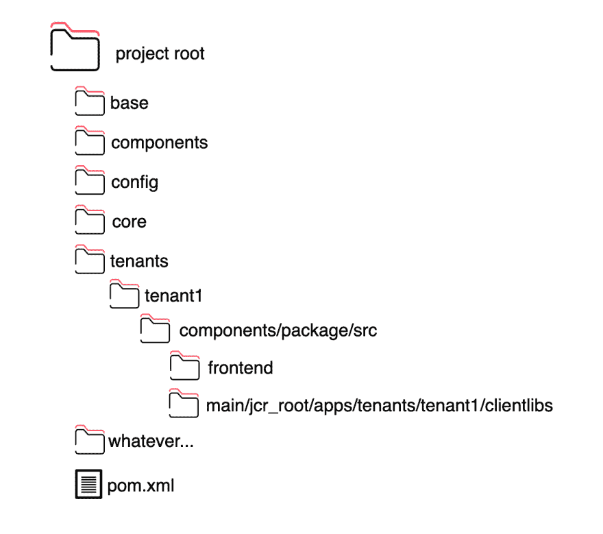
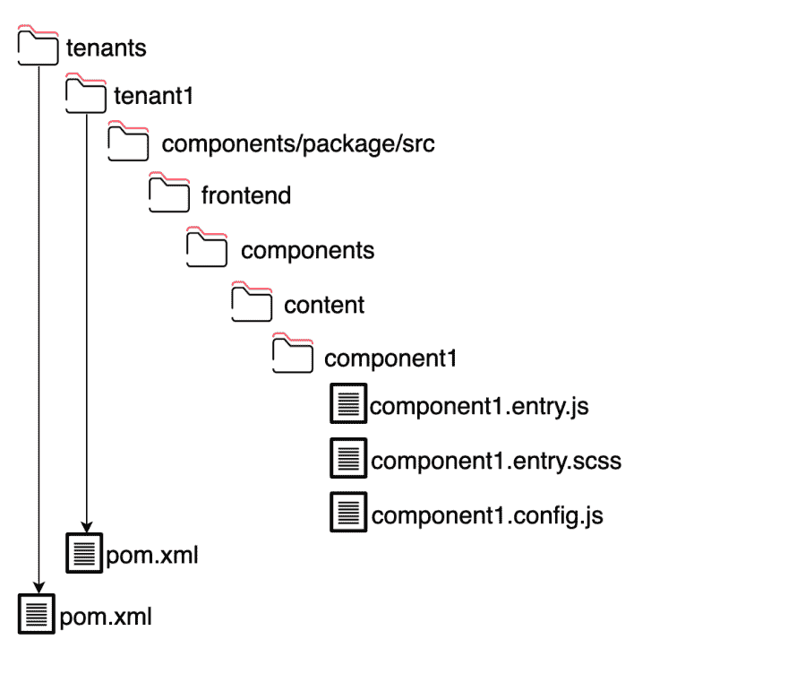
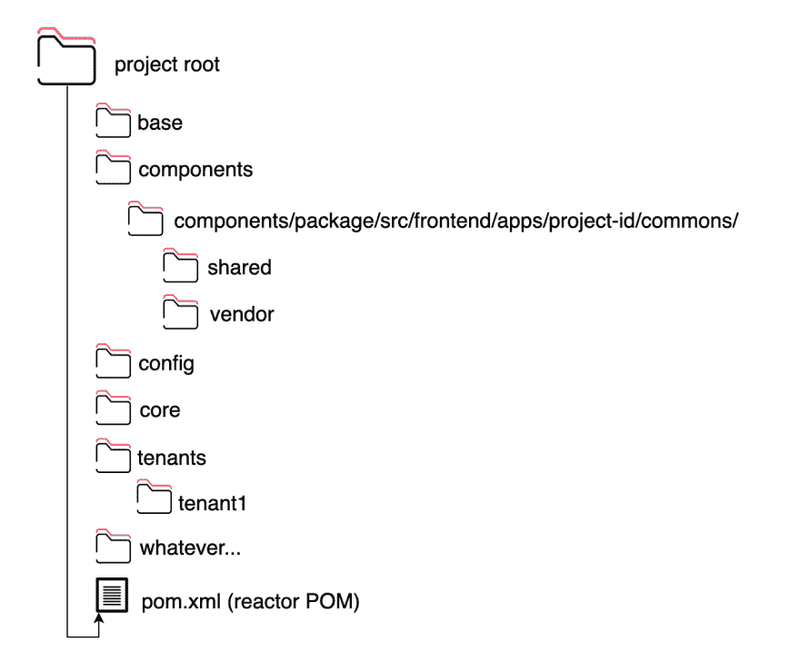

# 在多租户 AEM 项目中集成现代前端(第 1 部分)

> 原文：<https://dev.to/anfibiacreativa/integrating-a-modern-frontend-in-a-multi-tenant-aem-project-2l20>

我觉得是时候找个时间写这篇文章了。我确信不止一个从事 AEM 项目的前端开发人员(尤其是技术主管或前端架构师)会发现它很有用。非常重要的一点是，你要明白我在这里给出的建议是我个人的观点和偏好，但这是基于我在基于 AEM 的大型企业平台中担任前端技术主管 5 年的经验。

像每个建筑主题一样，它有点密集，所以我将它分成不同的子主题，以便更容易理解。

## 技术堆栈

我将假定整个项目遵循 maven 原型[https://Maven . Apache . org/guides/introduction/introduction-to-archetypes . html](https://maven.apache.org/guides/introduction/introduction-to-archetypes.html)(或者最好的情况下是 Adobe 原型)，显然，Maven 是将它们组合在一起的编译工具。其他假设，你使用的至少是 AEM 6.3 版本，Maven 3.5+，Java8，和 Sling 模型。(尽管后端技术无关紧要，但老实说，Maven 版本无关紧要)

在前端，我们的堆栈将是 ES6(现在没有框架，但我们将在稍后的步骤中集成一个-也称为新的 post-)，我们将使用 Redux 进行状态管理，显然我们的 html 将被编写为 HTL 模板。准备好了吗？

## 文件夹结构

你需要考虑的第一件事是你的文件夹结构。为了决定您的文件夹结构，您可能需要与后端技术主管或解决方案架构师合作。

通常他们会对这个主题有强烈的意见，并且(客户)的需求会起主要作用。让我们假设手中有一个大型企业项目。这可能意味着，在一个共同的依赖关系下的许多子项目。其中的每一个，我们都称之为“房客”。

所以我们提出下面的结构(我知道用 AEM 工作的人会觉得很熟悉，就不赘述了)。
在我们假设的项目中，吊索模型在我们的核心包中。html 文件(HTL 文件)、对话等将在我们的组件包中，与所有租户使用的公共前端文件(javascript 供应商、摘要和共享 sass 代码)一起，每个租户的前端文件(js 和 sass)文件将在各自的租户/租户名称包中。注意`tenants`是一个独立的模块。

## Clientlibs

如果您已经使用 AEM 一段时间了，作为前端或后端开发人员，您很可能熟悉 AEM 的前端代码模式，客户端库(被 AEM 开发人员称为 clientlibs)。你可以在这里阅读更多相关信息->[https://helpx . adobe . com/experience-manager/6-4/sites/developing/using/client libs . html](https://helpx.adobe.com/experience-manager/6-4/sites/developing/using/clientlibs.html)

Clientlibs 是分类的，(准确地说是通过为每个 client libs 声明一个类别名)，你可以拥有任意多的类别(记住这一点！).AEM 作为一个系统下载它自己的核心 clientlibs(例如，想想 granite，它使所有的创作界面对话都可以工作等等)。这个 clientlib，对 jQuery 有依赖性，所以如果你需要，你在前端就有 jQuery 可用，即使你自己没有介绍。(当然，您只能使用特定的版本！).

还记得我说过你可以拥有所有你想要的客户库吗？理论上，你可以。实际上，您可能希望根据为您的站点提供服务的协议来做出决定。如果是 http/2，(我鼓励你去争取！)每个组件或模块可能有一个 clientlib 类别。相反，如果您使用的是 HTTP 1.1，那么您可能更好地将所有包聚合成一个包，并按照“wcmmode”(作者或预览/发布)将它们作为一个单独的类别提供服务。在设计前端构建时，这是一个重要的决定。因此，请尽早向您的开发团队或架构师提出这个问题。我们将在以后的文章中讨论聚合和压缩。

请注意，AEM 本身支持 LESS 的编译。但是我们不会用它。我们将自己做我们的 CSS 预处理。

## 组件

在 AEM 的最新版本中，按照内容或结构对组件进行分类是一个很好的实践，这意味着它们是否具有结构功能，或者是否将被拖放到内容中。我相信这对于理解什么是公共资产或组件，以及什么服务于更专门、更具体的角色是非常有用的。

考虑到这一点，我们来看看租户内部的结构可能是什么样的:

此外，在每个组件文件夹中，都有一个

*   组件名.条目. scss
*   组件名.条目. js
*   componentname.config.js(必要时可选)

# 共享、抽象和厂商

在这篇文章的前面，我们提到了这些类别，并解释了它们被推荐存在于一个公共的依赖关系中。所谓共享和抽象，我们指的是诸如混合、函数、映射和全局变量之类的实用程序代码，它们是为了使这些代码工作而服务的。

由于这段代码由所有租户使用，我们将把它放在组件包中。不仅多次重复这段代码是有意义的，多次维护它也是没有意义的。它也不属于租户空间，在这里只有特定于租户的代码必须。

现在我们已经添加了所有这些，我们的结构看起来如下。

# 前端构建

现在我们终于可以开始有趣的部分了。安装和配置我们的前端构建。我建议将这个全局前端构建在一个单独的模块中。如果你想了解更多(我们将使用什么技术，我们将如何配置它来抓取我们的条目，等等)，请阅读下一篇文章！

当我写的时候，你可以看这个视频:

[https://www.youtube.com/embed/XGrNepE_s6I](https://www.youtube.com/embed/XGrNepE_s6I)