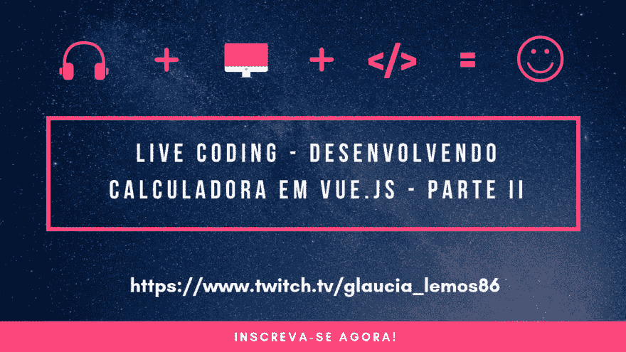
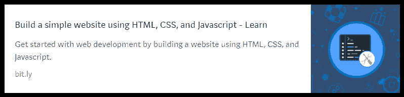
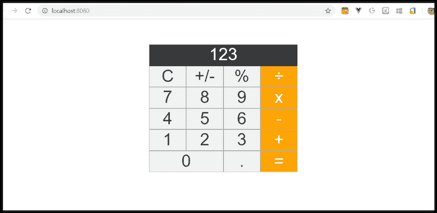
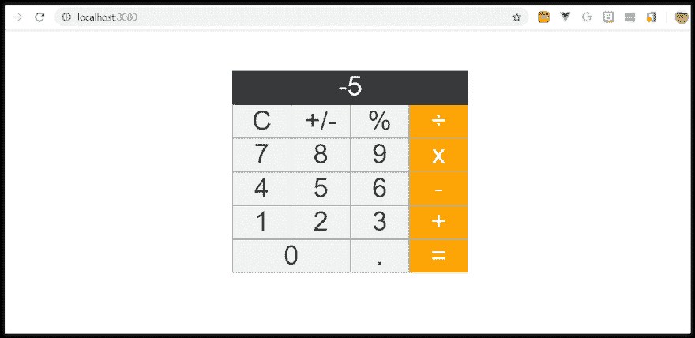
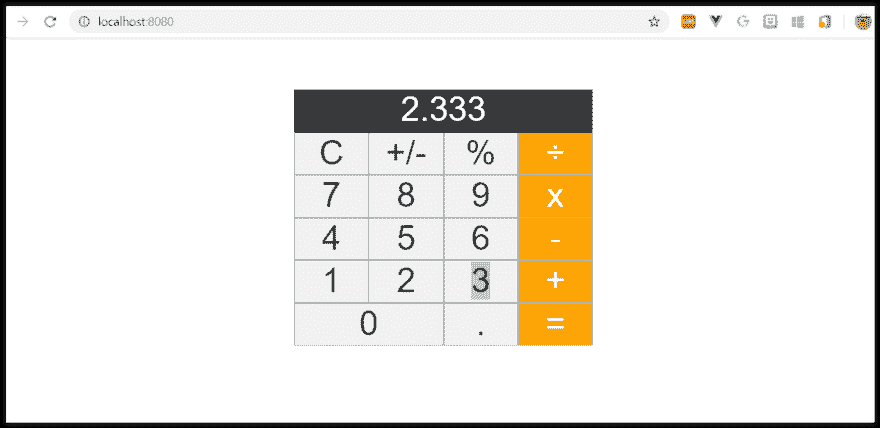
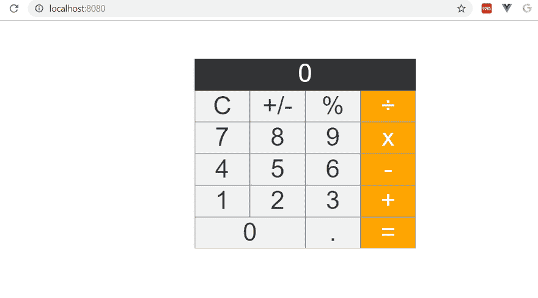
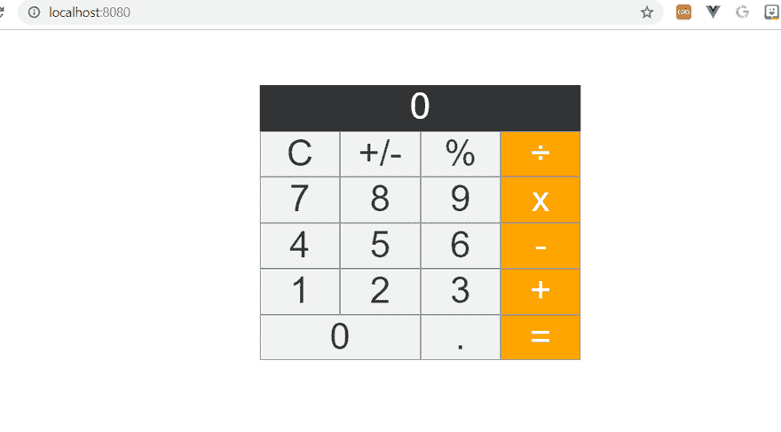
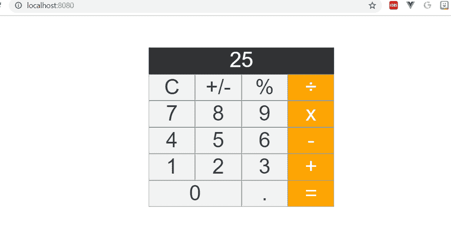
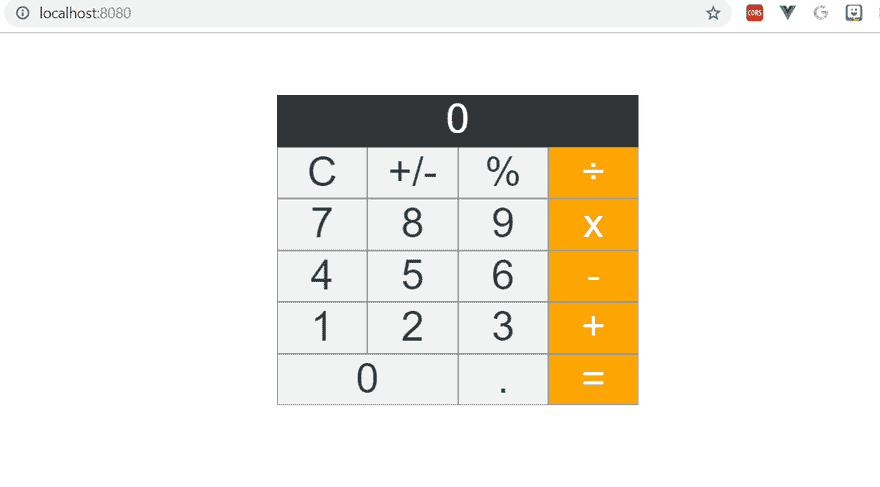

# 在 vue . js 中开发计算器 javascript 中的逻辑

> [https://dev . to/azure/development-即时计算器-js-逻辑-no-javascript-15n6](https://dev.to/azure/desenvolvendo-calculadora-em-vue-js-logica-no-javascript-15n6)

[](https://res.cloudinary.com/practicaldev/image/fetch/s--X0r5yakR--/c_limit%2Cf_auto%2Cfl_progressive%2Cq_auto%2Cw_880/https://i.postimg.cc/RhfznY33/Evento-Twitch-Glaucia-Lemos.png)

否 **[【最新帖子】](https://dev.to/glaucia86/desenvolvendo-calculadora-em-vue-js-parte-i-2dc1)** 我们只是尝试用 vista . js 创建我们计算器的. css 侧。

今天，我们将重点讨论该计算器按钮在 JavaScript 中的动作逻辑。你会发现使用 vue . js 来操作 JavaScript 是多么容易。

忆及为了延续这一系列文章，需要事先掌握: **HTML，CSS & JavaScript。**

如果您不知道，我推荐以下两门完全免费的课程:

[](https://docs.microsoft.com/pt-br/learn/modules/build-simple-website/?WT.mc_id=devto-blog-gllemos)

[](https://docs.microsoft.com/pt-br/learn/modules/develop-web-apps-with-vs-code/?WT.mc_id=devto-blog-gllemos)

我们开始吧？！

## 开发‘显示’

打开**[【visual studio 代码】](https://code.visualstudio.com/?WT.mc_id=devto-blog-gllemos)** 。之后打开文件夹: **src** ，然后打开文件**【计算器】vista**

让我们把焦点放在**脚本**的标签部分上。
这正是我们计算器的全部逻辑将要发生的地方！

键入以下代码:

```
<script>

export default {
  data() {
    return {
      valorCorrente: '123',
    };
  },
};

</script> 
```

Enter fullscreen mode Exit fullscreen mode

我们在这里创建一个变量，它将负责我们计算器的“显示”。

完成后，请让应用程序在旁边运行，这样我们就可以跟踪进度，并确保一切顺利。

在“模板”部分中，添加以下代码行:

```
<template>
  <div class="calculadora">
    <div class="display">{{valorCorrente || '0'}}</div>
    <div class="botao">C</div>
    <div class="botao">+/-</div>
    <div class="botao">%</div>
    <div class="botao operadores">÷</div>
    <div class="botao">7</div>
    <div class="botao">8</div>
    <div class="botao">9</div>
    <div class="botao operadores">x</div>
    <div class="botao">4</div>
    <div class="botao">5</div>
    <div class="botao">6</div>
    <div class="botao operadores">-</div>
    <div class="botao">1</div>
    <div class="botao">2</div>
    <div class="botao">3</div>
    <div class="botao operadores">+</div>
    <div class="botao zero">0</div>
    <div class="botao">.</div>
    <div class="botao"> = </div>
  </div>
</template> 
```

Enter fullscreen mode Exit fullscreen mode

然后运行应用程序，并应如下图所示:

[](https://postimg.cc/5H4qWztc)

我们的计算器显示已经开始工作了。现在，让我们来建立其他按钮的逻辑！

## 开发‘c’按钮

计算器中以字母 c 表示的“清除”按钮将按如下方式开发。

导航到模板标记并包括以下代码:

```
<template>
  <div class="calculadora">
    <div class="display">{{valorCorrente || '0'}}</div>
    <div @click="limpar" class="botao"></div>
    (...)
  </div>
</template> 
```

Enter fullscreen mode Exit fullscreen mode

请注意，我们包括了【% t0】@ click。这表示我们将开始处理 vista . js 中的事件。如果您想了解更多信息，只需访问 vista . js 中的文档，该文档仅涉及此部分-

对于所有涉及单击的按钮，我们将使用此功能。可以是:

*   @click= " "
*   v-on:click= " "

两种方法都是正确的。最常用的是: **v-on:点击**。所以，让我们用最酷的方式。

下面我们现在做的是，把 **v-on:click** 的所有动作放到现在的所有按钮上:

```
<template>
  <div class="calculadora">
    <div class="display">{{valorCorrente || '0'}}</div>
    <div v-on:click="limpar" class="botao">C</div>
    <div v-on:click="" class="botao">+/-</div>
    <div v-on:click="" class="botao">%</div>
    <div v-on:click="" class="botao operadores">÷</div>
    <div v-on:click="" class="botao">7</div>
    <div v-on:click="" class="botao">8</div>
    <div v-on:click="" class="botao">9</div>
    <div v-on:click="" class="botao operadores">x</div>
    <div v-on:click="" class="botao">4</div>
    <div v-on:click="" class="botao">5</div>
    <div v-on:click="" class="botao">6</div>
    <div v-on:click="" class="botao operadores">-</div>
    <div v-on:click="" class="botao">1</div>
    <div v-on:click="" class="botao">2</div>
    <div v-on:click="" class="botao">3</div>
    <div v-on:click="" class="botao operadores">+</div>
    <div v-on:click="" class="botao zero">0</div>
    <div v-on:click="" class="botao">.</div>
    <div v-on:click="" class="botao operadores"> = </div>
  </div>
</template> 
```

Enter fullscreen mode Exit fullscreen mode

现在，让我们发展清理的逻辑。转到标记
脚本并包括以下方法:

```
<script>
export default {
  data() {
    return {
      valorCorrente: '',
      numeroAnterior: null,
      operador: null,
      operadorClicado: false,
    };
  },
  methods: {
    limpar() {
      this.valorCorrente = '';
    }
  }
</script> 
```

Enter fullscreen mode Exit fullscreen mode

运行应用程序，看看它是否能正常工作！

## 开发“+”按钮

现在，我们将通过更改以下代码来开发计算器按钮**+/**。

在**模板**中创建功能**信号** :

```
<template>
  <div class="calculadora">
    <div v-on:click="sinal" class="botao">+/-</div>
  </div>
</template> 
```

Enter fullscreen mode Exit fullscreen mode

在**脚本**中制定方法**信号**T4】

```
<script>
  sinal() {
      this.valorCorrente = this.valorCorrente.charAt(0) === '-'
        ? this.valorCorrente.slice(1)
        : `-${this.valorCorrente}`;
    }
</script> 
```

Enter fullscreen mode Exit fullscreen mode

我们在这次行动中使用的是**和**切片**。为了更好地了解这些方法，我建议阅读以下内容:**

 ***   **图一【图二】【图三】**
*   **[切片](https://developer.mozilla.org/pt-BR/docs/Web/JavaScript/Reference/Global_Objects/Array/slice)**

如果运行计算器，您将看到+/-符号工作正常。

[](https://postimg.cc/ygjv0hYn)

我们继续前进！

## 开发按钮“%”

从现在开始，逻辑永远是这样的:在**模板**标签中的**v-on:click = "**动作中创建方法，然后在**脚本**标签中开发该方法的逻辑。

```
<template>
  <div class="calculadora">
    <div v-on:click="porcentagem" class="botao">%</div>
  </div>
</template> 
```

Enter fullscreen mode Exit fullscreen mode

```
<script>
  porcentagem() {
      this.valorCorrente = `${parseFloat(this.valorCorrente) / 100}`;
    },
</script> 
```

Enter fullscreen mode Exit fullscreen mode

运行应用程序，查看它是否工作正常。

## 发展数字结合

如果你看看这篇文章的这一点，这些数字并不相吻合。为此，我们将修改标记**模板**
中的代码如下

```
<template>
  <div class="calculadora">
    <div class="display">{{valorCorrente || '0'}}</div>
    <div v-on:click="limpar" class="botao">C</div>
    <div v-on:click="sinal" class="botao">+/-</div>
    <div v-on:click="porcentagem" class="botao">%</div>
    <div v-on:click="" class="botao operadores">÷</div>
    <div v-on:click="juntarNumeros('7')" class="botao">7</div>
    <div v-on:click="juntarNumeros('8')" class="botao">8</div>
    <div v-on:click="juntarNumeros('9')" class="botao">9</div>
    <div v-on:click="" class="botao operadores">x</div>
    <div v-on:click="juntarNumeros('4')" class="botao">4</div>
    <div v-on:click="juntarNumeros('5')" class="botao">5</div>
    <div v-on:click="juntarNumeros('6')" class="botao">6</div>
    <div v-on:click="" class="botao operadores">-</div>
    <div v-on:click="juntarNumeros('1')" class="botao">1</div>
    <div v-on:click="juntarNumeros('2')" class="botao">2</div>
    <div v-on:click="juntarNumeros('3')" class="botao">3</div>
    <div v-on:click="" class="botao operadores">+</div>
    <div v-on:click="juntarNumeros('0')" class="botao zero">0</div>
    <div v-on:click="" class="botao">.</div>
    <div v-on:click="" class="botao operadores"> = </div>
  </div>
</template> 
```

Enter fullscreen mode Exit fullscreen mode

e 在标记脚本中，执行以下操作:

```
<script>
  juntarNumeros(numero) {
      if (this.operadorClicado) {
        this.valorCorrente = '';
        this.operadorClicado = false;
      }

      this.valorCorrente = `${this.valorCorrente}${numero}`;
    },
</script> 
```

Enter fullscreen mode Exit fullscreen mode

现在运行该应用程序时，您将看到计算已经获得了比以前更多的功能。我们继续吧，现在只剩几分钟了！

## 开发按钮’(点)

每个计算器都需要点，不是吗？对我们来说不会有什么不同！
包括以下代码块:

```
<template>
  <div class="calculadora">
    <div v-on:click="ponto" class="botao">.</div>
  </div>
</template> 
```

Enter fullscreen mode Exit fullscreen mode

```
<script>
  ponto() {
        if (this.valorCorrente.indexOf('.') === -1) {
          this.juntarNumeros('.');
        }
      },
</script> 
```

Enter fullscreen mode Exit fullscreen mode

运行应用程序，单击“点”按钮，然后查看结果:

[](https://postimg.cc/LgFL8gV3)

## 我发展了对显示屏上的数字进行筛选的逻辑

计算器的开发即将完成，请注意，现在只需开发最容易开发的数学运算符。但在我们开始行动之前我们需要创造一个逻辑来指向数字。

例如:如果要计算两个数字(10 + 5)的总和，我们需要创建一个逻辑，当用户单击操作按钮时，需要在显示屏上箭头这些数字，对吗？为此，我们将包括以下代码块:

```
<script>
  setarValor() {
      this.numeroAnterior = this.valorCorrente;
      this.operadorClicado = true;
    },
</script> 
```

Enter fullscreen mode Exit fullscreen mode

好了！够了！现在，是的，我们可以开发包括结果在内的 4 个数学运算，以便最终完成我们的计算器！

## 开发按钮' = '(结果)

在开发 4 个操作之前，我们先开发结果按钮' = '。为此，
包括以下代码块:

```
<template>
  <div class="calculadora">
    <div v-on:click="resultado" class="botao operadores"> = </div>  
  </div>
</template> 
```

Enter fullscreen mode Exit fullscreen mode

```
<script>
  resultado() {
      this.valorCorrente = `${this.operador(
        parseFloat(this.numeroAnterior),
        parseFloat(this.valorCorrente),
      )}`;
      this.numeroAnterior = null;
    },
</script> 
```

Enter fullscreen mode Exit fullscreen mode

现在是的，除了开发四个数学运算，我们还可以测试它们是否正常工作。我们继续说，快结束了。

## 开发【分割】按钮

再次，在**模板**标签中加入分割方法，并在**脚本**标签中制定分割逻辑，如下所示:

```
<template>
  <div class="calculadora">
    <div v-on:click="dividir" class="botao operadores">÷</div>  
  </div>
</template> 
```

Enter fullscreen mode Exit fullscreen mode

```
<script>
  dividir() {
      this.operador = (num1, num2) => num1 / num2;
      this.setarValor();
    },
</script> 
```

Enter fullscreen mode Exit fullscreen mode

请参见下面的 gif 输出:

[](https://gifyu.com/image/ExVB)

## 开发【x】(乘)按钮

包括以下代码:

```
<template>
  <div class="calculadora">
    <div v-on:click="multiplicar" class="botao operadores">x</div>  
  </div>
</template> 
```

Enter fullscreen mode Exit fullscreen mode

```
<script>
  multiplicar() {
      this.operador = (num1, num2) => num1 * num2;
      this.setarValor();
    },
</script> 
```

Enter fullscreen mode Exit fullscreen mode

结果 a...

[](https://gifyu.com/image/ExVX)

## 开发‘-’(减少)按钮

包括以下代码:

```
<template>
  <div class="calculadora">
    <div v-on:click="diminuir" class="botao operadores">-</div>  
  </div>
</template> 
```

Enter fullscreen mode Exit fullscreen mode

```
<script>
  diminuir() {
      this.operador = (num1, num2) => num1 - num2;
      this.setarValor();
    },
</script> 
```

Enter fullscreen mode Exit fullscreen mode

让我们测试一下-我...。

[](https://gifyu.com/image/ExZz)

我们就快完成了-我...。现在，让我们开发我们的最后一个计算器按钮！

## 开发“+”按钮(求和)

包括以下代码:

```
<template>
  <div class="calculadora">
    <div v-on:click="somar" class="botao operadores">+</div>  
  </div>
</template> 
```

Enter fullscreen mode Exit fullscreen mode

```
<script>
  somar() {
      this.operador = (num1, num2) => num1 + num2;
      this.setarValor();
    },
</script> 
```

Enter fullscreen mode Exit fullscreen mode

现在，让我们测试一下计算器上的所有按钮！

[](https://gifyu.com/image/ExZT)

我们终于完成了我们的计算器！

## 结语

如你所见，**[vista . js](https://br.vuejs.org/v2/guide/index.html)**简单、动态、实用。由于您的学习曲线和实用性，我建议您使用“快速开发单页应用程序”(SPA)框架。

下面是 GitHub 中已开发和提供的代码:

**[发达代码链接──计算器](https://github.com/glaucia86/live-coding-vuejs-calculadora)**

如果你想跟踪这篇视频文章的发展，我在 Twitter 和 Youtube 上进行了实时流，解释了计算机开发的步骤:

**[视频链接:开发 vista . js-第二部分](https://youtu.be/UgK7vt70rN4)** 计算器

但请注意，文件“calculator . vista”正在使用 vista . js 文档所称的“t0”[【single file components】](https://br.vuejs.org/v2/guide/single-file-components.html)。这是什么意思？所有标签:模板、脚本和样式都定义在一个文件中。
我真诚地不太喜欢这个定义。

为此，在下一篇文章中，我将向您解释并演示，您可以将这些标记分开，只将模板保留在“calculadora . vue”文件中，然后在其中调用脚本文件和 css 文件，从而使项目更干净、更易于理解！

那就等下一篇报道吧！

还有，如果你想知道更多的消息，请继续关注我在 twitter 上！

[](https://twitter.com/glaucia_lemos86)

一点也不。Até a próxima！😍**