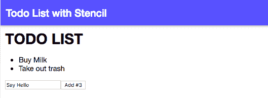

# 使用 Stencil.js 创建可重用的 Web 组件

> 原文：<https://dev.to/theodesp/creating-reusable-web-components-with-stencil-js-4oc6>

[**阅读原文**](https://codethat.today/tutorial/creating-components-with-stenciljs/)

如果你认为我们会引入另一个 Javascript 框架，你可以继续阅读，不必担心。正如它的创建者所阐明的， [Stencil.js](https://stenciljs.com/) 不是一个框架——相反，它是一个 web 组件的编译器。

Web 组件本质上是 web 开发的未来。它们基本上是可以在现代浏览器上工作的 HTML 标签，可以与任何支持 HTML 的 JavaScript 库或框架一起使用；不再有 React.js vs. Angular vs. Vue.js 的争论，因为它们基于现有的 web 标准，允许开发人员轻松地用新元素、封装的样式和自定义行为扩展 HTML，而无需花费时间调试 volatile 库。

在这篇文章中，我们将使用模板工具创建一个小的待办事项列表应用程序，并介绍 web 组件的基础知识。这个例子假设您已经准备好了一个开发环境。你也可以在 [GitHub](https://github.com/theodesp/todolist-stencil) 上找到本教程的代码。

我们开始吧。

## 模板项目启动者

Stencil 为我们提供了使用 TypeScript 和 JSX 编写 web 组件的工具，并且可以编译成普通的 web 组件供任何框架使用。

1.  让我们从克隆模板初学者工具包开始:

```
$ git clone https://github.com/ionic-team/stencil-starter.git todolist-stencil 
```

<svg width="20px" height="20px" viewBox="0 0 24 24" class="highlight-action crayons-icon highlight-action--fullscreen-on"><title>Enter fullscreen mode</title></svg> <svg width="20px" height="20px" viewBox="0 0 24 24" class="highlight-action crayons-icon highlight-action--fullscreen-off"><title>Exit fullscreen mode</title></svg>

1.  导航到新目录并安装项目依赖项:

```
$ cd todolist-stencil && npm install 
```

<svg width="20px" height="20px" viewBox="0 0 24 24" class="highlight-action crayons-icon highlight-action--fullscreen-on"><title>Enter fullscreen mode</title></svg> <svg width="20px" height="20px" viewBox="0 0 24 24" class="highlight-action crayons-icon highlight-action--fullscreen-off"><title>Exit fullscreen mode</title></svg>

1.  删除 app-profile 和 app-home 文件夹，并分别更新 my-app 组件，因为本演示不需要它们。

```
$ rm -rf src/components/app-profile && rm -rf src/components/app-home 
```

<svg width="20px" height="20px" viewBox="0 0 24 24" class="highlight-action crayons-icon highlight-action--fullscreen-on"><title>Enter fullscreen mode</title></svg> <svg width="20px" height="20px" viewBox="0 0 24 24" class="highlight-action crayons-icon highlight-action--fullscreen-off"><title>Exit fullscreen mode</title></svg>

文件:src/components/my-app.tsx

```
import { Component } from '@stencil/core';

@Component({
 tag: 'my-app',
 styleUrl: 'my-app.css'
})
export class MyApp {
 render() {
   return (
     <div>
       <header>
         <h1 class="heading">Todo List with Stencil</h1>
       </header>
       <main>
         <todo-app>
       </todo-app></main>
     </div>
   );
 }
} 
```

<svg width="20px" height="20px" viewBox="0 0 24 24" class="highlight-action crayons-icon highlight-action--fullscreen-on"><title>Enter fullscreen mode</title></svg> <svg width="20px" height="20px" viewBox="0 0 24 24" class="highlight-action crayons-icon highlight-action--fullscreen-off"><title>Exit fullscreen mode</title></svg>

如您所见，组件格式遵循 Angular 和 React.js 结构的混合，使用 decorators 添加元数据，使用 render 方法定义 HTML。我们还可以定义一个 CSS 文件 URL，用于限定范围的组件样式规则。

1.  创建 todo-app 文件夹，并为我们的示例添加代码:

```
import {Component, State} from '@stencil/core';
import {TodoItem} from "../../models/todoItem";

@Component({
 tag: 'todo-app',
 styleUrl: 'todo-app.css'
})
export class TodoApp {
 @State() items: TodoItem[] = [];
 @State() text: string;

 render() {
   const handleOnChange = (e) => this.handleOnChange(e);
   const handleSubmit = (e) => this.handleSubmit(e);
   return (
     <div class="todo-app">
       <h1>TODO LIST</h1>
       <todo-list todoitems="{this.items}/">
       <todo-list-form onsubmit="{handleSubmit}" oninputchange="{handleOnChange}" todoitemslength="{this.items.length}/">
     </todo-list-form></todo-list></div>
   );
 }
 private handleSubmit(e) {
   e.preventDefault();
   if (!this.text.length) {
     return;
   }
   const newItem = new TodoItem(this.text);
   this.text = '';
   this.items = [...this.items, newItem];
 }
 private handleOnChange(e) {
   this.text = e.detail;
 }
} 
```

<svg width="20px" height="20px" viewBox="0 0 24 24" class="highlight-action crayons-icon highlight-action--fullscreen-on"><title>Enter fullscreen mode</title></svg> <svg width="20px" height="20px" viewBox="0 0 24 24" class="highlight-action crayons-icon highlight-action--fullscreen-off"><title>Exit fullscreen mode</title></svg>

这里我们定义了一个新组件，它将呈现我们添加的现有条目列表，以及我们用来添加待办事项列表条目的输入表单。注意`@State`装饰器的用法，因为它被用来分配本地组件状态，就像 React 一样。当我们更改该属性的值时，组件呈现方法会被再次调用。

让我们看看待办事项列表的内容:

```
$ mkdir src/components/todo-list && touch src/components/todo-list/todo-list.tsx 
```

<svg width="20px" height="20px" viewBox="0 0 24 24" class="highlight-action crayons-icon highlight-action--fullscreen-on"><title>Enter fullscreen mode</title></svg> <svg width="20px" height="20px" viewBox="0 0 24 24" class="highlight-action crayons-icon highlight-action--fullscreen-off"><title>Exit fullscreen mode</title></svg>

文件:src/components/todo-list/todo-list . tsx

```
import { Component , Prop } from '@stencil/core';
import { TodoItem } from "../../models/todoItem";

@Component({
 tag: 'todo-list'
})
export class TodoList {
 @Prop() todoItems: TodoItem[];

 render() {
   return (
     <ul class="todo-list">
       {
         this.todoItems.map((item: TodoItem) => (
           <li>{item.text}</li>
         ))
       }
     </ul>
   );
 }
} 
```

<svg width="20px" height="20px" viewBox="0 0 24 24" class="highlight-action crayons-icon highlight-action--fullscreen-on"><title>Enter fullscreen mode</title></svg> <svg width="20px" height="20px" viewBox="0 0 24 24" class="highlight-action crayons-icon highlight-action--fullscreen-off"><title>Exit fullscreen mode</title></svg>

在这个组件中，我们使用`@Prop()`装饰器从父组件接收属性并呈现它们。

现在，让我们看看 todo-list-form 的内容:

```
import { Component, Prop, Event, EventEmitter, State } from '@stencil/core';

@Component({
 tag: 'todo-list-form'
})
export class TodoListForm {
 @Prop() todoItemsLength: number;
 @State() value: string = '';
 @Event() inputChange: EventEmitter;
 @Event() submit: EventEmitter;

 handleOnChange(e) {
   this.value = e.target.value;
   this.inputChange.emit(this.value)
 }
 handleOnSubmit(e) {
   e.preventDefault();
   this.submit.emit(this.value);
   this.value = '';
 }

 render() {
   const handleOnChange = (e) => this.handleOnChange(e);
   const handleOnSubmit = (e) => this.handleOnSubmit(e);
   return (
     <form class="todo-list-form" onsubmit="{handleOnSubmit}">
       <input type="text" oninput="{handleOnChange}" value="{this.value}">
       <button>
         Add #{this.todoItemsLength + 1}
       </button>
     </form>
   );
 }
} 
```

<svg width="20px" height="20px" viewBox="0 0 24 24" class="highlight-action crayons-icon highlight-action--fullscreen-on"><title>Enter fullscreen mode</title></svg> <svg width="20px" height="20px" viewBox="0 0 24 24" class="highlight-action crayons-icon highlight-action--fullscreen-off"><title>Exit fullscreen mode</title></svg>

这里我们用`@Event()`装饰器展示事件处理的用法。我们绑定变更和提交事件，并将内容发送到父元素，即 todo-app 组件。

最后，我们来定义一下`TodoItem`模型:

```
$ mkdir src/models && touch src/models/todo-item.ts 
```

<svg width="20px" height="20px" viewBox="0 0 24 24" class="highlight-action crayons-icon highlight-action--fullscreen-on"><title>Enter fullscreen mode</title></svg> <svg width="20px" height="20px" viewBox="0 0 24 24" class="highlight-action crayons-icon highlight-action--fullscreen-off"><title>Exit fullscreen mode</title></svg>

文件:src/models/todo-item.ts

```
export class TodoItem {
 text: string;
 constructor(text: string) {
   this.text = text;
 }
} 
```

<svg width="20px" height="20px" viewBox="0 0 24 24" class="highlight-action crayons-icon highlight-action--fullscreen-on"><title>Enter fullscreen mode</title></svg> <svg width="20px" height="20px" viewBox="0 0 24 24" class="highlight-action crayons-icon highlight-action--fullscreen-off"><title>Exit fullscreen mode</title></svg>

现在我们准备运行我们的应用程序:

```
$ npm run dev 
```

<svg width="20px" height="20px" viewBox="0 0 24 24" class="highlight-action crayons-icon highlight-action--fullscreen-on"><title>Enter fullscreen mode</title></svg> <svg width="20px" height="20px" viewBox="0 0 24 24" class="highlight-action crayons-icon highlight-action--fullscreen-off"><title>Exit fullscreen mode</title></svg>

接下来，导航到`http://localhost:3333`并与页面交互。以下是一个视图示例:

[](https://res.cloudinary.com/practicaldev/image/fetch/s--vTgWZydV--/c_limit%2Cf_auto%2Cfl_progressive%2Cq_auto%2Cw_880/https://thepracticaldev.s3.amazonaws.com/i/qbceidyytlmui14p30qy.png)

## 结论

在本教程中，我们使用 Stencil.js 组件编译器制作了一个演示 web 应用程序。与 React 相比，使用 Stencil 开发 web 组件没有太大的区别，因此转换开销很小。如果您是一名 web 开发人员，想要基于标准的组件并易于开发它们，那么您将从这个库受益。至于我，我必须完成我的待办事项！

## 有用的链接

1.  [**官网**](https://stenciljs.com/):stencil . js 官网
2.  [**Web 组件**](https://www.webcomponents.org/introduction):Web 组件简介