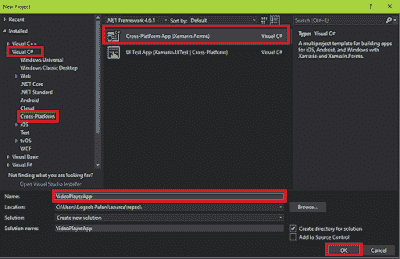

# Xamarin 中的视频播放器应用程序。形式

> 原文：<https://dev.to/logeshpalani98/video-player-app-in-xamarin-forms-3cih>

### * *简介**

```
 In this article, we are going to play a video and an audio in Xamarin.Forms application.There is no default function available for playing the video or audio. So, we need to add a plugin for this. 
```

### * *Nuget 包**

*Xamarin。表单=搜索”插件。MediaManager.Forms”。*

*Xamarin。Android =搜索”插件。MediaManager”。*

**MediaManager 跨平台媒体插件特性**

*   设计简单，易于操作
*   独立，便于与现有项目和框架集成
*   远程和本地媒体文件的本地回放
*   本地媒体通知和远程控制
*   播放状态(播放、缓冲、加载、暂停、进度)

### **输出🐱‍👤**

[](https://1.bp.blogspot.com/-CCEhJv9P53w/XQpWvSY8y1I/AAAAAAAAOPU/4DIthWsxANYpyYz3w1mLMfYRGla7iiwRwCLcBGAs/s1600/Video%2BPlayer%2BResult.gif)

### **第一步**

您可以创建 Xamarin。通过转到文件>>新建>> Visual C# > >跨平台> >跨平台应用程序(Xamarin。原生或 Xamarin。表单)，给出应用程序名称，然后按 OK。

(项目名称:VideoPlayerApp)

[](https://1.bp.blogspot.com/-WgZeHIdrPEA/XQpW1Cd4aII/AAAAAAAAOPY/_hjca1Fq8EUgZ69V5doprDZ6CMYeOB0vACLcBGAs/s1600/Video%2BPlayer%2BNew.png)

### **第二步:**

```
 After the project creation, add the following NuGet Packages to your project. 
```

*   Plugin.MediaManager
*   插件。MediaManager.Forms

    ```
     For that, go to Solution Explorer and select your solution. Right-click and select Manage NuGet Packages for the Solution". Now, select the following NuGet Package and select your project to install it. 
    ```

*   [插件。MediaManager.Forms](https://www.nuget.org/packages/Plugin.MediaManager.Forms/)

### **第三步:**

```
 In this step, add a VideoView control to your project. For that, go to Solution Explorer \>\> VideoPlayerApp (PCL) \>\> double click on MainPage.Xaml. After opening this, you can add VideoView assembly and XAML code to your project. 
```

如下所示编写代码。

**组装**

**XAML 电码**

### **第四步:**

### 接下来，打开解决方案浏览器>>VideoPlayerApp(PCL)>>main page . xaml . cs 页面，双击打开其设计视图。代码如下。

**代码在**后面

### **第五步:**

### 确保调用“VideoViewRenderer。init()；"否则视频视图将不准备显示视频。

**Android 项目**

进入解决方案浏览器> > VideoPlayerApp 添加 Android 项目。Droid > > MainActivity.cs 并双击打开其设计视图。这是代码。

**MainActivity.cs 代码**

**IOS 项目**
** **添加 IOS 项目。为此，请访问解决方案浏览器> > VideoPlayerApp。IOS > > AppDelegate.cs，点击打开 AppDelegate.cs，下面是这个页面的代码。

**AppDelegate.cs 代码**

**通用视窗项目**

```
 Add Universal Windows project. For that, open Solution Explorer \>\>VideoPlayerApp.UWP \>\> MainPage.xaml.cs and click open MainPage.xaml.cs. 
```

将下面给出的代码添加到本页。

**MainActivity.xaml.cs 代码**

### **第六步:**

### **单击“F5”或“构建”运行您的项目。运行这个项目，你会得到如下结果。**

**[](https://1.bp.blogspot.com/-CCEhJv9P53w/XQpWvSY8y1I/AAAAAAAAOPc/qCyGToS_4MA_HpXS0gnjC47-0QS5b72YQCEwYBhgL/s1600/Video%2BPlayer%2BResult.gif)T4】**

**最后，我们成功创建了 Xamarin。窗体 VideoPlayerApp 应用程序。**