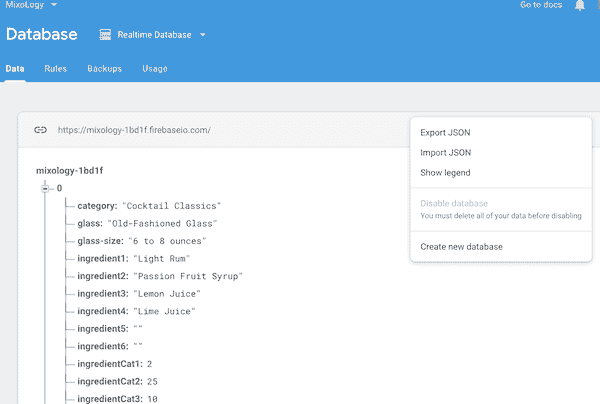
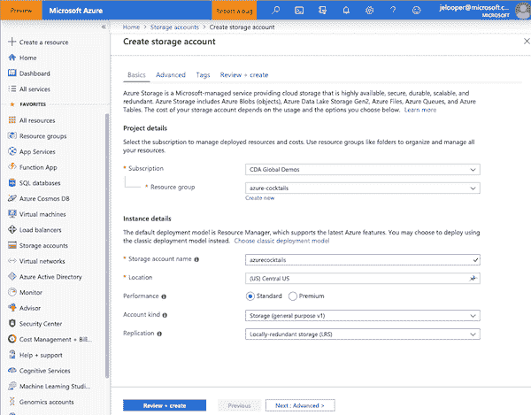
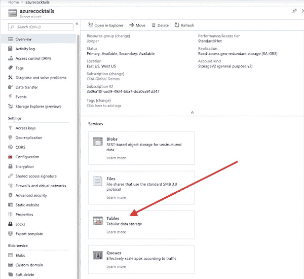
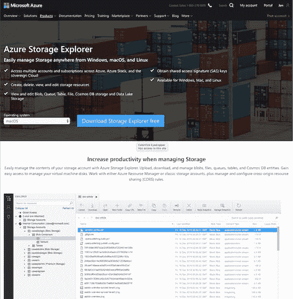
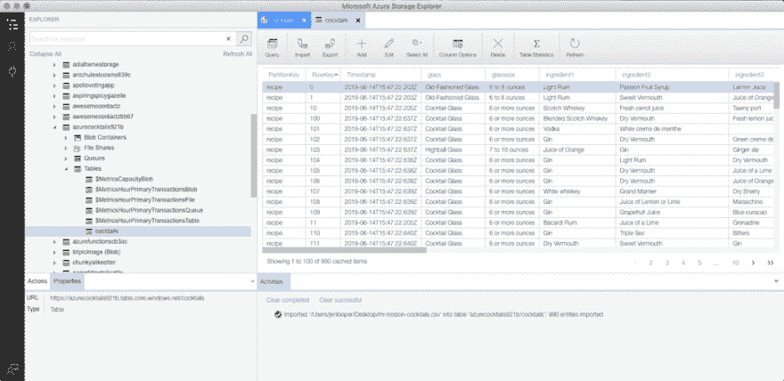
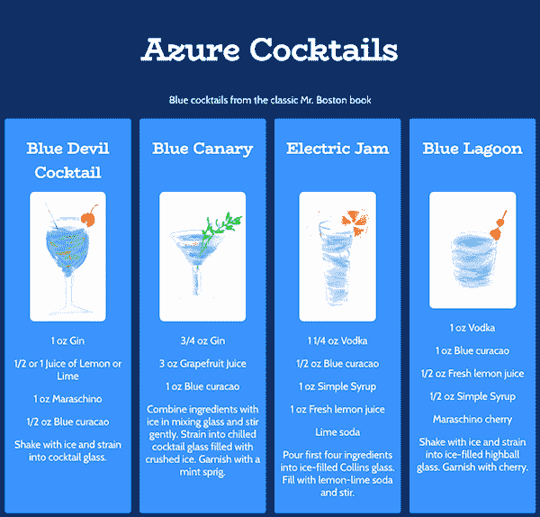

# 微软 Azure 给被宠坏的人 3:迁移数据库

> 原文：<https://dev.to/azure/microsoft-azure-for-spoiled-people-3-migrate-a-database-1f7o>

到目前为止，在这个系列中，我已经讨论了如何在 Azure 上设置托管在`azurewebsites.net`上的 web 应用程序，以及如何使用 Azure 管道设置持续集成。如果你一直在跟进，你现在应该知道如何搭建一个 Vue 网站，并让它稳固地托管在 Azure 上。查看本系列的第 1 部分和第 2 部分，了解更多信息。先睹为快:[下面是我按照下面列出的步骤构建的](https://azure-cocktails.azurewebsites.net/)。

[](https://res.cloudinary.com/practicaldev/image/fetch/s--VvDiqIb4--/c_limit%2Cf_auto%2Cfl_progressive%2Cq_auto%2Cw_880/https://thepracticaldev.s3.amazonaws.com/i/tgvfjygmoj0ytjd46da9.png)

现在我们回到本系列的前提，即在某个时候，你可能需要放弃 Firebase 等具有直观实时数据库服务的服务，转而使用 Microsoft Azure 等服务。但到目前为止，我还没有真正谈到等式的数据库部分。

## 朋友们，准备好，因为数据库时间到了！

我想要建立的网站利用了我为我的调酒演示应用程序创建的相同数据集。在视频中了解更多关于项目[的信息。它涉及重新利用来自《老 T2 先生的波士顿调酒师指南》](https://www.youtube.com/watch?v=SgBDEydZb4A) *的数据，这是一本包含 1000 多种鸡尾酒的经典书籍，最初出版于 1935 年(经过多次修订后，现在再版供您欣赏)。

经过大量的数据清理，我的数据集包含了 990 种食谱，你可以[在 Kaggle](https://www.kaggle.com/jenlooper/analyzing-mr-boston-dataset) 上阅读，用于数据科学的目的。这些食谱也存在于 Firebase 中，甚至现在还在我的 MixoLogy 移动应用程序中使用:点击一个瓶子的图像，就可以获得使用这种特殊烈酒的食谱，等等。

对于我为这个系列构建的新网站，我想创建一个反映蓝色的网站，所以我决定创建一个自然颜色为蓝色的鸡尾酒列表，因为配方中有蓝色的库拉索甜酒。本质上，我需要:

*   将我的数据集导入 Azure 的一个数据库产品
*   在我的 Azure-Cocktails Vue 应用程序中使用该数据集
*   围绕体验构建一个好的用户界面

所以，回到[蔚蓝门户](https://ms.portal.azure.com?WT.mc_id=devto-blog-jelooper)！最初，我认为我需要跳转到 Cosmos DB，但是我的数据库需求对于这个应用程序来说是非常小的；只有一个集合，一个简单的数据结构，和一个非常基本的用例。所以 Cosmos DB 对这个项目来说有点过了。

> 您可能希望将 [Cosmos DB](https://docs.microsoft.com/en-us/azure/cosmos-db/use-cases?WT.mc_id=devto-blog-jelooper) 用于需要全球分布和伸缩的数据库。对于我的小应用程序来说，没有必要拥有这样一个健壮的解决方案。

相反，在与我的同事新美乐股份公司·科廷和苏兹·辛顿协商后，我决定使用 Azure 存储的一部分 Azure Tables 来存储我的基本鸡尾酒数据。

[](https://res.cloudinary.com/practicaldev/image/fetch/s--PcGthzoB--/c_limit%2Cf_auto%2Cfl_progressive%2Cq_auto%2Cw_880/https://thepracticaldev.s3.amazonaws.com/i/srxa7qf0gxb7ztwgksqx.png)

## 步骤 1:导出您的 Firebase 数据

对我来说，第一步是从 Firebase 下载我的数据并上传到 Azure。下载足够容易；在 Firebase 控制台中找到您的数据库，并将其作为 JSON 导出到您的本地。

[](https://res.cloudinary.com/practicaldev/image/fetch/s--cD0fg1MX--/c_limit%2Cf_auto%2Cfl_progressive%2Cq_auto%2Cw_880/https://thepracticaldev.s3.amazonaws.com/i/c8wsasjny7r8nv1zvg3w.png)

接下来，您需要将这些数据转换成. csv 格式。使用这样的工具来完成:json to csv 。

要将这些数据上传到 Azure Table Storage，首先要访问 Azure 门户并创建一个数据库。点击左上方的`+`创建一个资源。它将是一个存储帐户，并且可以是`Locally-redundant storage (LRS)`的`general purpose v1`存储帐户。

[](https://res.cloudinary.com/practicaldev/image/fetch/s--pFbgHB1g--/c_limit%2Cf_auto%2Cfl_progressive%2Cq_auto%2Cw_880/https://thepracticaldev.s3.amazonaws.com/i/h5ouji4q4sjo6pi6hq00.png)

一旦此帐户的部署完成，您将看到您的存储帐户的几个元素被列出。我们感兴趣的是表存储。在这里，您将创建一个表来存储导出的数据。点击“表格”链接:

[](https://res.cloudinary.com/practicaldev/image/fetch/s--eBgPmBGG--/c_limit%2Cf_auto%2Cfl_progressive%2Cq_auto%2Cw_880/https://thepracticaldev.s3.amazonaws.com/i/hp9pbmulz4lkwisnepw5.png)

此时，您希望找到一些方法来导入数据。但是，嘿，没有链接或任何简单的方法可以通过门户网站做到这一点！哦不！

感谢 Suz 的超级秘密提示，有一个“后门”可以做到这一点:Azure Storage Explorer 桌面工具。

[](https://res.cloudinary.com/practicaldev/image/fetch/s--vltgVgh5--/c_limit%2Cf_auto%2Cfl_progressive%2Cq_auto%2Cw_880/https://thepracticaldev.s3.amazonaws.com/i/gt8qletuf38on6wx4gqa.png)

## 第二步:将您的数据上传到 Azure 存储

请访问 [Storage Explorer 网站](https://azure.microsoft.com/en-us/features/storage-explorer?WT.mc_id=devto-blog-jelooper/)并下载这款免费工具。安装后，使用您的 Azure 凭据登录。

现在，当您启动该工具时，您可以导航到您的存储帐户表并从. csv 上传数据。使用表顶部的工具栏进行导入。

[](https://res.cloudinary.com/practicaldev/image/fetch/s--nYWzikd6--/c_limit%2Cf_auto%2Cfl_progressive%2Cq_auto%2Cw_880/https://thepracticaldev.s3.amazonaws.com/i/o65ewjrdr7gvj6mg8zdf.png)

> 注意，表存储对列名很挑剔，您可能需要用 pascal-case 或 camel-case 来重命名您的列名。

如果一切顺利，您应该将数据安全地保存在 Azure 表中！现在，您可以开始在您的应用程序中使用它。

[](https://res.cloudinary.com/practicaldev/image/fetch/s--uu_7nVu4--/c_limit%2Cf_auto%2Cfl_progressive%2Cq_auto%2Cw_880/https://thepracticaldev.s3.amazonaws.com/i/zqfy5sfpz5s51gqsg44i.png)

## 第三步:将你的应用连接到 Azure Tables

要将你的 Vue 应用连接到你在 Azure 中创建的存储服务，你需要使用 [Azure-Storage](https://github.com/Azure/azure-storage-node?WT.mc_id=devto-blog-jelooper) npm 包，这是 Azure 的 Storage SDK for Node.js，安装在你的应用中(`npm i azure-storage`)。查询数据库时会用到它。

在连接到云的应用程序中，通常需要一个连接字符串来进行服务和应用程序之间的握手。在 Azure 门户的存储帐户的“访问密钥”部分下找到正确的连接字符串。我把我的添加到一个`config.js`文件中，我把它放在了应用程序根目录:

```
export default {
    DB_KEY:
        'DefaultEndpointsProtocol=https;AccountName=azurecocktails921b;AccountKey=blablabla==;EndpointSuffix=core.windows.net',
}; 
```

<svg width="20px" height="20px" viewBox="0 0 24 24" class="highlight-action crayons-icon highlight-action--fullscreen-on"><title>Enter fullscreen mode</title></svg> <svg width="20px" height="20px" viewBox="0 0 24 24" class="highlight-action crayons-icon highlight-action--fullscreen-off"><title>Exit fullscreen mode</title></svg>

一旦钥匙就位，你就可以在应用中引用`DB_KEY`。

## 第四步:查询数据

使用您的数据的时刻终于到来了！在这个应用程序中，我想只显示蓝色的鸡尾酒，因为，你知道，蓝色。我想，如果食谱中有任何剂量的蓝库拉索芦荟，它至少会有点蓝。所以我创建了一个 Vuex 存储，我所有的数据库功能都将驻留在这里。

为了获取鸡尾酒列表，我添加了一个查询:

```
 fetchCocktails({ commit }) {
        var azure = require('azure-storage');
        var tableService = azure.createTableService(config.DB_KEY);
        var query = new azure.TableQuery()
            .top(100)
            .where('ingredient1 eq ?', 'Blue curacao')
            .or('ingredient2 eq ?', 'Blue curacao')
            .or('ingredient3 eq ?', 'Blue curacao')
            .or('ingredient4 eq ?', 'Blue curacao')
            .or('ingredient5 eq ?', 'Blue curacao')
            .or('ingredient6 eq ?', 'Blue curacao');

        tableService.queryEntities('cocktails', query, null, function(error, result, response) {
            if (!error) {
                commit('setCocktails', response.body.value);
            } else {
                //throw error
                alert('Oh noes! No cocktails found.');
            }
        });
    }, 
```

<svg width="20px" height="20px" viewBox="0 0 24 24" class="highlight-action crayons-icon highlight-action--fullscreen-on"><title>Enter fullscreen mode</title></svg> <svg width="20px" height="20px" viewBox="0 0 24 24" class="highlight-action crayons-icon highlight-action--fullscreen-off"><title>Exit fullscreen mode</title></svg>

在这个查询中，发生了几件事:

*   使用 azure-storage npm 包
*   从该包中创建对存储服务的引用，调用配置文件中的`db_key`
*   用几个条件创建一个新查询
*   调用服务上的查询
*   将结果提交给 Vuex 存储，在那里可以重用这些结果

现在，您可以在 Home.vue 组件的`created()`生命周期钩子中获得鸡尾酒的过滤列表，通过一个计算属性:
准备返回的数据用于食谱卡

```
 computed: {
    ...mapState(["cocktails"])
},

created() {
    this.$store.dispatch("fetchCocktails");
} 
```

<svg width="20px" height="20px" viewBox="0 0 24 24" class="highlight-action crayons-icon highlight-action--fullscreen-on"><title>Enter fullscreen mode</title></svg> <svg width="20px" height="20px" viewBox="0 0 24 24" class="highlight-action crayons-icon highlight-action--fullscreen-off"><title>Exit fullscreen mode</title></svg>

和...瞧啊。现在，您可以在应用程序中查看数据...或者至少你应该。

## 第五步:搞定 CORS

当心！您可能会惊讶地发现您的数据还没有显示出来！那是因为你可能遇到了 CORS 问题。回到您在门户中的存储帐户，确保 CORS 设置正确，允许通过适当的标题访问您的网站。在文档中了解更多关于 [CORS 的信息。一旦 CORS 被修复，你应该会看到你的应用在本地运行，你也可以按照本系列前两篇文章中的说明将它发布到 Azure。](https://docs.microsoft.com/en-us/rest/api/storageservices/Cross-Origin-Resource-Sharing--CORS--Support-for-the-Azure-Storage-Services?WT.mc_id=devto-blog-jelooper)

[](https://res.cloudinary.com/practicaldev/image/fetch/s--1dKjt5Cu--/c_limit%2Cf_auto%2Cfl_progressive%2Cq_auto%2Cw_880/https://thepracticaldev.s3.amazonaws.com/i/zl8pi8d0htkma3tnyh15.png)

## 干杯！

如果你喜欢蓝色库拉索岛，你很幸运！我已经建立了一个好看的，简单的数据库驱动的网站，供你夏天享受。顺便说一句，我根据他们的描述，用铅笔和铅笔手绘了所有的鸡尾酒。

[](https://res.cloudinary.com/practicaldev/image/fetch/s--AX-Fdee1--/c_limit%2Cf_auto%2Cfl_progressive%2Cq_auto%2Cw_880/https://thepracticaldev.s3.amazonaws.com/i/8hh014v0o05efls3ivel.png)

在这篇文章中，我讨论了如何设置一个非常基本的数据库，以便在你的 Vue 应用中进行查询。在我的下一篇文章中，我将更多地讨论如何像使用 Firebase 数据库一样使用它，使用实时功能来增强应用程序的 UI。敬请期待！

*波士顿先生品牌名称现在归 Sazerac 公司所有，该公司保留该品牌的权利，但也允许对该内容进行[非商业性使用](http://www.sazerac.com/SazeracTermsOfUse.html)。

> 有用链接:
> 💫[cosmos db](https://docs.microsoft.com/en-us/azure/cosmos-db/use-cases?WT.mc_id=devto-blog-jelooper)T3】🧳[azure storage explorer](https://azure.microsoft.com/en-us/features/storage-explorer?WT.mc_id=devto-blog-jelooper/)T6】🚀[node . js 的 Azure 存储](https://github.com/Azure/azure-storage-node?WT.mc_id=devto-blog-jelooper)