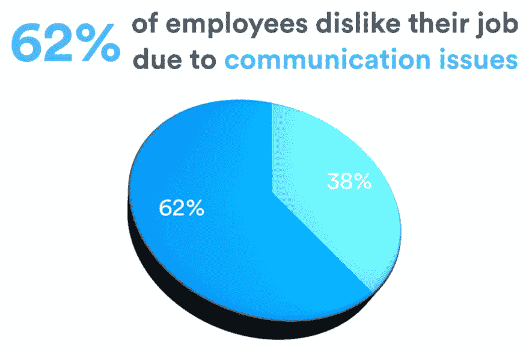
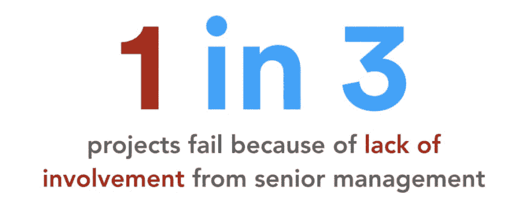

# 软件项目失败的四个主要原因

> 原文：<https://dev.to/meghamaheshwar6/four-major-reasons-why-software-projects-fail-28h4>

PMI 在 2016 年进行的一项研究表明，大约有 [14%的 IT 项目失败](https://www.cio.com/article/3174516/it-project-success-rates-finally-improving.html)。这表明，虽然软件行业继续呈指数增长，但大量的软件项目和努力仍然没有取得成功。

当一个公司承担一个软件项目时，它通常是很重要的。鉴于此，你如何确保你的项目**不会失败？在这篇博文中，我们将探究软件开发项目失败的四个原因——以及帮助项目继续进行的可行解决方案！**

## 1.不清楚或模糊的项目需求

定义项目规范是执行成功项目的第一步。然而，在急于取悦潜在客户并达成交易的过程中，公司往往会忽略可能会破坏项目的细节。也许更不可原谅的是，项目需求可能在各方之间沟通不畅，完全被误解。例如，客户可能需要一个精通 PHP **和** .Net 编码的开发人员。然而，你的理解可能是客户希望雇佣一个精通 PHP **或** .Net 编码的开发人员。看出区别了吗？

详细的需求是有原因的。他们帮助我们定义完成项目的明确目标，同时确保最终产品满足客户的*实际*期望。

### 你如何解决这个问题？

每个项目都是独一无二的，每个客户都是不同的。确保你在正确轨道上的最简单的方法是问**许多**问题。即使它们看起来很傻或“显而易见”，确信总比错误好。事实:如果你不明白某件事，几乎可以肯定的是，房间里的其他人也有同样的感觉，但都保持沉默。

需求具体且可测量吗？它们能现实地实现吗？需求是流动的吗？这些都是有助于阐明项目意图的问题。

一旦你确信你已经确定了需求，在一个全面的文档中记录下所有的东西。然后和客户聊天。利用这段时间来来回回，修改需求规格，添加额外的细节，并确保你们在同一页上。

## 2.沟通不畅或有限

有效的沟通对任何项目的成功都至关重要。仅仅因为你理解了客户的需求，并不意味着你的开发人员也理解了。有时候，员工太害羞而不敢表达怀疑或提问。另一方面，高层管理对客户也不完全透明。

透明坦诚的谈话是项目经理的梦想。是的，当分歧(或技术问题)出现时，它可能会导致一些压力，但它们最终会导致一个成功和全面的项目。当担忧被掩盖，问题被掩盖，我们就有危及项目的风险。

### 你该怎么办？

很简单:**更好的沟通**。建立一种诚实的文化，鼓励员工大胆说出他们心中的犹豫、抱怨和其他想法。消除普遍存在于大多数现代办公室的“责备文化”。

与您的开发人员召开周会，以确保他们在正确的轨道上。这是你开诚布公地与他们交流的时候了，激励他们，评估他们的进步，并解决前进道路上的任何障碍。通过这样做，每个人都可以随时了解项目的状态。

### **与客户交谈**

沟通问题不仅仅是内部问题。根据项目的不同，你也应该让你的客户尽可能了解情况。即使这意味着承认小问题或延误。

向客户更新项目的进展——报告，数字，任何相关的东西。利用这个机会向客户展示你的回应、互动和对项目的投入。正如他们所说，沟通是关键。

## 3.计划不周

在 Innotas 的一项调查中，55%的 IT 专业人员表示，由于缺乏时间、人员和预算，他们的开发项目失败了。这背后的主要原因是计划不周。事实上，排除不可预测的情况，这是唯一的原因。

许多公司没有做适当的可行性研究，甚至没有对项目的实际物流给予太多的思考。这可能会导致不切实际的期望(通常是乐观的一面)，并不可避免地导致压力和失望。在最坏的情况下，没有足够的高级经理来指导工程师。如果没有方向和有限的动力，项目最终失败也就不足为奇了。

### 那么，有什么办法呢？

从一开始就让高层管理人员参与进来。如果项目需求改变，或者期望*从一开始就过于乐观，那么必须有人参与进来调整计划；有人来控制项目的执行，使其保持在正确的轨道上。*

客户总是希望他们的项目昨天交付，尽可能以最低的成本和最高的质量。很公平。因为你不想让他们失望，你可以向他们保证这是可能的。最终，当项目延期时，预算超支，你就有麻烦了。

避免这一切的一个简单方法就是尽量坦白。向客户陈述事实和数字，尽可能透明。如果最后期限不切实际，确保客户知道。这是确保交付一个成功项目的必要步骤——即使它比客户希望的时间长一点。

## 4.不合格的工程师

如果尽管进行了全面的需求分析、计划和沟通，项目还是不顺利，那么是时候面对一个令人不快的事实了:你的开发人员不够好。

有时是因为没有雇佣足够的合格工程师来完成项目，测试懒惰，或者试图通过偷工减料来加速结果。

其他时候是基于成本:公司想省钱，所以他们以通常价格的十分之一“投资”外包。你瞧，质量和价格相匹配，整个项目是一场灾难。不管你在计划或后勤方面做得多么彻底:如果工程师达不到标准，项目就有麻烦了。

### 你如何防止这种情况？

建立一个强大的质量保证团队。质量保证工程师的主要职责是在不同的环境中测试代码，以便软件的所有功能都能正常运行。通过雇佣合适的 QA 专家，你可以提高你构建的软件的质量。

如果你想走节约成本的路线，或者你承担了超出你能力范围的工作，考虑将你的软件开发外包。我们已经写了一篇简短的[印度近海开发指南](https://thescalers.com/guide-to-offshore-development-services-india/)，它将帮助你理解那是怎么一回事！

构建软件是一门艺术，需要专业知识和周密的计划来实现良好的执行。通过解决我们已经讨论过的领域，你有很大的机会运行一个成功的软件项目。祝你好运！

如果您有兴趣在印度建立一个离岸团队，为您的企业成功开发软件，请随意填写联系表格，我们的高级管理人员会与您联系！