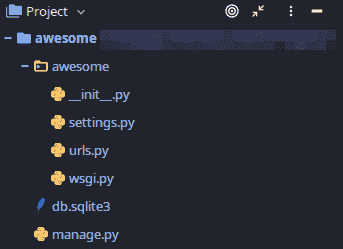
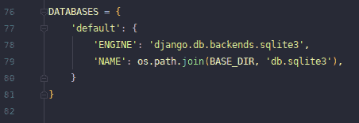
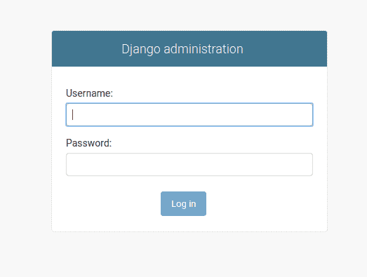
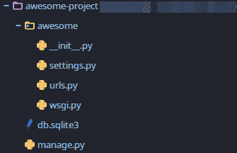
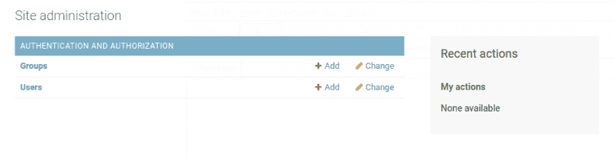
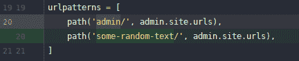
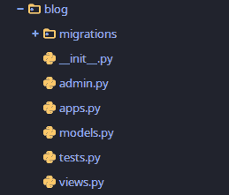
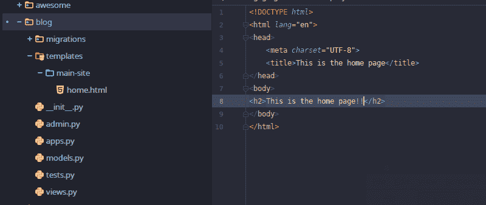
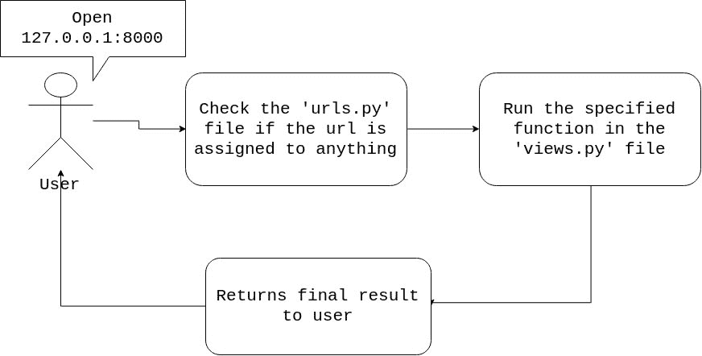

# 向前迈进-第 2 课

> 原文：<https://dev.to/jonathanfarinloye/moving-forward-lesson-2-1ibe>

1.  [熟悉一下](#familiarize)
2.  [数据库](#database)
3.  [应用程序](#apps)
4.  [主页](#homepage)

## 熟悉一下

我相信你要么有 Python IDE，要么有代码编辑器。我用 Pycharm。很多人喜欢 VS 代码。如果您没有，请在继续之前下载一个。

希望您现在有一个代码编辑器，在编辑器中打开您的项目。您可能希望熟悉项目中的文件和文件夹。

<figure>[](https://res.cloudinary.com/practicaldev/image/fetch/s--s-gCktdv--/c_limit%2Cf_auto%2Cfl_progressive%2Cq_auto%2Cw_880/https://thepracticaldev.s3.amazonaws.com/i/fyasui07xytrxvrj5gf7.png) 

<figcaption>一些非常随机的文件和东西</figcaption>

</figure>

你可能会认出这个***【manage . py】***文件，因为它是我们在运行服务器时使用的文件。您应该有一个名为***‘db . sqlite3’***的文件。这是数据库文件。它是在我们运行服务器时自动生成的。可以使用其他数据库服务——比如 Postgres、MySQL。但是，我们将使用默认设置。稍后，我们可以讨论建立一个 Postgres 数据库。

还有就是***‘_ _ init _ _。py'*** 它只是将 ***'awesome'*** 目录标识为一组 python 文件，或者我们可以称之为模块。***‘settings . py’***文件包含了 Django 项目的设置。我们继续前进的时候会一头扎进去。

<figure>[](https://res.cloudinary.com/practicaldev/image/fetch/s--93SuZWnN--/c_limit%2Cf_auto%2Cfl_progressive%2Cq_auto%2Cw_880/https://thepracticaldev.s3.amazonaws.com/i/fgjcb0x1vm1wl8buk2ge.png)

<figcaption>settings . py 的一部分显示数据库设置</figcaption>

</figure>

然后，我们有***【URLs . py】***包含我们的站点将使用的 URL。如果您现在查看它，您会看到一些注释，然后是一个***【URL pattern】***，它是:

```
urlpatterns = [
    path('admin/', admin.site.urls),
] 
```

<svg width="20px" height="20px" viewBox="0 0 24 24" class="highlight-action crayons-icon highlight-action--fullscreen-on"><title>Enter fullscreen mode</title></svg> <svg width="20px" height="20px" viewBox="0 0 24 24" class="highlight-action crayons-icon highlight-action--fullscreen-off"><title>Exit fullscreen mode</title></svg>

如果现在运行服务器，请确保虚拟环境处于活动状态。记住，要运行服务器:

```
/awesome$ python manage.py runserver 
```

<svg width="20px" height="20px" viewBox="0 0 24 24" class="highlight-action crayons-icon highlight-action--fullscreen-on"><title>Enter fullscreen mode</title></svg> <svg width="20px" height="20px" viewBox="0 0 24 24" class="highlight-action crayons-icon highlight-action--fullscreen-off"><title>Exit fullscreen mode</title></svg>

然后访问 127.0.0.1:8000/admin，您应该会看到类似如下的登录页面:

<figure>[](https://res.cloudinary.com/practicaldev/image/fetch/s--vliBBoeH--/c_limit%2Cf_auto%2Cfl_progressive%2Cq_auto%2Cw_880/https://thepracticaldev.s3.amazonaws.com/i/y8vg39qcts24wllcpajc.png) 

<figcaption>吃一个苹果吃到现在🍏</figcaption>

</figure>

最后，我们有了***【wsgi . py】***文件。

> web 服务器网关接口(WSGI)是一个简单的调用约定，用于 web 服务器将请求转发给用 Python 编程语言编写的 Web 应用程序或框架。[来自维基百科](https://en.wikipedia.org/wiki/Web_Server_Gateway_Interface)

如果你好奇，你可以在网上找到更多的信息。然而，我们不会过多地玩弄这个文件。我怀疑我们会碰它。

在继续之前，我们将把文件夹从上到下重新命名为***【awesome-project】***，以便与包含***【URLs . py】***和其他文件的文件夹区分开来。

<figure>[](https://res.cloudinary.com/practicaldev/image/fetch/s--wABotaDP--/c_limit%2Cf_auto%2Cfl_progressive%2Cq_auto%2Cw_880/https://thepracticaldev.s3.amazonaws.com/i/1mhviylwtqsnsff3manx.png) 

<figcaption>改名错了一个会打破一切😭</figcaption>

</figure>

## 数据库

数据库是，嗯，数据库。存储信息、数据和一大堆东西。我们对数据库执行的第一个任务是创建一个***‘超级用户’***。超级用户对整个项目有“终极访问权”。确保你小心使用你的超级用户帐号。要创建一个，请运行:

```
/awesome-project$ python manage.py createsuperuser 
```

<svg width="20px" height="20px" viewBox="0 0 24 24" class="highlight-action crayons-icon highlight-action--fullscreen-on"><title>Enter fullscreen mode</title></svg> <svg width="20px" height="20px" viewBox="0 0 24 24" class="highlight-action crayons-icon highlight-action--fullscreen-off"><title>Exit fullscreen mode</title></svg>

如果你现在这样做，你会得到一堆错误。那是因为数据库还没有准备好接收信息。Django 用其 ***迁移*** 很好地管理了数据库。如果执行了应该反映在数据库中的更改，Django 会要求您执行***【make migrations】***，然后执行***【migrate】***。未应用的迁移总是会出现。类似于:

```
You have 17 unapplied migration(s). Your project may not work 
properly 
until you apply the migrations for app(s): admin, auth, contenttypes, 
sessions.
Run 'python manage.py migrate' to apply them. 
```

<svg width="20px" height="20px" viewBox="0 0 24 24" class="highlight-action crayons-icon highlight-action--fullscreen-on"><title>Enter fullscreen mode</title></svg> <svg width="20px" height="20px" viewBox="0 0 24 24" class="highlight-action crayons-icon highlight-action--fullscreen-off"><title>Exit fullscreen mode</title></svg>

要进行迁移，请运行:

```
/awesome-project$ python manage.py makemigrations 
```

<svg width="20px" height="20px" viewBox="0 0 24 24" class="highlight-action crayons-icon highlight-action--fullscreen-on"><title>Enter fullscreen mode</title></svg> <svg width="20px" height="20px" viewBox="0 0 24 24" class="highlight-action crayons-icon highlight-action--fullscreen-off"><title>Exit fullscreen mode</title></svg>

如果检测到更改，它会为迁移做准备。

要应用迁移，请运行:

```
/awesome-project$ python manage.py migrate 
```

<svg width="20px" height="20px" viewBox="0 0 24 24" class="highlight-action crayons-icon highlight-action--fullscreen-on"><title>Enter fullscreen mode</title></svg> <svg width="20px" height="20px" viewBox="0 0 24 24" class="highlight-action crayons-icon highlight-action--fullscreen-off"><title>Exit fullscreen mode</title></svg>

你会得到这样的结果:

```
Operations to perform:
  Apply all migrations: admin, auth, contenttypes, sessions
Running migrations:
  Applying contenttypes.0001_initial... OK
  Applying auth.0001_initial... OK
  Applying admin.0001_initial... OK
  Applying admin.0002_logentry_remove_auto_add... OK
  Applying admin.0003_logentry_add_action_flag_choices... OK
  Applying contenttypes.0002_remove_content_type_name... OK
  Applying auth.0002_alter_permission_name_max_length... OK
  Applying auth.0003_alter_user_email_max_length... OK
  Applying auth.0004_alter_user_username_opts... OK
  Applying auth.0005_alter_user_last_login_null... OK
  Applying auth.0006_require_contenttypes_0002... OK
  Applying auth.0007_alter_validators_add_error_messages... OK
  Applying auth.0008_alter_user_username_max_length... OK
  Applying auth.0009_alter_user_last_name_max_length... OK
  Applying auth.0010_alter_group_name_max_length... OK
  Applying auth.0011_update_proxy_permissions... OK
  Applying sessions.0001_initial... OK 
```

<svg width="20px" height="20px" viewBox="0 0 24 24" class="highlight-action crayons-icon highlight-action--fullscreen-on"><title>Enter fullscreen mode</title></svg> <svg width="20px" height="20px" viewBox="0 0 24 24" class="highlight-action crayons-icon highlight-action--fullscreen-off"><title>Exit fullscreen mode</title></svg>

这意味着您已经成功地迁移了您的更改。现在，尝试再次创建您的超级用户

```
/awesome-project$ python manage.py createsuperuser
Username: we-awesome    
Email address: hello@awesome.us
Password: DjangoPass
Password (again): DjangoPass
Superuser created successfully. 
```

<svg width="20px" height="20px" viewBox="0 0 24 24" class="highlight-action crayons-icon highlight-action--fullscreen-on"><title>Enter fullscreen mode</title></svg> <svg width="20px" height="20px" viewBox="0 0 24 24" class="highlight-action crayons-icon highlight-action--fullscreen-off"><title>Exit fullscreen mode</title></svg>

> 注意:我强烈建议您设置一个强密码。我用这个只是因为它是一个教程。在现实生活项目中。一个强密码和一个真实的电子邮件地址是必不可少的。

现在再次运行您的服务器，通过 127.0.0.1:8000/admin 访问管理页面并使用您的详细信息登录。

<figure>

[](https://res.cloudinary.com/practicaldev/image/fetch/s--S662-48I--/c_limit%2Cf_auto%2Cfl_progressive%2Cq_auto%2Cw_880/https://thepracticaldev.s3.amazonaws.com/i/2k99awm4f17bi7cppr34.png)

<figcaption>Another apple for you, or maybe an orange🍊</figcaption>

</figure>

你应该知道的一件事是，你可以改变管理页面的链接。所以如果你想把它从***127 . 0 . 0 . 1:8000/admin***改成***127 . 0 . 0 . 1:8000/some-random-text***，只要转到 ***urls.py*** 文件就可以了。

<figure>

[](https://res.cloudinary.com/practicaldev/image/fetch/s--SdkGWCwD--/c_limit%2Cf_auto%2Cfl_progressive%2Cq_auto%2Cw_880/https://thepracticaldev.s3.amazonaws.com/i/1d4f7drxkezy8670h8sd.png)

<figcaption>Previous and current line 20</figcaption>

</figure>

> 访问***127 . 0 . 0 . 1:8000/some-random-text***打开管理页面；访问***127 . 0 . 0 . 1:8000/admin***给出 404 错误

## 应用程序

那么，项目和应用程序有什么区别呢🤔？想象一个有不同团队的公司。一支 ***营销*** 团队，奔赴房山，开拓市场。一个 ***设计团队*** ，你就在这个 ***开发*** 团队。你最好的朋友在 ***行政*** 团队等等。应用程序可以比作个人团队，而项目就像公司。我们可以创建一个 ***【博客】*** 应用程序来管理博客问题。我们可以有一个 ***【个人资料】*** 应用程序来管理用户资料等等。

让我们创建一个 ***【博客】*** app。
创建一个应用。在 ***awesome-project*** 目录下打开你的终端。确保您的虚拟环境处于活动状态，然后运行:

```
/awesome-project$ django-admin startapp blog 
```

<svg width="20px" height="20px" viewBox="0 0 24 24" class="highlight-action crayons-icon highlight-action--fullscreen-on"><title>Enter fullscreen mode</title></svg> <svg width="20px" height="20px" viewBox="0 0 24 24" class="highlight-action crayons-icon highlight-action--fullscreen-off"><title>Exit fullscreen mode</title></svg>

> 像往常一样，你可以给它另一个名字。

我很确定是 worked✨✨！如果没有，😟回顾一下你所做的，并友好地告诉我哪里出错了。

创建应用程序还会创建一堆我们以前从未见过的文件。

<figure>

[](https://res.cloudinary.com/practicaldev/image/fetch/s--X_2F-IGK--/c_limit%2Cf_auto%2Cfl_progressive%2Cq_auto%2Cw_880/https://thepracticaldev.s3.amazonaws.com/i/ncmnvdk9vxhuzf39jlxl.png)

<figcaption>That's a lot of strange stuff😕</figcaption>

</figure>

当我们前进并遇到它们时，我们会讨论它们是什么。

我们也不用忘记在 ***settings.py*** 文件中注册 app。(实际上，在我写这篇文章的时候，我忘记注册它了😬)为此，打开您的***‘博客’***目录中的 ***apps.py*** 文件，并复制该类的名称。我这里是 ***BlogConfig*** 。现在转到 ***settings.py*** 。滚动到看到 ***已安装 _ 应用*** 。默认情况下，有许多应用程序，但是，我们想添加一个新的应用程序，即 ***BlogConfig*** 。“]”前最后一行后加逗号，移至下一行，加:
40。'博客.应用程序.博客配置'

> ***博客*** -文件夹/app 的名称；*-文件的名称；***【blog config】***——类的名称。*

 *请不要像我一样忘记。😬😬

## 首页

在本课中，我们要考虑的最后一件事是如何更改默认主页。我指的是访问 127.0.0.1:8000 时显示的页面。为此，我们需要创建一个模板，一个 HTML 文件。让我们使用我们的博客应用程序。在博客文件夹中新建一个文件夹，命名为 ***【模板】*** 。您可以直接在这个文件夹中创建 HTML 文件，或者进一步添加子目录来组织文件。哪种方式都可以。(编辑:例如，我在 templates 目录中创建了一个主站点子目录。这将反映在我的观点中。

[](https://res.cloudinary.com/practicaldev/image/fetch/s--2N21mWx_--/c_limit%2Cf_auto%2Cfl_progressive%2Cq_auto%2Cw_880/https://thepracticaldev.s3.amazonaws.com/i/6eujt5x3gnkfsacmn9bo.png)

> 您可以看到 HTML 文件的文件夹排列和位置。

现在的问题是:我如何让这个文件显示？这是我们访问 ***view.py*** 文件和 ***urls.py*** 的地方。

<figure>[](https://res.cloudinary.com/practicaldev/image/fetch/s--poiPjGMc--/c_limit%2Cf_auto%2Cfl_progressive%2Cq_auto%2Cw_880/https://thepracticaldev.s3.amazonaws.com/i/wfj09is31bah6tsoo3z6.jpg) 

<figcaption>这是一个相当骨骼化的表象</figcaption>

</figure>

这不是发生的一切，但这是我们现在所需要的一切。所以让我们跟着图像走。用户的请求乘坐飞机🛬，降落在***【URLs . py】***文件中。到达那里后，它检查 url 是否存在。你应该知道的一件事是我们的***‘URLs . py’***文件只处理后缀。即不包括 127.0.0.1:8000 本身。所以记住，如果我们想要替换默认主页，我们在***‘URLs . py’***中添加一行。

```
20\. urlpatterns = [
21\.     path('some-random-text/', admin.site.urls),
22\.     path('',)
23\. ] 
```

<svg width="20px" height="20px" viewBox="0 0 24 24" class="highlight-action crayons-icon highlight-action--fullscreen-on"><title>Enter fullscreen mode</title></svg> <svg width="20px" height="20px" viewBox="0 0 24 24" class="highlight-action crayons-icon highlight-action--fullscreen-off"><title>Exit fullscreen mode</title></svg>

新加的一行说当他们输入不带任何后缀的前缀(127.0.0.1:8000)时，来找我。我们图像中的第二个框表示我们应该在 ***views.py*** 中运行指定的函数。这意味着我们必须创建一个函数来返回一些东西。问题是我们想要回报什么？HTML 文件。让我们去创建我们的函数。在 ***views.py*** 中，创建一个函数，命名为。它至少接受一个参数，我们称之为 request。然后在所请求的 URL 上返回 HTML 文档的呈现。我知道这听起来令人困惑。拿起笔和纸，画出不同的部分，试着把它们连接起来。我的函数看起来像:

```
4\. def home(request):
5\.     return render(request, 'main-site/home.html') 
```

<svg width="20px" height="20px" viewBox="0 0 24 24" class="highlight-action crayons-icon highlight-action--fullscreen-on"><title>Enter fullscreen mode</title></svg> <svg width="20px" height="20px" viewBox="0 0 24 24" class="highlight-action crayons-icon highlight-action--fullscreen-off"><title>Exit fullscreen mode</title></svg>

视图自动检查模板文件夹作为所有 HTML 文档的基本目录。现在要将视图添加到我们的 url 路径中，我们首先要将它导入到 ***urls.py*** 文件中。在文件的顶部，添加:

```
1\. from blog import views 
```

<svg width="20px" height="20px" viewBox="0 0 24 24" class="highlight-action crayons-icon highlight-action--fullscreen-on"><title>Enter fullscreen mode</title></svg> <svg width="20px" height="20px" viewBox="0 0 24 24" class="highlight-action crayons-icon highlight-action--fullscreen-off"><title>Exit fullscreen mode</title></svg>

> 这将从博客应用程序导入视图

在我们之前添加的 url 路径中，添加一些额外的信息

```
20\. urlpatterns = [
21\.     path('some-random-text/', admin.site.urls),
22\.     path('', views.home)
23\. ] 
```

<svg width="20px" height="20px" viewBox="0 0 24 24" class="highlight-action crayons-icon highlight-action--fullscreen-on"><title>Enter fullscreen mode</title></svg> <svg width="20px" height="20px" viewBox="0 0 24 24" class="highlight-action crayons-icon highlight-action--fullscreen-off"><title>Exit fullscreen mode</title></svg>

> 这总是说当你打开链接时；前缀为空后缀；运行名为 home 的函数，您可以在视图文件中找到它。

给你的 url 命名也是一个很好的做法，因为你会在你的 HTML 文档中多次引用它们。要添加名称:

```
20\. urlpatterns = [
21\.     path('some-random-text/', admin.site.urls),
22\.     path('', views.home, name='home')
23\. ] 
```

<svg width="20px" height="20px" viewBox="0 0 24 24" class="highlight-action crayons-icon highlight-action--fullscreen-on"><title>Enter fullscreen mode</title></svg> <svg width="20px" height="20px" viewBox="0 0 24 24" class="highlight-action crayons-icon highlight-action--fullscreen-off"><title>Exit fullscreen mode</title></svg>

保存一切，并重新启动您的服务器。

<figure>[](https://res.cloudinary.com/practicaldev/image/fetch/s--1sQaJYkJ--/c_limit%2Cf_auto%2Cfl_progressive%2Cq_auto%2Cw_880/https://thepracticaldev.s3.amazonaws.com/i/72hrh1si56fayr17t83m.png) 

<figcaption>无视空看</figcaption>

</figure>

💃🕺🍾💃🕺🍾我想我们应该庆祝一下。去给自己买一瓶你最喜欢的，你已经很努力了。
你可以通过创建另一个应用程序和另一个 url 等方式来查看。好奇。你会得到一切！我也会休息一下🍟。我们下次继续。
<small>项目可以在[这里找到](https://github.com/JonathanFarinloye/Beginners_Tutorial_Django)</small>*