# 使用 React Native 创建拼车应用程序——第 1 部分:设置服务器

> 原文：<https://dev.to/wernancheta/create-a-carpooling-app-with-react-native-part-1-setting-up-the-server-1d43>

在这个系列中，我们将使用 React Native 创建一个拼车应用程序。这将是一个由两部分组成的系列，向您展示如何创建一个使用 PHP 作为后端的全栈 React Native 应用程序。

第一部分包括以下内容:

*   设置推送应用程序
*   建立一个谷歌项目
*   设置 Laradock
*   创建服务器组件
*   使用 ngrok 公开服务器

而[第二部分](https://dev.to/anchetawern/create-a-carpooling-app-with-react-native-part-2-creating-the-frontend-1l89)将涵盖以下内容:

*   创建应用程序
*   运行应用程序

我之前写过一个类似的教程:[用 React Native](https://pusher.com/tutorials/ride-hailing-react-native) 构建一个叫车应用。两者的主要区别在于，第一个演示了如何构建一个类似如下的应用程序:

*   [抓取](https://www.grab.com)
*   [优步](https://www.uber.com)
*   [升](https://www.lyft.com/)级

上述应用的主要思想是向用户提供乘车服务。这在传统上被称为“拼车”。

虽然本教程将向您展示如何构建一个类似的应用程序:

*   [Wunder 拼车](https://www.wunder.org/)
*   [抢份额](https://www.grab.com/ph/share/)
*   [Waze 拼车](https://www.waze.com/carpool)

上述应用的主要思想是让用户与和他们同路的人分享他们的旅程。这就是传统上所说的“拼车”。尽管传统拼车应用程序和我们将要开发的应用程序有一些不同之处:

*   共享乘车的人不一定拥有车辆。这意味着他们可以比他们搭载的人更早离开车辆。唯一的规则是，拼车的人需要一直呆在车里，直到他们载上另一个人。
*   拼车的人只能接一个人。“一个人”不一定等同于自然人。可以有两个或更多，但这个想法是，一旦这个人接受了另一个用户的共乘，那么他们就不能再接受其他用户的新请求。

## 先决条件

本教程要求您的计算机上已经安装了以下内容:

*   [React 原生开发环境](https://facebook.github.io/react-native/)——本系列假设您已经安装了创建和运行 React 原生应用所需的所有软件。该系列将向您展示如何为 Android 和 iOS 设备创建应用程序。我们将使用`react-native init`命令创建一个 React 本地项目。你可以在你的机器上安装 Android Studio 和 Xcode，或者只安装其中一个。此外，你可以设置 [Genymotion](https://www.genymotion.com/fun-zone/) ，这样你就可以轻松更改你的应用内位置。如果您尚未设置您的机器，请务必查看[设置说明](https://facebook.github.io/react-native/docs/getting-started.html)。
*   [Docker](https://www.docker.com/) 和[Docker Compose](https://docs.docker.com/compose/)——本系列假设你已经有 [Docker](https://docs.docker.com/install/) 和 [Docker Compose](https://docs.docker.com/compose/install/) 在你的机器上运行。我们将使用这些来轻松地设置一个带有我们需要的所有软件的服务器。这也保证了我们拥有相同的环境。
*   [Git](https://git-scm.com/) -用于克隆回购协议。

需要了解创建 React 原生应用的基础知识。这意味着你必须知道如何在模拟器或你的设备上运行应用程序。您还应该很好地掌握基本的 React 概念，比如 props、refs、state 和组件生命周期。

需要了解[码头工人](https://www.docker.com/)。你应该知道如何在你的操作系统上设置 Docker，并从头开始设置一个容器。注意 Docker 对 Windows 7 和 8 的支持很差。因此，如果你正在使用这些系统中的任何一个，你可能会很难跟上这个教程。

以下知识会有所帮助，但不是必需的。我将尽可能多地介绍细节，这样对以下内容一无所知的读者也能理解:

*   [PHP](http://php.net/)
*   [弹性搜索](https://www.elastic.co/)
*   [推杆通道](https://pusher.com/)

最后，本教程假设您了解您正在使用的操作系统。需要知道如何安装新软件，在终端中执行命令。

## 我们将建造什么

在我们继续之前，重要的是要知道我们到底要构建什么。该应用程序有两种模式:

*   **分享** -这允许用户分享他们的乘坐，以便其他人可以请求与他们一起乘坐。在本系列的其余部分，我将把使用这个特性的用户称为“骑手”。
*   **徒步旅行** -这允许用户请求和某人一起乘车。我将这些用户称为“徒步旅行者”。

下面是 app 的整个流程。我用 Genymotion emulator 给玩骑手的用户，用 iPhone 给徒步旅行者。这是为了让我可以使用 Genymotion 的 GPS 仿真工具来模拟行驶中的车辆:

[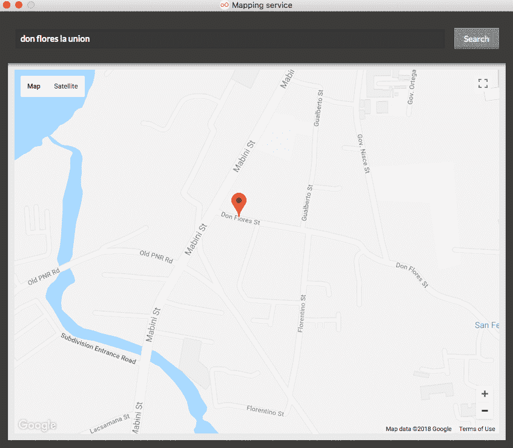](https://res.cloudinary.com/practicaldev/image/fetch/s--WTycCQj0--/c_limit%2Cf_auto%2Cfl_progressive%2Cq_auto%2Cw_880/https://d2mxuefqeaa7sj.cloudfront.net/s_A3E35E29FAFD056D08992342D002CE1A37F4AC4A11322BD972B8B8DD01FAC87E_1527131902596_gps-map.png)

我可以简单地点击地图，这样 React Native 的地理定位就会被触发。这样我就可以使用推送通道向徒步旅行者发送信息，这样他们就可以知道徒步旅行者的当前位置。

现在，让我们继续应用程序流程:

1.  首先，骑手输入自己的用户名，点击**拼车** :
    [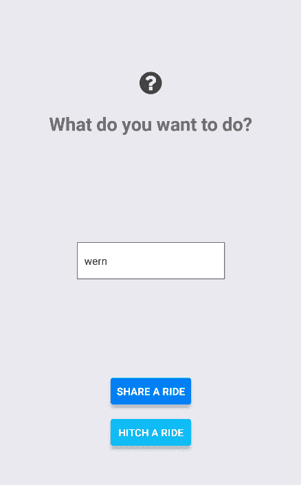](https://res.cloudinary.com/practicaldev/image/fetch/s--cMt0pbv4--/c_limit%2Cf_auto%2Cfl_progressive%2Cq_auto%2Cw_880/https://d2mxuefqeaa7sj.cloudfront.net/s_A3E35E29FAFD056D08992342D002CE1A37F4AC4A11322BD972B8B8DD01FAC87E_1527132082506_1-rider-enters-username.png)

2.  骑手输入他们想去的地方，并从下拉列表中选择。Google Places Autocomplete 让这个功能发挥作用:
    [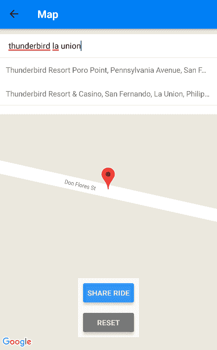](https://res.cloudinary.com/practicaldev/image/fetch/s--M2pJHinv--/c_limit%2Cf_auto%2Cfl_progressive%2Cq_auto%2Cw_880/https://d2mxuefqeaa7sj.cloudfront.net/s_A3E35E29FAFD056D08992342D002CE1A37F4AC4A11322BD972B8B8DD01FAC87E_1527132215878_2-rider-where-to-go.png)

3.  选择一个地方后，该应用程序会绘制出从起点到目的地的最佳路线。红色标记为起点，蓝色标记为目的地:
    [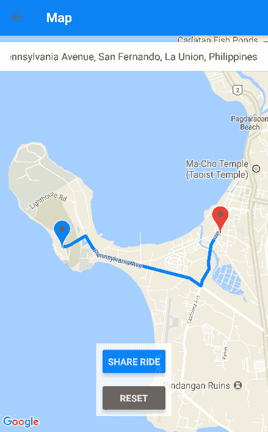](https://res.cloudinary.com/practicaldev/image/fetch/s--n_kBUbyN--/c_limit%2Cf_auto%2Cfl_progressive%2Cq_auto%2Cw_880/https://d2mxuefqeaa7sj.cloudfront.net/s_A3E35E29FAFD056D08992342D002CE1A37F4AC4A11322BD972B8B8DD01FAC87E_1527132384061_3-app-plots-route.png) 
    如果骑手想选择另一个地方，可以点击**重置**按钮。这将清空用于输入地点的文本字段，并从地图上移除标记和路线。

4.  此时，骑车人点击**共享乘车**按钮。这触发了对服务器的请求，然后服务器将所有相关数据保存到 Elasticsearch 索引中。这使得徒步旅行者可以在以后寻找它们。
    为了保持路线信息的更新，我们使用 React Native 的地理定位功能来观察骑手的当前位置。每次他们的位置发生变化，Elasticsearch 索引也会更新:
    [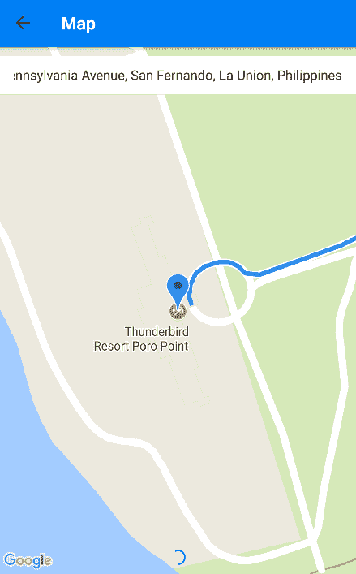](https://res.cloudinary.com/practicaldev/image/fetch/s--Tm5zPjQx--/c_limit%2Cf_auto%2Cfl_progressive%2Cq_auto%2Cw_880/https://d2mxuefqeaa7sj.cloudfront.net/s_A3E35E29FAFD056D08992342D002CE1A37F4AC4A11322BD972B8B8DD01FAC87E_1527132580523_4-rider-shares-ride.png)

5.  现在让我们来看看徒步旅行者这边的事情。首先，徒步者输入他们的用户名，点击**搭车** :
    [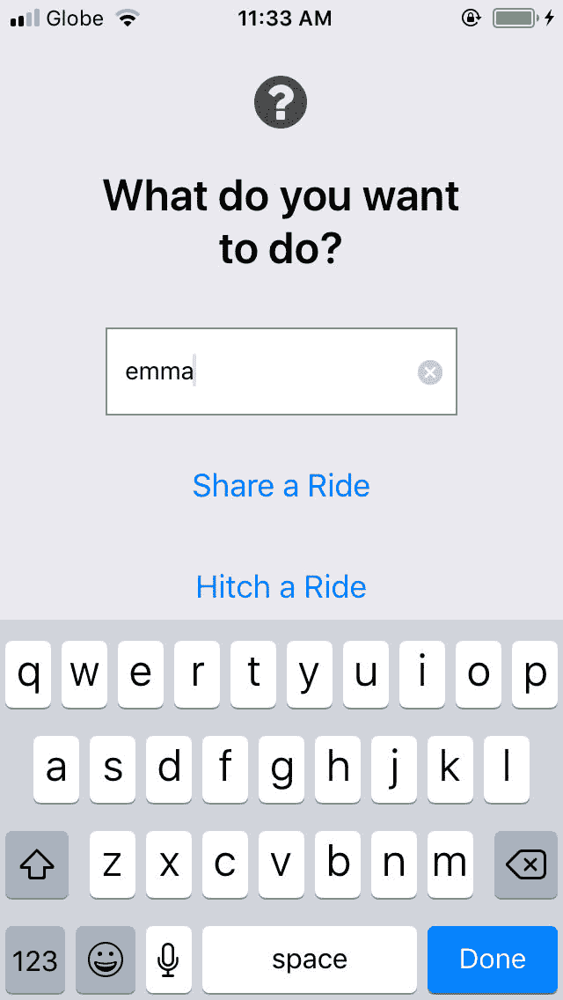](https://res.cloudinary.com/practicaldev/image/fetch/s--IXgXWI5U--/c_limit%2Cf_auto%2Cfl_progressive%2Cq_auto%2Cw_880/https://d2mxuefqeaa7sj.cloudfront.net/s_A3E35E29FAFD056D08992342D002CE1A37F4AC4A11322BD972B8B8DD01FAC87E_1527132915532_1-hiker-enters-username.jpeg)

6.  接下来，徒步旅行者寻找他们的目的地。为了简单起见，我们选取骑手要去的同一个地方:
    [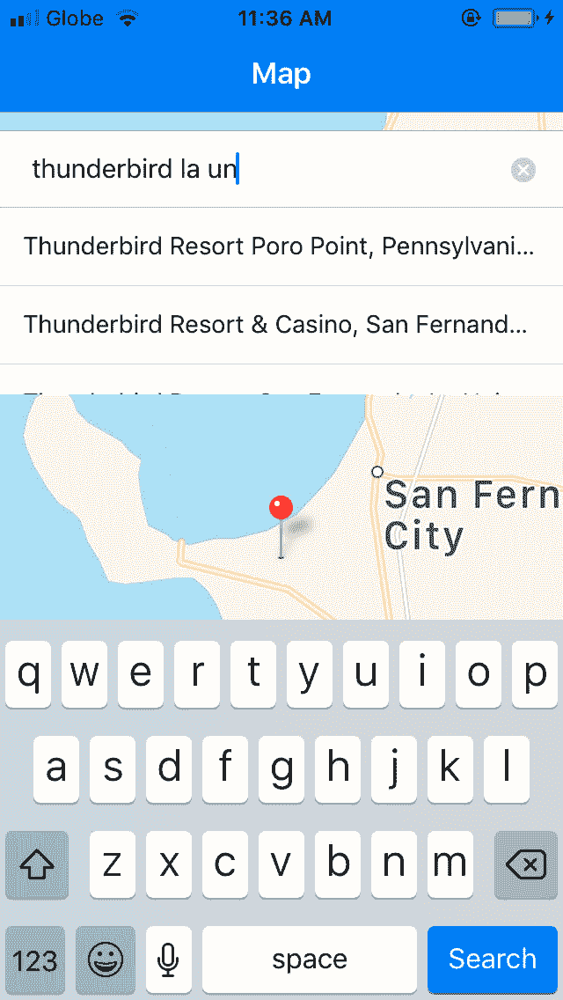](https://res.cloudinary.com/practicaldev/image/fetch/s--EhBINTy6--/c_limit%2Cf_auto%2Cfl_progressive%2Cq_auto%2Cw_880/https://d2mxuefqeaa7sj.cloudfront.net/s_A3E35E29FAFD056D08992342D002CE1A37F4AC4A11322BD972B8B8DD01FAC87E_1527133057897_2-hiker-search-for-place.jpeg)

7.  该应用程序再次绘制出从徒步旅行者的出发地到目的地的最理想路线:
    [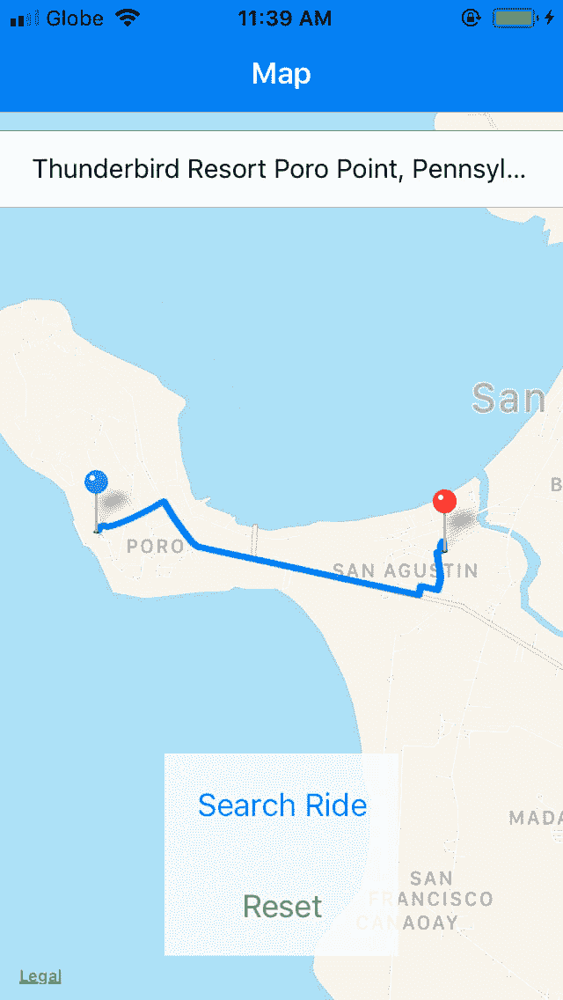](https://res.cloudinary.com/practicaldev/image/fetch/s--C3SqAvEO--/c_limit%2Cf_auto%2Cfl_progressive%2Cq_auto%2Cw_880/https://d2mxuefqeaa7sj.cloudfront.net/s_A3E35E29FAFD056D08992342D002CE1A37F4AC4A11322BD972B8B8DD01FAC87E_1527133218761_3-app-plots-route.jpeg)

8.  徒步旅行者然后点击**搜索乘车**按钮。此时，应用程序向服务器发出请求，寻找与徒步者添加的路线相匹配的骑手。骑手现在应该收到请求。推动器频道使此功能工作:
    [](https://res.cloudinary.com/practicaldev/image/fetch/s--rQUDHS8z--/c_limit%2Cf_auto%2Cfl_progressive%2Cq_auto%2Cw_880/https://d2mxuefqeaa7sj.cloudfront.net/s_A3E35E29FAFD056D08992342D002CE1A37F4AC4A11322BD972B8B8DD01FAC87E_1527137835173_rider-receives-request.png)

9.  一旦骑手接受了请求，徒步旅行者就会收到骑手接受了他们的请求的警告:
    [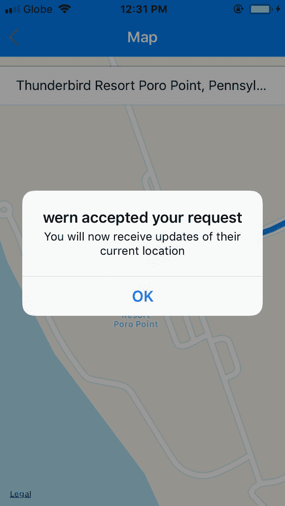](https://res.cloudinary.com/practicaldev/image/fetch/s--_WLwdqRW--/c_limit%2Cf_auto%2Cfl_progressive%2Cq_auto%2Cw_880/https://d2mxuefqeaa7sj.cloudfront.net/s_A3E35E29FAFD056D08992342D002CE1A37F4AC4A11322BD972B8B8DD01FAC87E_1527137993655_hiker-receives-accept-notification.jpg)

10.  此时，徒步旅行者的地图将显示骑手的当前位置。React Native 的地理定位功能和推送通道让这个工作:
    [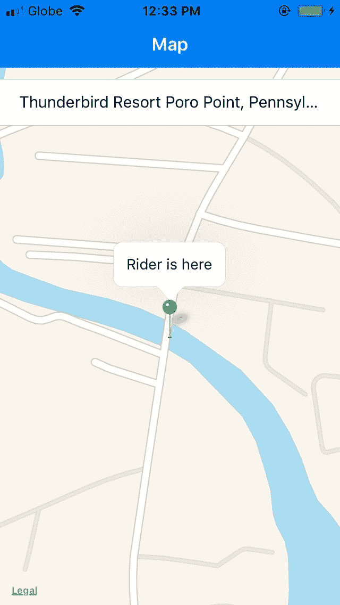](https://res.cloudinary.com/practicaldev/image/fetch/s--lyg9kJBa--/c_limit%2Cf_auto%2Cfl_progressive%2Cq_auto%2Cw_880/https://d2mxuefqeaa7sj.cloudfront.net/s_A3E35E29FAFD056D08992342D002CE1A37F4AC4A11322BD972B8B8DD01FAC87E_1527138225536_map-shows-current-rider-location.jpg) 
    同时，骑手的地图会在地图上显示他们当前的位置。这就是你可以使用 Genymotion 的 GPS 仿真工具更新骑手位置的地方:
    [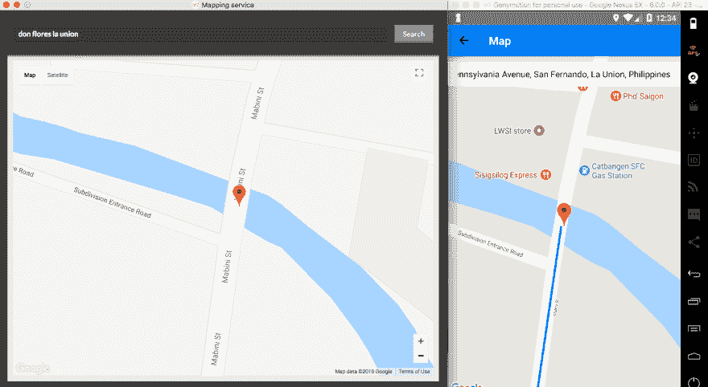](https://res.cloudinary.com/practicaldev/image/fetch/s--pZwjD910--/c_limit%2Cf_auto%2Cfl_progressive%2Cq_auto%2Cw_880/https://d2mxuefqeaa7sj.cloudfront.net/s_A3E35E29FAFD056D08992342D002CE1A37F4AC4A11322BD972B8B8DD01FAC87E_1527138300343_riders-map.png)

11.  一旦骑手靠近了徒步者，两个用户都会收到通知，告知他们已经彼此靠近:
    [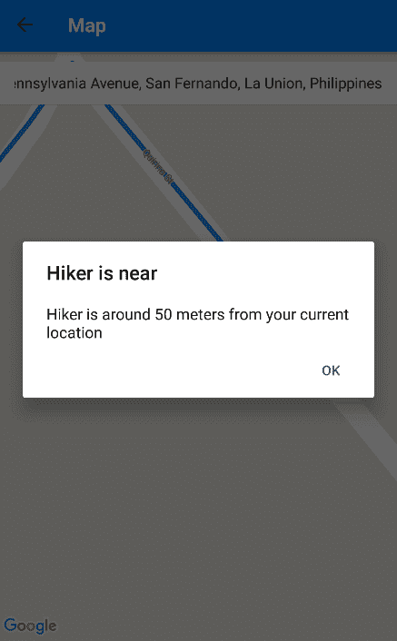](https://res.cloudinary.com/practicaldev/image/fetch/s--e_LP1Ikz--/c_limit%2Cf_auto%2Cfl_progressive%2Cq_auto%2Cw_880/https://d2mxuefqeaa7sj.cloudfront.net/s_A3E35E29FAFD056D08992342D002CE1A37F4AC4A11322BD972B8B8DD01FAC87E_1527138461474_hiker-is-near.png)

12.  一旦他们之间的距离在 20 米以内，应用程序的用户界面就会重置，并返回到登录屏幕:
    [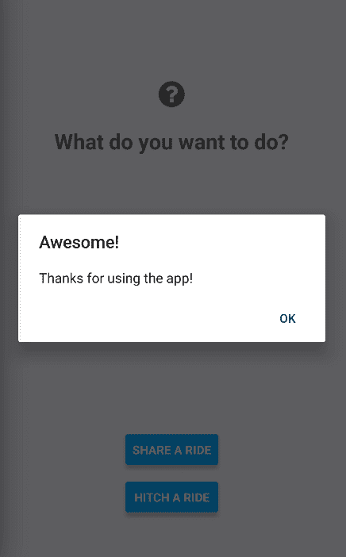](https://res.cloudinary.com/practicaldev/image/fetch/s--0XshEhgq--/c_limit%2Cf_auto%2Cfl_progressive%2Cq_auto%2Cw_880/https://d2mxuefqeaa7sj.cloudfront.net/s_A3E35E29FAFD056D08992342D002CE1A37F4AC4A11322BD972B8B8DD01FAC87E_1527138617110_done.png)

我们将使用以下技术来构建应用程序:

*   **Elasticsearch** -用于保存和搜索路线。
*   **推动器频道** -用于在骑手和徒步者之间建立实时通信，以便他们保持更新彼此的位置。
*   PHP -用于保存和搜索 Elasticsearch 索引中的文档。
*   **谷歌地图** -用于在应用程序中显示地图。
*   Google Places 自动完成功能 -用于搜索地点。
*   Google Directions API -用于获取骑手和徒步旅行者的出发地和目的地之间的方向。
*   **[几何库谷歌地图 API V3](https://github.com/alexpechkarev/geometry-library)**——用于确定某个特定坐标是否位于一组坐标内。

该应用的完整源代码可在本 [Github repo](https://github.com/anchetaWern/Ridesharer) 上获得。

## 设置推送器 app

我们需要创建一个推送应用程序来使用推送通道。如果您还没有创建一个[推销商账户](https://pusher.com/)，请开始创建。

一旦你有了账户，进入你的[仪表盘](https://dashboard.pusher.com/)，点击屏幕左侧的**频道应用**，然后点击**创建频道应用**。输入你的应用程序的名称，并选择一个合适的集群，最好是离你当前位置最近的集群:

[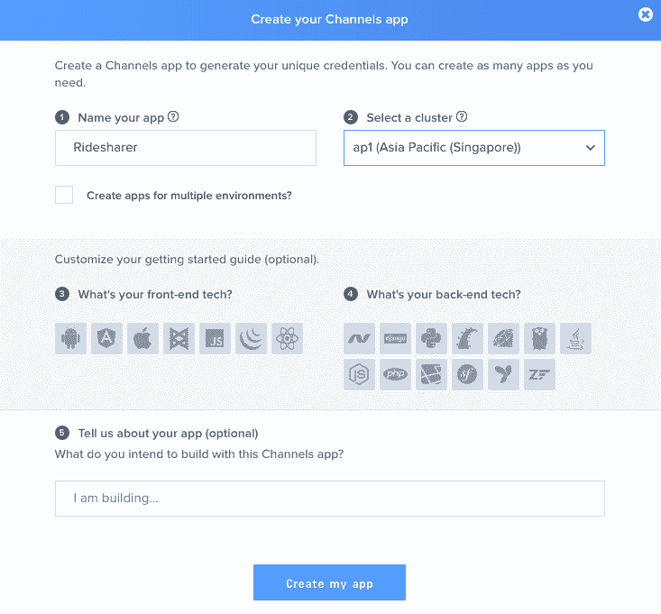](https://res.cloudinary.com/practicaldev/image/fetch/s--cSgMJDJ8--/c_limit%2Cf_auto%2Cfl_progressive%2Cq_auto%2Cw_880/https://d2mxuefqeaa7sj.cloudfront.net/s_A3E35E29FAFD056D08992342D002CE1A37F4AC4A11322BD972B8B8DD01FAC87E_1527061653747_create-channels-apps.png)

创建应用程序后，点击**应用程序设置**选项卡并启用客户端事件:

[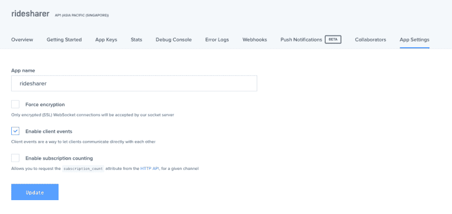](https://res.cloudinary.com/practicaldev/image/fetch/s--ixFevpLN--/c_limit%2Cf_auto%2Cfl_progressive%2Cq_auto%2Cw_880/https://d2mxuefqeaa7sj.cloudfront.net/s_A3E35E29FAFD056D08992342D002CE1A37F4AC4A11322BD972B8B8DD01FAC87E_1527061827251_enable-client-events.png)

这将允许我们直接从应用程序本身触发事件。这样，我们在服务器上唯一需要做的事情就是验证请求。完成后，别忘了点击**更新**。

我们稍后将使用的 API 键在 **App keys** 选项卡上。

## 建立谷歌项目

我们将使用谷歌的三项服务来构建这个应用程序:

*   谷歌地图
*   谷歌地点
*   谷歌方向

这需要我们在 console.developers.google.com 创建一个谷歌项目，这样我们就可以使用这些服务。

在您的仪表盘上，点击**选择项目**下拉菜单，然后点击**创建项目**。输入项目名称，点击**创建**:

[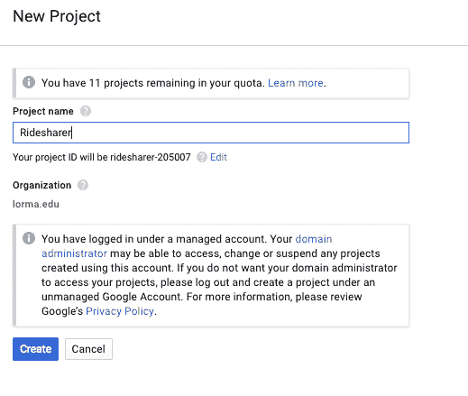](https://res.cloudinary.com/practicaldev/image/fetch/s--Jx2H1a-f--/c_limit%2Cf_auto%2Cfl_progressive%2Cq_auto%2Cw_880/https://d2mxuefqeaa7sj.cloudfront.net/s_A3E35E29FAFD056D08992342D002CE1A37F4AC4A11322BD972B8B8DD01FAC87E_1527060657020_create-google-project.png)

项目创建完成后，点击左侧的**库**。查找并启用以下 API:

*   Android 版地图 SDK
*   iOS 版 Maps SDK 注意，如果你不启用它，并按照 iOS 的[安装说明操作，将会使用苹果地图。](https://github.com/react-community/react-native-maps/blob/master/docs/installation.md#if-you-want-to-use-google-maps)
*   Places SDK for Android
*   为 iOS 放置 SDK
*   方向 API
*   地理编码 API

启用后，点击左侧的**凭证**菜单，然后点击**创建凭证**按钮，选择 **API 键**:

[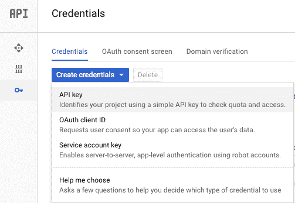](https://res.cloudinary.com/practicaldev/image/fetch/s--kh0maNaE--/c_limit%2Cf_auto%2Cfl_progressive%2Cq_auto%2Cw_880/https://d2mxuefqeaa7sj.cloudfront.net/s_A3E35E29FAFD056D08992342D002CE1A37F4AC4A11322BD972B8B8DD01FAC87E_1527061233282_create-credentials.png)

这将生成一个 API 密钥，允许您使用上面提到的服务。请记下这把钥匙，因为我们以后会用到它。

您可以选择限制访问，这样一旦任何人可以访问您的密钥，他们就可以使用它。为了避免在开发应用程序时出现问题，我建议暂时不要开发。

## 设置拉多克

Laradock 是 Docker 的一个完整的 PHP 开发环境。它允许我们轻松地设置开发服务器。完成以下步骤来设置 Laradock:

### 配置环境

1.  克隆官方回购(`git clone https://github.com/laradock/laradock.git --branch v7.0.0`)。这将创建一个`laradock`目录。注意，在上面的命令中，我们克隆了一个特定的发布标签( [v7.0.0](https://github.com/laradock/laradock/tree/v7.0.0) )。这是为了确保我们都使用相同版本的 Laradock。这有助于您避免与 Laradock 安装的不同配置和软件版本有关的问题。您可以选择克隆最新的版本，但是您必须自己处理兼容性问题。

2.  在`laradock`目录中导航，并创建示例`.env`文件的副本:

3.  在文本编辑器中打开`.env`文件，用下面的内容替换现有的配置。这是保存项目的目录。继续在`laradock`文件夹外创建一个`laradock-projects`文件夹。然后在`laradock-projects`里面，创建一个名为`ridesharer`的新文件夹。我们将在这里添加服务器代码:

```
APP_CODE_PATH_HOST=../laradock-projects 
```

<svg width="20px" height="20px" viewBox="0 0 24 24" class="highlight-action crayons-icon highlight-action--fullscreen-on"><title>Enter fullscreen mode</title></svg> <svg width="20px" height="20px" viewBox="0 0 24 24" class="highlight-action crayons-icon highlight-action--fullscreen-off"><title>Exit fullscreen mode</title></svg>

这是 Elasticsearch 端口配置。下面这个实际上是默认的，所以在大多数情况下，你真的不需要改变什么。但是，如果您有不同的配置，或者如果您想要使用不同的端口，因为现有的应用程序已经在使用这些端口，那么这是更改它们的好地方:

```
ELASTICSEARCH_HOST_HTTP_PORT=9200
ELASTICSEARCH_HOST_TRANSPORT_PORT=9300 
```

<svg width="20px" height="20px" viewBox="0 0 24 24" class="highlight-action crayons-icon highlight-action--fullscreen-on"><title>Enter fullscreen mode</title></svg> <svg width="20px" height="20px" viewBox="0 0 24 24" class="highlight-action crayons-icon highlight-action--fullscreen-off"><title>Exit fullscreen mode</title></svg>

这是 Apache 站点配置所在的路径。我们将在稍后的步骤中更新它。这只是让你知道它的位置:

```
APACHE_SITES_PATH=./apache2/sites 
```

<svg width="20px" height="20px" viewBox="0 0 24 24" class="highlight-action crayons-icon highlight-action--fullscreen-on"><title>Enter fullscreen mode</title></svg> <svg width="20px" height="20px" viewBox="0 0 24 24" class="highlight-action crayons-icon highlight-action--fullscreen-off"><title>Exit fullscreen mode</title></svg>

### 添加虚拟主机

*   打开`laradock/apache2/sites/default.apache.conf`文件并添加一个新的虚拟主机(如果不使用，也可以替换现有的虚拟主机):

```
<VirtualHost *:80>
  ServerName ridesharer.loc
  DocumentRoot /var/www/ridesharer
  Options Indexes FollowSymLinks

  <Directory "/var/www/ridesharer">
    AllowOverride All
    <IfVersion < 2.4>
      Allow from all
    </IfVersion>
    <IfVersion >= 2.4>
      Require all granted
    </IfVersion>
  </Directory>

</VirtualHost> 
```

<svg width="20px" height="20px" viewBox="0 0 24 24" class="highlight-action crayons-icon highlight-action--fullscreen-on"><title>Enter fullscreen mode</title></svg> <svg width="20px" height="20px" viewBox="0 0 24 24" class="highlight-action crayons-icon highlight-action--fullscreen-off"><title>Exit fullscreen mode</title></svg>

上面的代码告诉 Apache，当在浏览器上访问`http://ridesharer.loc`时，提供`/var/www/ridesharer`目录中的文件。如果目录中有`index.php`文件，那么默认情况下会提供这个文件(如果没有指定文件名)。
`/var/www`目录映射到您之前在`.env`文件上指定的应用程序目录:

```
APP_CODE_PATH_HOST=../laradock-projects 
```

<svg width="20px" height="20px" viewBox="0 0 24 24" class="highlight-action crayons-icon highlight-action--fullscreen-on"><title>Enter fullscreen mode</title></svg> <svg width="20px" height="20px" viewBox="0 0 24 24" class="highlight-action crayons-icon highlight-action--fullscreen-off"><title>Exit fullscreen mode</title></svg>

这意味着`/var/www/ridesharer`相当于`/laradock-projects/ridesharer`。
这就是为什么我们之前在`laradock-projects`目录中创建了一个`ridesharer`文件夹。这意味着你在`ridesharer`文件夹中创建的任何文件都会得到服务。

*   更新操作系统的`hosts`文件，将`ridesharer.loc`指向`localhost`:

```
127.0.0.1     ridesharer.loc 
```

<svg width="20px" height="20px" viewBox="0 0 24 24" class="highlight-action crayons-icon highlight-action--fullscreen-on"><title>Enter fullscreen mode</title></svg> <svg width="20px" height="20px" viewBox="0 0 24 24" class="highlight-action crayons-icon highlight-action--fullscreen-off"><title>Exit fullscreen mode</title></svg>

这告诉浏览器在访问`http://ridesharer.loc`时不要查看互联网上的其他地方。相反，它将只在本地主机中查找。

### 配置弹性搜索

打开`docker-compose.yml`文件，搜索`ElasticSearch Container`。这将向您显示弹性搜索配置:

```
### ElasticSearch ########################################
        elasticsearch:
          build: ./elasticsearch
          volumes:
            - elasticsearch:/usr/share/elasticsearch/data
          environment:
            - cluster.name=laradock-cluster
            - bootstrap.memory_lock=true
            - "ES_JAVA_OPTS=-Xms512m -Xmx512m"
          ulimits:
            memlock:
              soft: -1
              hard: -1
          ports:
            - "${ELASTICSEARCH_HOST_HTTP_PORT}:9200"
            - "${ELASTICSEARCH_HOST_TRANSPORT_PORT}:9300"
          depends_on:
            - php-fpm
          networks:
            - frontend
            - backend 
```

<svg width="20px" height="20px" viewBox="0 0 24 24" class="highlight-action crayons-icon highlight-action--fullscreen-on"><title>Enter fullscreen mode</title></svg> <svg width="20px" height="20px" viewBox="0 0 24 24" class="highlight-action crayons-icon highlight-action--fullscreen-off"><title>Exit fullscreen mode</title></svg>

在环境下，添加以下内容:

```
- xpack.security.enabled=false 
```

<svg width="20px" height="20px" viewBox="0 0 24 24" class="highlight-action crayons-icon highlight-action--fullscreen-on"><title>Enter fullscreen mode</title></svg> <svg width="20px" height="20px" viewBox="0 0 24 24" class="highlight-action crayons-icon highlight-action--fullscreen-off"><title>Exit fullscreen mode</title></svg>

所以应该是这样的:

```
environment:
  - cluster.name=laradock-cluster
  - bootstrap.memory_lock=true
  - xpack.security.enabled=false
  - "ES_JAVA_OPTS=-Xms512m -Xmx512m" 
```

<svg width="20px" height="20px" viewBox="0 0 24 24" class="highlight-action crayons-icon highlight-action--fullscreen-on"><title>Enter fullscreen mode</title></svg> <svg width="20px" height="20px" viewBox="0 0 24 24" class="highlight-action crayons-icon highlight-action--fullscreen-off"><title>Exit fullscreen mode</title></svg>

这使得连接到 Elasticsearch 时不需要进行身份验证。

您可以选择以后启用它，这样就不是任何人都可以访问 Elasticsearch 索引。但是为了避免开发过程中的身份验证问题，我们现在将禁用它。

### 调出容器

在`laradock`目录中导航，使用 Docker Compose:
调出容器

```
docker-compose up -d apache2 php-fpm elasticsearch workspace 
```

<svg width="20px" height="20px" viewBox="0 0 24 24" class="highlight-action crayons-icon highlight-action--fullscreen-on"><title>Enter fullscreen mode</title></svg> <svg width="20px" height="20px" viewBox="0 0 24 24" class="highlight-action crayons-icon highlight-action--fullscreen-off"><title>Exit fullscreen mode</title></svg>

这将在容器上安装和设置 Apache、PHP 和 Elasticsearch。还有一个工作区，这样您可以登录到容器。这允许你使用 [Composer](https://getcomposer.org/) 来安装软件包。

根据您的互联网连接，此过程可能需要一段时间。

### 解决 Laradock 问题

如果您在完成此步骤时遇到问题，很可能是端口问题。也就是说，另一个进程已经在使用容器想要使用的端口。

处理端口问题的最快方法是改变 Apache 和 Elasticsearch 正在使用的默认端口(或者任何已经被另一个进程占用的端口)。打开`laradock`文件夹中的`.env`文件，进行以下更改:

对于 Apache，替换`APACHE_HOST_HTTPS_PORT`或`APACHE_PHP_UPSTREAM_PORT`的值(或两者):

```
# APACHE_HOST_HTTPS_PORT=443 
APACHE_HOST_HTTPS_PORT=445 

# APACHE_PHP_UPSTREAM_PORT=9000
APACHE_PHP_UPSTREAM_PORT=9001 
```

<svg width="20px" height="20px" viewBox="0 0 24 24" class="highlight-action crayons-icon highlight-action--fullscreen-on"><title>Enter fullscreen mode</title></svg> <svg width="20px" height="20px" viewBox="0 0 24 24" class="highlight-action crayons-icon highlight-action--fullscreen-off"><title>Exit fullscreen mode</title></svg>

用于弹性搜寻:

```
# ELASTICSEARCH_HOST_HTTP_PORT=9200
ELASTICSEARCH_HOST_HTTP_PORT=9211

# ELASTICSEARCH_HOST_TRANSPORT_PORT=9300
ELASTICSEARCH_HOST_TRANSPORT_PORT=9311 
```

<svg width="20px" height="20px" viewBox="0 0 24 24" class="highlight-action crayons-icon highlight-action--fullscreen-on"><title>Enter fullscreen mode</title></svg> <svg width="20px" height="20px" viewBox="0 0 24 24" class="highlight-action crayons-icon highlight-action--fullscreen-off"><title>Exit fullscreen mode</title></svg>

注释掉默认配置是一个很好的做法，这样你就知道你要替换的是哪一个。

如果您遇到的问题不是端口问题，那么您可以访问 [Laradock 的问题页面](https://github.com/laradock/laradock/issues)并搜索您遇到的问题。

## 创建服务器组件

### 安装依赖项

一旦所有的软件都安装在容器中，Docker 就会自动启动它。这允许您登录到容器。您可以通过在`laradock`目录中执行下面的命令来做到这一点:

```
docker-compose exec --user=laradock workspace bash 
```

<svg width="20px" height="20px" viewBox="0 0 24 24" class="highlight-action crayons-icon highlight-action--fullscreen-on"><title>Enter fullscreen mode</title></svg> <svg width="20px" height="20px" viewBox="0 0 24 24" class="highlight-action crayons-icon highlight-action--fullscreen-off"><title>Exit fullscreen mode</title></svg>

一旦你进入，导航到`ridesharer`文件夹并创建一个`composer.json`文件:

```
{
  "require": {
    "alexpechkarev/geometry-library": "1.0",
    "elasticsearch/elasticsearch": "^6.0",
    "pusher/pusher-php-server": "^3.0",
    "vlucas/phpdotenv": "^2.4"
  }
} 
```

<svg width="20px" height="20px" viewBox="0 0 24 24" class="highlight-action crayons-icon highlight-action--fullscreen-on"><title>Enter fullscreen mode</title></svg> <svg width="20px" height="20px" viewBox="0 0 24 24" class="highlight-action crayons-icon highlight-action--fullscreen-off"><title>Exit fullscreen mode</title></svg>

保存文件并执行`composer install`。这将安装以下软件包:

*   `geometry-library` -如前所述，这允许我们确定一个特定的坐标是否位于一组坐标中。我们将使用这个库来确定 Google Directions API 返回的方向是否覆盖了徒步旅行者的上车地点(起点)。
*   `elasticsearch` -该库允许我们查询 Elasticsearch 索引，以便我们可以添加、搜索、更新或删除文档。
*   这是官方的 Pusher PHP 库，用于与 Pusher 的服务器通信。我们将使用它来验证来自应用程序的请求。
*   `vlucas/phpdotenv` -用于从`.env`文件中加载环境变量。`.env`文件是我们放置 Elasticsearch、Google 和 Pusher 配置的地方。

### 添加环境变量

在`laradock-projects/ridesharer`目录中，创建一个`.env`文件，并添加以下内容:

```
PUSHER_APP_ID="YOUR PUSHER APP ID"
PUSHER_APP_KEY="YOUR PUSHER APP KEY"
PUSHER_APP_SECRET="YOUR PUSHER APP SECRET"
PUSHER_APP_CLUSTER="YOUR PUSHER APP CLUSTER"

GOOGLE_API_KEY="YOUR GOOGLE API KEY"

ELASTICSEARCH_HOST="elasticsearch" 
```

<svg width="20px" height="20px" viewBox="0 0 24 24" class="highlight-action crayons-icon highlight-action--fullscreen-on"><title>Enter fullscreen mode</title></svg> <svg width="20px" height="20px" viewBox="0 0 24 24" class="highlight-action crayons-icon highlight-action--fullscreen-off"><title>Exit fullscreen mode</title></svg>

这个文件是您放置我们将用于服务器的密钥和配置选项的地方。

这个文件是您放置我们将用于服务器的密钥和配置选项的地方。

### 加载器文件

由于我们将要创建的大部分文件将使用来自`.env`文件的配置或者连接到 Elasticsearch 服务器，我们将使用这个文件来完成这些任务。这样，我们只需要在每个文件中包含这个文件，而不是重复相同的代码。

首先将`Elasticsearch\ClientBuilder`类导入到当前范围。这允许我们使用`ClientBuilder`类，而不必在每次需要使用它的时候引用它的名称空间`Elasticsearch`:

```
// laradock-projects/ridesharer/loader.php
use Elasticsearch\ClientBuilder; 
```

<svg width="20px" height="20px" viewBox="0 0 24 24" class="highlight-action crayons-icon highlight-action--fullscreen-on"><title>Enter fullscreen mode</title></svg> <svg width="20px" height="20px" viewBox="0 0 24 24" class="highlight-action crayons-icon highlight-action--fullscreen-off"><title>Exit fullscreen mode</title></svg>

包括供应商自动加载文件。这允许我们包含我们之前安装的所有包:

```
require 'vendor/autoload.php'; 
```

<svg width="20px" height="20px" viewBox="0 0 24 24" class="highlight-action crayons-icon highlight-action--fullscreen-on"><title>Enter fullscreen mode</title></svg> <svg width="20px" height="20px" viewBox="0 0 24 24" class="highlight-action crayons-icon highlight-action--fullscreen-off"><title>Exit fullscreen mode</title></svg>

加载`.env`文件:

```
$dotenv = new Dotenv\Dotenv(__DIR__);
$dotenv->load();

$elasticsearch_host = getenv('ELASTICSEARCH_HOST'); // get the elasticsearch config 
```

<svg width="20px" height="20px" viewBox="0 0 24 24" class="highlight-action crayons-icon highlight-action--fullscreen-on"><title>Enter fullscreen mode</title></svg> <svg width="20px" height="20px" viewBox="0 0 24 24" class="highlight-action crayons-icon highlight-action--fullscreen-off"><title>Exit fullscreen mode</title></svg>

之后，连接到 Elasticsearch:

```
$hosts = [
  [
    'host' => $elasticsearch_host
  ]
];

$client = ClientBuilder::create()->setHosts($hosts)->build(); 
```

<svg width="20px" height="20px" viewBox="0 0 24 24" class="highlight-action crayons-icon highlight-action--fullscreen-on"><title>Enter fullscreen mode</title></svg> <svg width="20px" height="20px" viewBox="0 0 24 24" class="highlight-action crayons-icon highlight-action--fullscreen-off"><title>Exit fullscreen mode</title></svg>

### 设置类型映射

由于我们将在这个应用程序中使用坐标，我们需要告诉 Elasticsearch 我们将使用的字段是坐标。这样，我们可以在以后使用专门为查询地理点数据而创建的函数来查询它们。这是通过称为[映射](https://www.elastic.co/guide/en/elasticsearch/reference/current/geo-point.html)的过程来完成的。

通过包含加载程序文件开始:

```
<?php 
// laradock-projects/ridesharer/set-map.php
require 'loader.php'; 
```

<svg width="20px" height="20px" viewBox="0 0 24 24" class="highlight-action crayons-icon highlight-action--fullscreen-on"><title>Enter fullscreen mode</title></svg> <svg width="20px" height="20px" viewBox="0 0 24 24" class="highlight-action crayons-icon highlight-action--fullscreen-off"><title>Exit fullscreen mode</title></svg>

接下来，我们现在可以继续指定实际的地图。注意，可能会发生错误(例如，索引已经创建，或者我们指定的数据类型之一没有被 Elasticsearch 识别),所以我们将所有内容包装在一个`try..catch`中。这允许我们“捕捉”错误并以友好的方式呈现出来:

```
try {
  $indexParams['index']  = 'places'; // the name of the index

  $myTypeMapping = [
    '_source' => [
      'enabled' => true
    ],
    'properties' => [
      'from_coords' => [
        'type' => 'geo_point'
      ],
      'to_coords' => [
        'type' => 'geo_point'
      ],
      'current_coords' => [
        'type' => 'geo_point'
      ],
      'from_bounds.top_left.coords' => [
        'type' => 'geo_point'
      ],
      'from_bounds.bottom_right.coords' => [
        'type' => 'geo_point'
      ],
      'to_bounds.top_left.coords' => [
        'type' => 'geo_point'
      ],
      'to_bounds.bottom_right.coords' => [
        'type' => 'geo_point'
      ]
    ]
  ];

  // next: add code for adding the map

} catch(\Exception $e) {
  echo 'err: ' . $e->getMessage();
} 
```

<svg width="20px" height="20px" viewBox="0 0 24 24" class="highlight-action crayons-icon highlight-action--fullscreen-on"><title>Enter fullscreen mode</title></svg> <svg width="20px" height="20px" viewBox="0 0 24 24" class="highlight-action crayons-icon highlight-action--fullscreen-off"><title>Exit fullscreen mode</title></svg>

分解上面的代码，我们首先指定想要使用的索引的名称。这不应该已经存在于 Elasticsearch 中。如果您来自 RDBMS 背景，索引就是数据库的同义词:

```
$indexParams['index']  = 'places'; 
```

<svg width="20px" height="20px" viewBox="0 0 24 24" class="highlight-action crayons-icon highlight-action--fullscreen-on"><title>Enter fullscreen mode</title></svg> <svg width="20px" height="20px" viewBox="0 0 24 24" class="highlight-action crayons-icon highlight-action--fullscreen-off"><title>Exit fullscreen mode</title></svg>

对于实际的类型映射，我们只需要指定两个属性:`_source`和`properties`。

`_source`允许我们指定在获取文件时是否允许返回[源](https://www.elastic.co/guide/en/elasticsearch/reference/current/mapping-source-field.html)。在 Elasticsearch 中，`_source`包含我们已经索引的字段(及其值)。

在现实应用中，你并不希望启用这个选项，因为它会影响搜索性能。我们启用它只是为了在查询索引时不必执行额外的步骤来获取源代码:

```
'_source' => [
  'enabled' => true
], 
```

<svg width="20px" height="20px" viewBox="0 0 24 24" class="highlight-action crayons-icon highlight-action--fullscreen-on"><title>Enter fullscreen mode</title></svg> <svg width="20px" height="20px" viewBox="0 0 24 24" class="highlight-action crayons-icon highlight-action--fullscreen-off"><title>Exit fullscreen mode</title></svg>

我们需要指定的另一个属性是`properties`。它接受我们想要指定其数据类型的字段名数组。当然，我们不需要指定我们计划使用的所有字段的数据类型。这是因为在大多数情况下，数据类型已经是隐含的了(例如，如果它用双引号或单引号括起来，那么它就是一个字符串)。但是对于特殊的数据类型，比如[地理点](https://www.elastic.co/guide/en/elasticsearch/reference/current/geo-point.html)，那就是我们需要明确指定它的时候:

```
'from_coords' => [
  'type' => 'geo_point'
], 
```

<svg width="20px" height="20px" viewBox="0 0 24 24" class="highlight-action crayons-icon highlight-action--fullscreen-on"><title>Enter fullscreen mode</title></svg> <svg width="20px" height="20px" viewBox="0 0 24 24" class="highlight-action crayons-icon highlight-action--fullscreen-off"><title>Exit fullscreen mode</title></svg>

如果您想要处理的字段位于其他字段的深处，那么您可以使用点符号来指定父字段:

```
'from_bounds.top_left.coords' => [
  'type' => 'geo_point'
] 
```

<svg width="20px" height="20px" viewBox="0 0 24 24" class="highlight-action crayons-icon highlight-action--fullscreen-on"><title>Enter fullscreen mode</title></svg> <svg width="20px" height="20px" viewBox="0 0 24 24" class="highlight-action crayons-icon highlight-action--fullscreen-off"><title>Exit fullscreen mode</title></svg>

最后，添加用我们指定的映射创建索引的代码:

```
$indexParams\['body'\]['mappings']['location'] = $myTypeMapping; // specify the map
$response = $client->indices()->create($indexParams); // create the index
print_r($response); // print the response 
```

<svg width="20px" height="20px" viewBox="0 0 24 24" class="highlight-action crayons-icon highlight-action--fullscreen-on"><title>Enter fullscreen mode</title></svg> <svg width="20px" height="20px" viewBox="0 0 24 24" class="highlight-action crayons-icon highlight-action--fullscreen-off"><title>Exit fullscreen mode</title></svg>

在浏览器上访问`http://ridesharer.loc/set-map.php`,它应该会打印出一个成功的响应。

注意，如果您有另一个正在运行的本地开发环境，它可能会优先于 Laradock。所以，如果你不能访问上面的网址，一定要禁用它们。

### 创建用户

当有人使用该应用程序时，他们需要先登录。如果他们使用的用户名不存在，那么就创建一个。

从获取应用程序传递的数据开始，在 PHP 中，这通常是通过从`$_POST`全局变量中提取字段名来完成的。但是在本例中，我们使用 [PHP 输入流](http://php.net/manual/en/wrappers.php.php)从请求体中读取原始数据`POST`。这是因为这是 Axios(我们稍后将在应用程序中使用的库)向服务器发送请求时提交数据的方式:

```
<?php 
// laradock-projects/ridesharer/create-user.php
require 'loader.php';

$data = json_decode(file_get_contents("php://input"), true);
$username = $data['username']; // get the value from the username field 
```

<svg width="20px" height="20px" viewBox="0 0 24 24" class="highlight-action crayons-icon highlight-action--fullscreen-on"><title>Enter fullscreen mode</title></svg> <svg width="20px" height="20px" viewBox="0 0 24 24" class="highlight-action crayons-icon highlight-action--fullscreen-off"><title>Exit fullscreen mode</title></svg>

构建要提供给 Elasticsearch 的参数。这包括`index`和`type`。您可以将`type`视为您想要查询的表或集合。

```
$params = [
  'index' => 'places', // the index 
  'type' => 'users' // the table or collection
]; 
```

<svg width="20px" height="20px" viewBox="0 0 24 24" class="highlight-action crayons-icon highlight-action--fullscreen-on"><title>Enter fullscreen mode</title></svg> <svg width="20px" height="20px" viewBox="0 0 24 24" class="highlight-action crayons-icon highlight-action--fullscreen-off"><title>Exit fullscreen mode</title></svg>

指定查询。在这种情况下，我们告诉 Elasticsearch 为所提供的用户名寻找一个精确匹配:

```
$params['body']['query']['match']['username'] = $username; // look for the username specified 
```

<svg width="20px" height="20px" viewBox="0 0 24 24" class="highlight-action crayons-icon highlight-action--fullscreen-on"><title>Enter fullscreen mode</title></svg> <svg width="20px" height="20px" viewBox="0 0 24 24" class="highlight-action crayons-icon highlight-action--fullscreen-off"><title>Exit fullscreen mode</title></svg>

执行搜索查询，如果没有返回任何“命中”，那么我们使用提供的用户名创建一个新用户:

```
try {
  $search_response = $client->search($params); // execute the search query

  if($search_response\['hits'\]['total'] == 0){ // if the username doesn't already exist
    // create the user
    $index_response = $client->index([
      'index' => 'places',
      'type' => 'users',
      'id' => $username,
      'body' => [
        'username' => $username
      ]
    ]);
  }

  echo 'ok';

} catch(\Exception $e) {
  echo 'err: ' . $e->getMessage();
} 
```

<svg width="20px" height="20px" viewBox="0 0 24 24" class="highlight-action crayons-icon highlight-action--fullscreen-on"><title>Enter fullscreen mode</title></svg> <svg width="20px" height="20px" viewBox="0 0 24 24" class="highlight-action crayons-icon highlight-action--fullscreen-off"><title>Exit fullscreen mode</title></svg>

### 保存路线

每当乘客共享一次乘坐时，需要将以下信息存储在索引中:

*   用户名
*   起源
*   目的地
*   原点坐标
*   目标坐标
*   从起点到终点的步骤

首先从应用程序提交的数据开始:

```
<?php 
// laradock-projects/ridesharer/save-route.php
require 'loader.php';

$google_api_key = getenv('GOOGLE_API_KEY');

$data = json_decode(file_get_contents("php://input"), true);
$start_location = $data['start_location']; // an array containing the coordinates (latitude and longitude) of the rider's origin
$end_location = $data['end_location']; // the coordinates of the rider's destination

$username = $data['username']; // the rider's username
$from = $data['from']; // the descriptive name of the rider's origin
$to = $data['to']; // the descriptive name of the rider's destination
$id = generateRandomString(); // unique ID used for identifying the document 
```

<svg width="20px" height="20px" viewBox="0 0 24 24" class="highlight-action crayons-icon highlight-action--fullscreen-on"><title>Enter fullscreen mode</title></svg> <svg width="20px" height="20px" viewBox="0 0 24 24" class="highlight-action crayons-icon highlight-action--fullscreen-off"><title>Exit fullscreen mode</title></svg>

使用`file_get_contents()`函数向[谷歌方向 API](https://developers.google.com/maps/documentation/directions/intro) 发出请求。`directions`端点期望将`origin`和`destination`作为查询参数传递。这两个包含纬度和经度值对(用逗号分隔)。我们只是传递应用程序提供的值。

`file_get_contents()`函数返回一个 JSON 字符串，所以我们使用`json_decode()`函数将其转换成一个数组。将`true`指定为第二个参数告诉 PHP 将其转换为数组而不是对象(当第二个参数被省略或设置为`false` ):

```
$steps_data = [];

$contents = file_get_contents("https://maps.googleapis.com/maps/api/directions/json?origin={$start_location['latitude']},{$start_location['longitude']}&destination={$end_location['latitude']},{$end_location['longitude']}&key={$google_api_key}");

$directions_data = json_decode($contents, true); 
```

<svg width="20px" height="20px" viewBox="0 0 24 24" class="highlight-action crayons-icon highlight-action--fullscreen-on"><title>Enter fullscreen mode</title></svg> <svg width="20px" height="20px" viewBox="0 0 24 24" class="highlight-action crayons-icon highlight-action--fullscreen-off"><title>Exit fullscreen mode</title></svg>

遍历步骤数组，并构造一个数组(`$steps_data`)，该数组只包含我们想要存储的数据。在这种情况下，只有每个步骤的纬度和经度值:

```
if(!empty($directions_data['routes'])){
  $steps = $directions_data['routes'][0]['legs'][0]['steps'];
  foreach($steps as $step){
    $steps_data[] = [
      'lat' => $step['start_location']['lat'],
      'lng' => $step['start_location']['lng']
    ];

    $steps_data[] = [
      'lat' => $step['end_location']['lat'],
      'lng' => $step['end_location']['lng']
    ];
  }
} 
```

<svg width="20px" height="20px" viewBox="0 0 24 24" class="highlight-action crayons-icon highlight-action--fullscreen-on"><title>Enter fullscreen mode</title></svg> <svg width="20px" height="20px" viewBox="0 0 24 24" class="highlight-action crayons-icon highlight-action--fullscreen-off"><title>Exit fullscreen mode</title></svg>

接下来，构建我们将保存到 Elasticsearch 索引的数据:

```
if(!empty($steps_data)){

  $params = [
    'index' => 'places',
    'type' => 'location',
    'id' => $id,
    'body' => [
      'username' => $username, 
      'from' => $from, 
      'to' => $to,
      'from_coords' => [ // geo-point values needs to have lat and lon
        'lat' => $start_location['latitude'],
        'lon' => $start_location['longitude'],
      ],
      'current_coords' => [
        'lat' => $start_location['latitude'],
        'lon' => $start_location['longitude'],
      ],
      'to_coords' => [
        'lat' => $end_location['latitude'],
        'lon' => $end_location['longitude'],
      ],
      'steps' => $steps_data
    ]
  ];

} 
```

<svg width="20px" height="20px" viewBox="0 0 24 24" class="highlight-action crayons-icon highlight-action--fullscreen-on"><title>Enter fullscreen mode</title></svg> <svg width="20px" height="20px" viewBox="0 0 24 24" class="highlight-action crayons-icon highlight-action--fullscreen-off"><title>Exit fullscreen mode</title></svg>

请求索引数据:

```
try{
  $response = $client->index($params);
  $response_data = json_encode([
    'id' => $id
  ]);

  echo $response_data;
}catch(\Exception $e){
  echo 'err: ' . $e->getMessage();
} 
```

<svg width="20px" height="20px" viewBox="0 0 24 24" class="highlight-action crayons-icon highlight-action--fullscreen-on"><title>Enter fullscreen mode</title></svg> <svg width="20px" height="20px" viewBox="0 0 24 24" class="highlight-action crayons-icon highlight-action--fullscreen-off"><title>Exit fullscreen mode</title></svg>

下面是生成唯一 ID 的函数:

```
function generateRandomString($length = 10){
  $characters = '0123456789abcdefghijklmnopqrstuvwxyzABCDEFGHIJKLMNOPQRSTUVWXYZ';
  $charactersLength = strlen($characters);
  $randomString = '';
  for($i = 0; $i < $length; $i++){
    $randomString .= $characters[rand(0, $charactersLength - 1)];
  }
  return $randomString;
} 
```

<svg width="20px" height="20px" viewBox="0 0 24 24" class="highlight-action crayons-icon highlight-action--fullscreen-on"><title>Enter fullscreen mode</title></svg> <svg width="20px" height="20px" viewBox="0 0 24 24" class="highlight-action crayons-icon highlight-action--fullscreen-off"><title>Exit fullscreen mode</title></svg>

### 搜索路线

当一个徒步旅行者搜索一个旅程时，对这个文件发出一个请求。这要求在请求体中传递徒步旅行者的出发地和目的地。这样，我们就可以用这些数据向 Google Directions API 发出请求:

```
<?php 
// /laradock-projects/ridesharer/search-routes.php
require 'loader.php';

$google_api_key = getenv('GOOGLE_API_KEY');

$params['index'] = 'places';
$params['type'] = 'location';

$data = json_decode(file_get_contents("php://input"), true);

// the hiker's origin coordinates
$hiker_origin_lat = $data['origin']['latitude'];
$hiker_origin_lon = $data['origin']['longitude'];

// the hiker's destination coordinates
$hiker_dest_lat = $data['dest']['latitude'];
$hiker_dest_lon = $data['dest']['longitude'];

$hiker_directions_contents = file_get_contents("https://maps.googleapis.com/maps/api/directions/json?origin={$hiker_origin_lat},{$hiker_origin_lon}&destination={$hiker_dest_lat},{$hiker_dest_lon}&key={$google_api_key}");

$hiker_directions_data = json_decode($hiker_directions_contents, true); 
```

<svg width="20px" height="20px" viewBox="0 0 24 24" class="highlight-action crayons-icon highlight-action--fullscreen-on"><title>Enter fullscreen mode</title></svg> <svg width="20px" height="20px" viewBox="0 0 24 24" class="highlight-action crayons-icon highlight-action--fullscreen-off"><title>Exit fullscreen mode</title></svg>

将徒步旅行者的脚步存储到一个数组中。我们稍后将使用它来确定徒步旅行者和骑手是否有相同的路线。注意，我们只为第一步存储了`start_location`。这是因为所有后续步骤的`start_location`与下一步骤的`end_location`重叠:

```
$hikers_steps = [];

$steps = $hiker_directions_data['routes'][0]['legs'][0]['steps']; // extract the steps
foreach($steps as $index => $s){
  if($index == 0){ 
    $hikers_steps[] = [
      'lat' => $s['start_location']['lat'],
      'lng' => $s['start_location']['lng']
    ];  
  }

  $hikers_steps[] = [
    'lat' => $s['end_location']['lat'],
    'lng' => $s['end_location']['lng']
  ];
} 
```

<svg width="20px" height="20px" viewBox="0 0 24 24" class="highlight-action crayons-icon highlight-action--fullscreen-on"><title>Enter fullscreen mode</title></svg> <svg width="20px" height="20px" viewBox="0 0 24 24" class="highlight-action crayons-icon highlight-action--fullscreen-off"><title>Exit fullscreen mode</title></svg>

接下来，我们构造要发送给 Elasticsearch 的查询。这里我们使用一个名为`gauss`的`decay`函数来为当前保存在索引中的每条路线分配一个分数。然后，该分数用于确定返回结果的顺序，或者是否返回结果。

指定`min_score`意味着不符合所提供分数的所有文档都不会在响应中返回。在下面的代码中，我们将查询距离原点 5 公里远的文档。但是一旦文档有一个不在 100 米内的`current_coords`，分配给它们的分数减半:

```
$params['body'] = [
  "min_score" => 0.5, // the minimum score for the function to return the record
  'query' => [
    'function_score' => [
      'gauss' => [
        'current_coords' => [
          "origin" => ["lat" => $hiker_origin_lat, "lon" => $hiker_origin_lon], // where to begin the search
          "offset" => "100m", // only select documents that are up to 100 meters away from the origin
          "scale" => "5km" // (offset + scale = 5,100 meters) any document which are not within the 100 meter offset but are still within 5,100 meters gets a score of 0.5
        ]
      ]
    ]
  ]
]; 
```

<svg width="20px" height="20px" viewBox="0 0 24 24" class="highlight-action crayons-icon highlight-action--fullscreen-on"><title>Enter fullscreen mode</title></svg> <svg width="20px" height="20px" viewBox="0 0 24 24" class="highlight-action crayons-icon highlight-action--fullscreen-off"><title>Exit fullscreen mode</title></svg>

如果你想知道更多关于这个函数是如何工作的，可以看看这篇文章:[越接近越好](https://www.elastic.co/guide/en/elasticsearch/guide/current/decay-functions.html)。

接下来，构建徒步旅行者的起点和终点的坐标。我们将用它来计算徒步旅行者的起点和终点之间的距离，以及徒步旅行者的起点和骑手的终点之间的距离。我们稍后将需要这些值来确定查询返回的路线是否与徒步旅行者的路线相匹配:

```
$hikers_origin = ['lat' => $hiker_origin_lat, 'lng' => $hiker_origin_lon];
$hikers_dest = ['lat' => $hiker_dest_lat, 'lng' => $hiker_dest_lon]; 
```

<svg width="20px" height="20px" viewBox="0 0 24 24" class="highlight-action crayons-icon highlight-action--fullscreen-on"><title>Enter fullscreen mode</title></svg> <svg width="20px" height="20px" viewBox="0 0 24 24" class="highlight-action crayons-icon highlight-action--fullscreen-off"><title>Exit fullscreen mode</title></svg>

发送请求并遍历所有结果:

```
try {
  $response = $client->search($params);

  if(!empty($response['hits']) && $response['hits']['total'] > 0){
    foreach($response['hits']['hits'] as $hit){

      $source = $hit['_source'];
      $riders_steps = $source['steps'];

      $current_coords = $source['current_coords'];
      $to_coords = $source['to_coords'];

      $riders_origin = [
        'lat' => $current_coords['lat'],
        'lng' => $current_coords['lon']
      ];

      $riders_dest = [
        'lat' => $to_coords['lat'],
        'lng' => $to_coords['lon']
      ];

      // check whether the rider's route matches the hiker's route
      if(isCoordsOnPath($hiker_origin_lat, $hiker_origin_lon, $riders_steps) && canDropoff($hikers_origin, $hikers_dest, $riders_origin, $riders_dest, $hikers_steps, $riders_steps)){
        // the rider's username, origin and destination
        $rider_details = [
          'username' => $source['username'],
          'from' => $source['from'],
          'to' => $source['to']
        ];

        echo json_encode($rider_details); // respond with the first match       
        break; // break out from the loop
      }
    }
  }

} catch(\Exception $e) {
  echo 'err: ' . $e->getMessage();
} 
```

<svg width="20px" height="20px" viewBox="0 0 24 24" class="highlight-action crayons-icon highlight-action--fullscreen-on"><title>Enter fullscreen mode</title></svg> <svg width="20px" height="20px" viewBox="0 0 24 24" class="highlight-action crayons-icon highlight-action--fullscreen-off"><title>Exit fullscreen mode</title></svg>

`isCoordsOnPath()`函数使用来自`php-geometry`库中的`isLocationOnPath()`函数。这接受以下参数:

*   包含我们要检查的坐标的经度和纬度的数组。
*   包含每个步骤的纬度和经度的数组的数组。
*   以度为单位的公差值。如果指定的地点不在道路附近，这很有用。这里，我使用了一个高值来覆盖大多数情况。只要徒步旅行者的起点在公路附近，那就没问题。

```
function isCoordsOnPath($lat, $lon, $path) {
  $response = \GeometryLibrary\PolyUtil::isLocationOnPath(['lat' => $lat, 'lng' => $lon], $path, 350); 
  return $response;
} 
```

<svg width="20px" height="20px" viewBox="0 0 24 24" class="highlight-action crayons-icon highlight-action--fullscreen-on"><title>Enter fullscreen mode</title></svg> <svg width="20px" height="20px" viewBox="0 0 24 24" class="highlight-action crayons-icon highlight-action--fullscreen-off"><title>Exit fullscreen mode</title></svg>

`canDropoff()`功能确定骑手和徒步旅行者是否都走同一条路线。这接受以下参数:

*   `$hikers_origin` -徒步旅行者出发地的坐标。
*   `$hikers_dest` -徒步旅行者目的地的坐标。
*   `$riders_origin` -骑手原点的坐标。
*   `$riders_destination` -骑手目的地的坐标。
*   `$hikers_steps` -包含徒步旅行者脚步的数组。
*   `$riders_steps` -包含骑手脚步的数组。

这个函数的工作方式是，它首先确定谁最后离开车辆:骑车人还是徒步旅行者。该应用程序的工作假设是，骑手必须先骑上车辆，并且他们应该在离开车辆之前搭载徒步旅行者。否则，徒步旅行者将无法追踪车辆的位置。这意味着当涉及离开车辆的顺序时，只有两种可能的情况:

*   骑手乘坐车辆→骑手搭载徒步旅行者→骑手离开车辆→徒步旅行者离开车辆
*   骑手乘坐车辆→骑手搭载徒步旅行者→徒步旅行者离开车辆→骑手离开车辆

一旦骑手抱起徒步旅行者，追踪就开始了。所以我们测量徒步旅行者的起点和目的地之间的距离，以及徒步旅行者的起点和骑手的目的地之间的距离。然后，我们可以通过比较两者之间的距离来确定谁将最后离开车辆。

一旦我们知道了两个用户离开车辆的顺序，我们现在可以使用`isCoordsOnPath()`函数来确定首先离开车辆的人的目的地是否在最后离开车辆的人的路线内:

```
function canDropoff($hikers_origin, $hikers_dest, $riders_origin, $riders_dest, $hikers_steps, $riders_steps) {
  // get the distance from the hiker's origin to the hiker's destination
  $hiker_origin_to_hiker_dest = \GeometryLibrary\SphericalUtil::computeDistanceBetween($hikers_origin, $hikers_dest);

  // get the distance from the hiker's origin to the rider's destination
  $hiker_origin_to_rider_dest = \GeometryLibrary\SphericalUtil::computeDistanceBetween($hikers_origin, $riders_dest);

  $is_on_path = false; // whether the rider and hiker is on the same path or not

  if($hiker_origin_to_hiker_dest > $hiker_origin_to_rider_dest){ // hiker leaves the vehicle last
    // if the rider's destination is within the routes covered by the hiker
    $is_on_path = isCoordsOnPath($riders_dest['lat'], $riders_dest['lng'], $hikers_steps); 

  }else if($hiker_origin_to_rider_dest > $hiker_origin_to_hiker_dest){ // rider leaves the vehicle last
    // if hiker's destination is within the routes covered by the rider
    $is_on_path = isCoordsOnPath($hikers_dest['lat'], $hikers_dest['lng'], $riders_steps);

  }else{ // if the rider and hiker are both going the same place
    // check whether either of the conditions above returns true
    $is_on_path = isCoordsOnPath($hikers_dest['lat'], $hikers_dest['lng'], $riders_steps) || isCoordsOnPath($riders_dest['lat'], $riders_dest['lng'], $hikers_steps);
  }

  return $is_on_path;

} 
```

<svg width="20px" height="20px" viewBox="0 0 24 24" class="highlight-action crayons-icon highlight-action--fullscreen-on"><title>Enter fullscreen mode</title></svg> <svg width="20px" height="20px" viewBox="0 0 24 24" class="highlight-action crayons-icon highlight-action--fullscreen-off"><title>Exit fullscreen mode</title></svg>

### 更新路线

每次位置改变时，应用程序都会向该文件发出请求。当创建路线时，应用程序发送服务器响应的唯一 ID。这允许我们从索引中获取现有的文档。然后我们用新的坐标更新源:

```
<?php 
// laradock-projects/ridesharer/update-route.php
require 'loader.php';

$data = json_decode(file_get_contents("php://input"), true); // get the request body and convert it to an array

$params['index'] = 'places';
$params['type'] = 'location';
$params['id'] = $data['id']; // the id submitted from the app

// the latitude and longitude values submitted from the app
$lat = $data['lat']; 
$lon = $data['lon']; 

$result = $client->get($params); // get the document based on the id used as the parameter
$result['_source']['current_coords'] = [ // update the current coordinates with the latitude and longitude values submitted from the app
  'lat' => $lat,
  'lon' => $lon
];

$params['body']['doc'] = $result['_source']; // replace the source with the updated data
$result = $client->update($params); // update the document

echo json_encode($result); 
```

<svg width="20px" height="20px" viewBox="0 0 24 24" class="highlight-action crayons-icon highlight-action--fullscreen-on"><title>Enter fullscreen mode</title></svg> <svg width="20px" height="20px" viewBox="0 0 24 24" class="highlight-action crayons-icon highlight-action--fullscreen-off"><title>Exit fullscreen mode</title></svg>

### 删除路线

一旦骑手接受了徒步旅行者的请求，应用程序就会向该文件发出请求，以便删除现有的路线。我们需要这样做，因为我们不希望其他徒步者对同一个骑手提出另一个请求(还记得骑手和徒步者 1:1 的比例吗？).此外，请注意，我们使用附加的`username`来查询索引。我们还没有真正采取任何安全措施，只允许一个用户名在一个应用程序实例上使用，但这告诉我们一个用户一次只能保存一条路线:

```
<?php 
// laradock-projects/ridesharer/delete-route.php
require 'loader.php';

$data = json_decode(file_get_contents("php://input"), true);

$params['index'] = 'places';
$params['type'] = 'location';
$params['body']['query']['match']['username'] = $data['username']; // find the rider's username

$result = $client->search($params); // search the index
$id = $result['hits']['hits'][0]['_id']; // only get the first result

unset($params['body']);
$params['id'] = $id;
$result = $client->delete($params);

echo json_encode($result); 
```

<svg width="20px" height="20px" viewBox="0 0 24 24" class="highlight-action crayons-icon highlight-action--fullscreen-on"><title>Enter fullscreen mode</title></svg> <svg width="20px" height="20px" viewBox="0 0 24 24" class="highlight-action crayons-icon highlight-action--fullscreen-off"><title>Exit fullscreen mode</title></svg>

### 删除索引

删除索引(`delete-index.php`)并不是应用程序正常工作所必需的。虽然它在测试应用程序时会很有用。这允许您重置 Elasticsearch 索引，以便您可以控制搜索乘客时返回的结果:

```
<?php 
// laradock-projects/ridesharer/delete-index.php
require 'loader.php';

try {
  $params = ['index' => 'places'];
  $response = $client->indices()->delete($params);
  print_r($response);
} catch(\Exception $e) {
  echo 'err: ' . $e->getMessage();
} 
```

<svg width="20px" height="20px" viewBox="0 0 24 24" class="highlight-action crayons-icon highlight-action--fullscreen-on"><title>Enter fullscreen mode</title></svg> <svg width="20px" height="20px" viewBox="0 0 24 24" class="highlight-action crayons-icon highlight-action--fullscreen-off"><title>Exit fullscreen mode</title></svg>

### 认证请求

下面是认证请求的代码，这样 Pusher 将允许用户使用通道服务。这需要之前从**应用键**标签中选择的键。一定要用你的键替换占位符:

```
<?php 
// laradock-projects/ridesharer/pusher-auth.php
require 'vendor/autoload.php';

// load the .env file located on the same directory as this file
$dotenv = new Dotenv\Dotenv(__DIR__); 
$dotenv->load();

// get the individual config from the .env file. This should be the same as the one's you have on the .env file
$app_id = getenv('PUSHER_APP_ID');
$app_key = getenv('PUSHER_APP_KEY');
$app_secret = getenv('PUSHER_APP_SECRET');
$app_cluster = getenv('PUSHER_APP_CLUSTER'); 
```

<svg width="20px" height="20px" viewBox="0 0 24 24" class="highlight-action crayons-icon highlight-action--fullscreen-on"><title>Enter fullscreen mode</title></svg> <svg width="20px" height="20px" viewBox="0 0 24 24" class="highlight-action crayons-icon highlight-action--fullscreen-off"><title>Exit fullscreen mode</title></svg>

将内容类型设置为`application/json`，因为这是推送客户端在客户端所期望的:

```
header('Content-Type: application/json'); 
```

<svg width="20px" height="20px" viewBox="0 0 24 24" class="highlight-action crayons-icon highlight-action--fullscreen-on"><title>Enter fullscreen mode</title></svg> <svg width="20px" height="20px" viewBox="0 0 24 24" class="highlight-action crayons-icon highlight-action--fullscreen-off"><title>Exit fullscreen mode</title></svg>

使用按键和选项连接到 Pusher 应用程序。选项包括运行应用程序的集群，以及是否加密连接:

```
$options = ['cluster' => $app_cluster, 'encrypted' => true]; 
$pusher = new Pusher\Pusher($app_key, $app_secret, $app_id, $options); 
```

<svg width="20px" height="20px" viewBox="0 0 24 24" class="highlight-action crayons-icon highlight-action--fullscreen-on"><title>Enter fullscreen mode</title></svg> <svg width="20px" height="20px" viewBox="0 0 24 24" class="highlight-action crayons-icon highlight-action--fullscreen-off"><title>Exit fullscreen mode</title></svg>

最后，获取 Pusher 客户端发送的数据，并将其用作`socket_auth()`方法的参数。该方法返回 Pusher 客户端需要的成功令牌:

```
$channel = $_POST['channel_name'];
$socket_id = $_POST['socket_id'];

echo $pusher->socket_auth($channel, $socket_id); 
```

<svg width="20px" height="20px" viewBox="0 0 24 24" class="highlight-action crayons-icon highlight-action--fullscreen-on"><title>Enter fullscreen mode</title></svg> <svg width="20px" height="20px" viewBox="0 0 24 24" class="highlight-action crayons-icon highlight-action--fullscreen-off"><title>Exit fullscreen mode</title></svg>

如您所见，我们在上面的代码中没有真正应用任何形式的身份验证。在现实场景中，您希望在返回成功令牌之前进行某种形式的身份验证。这可以是一个唯一的 ID，只分配给你的应用程序的用户，也可以是一个密钥，然后解密，以提出一个令牌用于验证请求。这个唯一的 ID 或密钥是从客户端发送的，因此服务器可以验证它。

您可以通过访问之前创建的任何文件来测试服务器是否在工作。

## 用 ngrok 暴露服务器

为了能够从应用程序访问虚拟主机`http://ridesharer.loc`，需要设置 ngrok。这允许您将虚拟主机暴露给互联网。

1.  [注册一个 ngrok 账户](https://dashboard.ngrok.com/user/signup)。
2.  去你的[仪表盘](https://dashboard.ngrok.com/get-started)下载 ngrok。
3.  解压存档文件。
4.  使用您的验证令牌(`.\ngrok authtoken YOUR_AUTH_TOKEN`)验证 ngrok
5.  公开虚拟主机:

```
ngrok http -host-header=ridesharer.loc 80 
```

<svg width="20px" height="20px" viewBox="0 0 24 24" class="highlight-action crayons-icon highlight-action--fullscreen-on"><title>Enter fullscreen mode</title></svg> <svg width="20px" height="20px" viewBox="0 0 24 24" class="highlight-action crayons-icon highlight-action--fullscreen-off"><title>Exit fullscreen mode</title></svg>

这将为您提供类似于以下内容的输出:

[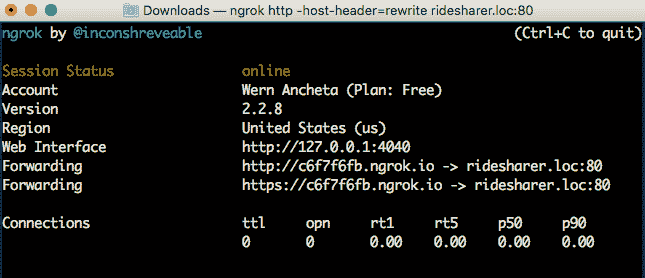](https://res.cloudinary.com/practicaldev/image/fetch/s---UrBfz3w--/c_limit%2Cf_auto%2Cfl_progressive%2Cq_auto%2Cw_880/https://d2mxuefqeaa7sj.cloudfront.net/s_A3E35E29FAFD056D08992342D002CE1A37F4AC4A11322BD972B8B8DD01FAC87E_1527127055458_run-ngrok.png)

复制 HTTPS 的网址，因为这是我们稍后要在应用程序中使用的。

## 结论

就是这样！在本教程中，我们已经设置了应用程序要使用的服务器。具体来说，您已经了解了以下内容:

*   如何设置和使用 Laradock？
*   如何使用 PHP 索引，搜索和删除 Elasticsearch 文档？
*   如何使用 Google Directions API 获取两个坐标之间的方向。
*   如何使用 ngrok 公开你的虚拟主机？

你可以在这个 [Github repo](https://github.com/anchetaWern/Ridesharer) 上找到本教程使用的代码。

在本系列的第二部分，我们将介绍如何创建实际的应用程序。

*原载于[推杆教程枢纽](https://pusher.com/tutorials/carpooling-react-native-part-1)。*