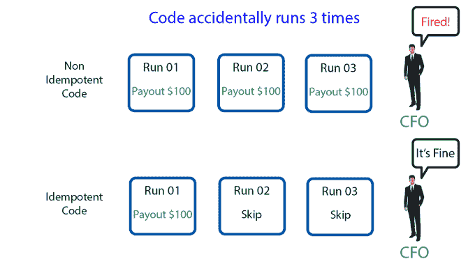

# 人类也可以编码:幂等性

> 原文：<https://dev.to/joecannatti/humans-can-code-too-idempotency-42jc>

《人类也能编码》是一个内容系列，面向任何不是来自传统计算机科学背景的人，并试图更好地理解软件开发。这包括那些刚刚开始编程生涯的人，以及那些只想了解开发人员到底在说些什么的商务人士。

## 这是一个可怕的术语

幂等性是一个非常令人生畏的词，有人会在拉取请求或代码审查中突然出现。这听起来超级复杂和科学，甚至是数学。

“等幂”这个词确实来自高等数学。然而，当软件开发人员使用这个词时，他们的意思是没有什么超级复杂的。

我会给它我自己的定义

> 幂等性–n
> 
> 一段代码可以使用相同的输入数据运行多次，而不会导致不希望的结果。
> 
> <cite>乔坎塔提-我们</cite>

在实践中，如果我们发现自己处于不知道一个工作单元是否运行的情况下，这与将要发生的事情有关。如果代码是幂等的，我们可以简单地再次运行它。如果这是第二次(或第 10000 次)运行，那也没关系。它不会引起任何问题。

这通常出现在基于消息传递的系统和后台作业中，因为这些系统涉及工作队列。这些队列可能会导致由于各种原因而多次运行代码。也就是说，它在几乎任何情况下都是一个重要的特性。

## 概念示例

在概念层面上，这里有一个非幂等方式的例子来考虑一个工作单元，后面跟着一个幂等版本。

> 向 ID 为 123 的用户支付 100 美元
> 
> <cite>不幂等</cite>
> 
> 支付 ID 为 456 的交易款项
> 
> <cite>幂等！干得好</cite>

### 那么，那两者有什么区别呢？

在第一种情况下，没有办法知道该作业是否重复，所以如果我们运行该作业 3 次，我们将向他们发送 300 美元。企业通常不想给额外的钱

在第二种情况下，在第一次运行代码时，它可以说，“是的，我们还没有把钱发出去，我现在就去”，然后在每次运行时，它可以说，“嘿，我已经这样做了，我什么也不做”。因此，您可以运行该作业 1 到无限次，并获得相同的结果。

[](https://res.cloudinary.com/practicaldev/image/fetch/s--p-wSiKjk--/c_limit%2Cf_auto%2Cfl_progressive%2Cq_auto%2Cw_880/https://zafulabs.files.wordpress.com/2019/06/idempotency.png%3Fw%3D680)

## 示例:预计算审核次数

```
def increment_review_count(user:)
  user.review_count += 1 
  user.save!
end 
```

那不是幂等的！如果您运行该代码 100 次，那么您将增加 100 个审查代码！

让我们尝试一个更安全的例子

```
def calculate_review_count(user:) 
  user.review_count = user.reviews.count 
  user.save!
end 
```

啊，甜蜜的解脱。那个更好。如果你运行 100 次，你仍然会得到正确的结果。这个例子的缺点是它也将会慢很多，因为它需要从数据库中读取评论。

## 示例:支出

```
def payout(user:, amount:)
  Xtripe.send_payment(id: user.xtripe_id, amount: amount)
end 
```

正如我们前面所讨论的，这是没有用的，因为这段代码没有办法确保这笔钱还没有发出去。我们可以使用一个事务记录来使这个幂等。

```
def payout(transaction:) 
  if transaction.should_be_payed? 
    Xtripe.send_payment(id: transaction.user.xtripe_id, 
                        amount: transaction.amount) 
    transaction.mark_as_paid! 
  end
end 
```

那一点点改变了一切。该方法可以检查交易是否已经支付，以及检查其他条件。

## 示例:备份到 S3(基于云的文件系统)

```
def backup_to_s3 
  User.all.each do |user|
    S3::File.write(name: user.id, content: user.to_json) 
  end
end 
```

这种方法的问题是，如果你的工作中途中断，如果不在 S3 进行检查，就无法知道我们从哪里停止的。

解决这个问题的一个方法是记录一个时间戳

```
def backup_to_s3
  User.where('last_backed_up < ?', 1.week.ago).each do |user| 
    S3::File.write(name: user.id, content: user.to_json) 
    user.last_backed_up = Time.now 
    user.save! 
  end
end 
```

我们可以一遍又一遍地运行这项工作，它永远不会做任何意想不到的事情！这就是幂等性的意义！