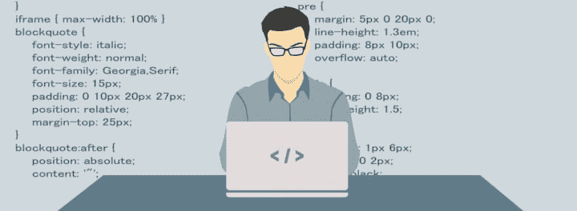
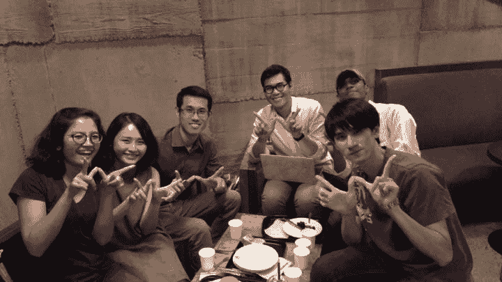

# 成为公司想要雇佣的初级开发人员。

> 原文：<https://dev.to/charlesstover/become-the-junior-developer-that-companies-want-to-hire-39b1>

# 前言🔰

## 我是谁，为什么要听我的？

作为一名自学成才的网络开发人员，我努力克服进入职场的障碍。我在学术界一直表现很好，这导致了教授的肯定，高级班的邀请，以及奖学金的邀请。我天真地认为员工也会有类似的行为:我所要做的就是做好我所做的事情，工作就会自动找上门来。如果我能像通过测试一样通过面试，我广博的编程知识会让找工作变得容易。

事实并非如此。不仅工作邀请没有潮水般涌入我的邮箱，而且当我直接联系公司时，我很少能得到回复。怎么了？我是个优秀的开发者。我可以解决现实世界的问题。我创建了应用程序并满足了客户的需求。不知何故，我对企业环境完全没有准备。

我怀疑自己的能力。我的自尊心被粉碎了。我以为我很聪明；我认为我的项目突破了极限；但是雇主们似乎不同意。他们通常认为我不值得采访。我收到的最常见的反馈是他们需要学位。我发明了能产生收入的应用程序这一事实并不重要。我放弃了，去追求其他的激情，让 web 开发像以前一样成为我最喜欢的消遣。

几年后，在同龄人的鼓励下，我决定再次从事 web 开发。我仍然对此充满热情。我很擅长这个。这让我很开心。我试图重返职场，从过去的经验中我知道这并不容易。我比以前更加认真地对待找工作这件事。区别？*谦逊。*你应该*知道你不知道的事情*，我知道有一些我不知道的关于 web 开发职业的事情，以及它们与作为爱好的 web 开发有什么不同。

我花了很多时间研究如何建立简历和作品集、面试流程以及开发人员职业的软技能。我寻找简历和作品集评论。我尽可能多地预约面试练习。我利用每一个机会。我至今仍在研究这些课题。我对它们有着浓厚的兴趣，因为我对这些话题的无知拖了我很长时间。我热切希望其他开发者也准备好面对这些问题，尤其是那些自学成才的人，因为他们在学术界经常被忽视，在网上几乎不存在。

自从进入一家企业，我参与了尽可能多的面试培训，参加了尽可能多的面试小组，收集了尽可能多的员工反馈。我把我学到的东西应用到我遇到的每一个寻求它的人身上——从 Reddit 线程到 T2 LinkedIn 消息。这是我公开记录和分享这些知识的尝试，希望有才华和自我激励的开发人员得到他们应得的公平的成功机会。

# 教育👨‍🎓👩‍🎓

在你成为受欢迎的初级开发人员之前，你必须先成为初级开发人员。这篇文章不等同于一种教育。这篇文章是对教育的补充，无论是正式的还是自我驱动的。

Gayle Laakmann McDowell 的《破解编码采访》是我极力推荐的另一个强有力的教育补充资料。它涵盖了许多公司所需的软技能，并确保你知道硬技能。你会在网上一次又一次地看到它的推荐，它很容易值得 30 美元的投资。

我鼓励任何人至少读一读那本书里讨论的数据结构和算法。如果你已经能解决问题，实现数据结构，或者创建算法，那么就去下一个。如果你发现自己对实现细节有点模糊，我强烈建议*你自己写*。这将增加你的作品集，帮助巩固你头脑中的知识。通过教学学习是我经常推荐的一种做法。这是我的灵感，让[用 JavaScript](https://medium.com/@Charles_Stover/implementing-quicksort-in-javascript-8044a8e2bf39) 实现 Quicksort，并为我的作品集生成了 [GitHub 库](https://github.com/CharlesStover/quicksort-js)和 [NPM 包](https://www.npmjs.com/package/@charlesstover/quicksort)。

你需要比仅仅知道数据结构和算法更进一步。了解它们之间的取舍。你什么时候会选择一个而不是另一个？在什么条件下哪个更具可扩展性？哪个占用的内存更少，哪个执行起来更快？什么时候你想用内存或效率来换取这些其他特性，为什么？在你的面试过程中，知道这些问题的答案是非常重要的。你几乎肯定会被要求解决一个需要复杂数据结构的问题。无论你选择哪一种，你都希望能够防御。“这是我记得的第一个数据结构”在生产应用程序中不太适用，所以在面试中也不太适用。

# 开源📄

这似乎是显而易见的，但是文件夹意味着你的成就的文件。所以记录下来！*彻底地。*我错误地把我最早的几年花在了开发专有软件上。我的服务器端代码被备份到了几个硬盘上，我的 JavaScript 在没有通过微型文件的情况下永远不会被用户看到。我相信代码要想盈利，就不能被复制。*我错了。*

我鼓励你尽可能地开源。您的快速排序实现对您的硬盘没有任何好处。你的编程入门视频游戏可能效率低得令人尴尬，但你是在卖空它。这些初学者项目显示:

*   你想做点什么，并且对工作之外的编程感兴趣。
*   你学会了制造东西，并且愿意也有能力根据需要学习新技术。
*   你没有放弃就完成了一个项目。通过克服障碍而不是放弃，你可以将挑战进行到底。
*   你*做了某件事*。如果你不公布你的代码，雇主会认为你*从未写过它*。写一些低效的东西比什么都不写要好得多。

自从开源我的项目以来，我的开发生涯已经获得了比那些项目本身更大的价值。我收到了[大量](https://github.com/CharlesStover/reactn/issues?q=is%3Aissue+is%3Aclosed)来自[社区的反馈](https://github.com/CharlesStover/use-react-router/issues?q=is%3Aissue+is%3Aclosed)，这让我能够优先考虑对客户来说重要的事情，并考虑我以前从未考虑过的使用案例和环境。在我的环境中从未存在过的错误在别人的环境中出现了。从他们的报告中，我发现了代码设计中的错误，并从中吸取了教训。今天，我可以创建可扩展到更多用例的组件和包，而不仅仅是我个人的投资组合和项目。这些学到的概念和对技术的深入理解提高了我的工作质量。

对于每个项目，我建议在其`README.md`中添加以下内容:

*   一个真实的名字。很好而且自动化，但是试着给它一个描述，让你和其他候选人有所区别。每个候选人都有一个“待办事项”和“购物清单”为什么你的更好？试试“React TODO App”或者“MongoDB 购物清单”
*   真实的描述。“TODO App”可以有很多含义。这对你来说是显而易见的，因为是你做的。它支持哪些 [CRUD 操作](https://en.wikipedia.org/wiki/Create,_read,_update_and_delete)？它使用服务器端代码吗？目标受众是谁？你正在解决什么问题，如何解决？例如，我的[购物清单](https://github.com/CharlesStover/shopping-list)应用程序”是为我父亲创建的，他需要一份可打印的购物清单给他的家庭护理助手。为了支持他不断衰退的记忆力，该应用程序会跟踪过去的项目，以便可以轻松地重新添加它们。我把客户放在第一位，发现问题，并执行解决方案。
*   使用的技术堆栈。HTML，JavaScript，React，PHP，SQL，Docker？让人们知道你有使用的经验。即使您的项目不是最干净的代码或最佳的实现，您也已经证明了您至少在概念上理解了这些技术。你知道他们解决什么问题，这是最大的障碍。完善它们的使用可以在工作中学习。
*   没有人，我的意思是没有人，会克隆你的库，安装它，然后在本地运行它，只是为了看你的作品。公司经常充斥着候选人(不管他们是不是好的候选人)。他们只会转向下一个候选人。在这个时间点上，对公司来说，你在统计上可能是普通人。他们最好把时间花在研究另一个候选人身上，而不是浪费时间或搅乱他们的机器。如果你的项目是前端，考虑把它部署到 [GitHub 页面](https://pages.github.com/)。如果您的项目不是前端，可以考虑添加任何 GUI 的屏幕截图，链接到任何 API 的现场演示，或者记录示例输入和输出。
*   记录你的 API，如果有的话。当您在企业环境中创建高度使用的、面向生产的 API 时，这是很好的经验和实践。公司想要好的文档，即使是只在内部使用的 API。每当内部客户引用该文档时，就少了一张需要回答的支持票，开发人员就多了一个小时的空闲时间来实现新功能，而不是支持现有功能。当一个 API 的创建者离开公司时，他们的替代者能多快支持他们所继承的服务？许多公司以前都吃过这种亏，他们知道好的文档是团队思维的象征。

# 联网🌐

如果你想*站出来*，那么你首先需要*站出来*。招聘人员不仅应该能够找到你，还应该对他们所看到的印象深刻。让你的名字有好的理由。

## 领英

在你的[职业兴趣](https://www.linkedin.com/jobs/career-interests/)下面，让招聘人员知道你是开放的。回复每一位招聘人员，不管你是否想要这份工作。练习你的专业沟通技巧。练习把复杂的社会和职业情况用清晰且不伤人的语言表达出来。这些技能将在面试和工作中得到体现。有时候，你知道你想要什么，但是你不知道怎么说。之后，当你面试的时候，能够专业地表达出你想要从这份工作中得到什么是很好的——这是得到它的最好方法。

不要过河拆桥，练习拒绝自己不感兴趣的工作。招聘人员可能会在未来向你提供更适合你兴趣的更好的机会。同样，你今天不接受的工作机会可能会在未来变得令人向往。最后，当你离开第一份工作去找第二份工作时，你拒绝当前公司而不过河拆桥的经历会帮助你获得专业推荐。

从招聘人员那里获取信息。找出什么是需要的。他们在寻找什么技能？如果他们告诉你你不适合某个职位，问问他们为什么。你缺什么？应该学什么？如果你在几个月后重新申请，他们希望看到你在哪些方面有所改进，从而让你获得这个职位？放下你的骄傲，收起你的谦逊，明白雇主想要的是一个能够学习的员工，而不是一个认为自己已经什么都知道的人。一位候选人告诉我，他们将会回来，并且比以往任何时候都准备得更充分，这是一个非常积极的信号。这显示了奉献精神，显示了学习的渴望，如果他们改正了错误，这显示了 T2 成功实现目标的能力。

了解自己的价值。无论招聘人员还是职位，*薪酬如何*？一个前端工程师在西雅图能挣多少钱？一个 PHP 开发者在印第安纳能挣多少钱？一个 React 本土开发者在印度赚什么？(请注意，我在每一项中都包含了一个位置。薪酬的最大决定因素是位置！当你的第一份工作不可避免地问你想要多少报酬时，*你就会知道你值多少钱。不要害怕高球。一旦他们决定要你，他们不会因为你要求太多而拒绝你。他们会用他们的最大值来反击。这比贬低自己，让自己的价值更接近最低工资要好。这是一个很好的方式来失去动力，感觉不受重视，并在工作中很快耗尽精力。*

链接到你的 LinkedIn 个人资料。你在 LinkedIn 之外的项目应该包含 LinkedIn 的链接。对你的工作印象深刻的招聘人员需要一种联系你的方式。对你的工作印象深刻的开发者可能会愿意给你一份工作推荐。例如，我用“在 LinkedIn 上关注我”来结束每篇中型文章。此时，这些链接共享已经产生了 300 个连接。

站着，让自己被发现。

## 碎碎念

保持你的推特账户的专业性。拥有个人推特是可以的，但是不要有任何有争议的东西。通过不断地在推特上发布你的成就来建立一个追随者，并分享你的项目推特资料来建立一个追随者。例如，我用“在 Twitter 上关注我”来结束每篇媒体文章此时，这些链接共享已经产生了 300 个追随者。

Twitter 是免费营销。我从来没有发过社交推特。我有一个严格的商业推特账户。如果我发布我所做的，人们会看到它，与它互动，提供反馈，并分享它。相关的标签，如技术栈，可以用来鼓励机器人自动转发你给更多的观众。

# 摘要💼

价值百万的问题是，“你如何从其他同等教育水平的应届大学毕业生中脱颖而出？”以及“你如何表明你的自考学历与你认可的竞争对手不相上下？”

首先，实际写你的简历！确保你的作品集和简历与你的 LinkedIn 同步。这有助于招聘人员找到你，知道你熟悉哪些技术。

保持你的简历在一页以内。如果你认为你需要更多，因为你已经完成了这么多，那么你就错了。作为参考，我 17 年的经历仍然是[一页纸的简历](https://charlesstover.com/resume/2019-05/charles-stover-resume.pdf)。更有可能的是，你包含了不应该出现在简历中的信息。记住一份简历能让你参加面试。细节会在采访中出现。

LinkedIn 经常在他们的 [LinkedIn Learning](https://www.linkedin.com/learning/) 平台上推出免费课程的促销活动。完成这些课程会在您的 LinkedIn 个人资料中添加一个认证条目，这是一种简单而有趣的脱颖而出的方式。

根据你申请的工作量身定做你的简历。你的教育、经历、兴趣和目标都可以成为面试中的话题。了解他们与工作的关系。你在这方面受过什么正式训练？记下特别相关的大学课程或在线培训。过去有哪些工作特别适合这份工作？删除不相关的项目。寻找前端工程师的雇主不会问你在汇编语言中编写凯撒密码的时间。只要他们花时间阅读，他们就会因为精神疲劳而对你失去兴趣。他们花在和你讨论这件事上的任何时间都可能是浪费时间。他们不会知道你是否适合这份工作。这些时间最好用来告诉他们你在这个领域的优势。

不要在简历中列出你无法辩护的内容。你可能认为你需要撒谎来获得面试机会，但是你没有。面试过程的一部分是专门为剔除说谎者而设计的。你只会浪费每个人的时间，包括你自己的时间。你会被问到你列出的技术，并被要求给出过去项目的细节。很明显，如果你不熟悉这些技术或假定的项目。声称与 NPM 和崔维斯·CI 一起工作过，但却不能定义他们，他们解决了什么问题，或者这些工具如何解决这些问题，这看起来并不好。即使是含糊的回答也可能是危险信号。您知道 NPM 管理您的节点包，但是您不知道是什么包，为什么您的项目需要这个工具，或者您使用的命令。这些都是明确不雇佣你的很好的理由。实际上，聘用一个没有 NPM 经验的候选人，比聘用一个据说有经验但不能回答上述问题的人，是更好的选择。没有经验的候选人也许能学会。说谎的候选人证明了他们没有学习能力。

我说以上这些并不是为了让你害怕在简历中列出一项技术。我说以上这些是为了强调有多少候选人在撒谎，雇主们是如何期待这一点的，并鼓励你也不要浪费时间撒谎。如果你真的有技术经验，不要害怕列出或讨论它。如果你不知道某个问题的答案，承认并解释原因。“我们用 NPM 安装包，但我知道的唯一一个是`npm install`。CI/CD 管道自动运行其余部分，所以我不熟悉它们。”你已经证明了你确实了解工具是什么，工具解决什么问题。你没有证明你没有学习能力。如果我听到这个答案，我会认为你完全有能力在工作中更好地学习 NPM。这与撒谎的候选人形成了鲜明的对比，后者声称使用了某种工具，但无法提供具体的时间、地点或原因。

*推销自己。*不要*看轻自己*。为你的成就感到骄傲，对你的言辞充满自信。你没有“为朋友做一个小网站”您“通过交付符合可访问性的单页应用程序，并通过问题跟踪器和 CI/CD 管道维护它，超越了客户的期望。”雇主不想为你的朋友做小网站。他们希望创建 spa、执行长期维护、跟踪问题并自动化部署。你对自己项目的描述不应该是“我在浏览器里做了一个井字克隆”，而应该是“一个通过 Redux 实现 Flux 架构的 React 应用，支持键盘导航，用 CSS 执行动画。”记住要根据工作量身定制简历，用有市场价值的术语描述你的项目。

# 心态🧠

## 认识自己。

你为什么要面试这个职位？你的短期和长期目标是什么，这个职位如何帮助你实现这些目标？

在我最后一次面试中，我对这些问题的回答是:我想要一个比我以前的工作更高的技能上限。我想接受挑战，学习新技术，提升自己。我觉得我在以前的工作中已经停滞不前了，我有一种内在的动力去尽我所能成为最好的开发人员。

雇主想知道你是否适合他们。如果你只是想要钱，你在任何地方都是合适的——这意味着当竞争对手出价更高时，没有人能保证你会保持忠诚。如果是这样的话，他们就不想在你身上投资。对于我上一次的职业转变，我会愿意接受减薪，因为这意味着我可以取得更大的成就，这对我来说很重要。

## 面试不要吓人。

你要有每次面试都对你有好处的心态。就像你可以从招聘人员那里获得信息一样，你也可以在面试中获得同样的信息。确定他们的公司使用什么技术，需要什么技能，以及为什么他们不感兴趣。有些面试官不先把这些信息传递给人力资源部就无法给你，所以一定要在面试后跟进人力资源部。利用这些信息在两次面试之间提升自己。

面试你“知道”不会接受的地方。我把 know 放在引号里，因为我知道有人在遵循这个建议后接受了一份工作，面试时没有接受的意图，发现他们真的喜欢这家公司，并接受了这份工作。这是我唯一一条道德上模棱两可的建议。在你不感兴趣的地方练习面试。向他们询问相同的信息——他们的技术水平如何，他们看重什么技能，你在哪些方面可以提高，如果你得到了一份工作，你的价值是什么？这些实践面试会让你更好地交流你的软技能，而不那么焦虑，当你参加一个你真正想要的工作的面试时，它就会显现出来。

像第一天上班一样对待你的面试。这应该有助于减少你的焦虑，减轻被评价的压力。与面试官互动，就像他们是你的同事一样。面试的全部目的是让面试官决定你在工作中的表现。当他们问你问题时，并不是因为这是一个测试，你必须达到 90%以上才能通过。这是因为当你被给予现实世界的问题去解决时，他们想看到你的思维过程。这个思考过程不仅仅是得到一个正确或错误的答案。你考虑了多少边缘案例？您能看出在此使用案例中哪些适用于客户，哪些不适用吗？在解决问题时，您是否采取了额外的步骤来使您的代码可扩展到将来可能的修改，尽管它不是当前特性请求的一部分？你能交流困难的技术概念、数据结构、算法和它们的权衡吗？你知道什么时候寻求帮助吗，或者你认为你什么都知道吗？这些都是面试官可能会记笔记的地方，因为这些是你在团队中要做的事情。让面试官参与进来。和他们谈谈。问他们问题。描述你的思维过程。大声思考。将他们视为同事真的有助于完成这项任务。

# 面试准备👨‍💼👩‍💼

为了准备你的面试，确保你非常熟悉 S.T.A.R .的格式。当你的面试官让你描述一个事件时，尽可能用 S.T.A.R .来回答。这可以确保你提供了面试官想要了解的信息，并且你们两人之间没有沟通错误。如果你误解了这个问题，那么在这种情况或任务下，很明显你回答了错误的问题。如果你回答了正确的问题，面试官可能会寻找相关的经验(情况)，问题识别或沟通技能(任务)，解决问题或技术技能(行动)，或交付结果、妥协或从错误中学习的能力(结果)。通过用 S.T.A.R .来回答，你的基础就被覆盖了，强有力的交流就实现了。

## 列出你印象最深刻的项目。

印象深刻是主观的，但这里我指的是最广泛或独特的项目。你在一个团队中工作，你和客户一起工作，你和一个经理一起工作，你收到了大量的社区反馈，它像病毒一样传播，或者你完成了一件需要几周而不是几小时的事情。在行为问题中，准备提及你印象最深刻的项目。与定量的、百科全书式的编程知识不同，有时当被问及定性问题时，你会一无所获。你有这么多编写循环和遍历数组的经验，当你被要求这么做时，这已经是你的第二天性了。不幸的是，当被要求“说出一次你与上司的分歧”时，你可能没有现成的例子。当你试图处理这个问题时，你的大脑可能会一片空白。

> 如果我从来没有意见不合呢？如果我说我没有，我听起来是没有经验还是像在撒谎？如果我说了，听起来会不会觉得我很难共事或者很对立？什么算分歧？谁算上级？我几乎没有工作经历！我怎么会不同意上级的意见呢？

请注意，行为问题通常并不意味着工作中的*。上一个问题，上级可能是教授，也可能是导师。分歧不一定是激烈的争论，但可以是对实施细节的不同意见。你可以让问题尽可能的一般化，因为它需要有一个答案，这就是为什么预先列出你最令人印象深刻的项目是有益的。*

 *我强烈推荐通读亚马逊的领导原则。这些是互联网上一些最全面、包罗万象、经过严格测试的行为技能。你很难找到一个既重要又不在这个清单上的软技能。对于每一项领导力原则，我建议将其与你的一个令人印象深刻的项目联系起来。根据需要添加新的项目或情况。

*   项目 A——我*学到了*一些新东西。
*   项目 B — I *发明了*一个工具来帮助开发过程。

你绝对可以在一个项目中分配多个原则，但是我强烈建议你为每个原则分配一个项目或者一个情境。如果你发现自己无法联想到一些，那就再努力想想。尝试从关联中删除工作或发展方面。你节俭的时候可能只是在你的日常生活中，你设法削减开支，以便优先偿还学生贷款，从而减少你的累计利息。

一旦你将每个领导原则与一个项目或情况联系起来，清理你的列表。移除与任何软技能无关的项目或情况。你应该只剩下一份你的*实际*最令人印象深刻的项目列表。

带上这个单子去面试。当你被问到一个行为问题时，如果需要的话，通读这个列表来唤起你的记忆。不要把软技能写在项目旁边。这个列表的重点是让记忆不和谐。在回答问题时，你应该能够在几秒钟内浏览一遍，而不是在回答之前花几分钟阅读一页摘要。地点(项目)和事件(问题)的结合应该足以迅速唤起你对任何相关经历的记忆。

在回答一个关于你自己的问题时，不得不看着自己生活故事的笔记，这可能会感到奇怪，但不要担心。面试官知道面试过程中紧张的影响，我向你保证没有人会介意你对自己的软技能做笔记。人们比其他人更纠结于这些问题，所以你回答这些问题的能力会让你领先一步。

## 带来数据。

数字是世界通用的语言。它们消除了模糊性，推动了业务决策。如果你有数据来支持你的主张，那就拿出来。你的生产率或收入提高了多少？你赚了多少钱？你节省了多少时间？如果你只有定性的结果，有总比没有好。衡量你的效率不仅能让你认清自己的价值，还能显示出你重视分析数据的心态，这表明你在工作中也会这样做。

例如，我在上次面试前收集的一些数据:

*   我通过在 API 上实现选择加入(向后兼容)压缩算法，将网络流量减少了 30% (gzipped)到 60%(非 gzipped)。这不是一个复杂的算法。我从未接受过压缩或数据方面的正式培训。我只是注意到重复下载相同的属性名称浪费了网络流量。快速的谷歌搜索显示[我不是唯一一个寻求这种数据转换](https://stackoverflow.com/questions/37988451/convert-array-of-objects-to-an-object-of-arrays)的人。我测量了有和没有这种变化的数据包大小，以及 viola — data。
*   我简化了一个项目的现有内部测试框架。这导致端到端测试的开发时间从每条路径 3 天减少到仅仅 1 天。这不是火箭科学。我对现有框架如此难以使用感到恼火，所以我将常用命令转换成可重用的函数调用。当团队回应说使用起来更好时，我记录了开发时间的变化。

## 要自信。

自信很重要。找出你的不安全感，并练习解决它们。如果你的面试官探究你和你的成就的这些方面，你不想通过缺乏答案来证实他们的担忧。

你缺少学位吗？为什么？你认为这是你该做的正确选择。为什么？你决定你可以达到和大学毕业生同等的学术水平。为什么？抛开对判断的恐惧，为自己的决定感到自豪。如果你不能确信你迄今为止的选择是正确的，你怎么能被信任为公司做出正确的选择呢？

我没有计算机科学学位。这是我第一次尝试进入职场时最大的不安全感。现在，我直言不讳地反对通过大学课程学习软件开发。我相信这对我来说是正确的决定。这将花费我太多的钱，提供太少的好处。我自学比在教室里学得快。我曾亲自与开源开发者合作，并尽可能多地参与开发者社区。我已经证明我能够理解和讨论复杂的主题，所以我相信大学教育不会提高我作为一名开发人员的水平。我可以向采访者清楚地表达这种情绪。

一旦你理解了自己，练习表达它。自己练习，把想法用文字表达出来。焦虑、不安全感和对判断的恐惧背后隐藏着很多情绪。很难找到合适的词来描述你生活中充满情感的方面。*练习，练习，练习。*一旦你认为自己已经充分描述了最大的挑战，就和朋友、亲戚一起练习。然后，与导师和同事一起练习。*练习，练习，练习。*

寻求*诚实的*反馈。如果你的目标是提高或获得一份工作，你不希望自己受到打击。你想要建设性的*批评*。确保你身边的人知道他们不应该害怕伤害你的自我，确保你的自我不会被自我提升的机会所伤害。

## 最后…

当面试接近尾声时，你的面试官通常会给你一个提问的机会。一定要提问。这表明你对这家公司有实际的兴趣，而不仅仅是为了薪水而来。不要问工资、假期、休息时间或任何暗示你关心金钱多于职业的事情。一定要询问公司文化、发展机会、团队动态、技术支持，并确保你们彼此合适。你在面试公司，就像公司在面试你一样。他们不想把你放在一个你不会开心的环境中——这是让员工辞职的最快方法。确定对你来说什么是重要的，并询问这些问题与你的短期和长期目标有什么关系。

用结束语结束面试。这感觉不太自然，但是在你问完问题后，继续做总结陈述。"我没有其他问题了，但我有一点意见。"这是你描述你的最佳品质和你能给团队带来什么的机会。不要让面试官带着积极的想法离开面试，而要让他们带着你的小缺点离开。如果你最优秀的品质没有在谈话中自然而然地表现出来，现在就是你解决它们的机会。在一次面试中，我笔记的底部提到了一些我认为是我最强的品质。如果他们已经上来了，我就不理他们；如果他们没有上来，我现在就带他们上来。

# 结论🔚

如果你有任何问题或相关的好建议，请在评论区留下。

要阅读更多我的文章或关注我的作品，你可以通过 [LinkedIn](https://www.linkedin.com/in/charles-stover) 和 [Twitter](https://twitter.com/CharlesStover) 与我联系。又快又简单，还免费！

你也可以查看我在 CharlesStover.com 的投资组合。*